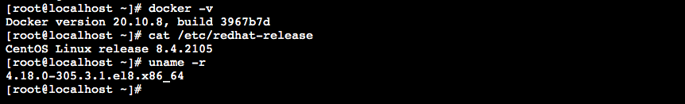

# 官网
- docker官网：http://www.docker.com
- Docker Hub官网：https://hub.docker.com

# 简介
前提条件
```markdown
目前，CentOS仅发型版本中的内核支持Docker，Docker运行在CentOS7(64-bit)上。要求系统是64位，
Linux系统内核版本为3.8以上。


```
查看自己的内核
```markdown
uname命令用于打印当前系统相关信息（内核版本号、硬件架构、主机名称和操作系统类型等）。


cat /etc/redhat-release

uname -r
```


