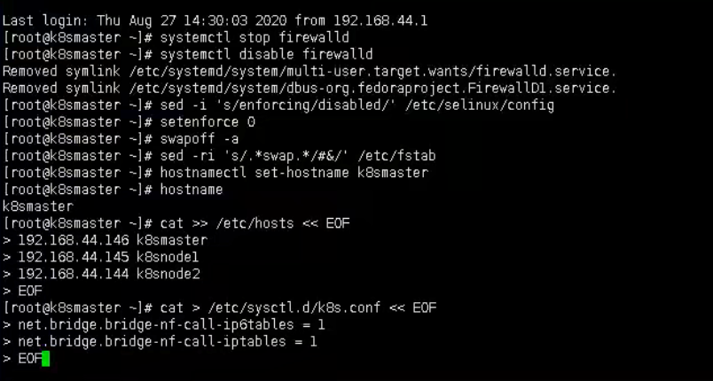

# 第一部分 K8S基本概念


## 1、K8S概念和特性
k8s概述
-  k8s是谷歌在2014年开放的容器化集群管理系统。
- 使用k8s进行容器化应用部署。
- 使用k8s利于应用扩展。
- k8s目标实施让部署容器化应用更加简洁和高效。

功能
- 自动装箱：
- 自我修复：
- 水平扩展：
- 服务发现：
- 滚动更新：
- 版本回退：
- 秘密和配置管理：
- 存储编排：
- 批处理：


## 2、K8S架构组件
- Master：主控节点
  - apiserver：集群统一入口。各个组件的协调者。以restful方式，交给etcd存储。
  - sheduler：节点调度。
  - controller-manager：集中的控制处理。处理集群中常规后台任务。一个资源对应一个控制器。
  - etcd：存储系统，用于保存集群相关数据。
- node：工作节点
  - kubeelet：master派到node节点代表，管理本机容器。
  - kub-proxy：提供网络代理，负载均衡等操作。

## 3、K8S核心概念
- Pod
  - k8s中最小的部署单元。
  - 一组容器的集合。
  - 共享网络。
  - 什么周期是短暂的。
- Controller
  - 确保预期的pod副本数量。
  - 无状态应用部署：可以拿过来直接用。
  - 有状态应用部署：需要特定条件，如固定IP。
  - 确保所以的node运行同一个pod。
  - 一次性任务和定时任务。
- Service
  - 定义一组pod的访问规则。


# 第二部分 搭建K8S集群
- 1、搭建k8s环境平台规划。
  - 单master方式。
  - 多master方式。
- 2、服务器硬件配置要求。
  - master：CPU至少2核。4G内存、20G硬盘。
  - node：4核、8G内存、40G硬盘。
- 3、搭建k8s集群部署方式。

kubernetes集群搭建主要的两种方式
- kubeadm方式：Kubeadm是一个K8s部署工具，提供kubeadm init和kubeadm join，用于快速部署Kubernetes集群。
- 二进制包：从github下载发行版的二进制包，手动部署每个组件，组成Kubernetes集群。
Kubeadm降低部署门槛，但屏蔽了很多细节，遇到问题很难排查。如果想更容易可控，推荐使用二进制包部署Kubernetes集群，虽然手动部署麻烦点，期间可以学习很多工作原理，也利于后期维护。

## kubeadm部署方式：
- 第一步、在Master创建一个Master节点。kubeadm init。
- 第二步、在Node节点中将Node加入到当前集群中 $kubeadm join <Master节点的IP和端口>

虚拟机方式硬件要求：
- 一台或多台机器。
- 硬件配置：2GB或者更多RAM，2个CPU更多CPU，硬盘30GB或者更多。
- 集群中所以机器之间网络互通。
- 可以访问外网，需要拉取镜像。
- 禁止swap分区。
- 安装基础服务：yum install wget

最终目标：
- 在所以节点上安装Docker和kubeadm
- 部署Kubernetes Master
- 部署容器网络插件
- 部署Kubernetes Node，将节点加入Kubernetes集群中
- 部署Dashboard Web页面，可视化查看Kubernetes资源


操作系统处理：
- 关闭防火墙：
  - systemctl stop firewalld
  - systemctl disable firewalld
- 关闭selinux：
  - 永久: sed -i 's/enforcing/disabled/' /etc/selinux/config
  - 临时：setenforce 0
- 关闭swap：
  - 临时：swapoff -a
  - 永久：sed -ri 's/.*swap.*/#&/' /etc/fstab
- 根据规划设置主机名：hostnamectl   set -hostname <hostname>
- 在master添加hosts
```markdown
cat >> /etc/hosts <<EOF
192.168.44.141 master
192.168.44.142 node1
192.168.44.143 node2
EOF
```
- 将桥接的IPv4流量传递到iptables的链
```markdown
cat >> /etc/sysctl.d/k8s.conf << EOF
net.bridge.bridge-nf-call-ip6tables = 1
net.bridge.bridge-nf-call-iptables = 1
EOF
sysctl --system #生效
```
- 时间同步
```markdown
yum install ntpdate -y
ntpdate time.windows.com
```


所有节点安装Docker/kubeadm/kubelet


设置开机启动docker

docker改成阿里的镜像


# 第三部分 K8S核心技术


# 第四部分 部署统一日志管理


# 第五部分 部署性能监控平台


# 第六部分 搭建高可用的K8S集群


# 第七部分 K8S集群部署项目


