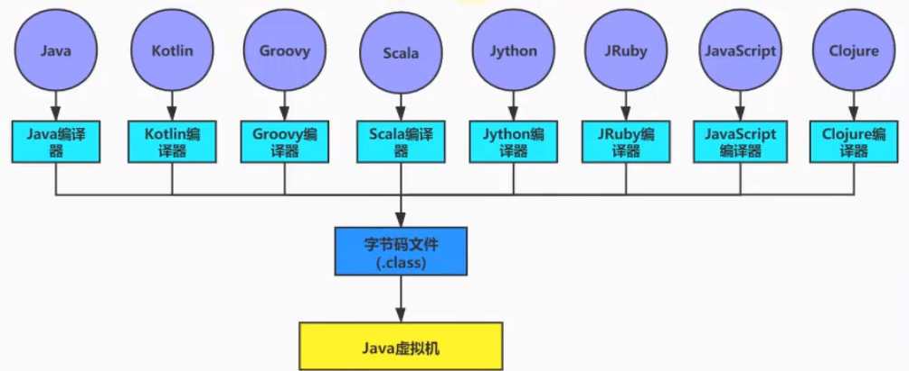
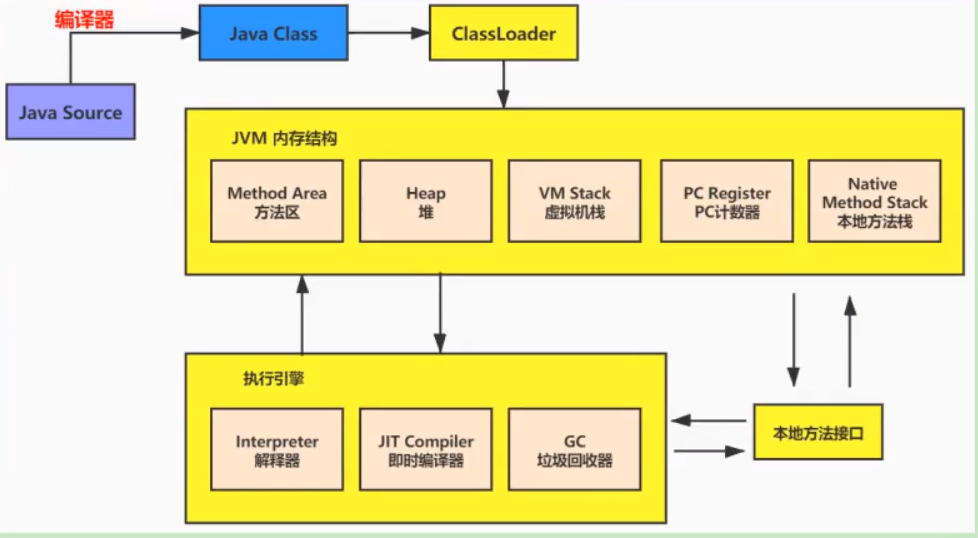
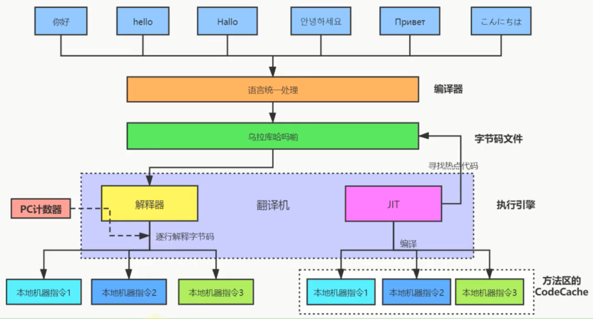
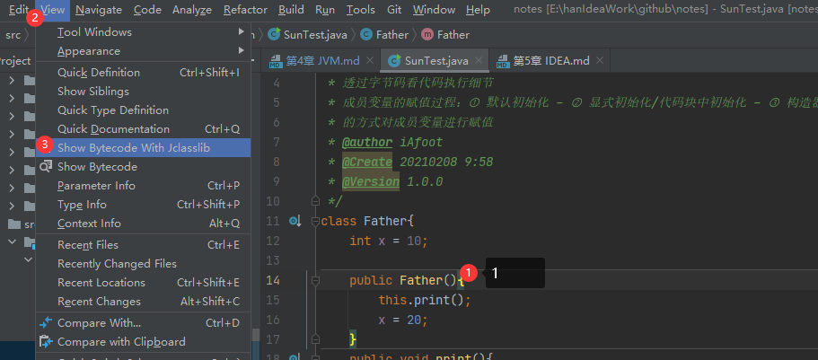
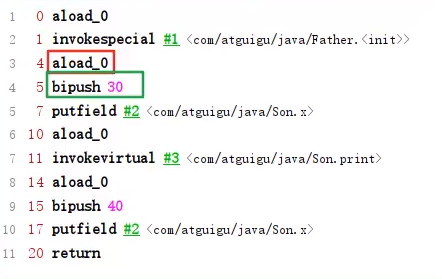


# JVM 中篇 CLASS结构
## 概述


### 字节码文件的跨平台性
1. Java语言：跨平台语言
* 当Java源代码成功编译成字节码后，如果想在不同的平台上面运行，则无须再次编译
* 这个又是不再那么吸引人了。Python、PHP、Perl、Ruby、Lisp等有强大的解释器。
* 跨平台似乎已经快称为一门语言必选的特性。

2. Java 虚拟机：跨语言的平台
> Java 虚拟机不和包括Java在内的任何语言绑定，它只与“Class文件”这种特定的二进制文件格式所关联。    无论使用何种语言进行软件开发，只要能将源文件
> 编译为正确的Class文件，那么这种语言就可以在Java虚拟机上执行。可以说，统一而强大的Class文件结构，就是Java虚拟机的基石、桥梁。
> 
* Java虚拟机规范：https://docs.oracle.com/javase/specs/index.html
* 所有的JVM全部遵守Java虚拟机规范，也就是说所有的JVM环境都是一样的，这样一来字节码文件可以在各种JVM上运行。

3. 想要让一个Java程序正确地运行在JVM中，Java源码就必须要被编译为符号JVM规范的字节码文件。
* 前端编译器的主要任务是负责将符合Java语法规范的Java代码转换为符号JVM规定的字节码文件。
* javac是一种能将Java源码编译为字节码的前端编译器。
* Javac编译器在将Java源码编译为一个有效的字节码文件过程中经历了4个步骤，分别是词法解析、语法解析、语义解析以及生成字码。

Oracle的JDK软件包括两部分内容：
    * 一部分是将Java源代码编译成Java虚拟机的指令集的编译器
    * 另一部分是用于实现Java虚拟机的运行时环境。    

* 前端编译器 vs 后端编译器
> Java源代码的编译结果是字节码，那么肯定需要有一种编译器能够将Java源程序编译为字节码，承担这个重要责任的就是配置在path环境变量中的
> javac编译器，javac是一种能够将Java源码编译为字节码的前端编译器。
> 
> HotSpot VM并没有强制要求前端编译器只能使用javac来编译字节码，其实只要编译结果符合JVM规范都可以被JVM所识别即可。在Java的前端编译器领域，
> 除了javac之外，还有一种被大家经常用到的前端编译器，那就是内置在Eclipse中的ECJ（Eclipse Complier for Java）编译器。和Javac
> 的全量编译式编译不同，ECJ是一种增量式编译器。
> * 在Eclipse中，当开发人员编写完代码后，使用“Ctrl+S”快捷键时，ECJ编译器所采取的编译方案时把未编译部分的源码逐行进行编译，而非每次都全量
> 编译。因此ECJ的编译效率会比javac更加迅速和高效，当然编译质量和javac相比大致还是一样的。
> * ECJ不仅是Eclipse的默认内置前端编译器，在Tomcat中同样也是使用ECJ编译器来编译jsp文件。由于ECJ编译器是采用GPLv2的开源协议进行源代码
> 公开，所以，大家可以登录eclipse官网下载ECJ编译器的源码进行二次开发。
> * 默认情况下，InteliJ IDEA使用javac编译器。（还可以自己设置为AspectJ编译器 ajc）
> 前端编译器不会直接涉及编译优化等方面的技术，而是将这些具体优化细节移交给HostSpot的JIT编译器负责。
> 
> AOT：静态提前编译器，Ahead Of Time Compiler。直接将代码编译为机器指令。

### 虚拟机的基石：Class文件
jclasslib查看字节码信息操作步骤：


* 字节码文件里是什么？
>源代码经过编译器编译之后便会生成一个字节码文件，字节码是一种二进制的类文件，它的内容是JVM的指令，而不像C、C++经由编译器直接生成机器码。

* 什么是字节码指令（byte code）?
> Java虚拟机的指令由一个字节长度的、代表某种特定含义的操作码（opcode）以及跟随其后的零个至多个代表此操作所需参数的操作数（operand）所构成。
  虚拟机中许多指令并不包含操作数，只有一个操作码。
  比如： 操作码[操作数]


* 待进一步完善 






https://www.bilibili.com/video/BV1PJ411n7xZ?p=210&spm_id_from=pageDriver

https://www.bilibili.com/video/BV1PJ411n7xZ?p=302

### OutOfMemory举例
* OutOfMemoryError：Java heap space。 堆空间占满。
* OutOfMemoryError：操作系统内存占满。
* OutOfMemoryError：堆外空间占满。
* OutOfMemoryError：栈空间占满。




















