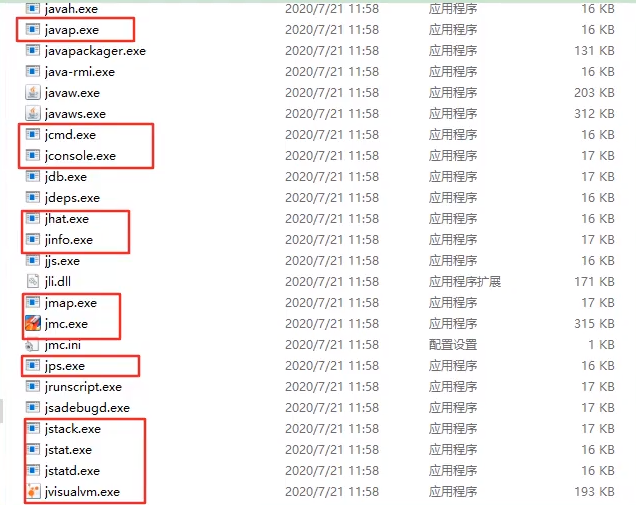

# 4.3.1 背景说明
* 生产中的问题
    * 生产环境发生了内存溢出该如何处理？
    * 生产环境应用给服务器分配多少内存合适？
    * 如何对垃圾回收器的性能进行调优？
    * 生产环境CPU负载飙高该如何处理？
    * 生产环境应用给应用分配多少线程合适？
    * 不加log，如何确定请求是否执行了某一行代码？
    * 不加log,如何实时查看某个方法的入参与返回值？

* 为什么要调优？
    * 防止出现OOM
    * 解决OOM
    * 减少Full GC出现的频率
    
* 不同阶段的考虑：
    * 上线前
    * 项目运行阶段
    * 线上出现OOM
    
* 监控的依据
    * 运行日志
    * 异常堆栈
    * GC日志
    * 线程快照
    * 堆转储快照
    
* 调优的大方向
    * 合理编写代码
    * 充分合理的使用硬件资源
    * 合理的进行JVM调优

## 4.3.1.1 性能优化步骤
* 1.发现问题：性能监控。
    * GC频繁
    * cpu load过高
    * OOM
    * 内存泄漏
    * 死锁
    * 程序响应时间较长
* 2.排查问题：性能分析。
    * 打印GC日志，通过GCviewer或者http://gceasy.io来分析日志信息
    * 灵活运用命令行工具，jstack、jmap、jinfo等
    * dump出堆文件，使用内存分析工具分析文件
    * 使用阿里Arthas、或jconsole、JVisualVM来实时查看JVM状态
    * jstack查看堆栈信息
* 3.解决问题：性能调优。
    * 适当增加内存，根据业务背景选择垃圾回收器
    * 优化代码，控制内存使用
    * 增加机器，分散节点压力
    * 合理设置线程池线程数量
    * 使用中间件提高程序效率，比如缓存，消息队列等
    * 其他...
  
## 4.3.1.2 性能评价/测试指标
* 1.停顿时间（或响应时间）：执行垃圾收集时，程序的工作线程被暂停的时间。
* 2.吞吐量：单位时间的工作（请求）量。
  * 运行用户代码时间，占总运行时间的比例。-XX:GCTimeRatio=n
* 3.并发数：同一时刻，对服务器有实际交互的请求数。
* 4.内存占用：java堆区所占的内存大小。
* 5.相互间的关系：

# 4.3.2 JVM命令行监控工具

自带命令行工具源码：https://hg.openjdk.java.net/jdk/jdk11/file/1ddf9a99e4ad/src/jdk.jcmd/share/classes/sun/tools

* 01-概述
  * 02-jpa：查看正在运行的Java进程
  * 03-jstat：查看JVM统计信息
  * 04-jinfo：实时查看和修改JVM配置参数
  * 05-jmap：导出内存映射文件&内存使用情况
  * 06-jhat:JDK自带堆分析工具
  * 07-jstack：打印JVM中线程快照
  * 08-jcmd：多功能命令行
  * 09-jstatd：远程主机信息收集

* 02-jpa：查看正在运行的Java进程
> jps（Java Process Status）
> * 基本语法：jps [options][hostid]
> * options参数：
>   * -q：仅仅显式LVMID（local virtual machine id），即本地虚拟机唯一id。不显示主类的名称等。
>   * -l：输出应用程序主类的全类名 或 如果进程执行的jar包，则输出jar完整路径。
>   * -m：输出虚拟机进程启动时传递给主类main()的参数。
>   * -v：列出虚拟机进程启动时的JVM参数。比如：-Xms20m -Xmx50m是启动程序指定的jvm参数。
> 说明：以上参数可以综合实验。
> 补充：如果某Java进程关闭了默认开启的UsePerfData参数(即使用参数-XX:-UsePerData)，那么jps命令（以及下面介绍的jstat）将无法探知该Java进程。
> 
> 显式指定系统内所有HotSpot虚拟机进程（查看虚拟机进程信息），可用于查询正在运行的虚拟机进程。
> 
> 说明：对于本地虚拟机进程来说，进程的本地虚拟机ID与操作系统的进程ID是一致的，是唯一的。 
* 03-jstat：查看JVM统计信息：官方文档》https://docs.oracle.com/javase/8/docs/technotes/tools/unix/jstat.html
> * 基本情况
>   jstat(JVM Statistics Monitoring Tool)：用于监视虚拟机各种运行状态信息的命令行工具。它可以显示本地或者远程虚拟机进程中的类装载、内存、
>   垃圾收集、JIT编译等运行数据。
>   在没有GUI图形界面，只提供纯文本控制台环境的服务器上，它将是运行期定位虚拟机性能问题的首选工具。常用语检测垃圾回收问题以及内存泄漏问题。
> * 基本语法：jstat -<option> [-t] [-h<lines>] <vmid> [<interval> [<count>]]
>   * 查看命令相关参数：jstat -h 或 jstat -help
> * 参数说明：
>   * option：option参数可由以下值构成。
>     * 类装载相关的：
>       * -class：显式ClassLoader的相关信息：类的装载、卸载数量、总空间、类装载所消耗的时间等。
>     * 垃圾回收相关的：
>       * -gc：显式与GC相关的对信息。包括Eden区、两个Survivor区、老年代、永久代等的容量、已用空间、GC时间合计等信息。
>       * -gccapacity：显式内容与-gc基本相同，但输出主要关注Java堆各个区域使用到的最大、最小空间。
>       * -gcutil：显式内容与-gc基本相同，但输出主要关注已使用空间占总空间的百分比。
>       * -gccause：与-gcutil功能一样，但是会额外输出导致最后一次或当前正在发生的GC产生的原因。
>       * -gcnew：显示新生代GC状况。
>       * -gcnewcapacity：显示内容与-gcnew基本相同，输出主要关注使用到的最大、最小空间。
>       * -gcold：显示老年代GC状况。
>       * -gcoldcapacity：显示内容与-gcold基本相同，输出主要关注使用到的最大、最小空间。
>       * -gcpermcapacity：显示永久代使用到的最大、最小空间。
>     * JIT相关的：
>       * -compiler：显示JIT编译器编译过的方法、耗时等信息。
>       * -printcompilation：输出已经被JIT编译的方法。
>   * interval：用于指定输出统计数据的周期，单位为毫秒。即：查询间隔。
>   * count：用于指定查询的总字数。
>   * -t：可以在输出信息前加上一个Timestamp列，显示程序的运行时间，单位秒。即程序开始执行到现在多少秒。
>     * 经验：
>     我们可以比较Java进程的启动时间以及总GC时间（GCT列），或者两次测量的间隔时间以及总GC时间的增量，来得出GC时间占运行时间的比例。
>     如果该比例超过20%，则说明目前堆的压力比较大；如果该比例超过90%,则说明几乎没有可用空间，随时都可能抛出OOM异常。
>   * -h：可以周期性输出输出时，输出多少行数据后输出一个表头信息。
> 说明：
> * option参数：
>   * 新生代相关：
>     * S0C：是第一个幸存者区的大小（字节）。
>     * S1C：是第二个幸存者区的大小（字节）。
>     * S0U：是第一个幸存者区已使用的大小（字节）。
>     * S1U：是第二个幸存者区已使用的大小（字节）。
>     * EC：是Eden空间的大小（字节）。
>     * EU：是Eden空间已使用大小（字节）。
>   * 老年代相关：
>     * OC：是老年代的大小（字节）。
>     * OU：是老年代已使用的大小（字节）。
>   * 方法区（元空间）相关：
>     * MC：是方法区的大小。
>     * MU：是方法区已使用的大小。
>     * CCSC：是压缩类空间的大小。
>     * CCSU：是压缩类空间已使用的大小。
>   * 其他：
>     * YGC：是指从应用程序启动到采用时young gc次数。
>     * YGCT：是指从应用程序启动到采样时young gc消耗的时间（秒）。
>     * FGC：是指从应用程序启动到采用时full gc次数。
>     * FGCT：是指从应用程序启动到采样时full gc消耗的时间（秒）。
>     * GCT：是指从应用程序启动到采样时gc的总时间。
>  
* 04-jinfo：实时查看和修改JVM配置参数
> * 基本情况：jinfo(Configuration Info for Java)》查看虚拟机配置参数信息，也可用于调整虚拟机的配置参数。
>   
> * 基本语法：
>   * 查看：
>     * jinfo -sysprops PID：可以查看由System.getProperties()取得的参数。
>     * jinfo -flags PID：查看曾经赋过值得一些参数。
>     * jinfo -flag 具体参数PID：查看某个java进程的具体参数值。
> 
>   * 修改：不仅可查看，并且可修改部分参数使之立即生效。参数只有被标记为manageable的flag可用被实时修改。
      > 命令【java -XX:+PrintFlagsFinal -version | grep manageable】可用查看被标记为manageable的参数。
      > 
>     * 针对boolean类型：jinfo -flag[+|-]具体参数 PID。
>     * 针对boolean类型：jinfo -flag 具体参数=具体参数值 PID。
> 
> * 拓展：（命令行执行）
>   * java -XX：+PrintFlagsInitial：查看所有JVM参数启动的初始值。
>   * java -XX：+PrintFlagsFinal：查看所有JVM参数的最终值。
>   * java -XX：+PrintCommandLineFlags：查看哪些已经被用户或者JVM设置过的详细的XX参数的名称和值。命令行修改过的。
>   
* 05-jmap：导出内存映射文件&内存使用情况
> * 基本情况：jmap（JVM Memory Map）：
> 作用一方面是获取dump文件（堆转储快照文件，二进制文件），它还可以获取目标Java进程
> 的内存相关信息，包括Java堆各区域的使用情况。堆中对象的统计信息、类加载信息等。
> 
> 开发人员可以在控制台中输入命令"jmap -help"查阅jmap工具的具体使用方式
> 和一些标准选项配置。
> 
> 官方帮助文档：
> https://docs.oracle.com/en/java/javase/11/tools/jmap.html
> * 基本语法：
>   * 它的基本使用语法为：
>     * jmap [option] <pid>
>     * jmap [option] <executable <core>>
>     * jmap [option] [server_id@] <remote server IP of hostname>
>   * -dump：
>     * 生成Java堆转储快照：dump文件。
>     * 特别的：-dump:live只保存堆中的存活对象。
>   * -heap：输出整个堆空间的详细信息，包括GC的使用、堆配置信息，以及内存的使用信息等。
>   * -histo：
>     * 输出堆中对象的统计信息，包括类、实例数量和合计容量。
>     * 特别的：-histo:live只统计堆中的存活对象。
>   * -permstat：
>     * 以ClassLoader为统计口径输出永久代的内存状态信息。
>     * 仅linux/solaris平台有效。
>   * -finalizerinfo：
>     * 显示在F-Queue中等待Finalizer线程执行finalize方法的对象。
>     * 仅linux/solaris平台有效
>   * -F：
>     * 当虚拟进程对-dump选项没有任何响应时，可使用此选项强制执行生成dump文件。
>     * 仅linux/solaris平台有效。
>   * -h|-help：jmap工具的帮助命令。
>   * -J<flag>：传递参数给jmap启动的jvm。
> * 导出内存映像文件：
>   * 手动的方式：
>     * jmap -dump:format=b,file=<filename.hprof> <pid>：实例：jmap -dump:format=b,file=/Users/hanrx/Desktop/1.hprof 1013
>     * jmap -dump:live,format=b,file=<filename.hprof> <pid>
>   * 自动的方式：
>     * -XX:+HeapDumpOnOutOfMemoryError：在程序发送OOM时，导出应用程序的当前堆快照。
>     * -XX：HeapDumpPath=<filename.hprof>：可以指定堆快照的保存位置。
> * 显示堆内心相关信息：
>   * jmap -heap pid：堆在这一刻内存占用情况。
>   * jmap -histo：对在这一个对象占用情况。
> * 其他作用：
>   * jmap -permstat pid：查看系统的ClassLoader信息。
>   * jmap -finalizerinfo：查看堆积在finalizer队列中的对象。
> 小结：
> 由于jmap将访问堆中的所有对象，为了保证在此过程中不被应用程序干扰，jmap需要借助安全点机制，让所有线程停留在不改变堆中数据的状态。也就是说，由
> jmap导出的堆快照必定是安全点位置的。这可能导致基于该堆快照的分析结果存在偏差。
> 
> 与前面讲的jstat则不同，垃圾回收器会主动将jstat所需要的摘要数据保存至固定位置之中，而jstat只需直接读取即可。
* 06-jhat:JDK自带堆分析工具
* 07-jstack：打印JVM中线程快照
* 08-jcmd：多功能命令行
* 09-jstatd：远程主机信息收集











https://www.bilibili.com/video/BV1PJ411n7xZ?p=315&spm_id_from=pageDriver















