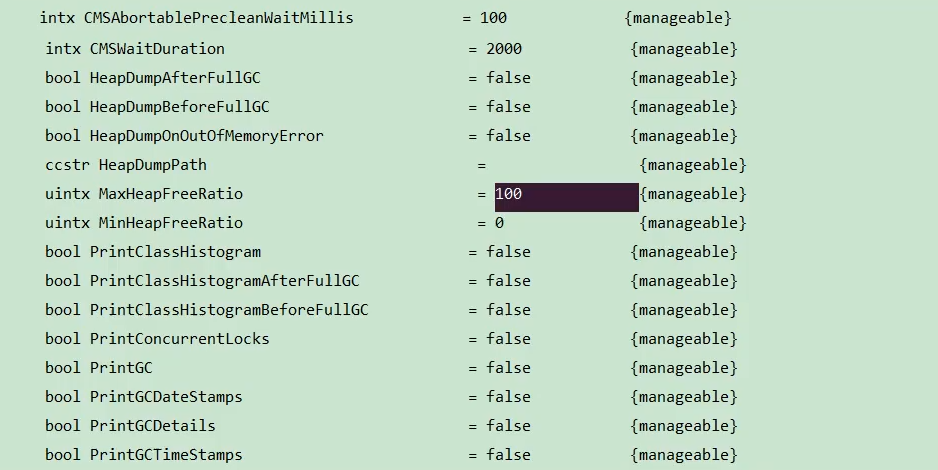
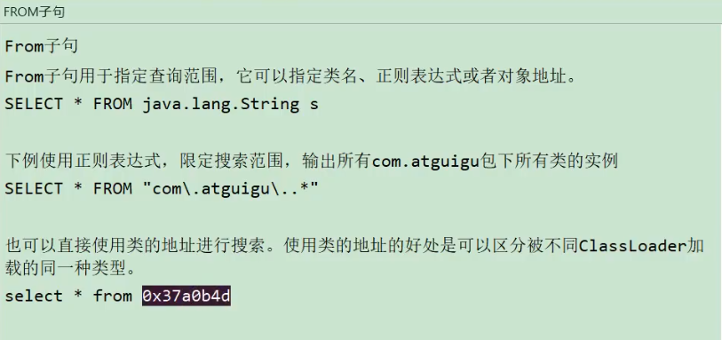
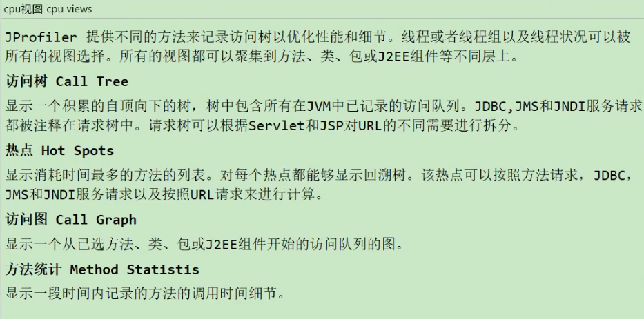

# 4.3.1 背景说明
* 生产中的问题
    * 生产环境发生了内存溢出该如何处理？
    * 生产环境应用给服务器分配多少内存合适？
    * 如何对垃圾回收器的性能进行调优？
    * 生产环境CPU负载飙高该如何处理？
    * 生产环境应用给应用分配多少线程合适？
    * 不加log，如何确定请求是否执行了某一行代码？
    * 不加log,如何实时查看某个方法的入参与返回值？

* 为什么要调优？
    * 防止出现OOM
    * 解决OOM
    * 减少Full GC出现的频率
    
* 不同阶段的考虑：
    * 上线前
    * 项目运行阶段
    * 线上出现OOM
    
* 监控的依据
    * 运行日志
    * 异常堆栈
    * GC日志
    * 线程快照
    * 堆转储快照
    
* 调优的大方向
    * 合理编写代码
    * 充分合理的使用硬件资源
    * 合理的进行JVM调优

## 4.3.1.1 性能优化步骤
* 1.发现问题：性能监控。
    * GC频繁
    * cpu load过高
    * OOM
    * 内存泄漏
    * 死锁
    * 程序响应时间较长
* 2.排查问题：性能分析。
    * 打印GC日志，通过GCviewer或者http://gceasy.io来分析日志信息
    * 灵活运用命令行工具，jstack、jmap、jinfo等
    * dump出堆文件，使用内存分析工具分析文件
    * 使用阿里Arthas、或jconsole、JVisualVM来实时查看JVM状态
    * jstack查看堆栈信息
* 3.解决问题：性能调优。
    * 适当增加内存，根据业务背景选择垃圾回收器
    * 优化代码，控制内存使用
    * 增加机器，分散节点压力
    * 合理设置线程池线程数量
    * 使用中间件提高程序效率，比如缓存，消息队列等
    * 其他...
  
## 4.3.1.2 性能评价/测试指标
* 1.停顿时间（或响应时间）：执行垃圾收集时，程序的工作线程被暂停的时间。
* 2.吞吐量：单位时间的工作（请求）量。
  * 运行用户代码时间，占总运行时间的比例。-XX:GCTimeRatio=n
* 3.并发数：同一时刻，对服务器有实际交互的请求数。
* 4.内存占用：java堆区所占的内存大小。
* 5.相互间的关系：

# 4.3.2 JVM命令行监控工具

自带命令行工具源码：https://hg.openjdk.java.net/jdk/jdk11/file/1ddf9a99e4ad/src/jdk.jcmd/share/classes/sun/tools

* 01-概述
  * 02-jpa：查看正在运行的Java进程
  * 03-jstat：查看JVM统计信息
  * 04-jinfo：实时查看和修改JVM配置参数
  * 05-jmap：导出内存映射文件&内存使用情况
  * 06-jhat:JDK自带堆分析工具
  * 07-jstack：打印JVM中线程快照
  * 08-jcmd：多功能命令行
  * 09-jstatd：远程主机信息收集

* 02-jpa：查看正在运行的Java进程
> jps（Java Process Status）
> * 基本语法：jps [options][hostid]
> * options参数：
>   * -q：仅仅显式LVMID（local virtual machine id），即本地虚拟机唯一id。不显示主类的名称等。
>   * -l：输出应用程序主类的全类名 或 如果进程执行的jar包，则输出jar完整路径。
>   * -m：输出虚拟机进程启动时传递给主类main()的参数。
>   * -v：列出虚拟机进程启动时的JVM参数。比如：-Xms20m -Xmx50m是启动程序指定的jvm参数。
> 说明：以上参数可以综合实验。
> 补充：如果某Java进程关闭了默认开启的UsePerfData参数(即使用参数-XX:-UsePerData)，那么jps命令（以及下面介绍的jstat）将无法探知该Java进程。
> 
> 显式指定系统内所有HotSpot虚拟机进程（查看虚拟机进程信息），可用于查询正在运行的虚拟机进程。
> 
> 说明：对于本地虚拟机进程来说，进程的本地虚拟机ID与操作系统的进程ID是一致的，是唯一的。 
* 03-jstat：查看JVM统计信息：官方文档》https://docs.oracle.com/javase/8/docs/technotes/tools/unix/jstat.html
> * 基本情况
>   jstat(JVM Statistics Monitoring Tool)：用于监视虚拟机各种运行状态信息的命令行工具。它可以显示本地或者远程虚拟机进程中的类装载、内存、
>   垃圾收集、JIT编译等运行数据。
>   在没有GUI图形界面，只提供纯文本控制台环境的服务器上，它将是运行期定位虚拟机性能问题的首选工具。常用语检测垃圾回收问题以及内存泄漏问题。
> * 基本语法：jstat -<option> [-t] [-h<lines>] <vmid> [<interval> [<count>]]
>   * 查看命令相关参数：jstat -h 或 jstat -help
> * 参数说明：
>   * option：option参数可由以下值构成。
>     * 类装载相关的：
>       * -class：显式ClassLoader的相关信息：类的装载、卸载数量、总空间、类装载所消耗的时间等。
>     * 垃圾回收相关的：
>       * -gc：显式与GC相关的对信息。包括Eden区、两个Survivor区、老年代、永久代等的容量、已用空间、GC时间合计等信息。
>       * -gccapacity：显式内容与-gc基本相同，但输出主要关注Java堆各个区域使用到的最大、最小空间。
>       * -gcutil：显式内容与-gc基本相同，但输出主要关注已使用空间占总空间的百分比。
>       * -gccause：与-gcutil功能一样，但是会额外输出导致最后一次或当前正在发生的GC产生的原因。
>       * -gcnew：显示新生代GC状况。
>       * -gcnewcapacity：显示内容与-gcnew基本相同，输出主要关注使用到的最大、最小空间。
>       * -gcold：显示老年代GC状况。
>       * -gcoldcapacity：显示内容与-gcold基本相同，输出主要关注使用到的最大、最小空间。
>       * -gcpermcapacity：显示永久代使用到的最大、最小空间。
>     * JIT相关的：
>       * -compiler：显示JIT编译器编译过的方法、耗时等信息。
>       * -printcompilation：输出已经被JIT编译的方法。
>   * interval：用于指定输出统计数据的周期，单位为毫秒。即：查询间隔。
>   * count：用于指定查询的总字数。
>   * -t：可以在输出信息前加上一个Timestamp列，显示程序的运行时间，单位秒。即程序开始执行到现在多少秒。
>     * 经验：
>     我们可以比较Java进程的启动时间以及总GC时间（GCT列），或者两次测量的间隔时间以及总GC时间的增量，来得出GC时间占运行时间的比例。
>     如果该比例超过20%，则说明目前堆的压力比较大；如果该比例超过90%,则说明几乎没有可用空间，随时都可能抛出OOM异常。
>   * -h：可以周期性输出输出时，输出多少行数据后输出一个表头信息。
> 说明：
> * option参数：
>   * 新生代相关：
>     * S0C：是第一个幸存者区的大小（字节）。
>     * S1C：是第二个幸存者区的大小（字节）。
>     * S0U：是第一个幸存者区已使用的大小（字节）。
>     * S1U：是第二个幸存者区已使用的大小（字节）。
>     * EC：是Eden空间的大小（字节）。
>     * EU：是Eden空间已使用大小（字节）。
>   * 老年代相关：
>     * OC：是老年代的大小（字节）。
>     * OU：是老年代已使用的大小（字节）。
>   * 方法区（元空间）相关：
>     * MC：是方法区的大小。
>     * MU：是方法区已使用的大小。
>     * CCSC：是压缩类空间的大小。
>     * CCSU：是压缩类空间已使用的大小。
>   * 其他：
>     * YGC：是指从应用程序启动到采用时young gc次数。
>     * YGCT：是指从应用程序启动到采样时young gc消耗的时间（秒）。
>     * FGC：是指从应用程序启动到采用时full gc次数。
>     * FGCT：是指从应用程序启动到采样时full gc消耗的时间（秒）。
>     * GCT：是指从应用程序启动到采样时gc的总时间。
>  
* 04-jinfo：实时查看和修改JVM配置参数
> * 基本情况：jinfo(Configuration Info for Java)》查看虚拟机配置参数信息，也可用于调整虚拟机的配置参数。
>   
> * 基本语法：
>   * 查看：
>     * jinfo -sysprops PID：可以查看由System.getProperties()取得的参数。
>     * jinfo -flags PID：查看曾经赋过值得一些参数。
>     * jinfo -flag 具体参数PID：查看某个java进程的具体参数值。
> 
>   * 修改：不仅可查看，并且可修改部分参数使之立即生效。参数只有被标记为manageable的flag可用被实时修改。
      > 命令【java -XX:+PrintFlagsFinal -version | grep manageable】可用查看被标记为manageable的参数。
      > 
>     * 针对boolean类型：jinfo -flag[+|-]具体参数 PID。
>     * 针对boolean类型：jinfo -flag 具体参数=具体参数值 PID。
> 
> * 拓展：（命令行执行）
>   * java -XX：+PrintFlagsInitial：查看所有JVM参数启动的初始值。
>   * java -XX：+PrintFlagsFinal：查看所有JVM参数的最终值。
>   * java -XX：+PrintCommandLineFlags：查看哪些已经被用户或者JVM设置过的详细的XX参数的名称和值。命令行修改过的。
>   
* 05-jmap：导出内存映射文件&内存使用情况
> * 基本情况：jmap（JVM Memory Map）：
> 作用一方面是获取dump文件（堆转储快照文件，二进制文件），它还可以获取目标Java进程
> 的内存相关信息，包括Java堆各区域的使用情况。堆中对象的统计信息、类加载信息等。
> 
> 开发人员可以在控制台中输入命令"jmap -help"查阅jmap工具的具体使用方式
> 和一些标准选项配置。
> 
> 官方帮助文档：
> https://docs.oracle.com/en/java/javase/11/tools/jmap.html
> * 基本语法：
>   * 它的基本使用语法为：
>     * jmap [option] <pid>
>     * jmap [option] <executable <core>>
>     * jmap [option] [server_id@] <remote server IP of hostname>
>   * -dump：
>     * 生成Java堆转储快照：dump文件。
>     * 特别的：-dump:live只保存堆中的存活对象。
>   * -heap：输出整个堆空间的详细信息，包括GC的使用、堆配置信息，以及内存的使用信息等。
>   * -histo：
>     * 输出堆中对象的统计信息，包括类、实例数量和合计容量。
>     * 特别的：-histo:live只统计堆中的存活对象。
>   * -permstat：
>     * 以ClassLoader为统计口径输出永久代的内存状态信息。
>     * 仅linux/solaris平台有效。
>   * -finalizerinfo：
>     * 显示在F-Queue中等待Finalizer线程执行finalize方法的对象。
>     * 仅linux/solaris平台有效
>   * -F：
>     * 当虚拟进程对-dump选项没有任何响应时，可使用此选项强制执行生成dump文件。
>     * 仅linux/solaris平台有效。
>   * -h|-help：jmap工具的帮助命令。
>   * -J<flag>：传递参数给jmap启动的jvm。
> * 导出内存映像文件：
>   * 手动的方式：
>     * jmap -dump:format=b,file=<filename.hprof> <pid>：实例：jmap -dump:format=b,file=/Users/hanrx/Desktop/1.hprof 1013
>     * jmap -dump:live,format=b,file=<filename.hprof> <pid>
>   * 自动的方式：
>     * -XX:+HeapDumpOnOutOfMemoryError：在程序发送OOM时，导出应用程序的当前堆快照。
>     * -XX：HeapDumpPath=<filename.hprof>：可以指定堆快照的保存位置。
> * 显示堆内心相关信息：
>   * jmap -heap pid：堆在这一刻内存占用情况。
>   * jmap -histo：对在这一个对象占用情况。
> * 其他作用：
>   * jmap -permstat pid：查看系统的ClassLoader信息。
>   * jmap -finalizerinfo：查看堆积在finalizer队列中的对象。
> 小结：
> 由于jmap将访问堆中的所有对象，为了保证在此过程中不被应用程序干扰，jmap需要借助安全点机制，让所有线程停留在不改变堆中数据的状态。也就是说，由
> jmap导出的堆快照必定是安全点位置的。这可能导致基于该堆快照的分析结果存在偏差。
> 
> 与前面讲的jstat则不同，垃圾回收器会主动将jstat所需要的摘要数据保存至固定位置之中，而jstat只需直接读取即可。
* 06-jhat:JDK自带堆分析工具：（JVM Heap Analysis Tool）
  * 基本情况：
    > Sun JDK提供的jhat命令与jmap命令搭配使用，用于分析jmap生成的heap dump文件（堆转储快照）。jhat内置了一个微型的HTTP/HTML服务器。
    > 生成dump文件的分析结果后，用户可以在浏览器中查看分析结果（分析虚拟机转储快照信息）。
    > 
    > 使用jhat命令，就启动了一个http命令，端口是7000，即http://localhost:7000/，就可以在浏览器里分析。
    > 
    > 说明：jhat命令在JDK9、JDK10中已经被删除，官方建议用VisualVM代替。
  * 基本语法：
* 07-jstack：打印JVM中线程快照：
  * 基本情况：
    > jstack（JVM Stack Trace）：用于生成虚拟机指定进程当前时刻的线程快照（虚拟机堆栈跟踪）。线程快照就是当前虚拟机内指定进程的每一条
    > 线程正在执行的方法堆栈的集合。
    > 
    > 生成线程快照的作用：可用于定位线程长时间停顿的原因，如线程间死锁、死循环、请求外部资源导致的长时间等待等问题。这些都是导致线程长时间
    > 停顿的常见原因。当线程出现停顿时，就可以用jstack显示各个线程调用的堆栈情况。
    > 
    > 官方帮助文档：https://docs.oracle.com/en/java/javase/11/tools/jstack.html
    > 
    > 在thread dump中，要留意下面几种状态：
    >   * 死锁，Deadlock（重点关注）
    >   * 等待资源，Waiting on condition（重点关注）
    >   * 等待获取监视器，Waiting on monitor entry（重点关注）
    >   * 阻塞，Blocked（重点关注） 
    >   * 执行中，Runnable 
    >   * 暂停，Suspended
  * 基本语法：jstack option pid
  > jstack管理远程进程的话，需要在远程程序的启动参数中增加：
  > -Djava.rmi.server.hostname=```..
  > -Dcom.sun.management.jmxremote
  > -Dcom.sun.management.jmxremote.port=8888
  > -Dcom.sun.management.jmxremote.authenticate=false
  > -Dcom.sun.management.jmxremote.ssl=false
  > * option参数：-F 当正常输出的请求不被响应时，强制输出线程堆栈。
  > * option参数：-l 除堆栈外，显示关于锁的附加信息。
  > * option参数：-m 如果调用到本地方法的话，可以显示C/C++的堆栈。
  > * option参数：-h 帮助操作。
* 08-jcmd：多功能命令行：
  * 基本情况：
    > 在JDK 1.7以后，新增了一个命令行工具jcmd。
    > 可以实现前面除jstat之外所有命令的功能。比如：用它来导出堆、内存使用、查看Java进程、导出线程信息、执行GC、JVM运行时间等。
    > 
    > 官方帮助文档：https://docs.oracle.com/en/java/javase/11/tools/jcmd.html
    > 
    > jcmd拥有jmap的大部分功能，并且在Oracle的官方网站上也推荐使用jcmd命令代替jmp命令。
  * 基本语法:
    * jcmd -l：列出所有的JVM进程。
    * jcmd pid help：针对指定的进程，列出支持的所有命令。
    * jcmd pid 具体命令：显示指定进程的指令命令的数据。
* 09-jstatd：远程主机信息收集
> 为了开启远程监控，需要配合使用jstatd工具。
> 
> 命令jstad是一个RMI服务端程序，它的作用相当于代理服务器，建立本地计算机与远程监控工具的通信。jstatd服务器将本机的Java应用程序信息传递到远程计算机。
> 

# 4.3.3 JVM 监控GUI

* 1.工具概述：
> 命令行工具无法获取方法级别的分析数据，如方法间的调用关系、各方法的调用次数和调用时间等。
> * JDK自带的工具：
>   * jconsole:JDK自带的可视化监控工具。查看Java应用程序的运行概况、监控堆信息、永久区（或元空间）使用情况、类加载情况等。
>   > 位置：jdk\bin\jconsole.exe
>   * Visual VM：Visual VM是一个工具，它提供了一个可视界面，用于查看Java虚拟机上运行的基于Java技术的应用程序的详细信息。
>   > 位置：jdk\bin\jvisualvm.exe
>   * JMC：Java Mission Control，内置Java Flight Recorder。能够以极低的性能开销收集Java虚拟机的性能数据。
> * 第三方工具：
>   * MAT：MAT（Memory Analyzer Tool）是基于Eclipse的内存分析工具，是一个快速、功能丰富的Java heap分析工具，它可以帮助我们查找内存泄漏和减少内存消耗。
>   > Eclipse的插件形式。
>   * JProfiler：商业软件，需要付费。功能强大。
>   > 与VisualVM类似。
>   * Arthas：Alibaba开源的Java诊断工具。深受开发者喜爱。
>   * Btrace：Java运行时追踪工具。可以在不停机的情况下，跟踪指定的方法调用、构造函数调用和系统内存等信息。
> 
* 2.jConsole：
  * 基本概述：
    > * 从Java5开始，在JDK中自带的java监控和管理控制台。
    > * 用于对JVM中内存、线程和类等的监控，是一个基于JMX（java management extensions）的GUI性能监控工具。
    > 
    > 官方教程：https://docs.oracle.com/javase/7/docs/technotes/guides/management/jconsole.html
  * 启动：
      * jdk/bin目录下，启动jconsole.exe命令即可。
      * 不需要使用jps命令来查询。
  * 三种连接方式：
      * Local：使用jConsole连接一个正在本地系统中运行的JVM并且执行程序的和运行JConsole需要是同一个用户。JConsole使用文件系统的授权通过RMI连接器
      连接到平台的MBean服务器上。这种从本地连接的监控能力只有Sun的JDK具有。
      * Remote：使用下面的URL通过RMI连接器连接到一个JMX代理。service:jmx:rmi:///jndi/rmi://hostName:portNum/jmxrmi。
      JConsole为建立连接，需要在环境变量中设置mx.remote.credentials来指定用户名和密码，从而进行授权。
      * Advanced：使用一个特殊的URL连接JMX代理，一般情况使用自己定制的连接器而不是RMI提供的连接器来连接JMX代理，或者是一个使用JDK1.4的实现了
      JMX和JMX Rmote的应用。
  * 主要作用：

* 3.Visual VM:
  * 基本概述：
    > * Visual VM是一个功能强大的多合一故障诊断和性能监控的可视化工具。
    > * 它集成了多个JDK命令行工具，使用Visual VM可用于显示虚拟机进程及进程的配置和环境信息（jps，jinfo），监视应用程序的CPU、CG、堆、方法区
    > 及线程的信息（jstat、jstack）等，甚至代替JConsole。
    > * 在JDK 6 Update 7以后，Visual VM便作为JDK的一部分发布（VisualVM 在JDK/bin目录下），即：它是完全免费。
    > * 此外，Visual VM也可以作为独立的软件安装：
    > 首页：https://visualvm.github.io/index.html
  * 插件的安装：
    > * Visual VM的一大特点是支持插件扩展，并且插件安装非常方便。我们既可以通过离线下载插件文件*.nbm，然后在Plugin对话框的已下载页面下，添加
    > 已下载的插件。也可以在可用插件页面下，在线安装插件。（这里建议安装上：VisualGC）
    > 插件地址：https://visualvm.github.io//pluginscenters.html
  * 连接方式：
    > * 本地连接：监控本地Java进程的CPU、类、线程等。
    > * 远程连接：
    >   * 1.确定远程服务器的ip地址。
    >   * 2.添加JMX（通过JMX技术具体监控远程服务器那个Java进程）。
    >   * 3.修改bin/catalina.sh文件，连接远程的tomcat。
    >   * 4.在.../conf中添加jmxremote.access和jmxremote.password文件。
    >   * 5.将服务器地址改为公网ip地址。
    >   * 6.设置阿里云安全策略和防火墙策略。
    >   * 7.启动tomcat，查看tomcat启动日志和端口监听。
    >   * 8.JMX中输入端口号、用户名。密码登录。
  * 主要功能：
    > * 1.生成/读取堆内存快照。
    >   * 保存：
    >  
    >   * 读取：
    > 
    > * 2.查看JVM参数和系统属性。
    > * 3.查看运行中的虚拟机进程。
    > * 4.生成/读取线程快照。
    > * 5.程序资源的实时监控。
    > * 6.其他功能：JMX代理连接、远程环境监控、CPU分析和内存分析。s
* 4.eclipse MAT:(Memory Analyzer Tool)
  * 基本概述：
    > 是一款功能强大的Java堆内存分析器。可以用于查找内存泄漏以及查看内存消耗情况。
    > 
    > MAT是基于Eclipse开发的，不仅可以单独使用，还可以作为插件的形式嵌入Exclipse中使用。免费的性能分析工具。可以在http://www.eclipse.org/mat/downloads.php下载。
    > 
  * 获取堆dump文件：
    * dump文件内容：
      > MAT可以分析heap dump文件。在进行内存分析时，只要获得了反应当前设备内存映像的hprof文件，通过MAT打开就可以直观地看到当前的内存信息。
      > 
      > 一般来说，这些内存信息包含：
      > * 所有的对象信息，包括对象实例、成员变量、存储于栈中的基本类型值和存储于堆中的其他对象的引用值。
      > * 所有的类信息，包括classloader、类名称、父类、静态变量等。
      > * GCRoot到所有的这些对象的引用路径。
      > * 线程信息，包括线程的调用栈及此线程的线程局部变量（TLS）;
    * 两点说明：
      * 缺点：
        > MAT 不是一个万能的工具，它并不能处理所有类型的堆存储文件。但是比较主流的厂家和格式，例如Sun，HP，SAP所采用的HPROF二进制堆存储文件，以及IBM的PHD堆存储文件等都能被很好的解析。
        > 
      * 说明：
        > 最吸引人的还是能够快速为开发人员生成 内存泄漏报表， 方便定位问题和分析问题。虽热MAT有如此强大的功能，但是内存分析也没有简单到一键完成的程度，很多内存问题还是需要我们从MAT
        > 展现给我们的信息中通过经验和直觉来判断才能发现。
    * 获取dump文件：
      * 方法一：
        > 通过前面结束的jmap工具生成，可以生成任意一个java进程的dump文件；
        > 
      * 方法二：
        > 通过配置JVM参数生成。
        > * 选项“-XX:+HeapDumpOnOutOfMemoryError”或"-XX:+HeapDumpBeforeFullGC"。
        > * 选项“-XX:HeapDumpPath”所代表的含义就是当程序出现OutOfMemory时，将会在相应的目录下生成一份dump文件。如果不指定选项“XX:HeapDUmpPath”则在当前目录下生成dump文件。
        > 对比：考虑到生产环境中几乎不可能在线对其进行分析，大家都是采用离线分析，因此使用jmap+MAT工具是最常见的组合。
      * 方法三：
        > 使用VisualVM可以到处堆dump文件。
        > 
      * 方法四：
        > 使用MAT既可以打开一个已有的堆快照，也可以通过MAT直接从活动Java程序中导出堆快照。该功能将借助jps列出当前正在运行的Java进程，以供选择并获取快照。
  * 分析堆dump文件：
    * histogram：展示了各个类实例数目以及这些实例heap或Retainedheap的总和。
      > MAT的直方图和jmap的-histo子命令一样，都能够展示各个类的实例数目以及这些实例的Shallow heap总和。但是，MAT的直方图还能够计算Retained heap，并支持基于实例数目
      > 或Retained heap的排序方式（默认为Shallow heap）。
      > 
      > 此外，MAT 还可以将直方图中的类按照超类、类加载器或者包名分组。
      > 
      > 当选中某个类时，MAT界面左上角的Inspector窗口将展示该类的Class实例的相关信息，如类加载器等。
    * thread overview：
      * 查看系统中的Java线程。
      * 查看局部变量的信息。
    * 获得对象相互引用的关系：
      * with outgoing references：
      * with incoming references:
    * 浅堆与深堆：
      * shallow heap：
        > 浅堆（Shallow Heap）是指一个对象所消耗的内存。在32位系统中，一个对象引用会占据4个字节，一个int类型会占用4个字节，long类型变量会占据
        > 8个字节，每个对象头需要占用8个字节。根据堆快照格式不同，对象的大小可能会向8字节进行对齐。
        > 
        > 
      * retained heap：
        > 保留集（Retained Set）：
        > 对象A的保留集指当对象A被垃圾回收后，可以被释放的所有的对象集合（包括对象A本身），即对象A的保留集可以被认为是只能通过对象A被 直接或间接访问
        > 到的所有对象的集合。通俗地说，就是指仅被对象A所持有的对象的集合。
        > 
        > 深堆（Retained Heap）:
        > 深堆是指对象的保留集中所有的对象的浅堆大小之和。
        > 
        > 注意：浅堆指对象本身占用的内存，不包括其内部引用对象的大小。一个对象的深堆只能通过该对象访问到的（直接或间接）所有对象的浅堆之和，即对象被
        > 回收后，可以释放的真实空间。
        > 
      * 补充：对象实际大小：
        > 
      * 案例分析：StudentTrace:
    * 支配树：
      > 
      > 
      > 
      > 
      > 
  * 案例：Tomcat堆溢出分析：
    * 说明：
    * 分析过程：
  * 支持使用OQL语言查询对象信息：
    * SELECT子句：
    * FROM子句：
    * WHERE子句：
    * 内置对象与方法：

* 补充1：再谈内存泄漏:
  * 内存泄漏的理解与分类：
    > 
    > 可达性分析算法来判断对象是否是不再使用的对象，本质都是判断一个对象是否还被引用。那么对于这种情况下，由于代码的实现不同就会出现很多中内存泄漏问题（
    > 让JVM误以为此对象还在引用中，无法回收，造成内存泄漏）。
    > 
    > 内存泄漏（memory leak）的理解：
    >   严格来说，只有对象不会再被程序用到了，但是GC又不能回收它们的情况，才叫内存泄漏。
    >   但实际情况很多时候一些不太好的实践（或疏忽）会导致对象的生命周期变得很长甚至导致OOM，也可以叫做宽泛意义上的“内存泄漏”。
    > 
    > 
    > 
    > 
  * Java中内存泄漏的8种情况：
    * 1-静态集合类：
      > 静态集合类，如HashMap、LinkedList等等。如果这些容器为静态的，那么他们的声明周期与JVM程序一致，则容器中的对象在程序结束之前将不能被释放，
      > 从而导致内存泄漏。简单而言，长生命周期的对象持有短生命周期对象的引用，尽管短生命周期的对象不再使用，但是因为长生命周期对象持有它的引用而导致不能被回收。
      > ```java
      > //静态集合类
      > class MemoryLeak{
      > static List list = new ArrayList();
      >     public void oomTests(){
      >         Object obj = new Object();//局部变量
      >         list.add(obj);
      >     }
      > }
      > ```
    * 2-单例模式：
      > 单例模式，和静态集合导致内存泄漏的原因类似，因为单例的静态特性，它的生命周期和JVM的生命周期一样长，所以如果单例对象持有外部对象的引用，那么这个外部对象也不会被回收，那么就会造成内存泄漏。
    * 3-内部类持有外部类：
      > 内部类持有外部类，如果一个外部类的实例对象的方法返回了一个内部类的实例对象。
      > 
      > 这个内部类对象被长期引用了，即使那个外部类实例对象不再被使用，但是由于内部类持有外部类的实例对象，这个外部类对象将不会被垃圾回收，这也会造成内存泄漏。
    * 4-各种连接，如数据库连接、网络连接和IO连接等：
      > 各种连接，如数据库连接、网络连接和IO连接等。
      > 
      > 在对数据库进行操作的过程中，首先需要建立与数据库的连接，但不再使用时，需要调用close方法来释放与数据库的连接。只有连接被关闭后，垃圾回收器才会回收对应的对象。
      > 
      > 否则，如果在访问数据库的过程中，对Connection、Statement或ResultSet不显性地关闭，将会造成大量的对象无法被回收，从而引起内存泄漏。
      > 
    * 5-变量不合理的作用域：
      > 
    * 6-改变哈希值：
      > 
    * 7-缓存泄漏：
      > 
    * 8-监听器和回调：
      > 
  * 内存泄漏案例分析：
    * 案例1：
    * 案例2：
* 补充2：支持使用OQL语言查询对象信息：
> MAT支持一种类似于SQL的查询语言OQL(Object Query Language)。OQL使用类SQL语法，可以在堆中进行对象的查找和筛选。
> * SELECT子句：
> 
> * FROM子句：
> 
> * WHERE子句：
> 
> * 内置对象与方法：
> 
  
* 5.JProfiler:
  * 基本概述：
    * 介绍：
      > 在运行Java的时候有时候想测试运行时占用内存情况，这时候就需要使用测试工具查看了。在eclipse里面有Eclipse Memory Analyzer tool（MAT）
      > 插件可以测试，而在IDEA中也有这么一个插件，就是JProfiler。
      > 
      > Jprofiler是由ej-technologies公司开发的一款Java应用性能诊断工具。功能强大，但是收费。
      > 
      > 官网下载地址：https://www.ej-technologies.com/products/jprofiler/overview.html
    * 特点：
      > 
    * 主要功能：
      > 
  * 安装与配置：
    * 下载与安装：
    * JProfiler中配置IDEA:
    * IDEA集成JProfiler：    
  * 具体使用：
    * 数据采集方式：
      * Instrumentation重构模式：
      * Sampling抽样模式：
    > 
    * 遥感监测Telemetries:
      > 
    * 内存视图：Live Memory：
      > 
      > 
    * 堆遍历heap walker：
      > 
    * cpu视图cpu views：
      > 
    * 线程视图threads：
      > 
    * 监视器&锁Monitors&locks：
  * 案例分析：
* 6.Arthas：
  * 基本概述：
    * 背景：
    * 概述：
      > Arthas 是Alibaba开源的Java诊断工具，深受开发者喜爱。
      > 当你遇到以下类似问题而束手无策时，Arthas可以帮助你解决：
      > 这个类从哪个 jar 包加载的？为什么会报各种类相关的 Exception？
      > 我改的代码为什么没有执行到？难道是我没 commit？分支搞错了？
      > 遇到问题无法在线上 debug，难道只能通过加日志再重新发布吗？
      > 线上遇到某个用户的数据处理有问题，但线上同样无法 debug，线下无法重现！
      > 是否有一个全局视角来查看系统的运行状况？
      > 有什么办法可以监控到JVM的实时运行状态？
      > 怎么快速定位应用的热点，生成火焰图？
      > 
      > Arthas支持JDK 6+，支持Linux/Mac/Windows，采用命令行交互模式，同时提供丰富的 Tab 自动补全功能，进一步方便进行问题的定位和诊断。
    * 基于那些工具开发而来：
    * 官方使用文档：https://arthas.aliyun.com/doc/
  * 安装与使用：
    * 安装：
    * 工程目录：
      > 
    * 启动：
      > Arthas 只是一个java程序，所有可以直接用 java -jar运行。
      > 
      > 执行成功后，arthas提供了一种命令行方式的交互方式，arthas会检测当前服务器上的Java进程，并进行进程列表展示出来，用户输入对应的编号（1/2/3/4...）进行选择，然后回车。
      > 
      > 比如：方式1:
      > java -jar arthas-boot.jar
      > 
      > 方式2：运行时选择Java进程PID
      > java -jar arthas-boot.jar [PID]
    * 查看进程：
    * 查看日志： cat ~/logs/arthas/arthas.log
    * 参看帮助：java -jar arthas-boot.jar -h
    * web console: http:[ip]:8563/
    * 退出：exit
  * 相关诊断指令：
    * 基础指令：
      > help——查看命令帮助信息。
      > cat——打印文件内容，和linux里的cat命令类似。
      > echo——打印参数，和linux里的ehco命令类似。
      > gred——匹配查找，和linux里的gred命令类似。
      > tee——复制标准输入到标准输出和指定的文件，和linux里的tree命令类似。
      > pwd——返回当前的工作目录，和linux命令类似。
      > cls——情况当前屏幕区域。
      > session——查看当前会话的信息。
      > reset——重置增强类，将被Arthas增强过的类全部还原，Arthas服务端关闭时会重置所有增强过的类。
      > version——输出当前目标Java进程所加载的Arthas版本号。
      > history——打印命令历史。
      > quit——退出当前Arthas客户端，其他Atthas客户端不受影响。
      > stop——关闭Arthas服务端，所有Arthas客户端全部退出。
      > keymap——Arthas快捷键列表及自定义快捷键。
    * jvm相关：
      > dashboard——当前系统的实时数据面板
      > thread——查看当前 JVM 的线程堆栈信息
      > jvm——查看当前 JVM 的信息
      > sysprop——查看和修改JVM的系统属性
      > sysenv——查看JVM的环境变量
      > vmoption——查看和修改JVM里诊断相关的option
      > perfcounter——查看当前 JVM 的Perf Counter信息
      > logger——查看和修改logger
      > getstatic——查看类的静态属性
      > ognl——执行ognl表达式
      > mbean——查看 Mbean 的信息
      > heapdump——dump java heap, 类似jmap命令的heap dump功能
      * dashboard：
      * thread:
      * jvm:
      * 其他：
    * class/classloader相关：
      * sc：
        > 
      * sm：
        > 
      * jad:
        > 
      * mc、redefine:
        > 
      * classloader:
        > 
    * monitor/watch/trace相关：
      > 
      * stack:
        > 
      * monitor:
        > 
      * trace:
        > 
      * watch:
        > 
        > 
      * tt:
        > 
    * 其他：
      > 
      * profiler/火焰图：
      * options：

* 7.Java Mission Control:
  * 历史：
    > 
  * 启动：
    > 
  * 描述：
    > 
  * 功能：实时监控JVM运行时的状态：
    > 
  * Java Flight Recorder：
    > 
    * 事件类型：
     > 
    * 启动方式：
      * 方式1:使用-XX:StartFilghtRecording=参数。
        > 
      * 方式2：使用jcmd的JFR.*子命令。
        > 
      * 方式3：JMC的JFR插件。
        > 
    * Java Flight Recorder取样分析：
      > 
      > 
      > 
      * 代码：
      * IO：
* 8.其他工具：
  * Flame Graphs（火焰图）：
    > 
    > 
  * Tprofiler：
    > 
    > 
  * Btrace:
    > 
  * YourKit:
  * JProbe:
  * Spring Insight：

















