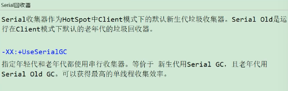
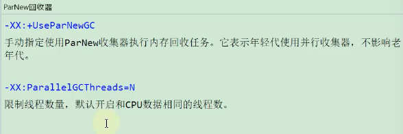
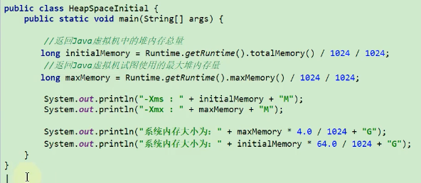

# 4.4.1 JVM参数选项类型
## 类型一：标准参数选项
* 特点：比较稳定，后续版本基本不会变化。以-开头。
* 各种选项：运行java或者java -help可以看到所有的标准选项。
  > 
  > 
  > 
  > 
* 补充内容：-server与-client
  > 

## 类型二：-X参数选项
* 特点： 非标准参数。功能还是比较稳定的，但官方说后续版本可能会变更。以-X开头。
* 各种选项：运行java -X命令可以看到所有的X选项。
> 
> 
* JVM的JIT编译模式相关的选项：
  * -Xint：禁用JIT，所有字节码都被解释执行，这个模式的速度最慢。
  * -Xcomp：所有字节码第一次使用就被编译成本地代码，然后再执行。
  * -Xmixed：混合模式，默认模式，让JIT根据程序运行的情况，有选项的将某些代码缓存执行。

* 特别地：-Xmx -Xms -Xss属于XX参数？
  * -Xms<size>：设置初始Java堆大小，等价于-XX:initialHeapSize。
  * -Xmx<size>：设置最大Java对大小，等价于-XX:MaxHeapSize。
  * -Xss<size>：设置Java线程堆栈大小，-XX:ThreadStackSize。

## 类型三：-XX参数选项
* 特点：非标准化参数。使用的最多的参数类型。这类选项属于实验性，不稳定。以-XX开头。
* 作用：用于开发和调试JVM。
* 分类：
  * Boolean类型格式：
    * -XX:+<option>：表示启用option属性。
    * -XX:-<option>：表示禁用option属性。
    * 举例：
    * 说明：因为有的指令是默认开启的，所以可以使用-关闭。
  * 非Boolean类型格式（key-value类型）：
    * 子类型1：数值型格式-XX:<option>=<number>
      > 
    * 子类型2: 非数值型格式-XX:<name>=<String>
      > 
* 特别地：-XX:+PrintFlagsFinal
  * 输出所有参数的名称和默认值。
  * 默认不包含Diagnostic和Experimental的参数。
  * 可以配合-XX:+UnlockDiagnosticVMOptions和-XX:UnlockExperimentalVMOptions使用。

# 4.4.2 添加JVM参数选项
  * Eclipse:
  * IDEA:
  * 运行jar包：java -Xms50m -Xmx50m -XX:+PrintGCDetails -XX:+PrintGCTimeStamps -jar demo.jar
  * 通过Tomcat运行war包：
    * Linux系统下可以在tomcat/bin/catalina.sh中添加类似如下配置：JAVA_OPTS="-Xms512M -Xmx1024M"
    * Windows系统下在catalina.bat中添加类似如下配置：set "JAVA_OPTS = -Xms512M -Xmx1024M"
  * 程序运行过程中：
    * 使用jinfo -flag <name>=<value> <pid>设置非Boolean类型的参数。
    * 使用jinfo -flag[+|-]<name> <pid>设置Boolean类型参数。
  
# 4.4.3 常用的JVM参数选项
* 打印设置的XX选项及值：
  * -XX:+PrintCommandLineFlags：可以让在程序运行前打印出用户手动设置或者JVM自动设置的XX选项。
  * -XX:+PrintFlagsInitial：表示打印出所有XX选项的默认值。
  * -XX:+PrintFlagsFinal：表示打印出XX选项在运行程序时生效的值。
  * -XX:+PrintVMOptions：打印JVM的参数。
* 堆、栈、方法区等内存大小设置：
  * 栈：-Xss128k  设置每个线程的栈大小为128k。等价于-XX:ThreadStackSize=128k。
  * 堆内存：
    * -Xms3550m：等价于-XX:InitialHeapSize，设置JVM初始堆内存为3550M。
    * -XmX3550m：等价于-XX:MaxHeapSize，设置JVM最大堆内存为3550M。
    * -Xmn2g：设置年轻代大小为2G。官方推荐配置为整个堆大小的3/8。
    * -XX:NewSize=1024m：设置年轻代初始值大小为1024m。
    * -XX:MaxNewSize=1024m：设置年轻代最大值为1024M。
    * -XX:SurvivorRatio=8：设置年轻代中Eden区与一个survivor区的比值，默认为8。
    * -XX:+UseAdaptiveSizePolicy：自动选择各区大小比例。(优先于SurvivorRatio)
    * -XX:NewRatio=4：设置老年与年轻代（包括1个Eden和2个Survivor区）的比值。
    * -XX:PretenureSizeThreadshold=1024：设置让大于此阈值的对象直接分配在老年代，单位为字节。只对Serial、ParNew收集器有效。
    * -XX:MaxTenuringThreshold=15：默认值为15。新生代每次MinorGC后，还存活的对象年龄+1,当对象的年龄大于设置的这个值时就进入老年代。
    * -XX:+PrintTenuringDistribution：让JVM在每次MinorGC后打印出当前使用的Survivor中对象的年龄分布。
    * -XX:TargetSurvivorRatio：表示MinorGC结束后Survivor区域中占用空间的期望比例。
  * 方法区：
    * 永久代：
      * -XX:PermSize=256m：设置永久代初始值为256M。
      * -XX:MaxPermSize=256m：设置永久代最大值为256M。
    * 元空间：
      * -XX:MetaspaceSize：初始空间大小。
      * -XX:MaxMetaspaceSize：最大空间，默认没有限制。
      * -XX:+UseCompressedOops：压缩对象指针。
      * -XX:+UseCompressedClassPointers：压缩类指针。
      * -XX:CompressedClassSpaceSize：设置Class Metaspace的大小，默认1G。
  * 直接内存：-XX:MaxDirectMemorySize。指定DirectMemory容量，若未指定，则默认与Java堆最大值一样。
* OutofMemory相关的选项：
  * -XX:+HeapDumpOnOutOfMemoryError：表示在内存出现OOM的时候，把Heap转存（Dump）到文件以便后续分析。
  * -XX:+HeapDumpBeforeFullGC：表示在出现FullGC之前，生成Heap转储文件。
  * -XX:HeapDumpPath=<path>：指定heap转存文件的存储路径。
  * -XX:OnOutOfMemoryError：指定一个可行性程序或者脚本的路径，当发送OOM的时候，去执行这个脚本。
  > 
* 垃圾收集相关选项：
  > 
  > 
  * 查看默认垃圾收集器：
    > 
  * Serial回收器：
    > 
  * ParNew回收器：
    > 
  * Parallel回收器：
    > 
    > 
* CMS回收器：
  > 
  > 
    * 补充参数：
      > 
    * 特别说明：
      > 
  * G1回收器：
    > 
    > 
    * Mixed GC调优参数。
      > 
  * 怎么选择垃圾回收器：
    > 
* GC日志相关选项：
  * 常用参数：
    * -verbose:gc：输出gc日志信息，默认输出到标准输出。
    * -XX:+PrintGC：等同于-verbose:gc。表示打开简化的GC日志。
    * -XX:+PrintGCDetails：在发生垃圾回收时打印内存回收详细的日志，并在进程退出时输出当前内存各区域分配情况。
    * -XX:+PrintGCTimeStamps：输出GC发生的时间戳。不可用独立使用，需要配合-XX:+PrintGCDetails使用。
    * -XX:PrintGCDateStamps：输出GC发生时的时间戳（以日期的形式，如2013-05-04T21:53.59.234+0800。不可用独立使用，需要配合-XX:+PrintGCDetails使用。
    * -XX:+PrintHeapAtGC：每次GC前和GC后，都打印堆信息。可以独立使用。
    * -Xloggc:<file>：把GC日志写入到一个文件中去，而不是打印到标准输出中。
  * 其他参数：
    * -XX:+TraceClassLoading：监控类的加载。
    * -XX:+PrintGCApplicationStoppedTime：打印GC时线程的停顿时间。
    * -XX:+PrintGCApplicationConcurrentTime：垃圾收集之前打印出来应用未中断的执行时间。
    * -XX:+PrintReferenceGC：记录回收了多少种不同引用类型的引用。
    * -XX:+PrintTenuringDistribution：让JVM在每次MinorGC后打印出当前使用的Survivor中对象的年龄分布。
    * -XX:+UseGCLogFileRotation：启用GC日志文件的自动转储。
    * -XX:NumberOfGClogFiles=1：GC日志文件的循环数目。
    * -XX:GCLogFileSize=1M：控制GC日志文件的大小。
* 其他参数：
  * -XX:+DisableExplicitGC：禁止hotspot执行system.gc()，默认禁用。
  * -XX:ReservedCodeCacheSize=<n>[g|m|k]、-XX:InitialCodeCacheSize=<n>[g|m|k]：指定代码缓存的大小。
  * -XX:+UseCodeCacheFlushing：使用该参数让jvm放弃一些被编译的代码，避免代码缓存被占满时JVM切换到interpreted-only的情况。
  * -XX:+DoEscapeAnalysis：开启逃逸分析。
  * -XX:+UseBiasedLocking：开启偏向锁。
  * -XX:+UsedLargePages：开启使用大页面。
  * -XX:+UseTLAB：使用TLAB,默认打开。
  * -XX:PrintTLAB：打印TLAB的使用情况。
  * -XX:TLABSize：设置TLAB大小。

# 4.4.4 通过Java代码获取JVM参数
> 
> 
* 通过Runtime获取
> 

