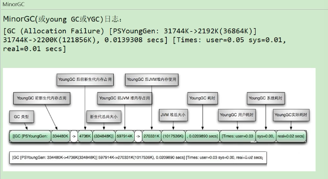

# 4.5.1 GC日志参数
* -verbose:gc：输出gc日志信息，默认输出到标准输出。
* -XX:+PrintGC：等同于-verbose:gc。表示打开简化的GC日志。
* -XX:+PrintGCDetails：在发生垃圾回收时打印内存回收详细的日志，并在进程退出时输出当前内存各区域分配情况。
* -XX:+PrintGCTimeStamps：输出GC发生的时间戳。不可用独立使用，需要配合-XX:+PrintGCDetails使用。
* -XX:PrintGCDateStamps：输出GC发生时的时间戳（以日期的形式，如2013-05-04T21:53.59.234+0800。不可用独立使用，需要配合-XX:+PrintGCDetails使用。
* -XX:+PrintHeapAtGC：每次GC前和GC后，都打印堆信息。可以独立使用。
* -Xloggc:<file>：把GC日志写入到一个文件中去，而不是打印到标准输出中。

# 4.5.2 GC日志格式
* GC分类：
  > 
  > 
  > 
* GC日志分类：
  * MinorGC：
    > 
    > 
  * FullGC:  
    > 
* GC日志结构剖析：
  * 垃圾收集器：
    > 
  * GC前后情况：
    
  * GC时间： 
    > 
* Minor GC日志分析：
  > 
  * 2020-11-20T17:19:43.365-0800：日志打印时间日期格式。如 2013-05-04T21:53:59.234+0800。
  * 0.822: gc发生时，Java虚拟机启动以来经过的秒数。
  * [GC(Allocation Failure)]：发送了一次垃圾回收，这是一次Minor GC。它不区分新生代GC还是老年代GC，括号里的内容是gc发生的原因，这里的Allocation
    Failure的原因是新生代中没有足够区域能够存放需要分配的数据而失败。
  * [PSYoungGen:76800K->8433K(89600K)]：
    * PSYoungGen：表示GC发生的区域，区域名称与使用的GC收集器是密切相关的。
      * Serial收集器：Default New Generation 显示DefNew。
      * ParNew收集器：ParNew。
      * Parallel Scanvenge收集器：PSYoung。
      * 老年代和新生代同理，也是和收集器名称相关。
    * 76800K->8433K(89600K): GC前该内存区域已使用容量 -> GC后该区域容量（该区域总容量）。
      * 如果是新生代，总容量则会显示新生代内存的9/10，即eden+from/eden+from+to区。
      * 如果是老年代，总容量则是全部内存大小，无变化。
    * 76800K->8449K(294400K)：在显示区域容量GC的情况之后，会接着显示整个堆内存区域的GC情况：GC前堆内存已使用容量 -> GC堆内存容量（堆内总容量）
      堆内总容量 =9/10新生代+老年代 < 初始化的内存大小。
    * ,0.0088371 secs]：整个GC所花费的时间，单位是秒。
    * [Times:user=0.02 sys=0.01,real=0.01secs]:
      * user：指的是CPU工作在用户态所花费的时间。
      * sys：指的是CPU工作在内核态所花费的时间。
      * real：指的是在此处GC事件中所花费的总时间。
* Full GC日志分析：
> 
  * 2020-11-20T17:19:43.794-0800：日志打印时间 日期格式。如：2013-05-04T21:53:59.234+0800。
  * 1.351：gc发生时，Java虚拟机启动以来经过的秒数。
  * Full GC(Metadata GC Threshold)：
    * 发生了一次垃圾回收，这是一次FULL GC。它不区分新生代GC还是老年代GC。
    * 括号里的内容是gc发送的原因，这里的Metadata GC Threshold的原因是Metaspace区不够用了。
      * Full GC(Ergonomics)：JVM自适应调整导致的GC。
      * Full GC(System)：调用了System.gc()方法。
    

# 4.5.3 GC日志分析工具

