# JVM
* 参考：
> Java 虚拟机规范：https://docs.oracle.com/javase/specs/index.html
> Java平台，标准版故障排除指南: https://docs.oracle.com/javase/8/docs/technotes/guides/troubleshoot/
> Java ®虚拟机规范：https://docs.oracle.com/javase/specs/jvms/se8/html/

* 调试查看工具：
    * 自带：jvisualvm、jconsole、JHSDB（JDK9及以后）。
    * JDK命令行。
    * Eclipse:Memory Analyzer Tool。
    * Jconsole。
    * VisualVm。
    * Jprofiler。
    * Java Flight Recorder。
    * GCViewer。
    * GC Easy。
    
* 内存调试自带命令：
    * jps：查看当前程序运行的进程。
    * jstat：查看JVM在JC时候统计信息。
        > jstat -gc 进程号
    * jinfo：查看JVM参数配置情况。
        > jinfo -flag 参数名 进程号。



* 常用参数说明：
> * -Xms：用于表示堆空间起始内存，等价于-XX:InitialHeapSize。(年轻代+老年代)
> * -Xmx：用于表示堆空间最大内存，等价于-XX:MaxHeapSize。(年轻代+老年代)
> * -XX:+PrintGCDetails： 打印垃圾回收细节。
> * 配置新生代与老年代在堆结构的占比。
>   * 默认-XX:NewRatio=2,表示新生代占1,老年代占2,新生代占整个堆的1/3。
>   * 可以修改-XX:NewRation=4，表示新生代占1，老年代占4，新生代占整个堆的1/5。
> * -XX：SurvivorRation：调整Eden和Survivor空间比例。比如-XX:SurvivorRatio=8。表是8：1：1。
> * -Xmn：设置新生最大内存大小。
> * -XX:MaxTenuringThreshold=<N>：幸存者区对象垃圾回收N次后放入养老区，默认15。
> * -XX:+UseTLAB。开启TLAB,默认开启的，为每个线程在伊甸园区分配独立空间，总体占伊甸园区1%。
> * -XX:TLABWasteTargetPercent。设置TLAB空间所占用Eden空间的百分比大小。
> * -XX:+HeapDumpOnOutOfMemoryError：当产生堆空间溢出时生成dump文件。
> * 查看默认的垃圾收集器：
>   * -XX:+PrintCommandLineFlags：查看命令行相关参数（包含适用的垃圾收集器）
>   * 使用命令行指令：jinfo -flag 相关垃圾回收器参数(Jdk8默认的UseParallelGC/UseParallelOldGC，Jdk9即以后UseG1GC) 进程ID


## 类加载器
* 类加载器分类：
    * 启动类加载器/引导类加载器：Bootstrap ClassLoader.
        * 使用C/C++实现，嵌套在JVM内部。
        * 用来家庄Java核心库：JAVA_HOME/jar/lib/rt.jar、resources.jar或sun.boot.class.path路径下的内容，用于提供JVM自身需要的类。
    * 扩展类加载器：Extension ClassLoader。
        * Java语言编写，由sun.misc.Launcher$ExtClassLoader实现。
        * 派生于ClassLoader.
        * 父类为启动类加载器。
        * 从java.ext.dirs系统属性所指定的目录中加载类库，或从JDK的安装目录的jar/lib/ext子系统（扩展系统）加载类库，如用户创建的JAR创建的JAR放在此目录也会由扩展类加载器加载。
    * 应用程序类加载器/系统类加载器：AppClassLoader。
        * java语言编写，有sum.misc.launcher$AppClassLoader实现。
        * 派生于ClassLoader类。
        * 父类加载器为扩展类加载器。
        * 负责加载环境变量classpath或系统属性java.class.path指定路径下的类库。
        * 该类是程序中默认的加载器，一般来说，Java应用程序类都是它来完成加载。
        * 通过ClassLoader#getSysClassLoader()方法可以获取到该类加载器。
    * 自定义类加载器：
        * 目的：
            * 隔离加载类。
            * 修改类加载的方式。
            * 扩展加载源。
            * 防止源码泄漏。
        * 实现步骤：
            * 继承java.lang.ClassLoader类的方式，实现自己的类加载器。
            * JDK1.2之前，会继承ClassLoader并重写loadClass()方法，从而实现自定义加载类。JDK1.2之后建议把自定义的类加载逻辑写在findClass()方法中。
            * 在编写类加载器时，如果没有太过于复杂的需要，可以直接继承URLClassLoader类，这样避免自己编写findClass()方法极其获取字节流的方式。
    * ClassLoader：除引导类加载器，其他类加载器都继承ClassLoader抽象类。
    * 获取ClassLoader几种方式：
    
    * 双亲委派机制：
    > Java虚拟对class文件采用的按需加载的方式，也就是说当需要使用该类时才会将它的class文件加载到内存生成class对象。而且加载某个类的class文件时，Java虚拟机采用的时双亲委派机制，即把请求交由父类处理，它是一种任务委派模式。
        * 工作原理： 
        * 举例2：
        * 优势：
            * 避免重复加载。
            * 保护程序安全，防止核心API被篡改。
        * 沙箱安全机制：即引导类加载的过程中会首先加载jdk自带的文件，可以保证对java核心源代码的保护。
    
    * 补充：
        * JVM表示两个class对象是否同一个类两个必要条件：
            * 类完整名称必须一致，包括包名。
            * 加载这个类的ClassLoader（ClassLoad实例）必须相同。
        * 对类加载器的引用：
        > JVM必须知道一个类型是由启动加载器还是由用户加载器加载的。如果一个类型是由用户类加载器加载的，那么JVM会将这个类加载器的一个引用作为类型信息的一部分保存在方法区。当解析一个类型到另一个类型的引用的时候，JVM需要保证这两个类型的类加载器时相同的。

## 运行时数据区：
* 总览：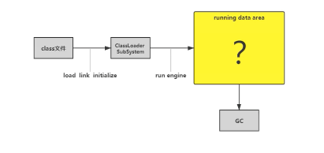
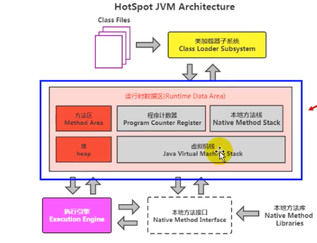
* 区域划分：

    * 方法区和堆：
    > 随着虚拟机启动而创建，随着虚拟机退出而销毁。线程共享(堆、堆外内存（永久代/元空间、代码缓存))。
    * 程序计数器、本地方法站、虚拟机站：
    > 单独线程私有。
* JVM角度看线程：
    * 在Hotspot JVM里，每个线程与操作系统的本地线程直接映射。
    > 当一个Java线程准备好执行以后，此时一个操作系统线程也同时创建。Java线程执行终止后，本地线程也会回收。操作系统负责所有线程的安排调度到任何一个可用的CPU上。一旦本地线程初始化成功，它就会调用Java线程中的run()方法。
    * Hotspot JVM后台主要线程有：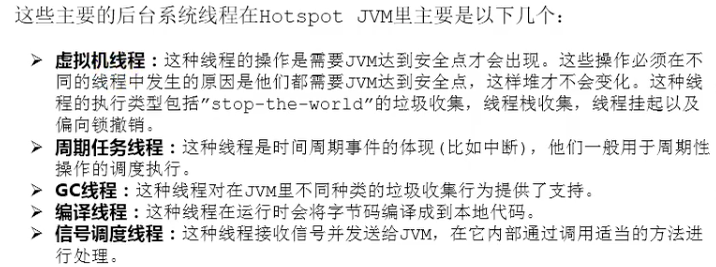
* 程序计数器（PC寄存器）：
    > 寄存器存储指令相关的现场信息。CPU只有把数据装载到寄存器才能够运行。并非广义所指物理寄存器。JVM中的PC寄存器是对物理PC寄存器的一种抽象模拟。
    * 作用：PC寄存器用来存储指向下一条指令的地址，也即将要执行的指令代码。由执行引擎读取下一条指令。
参见： 
    * 是一块很小内存空间，几乎可以忽略不计，也是运行最快的存储区域。
    * JVM规范中，每个线程都有它自己的程序计数器，是线程私有的，生命周期与线程一致。
    * 任何时间一个线程都只有一个方法在执行，就是所谓的当前方法。程序计数器会存储当前线程正在执行的Java方法的JVM指令地址。如果是native（本地）方法，则是未指定。
    * 是程序控制流的指示器，分支、循环、跳转、异常处理、线程恢复等基础功能需要依赖这个计数器来完成。
    * 字节码解释器的工作时就是通过改变这个计数器的值来选取下一条需要执行的字节码指令。
    * 它时唯一一个在Java虚拟机规范中没有规定任何OutMemoryError情况的区域。
    * PC寄存器的作用/好处：
    
    * PC寄存器为什么设置为私有：
     
        

## 虚拟机栈：
* 背景：
 > 由于跨平台设计，Java的指令根据栈来设计。不同平台CPU架构不同，所以不能设计为基于寄存器的。
* 优点：
> 跨平台，指令集小（8位），编译器容易实现。
* 缺点：
> 性能下降，实现同样功能需要更多的指令。
* 内存中栈和堆：栈是运行时的单位，堆是存储的单位。

* Java虚拟机栈是什么？
> 早期也叫Java栈，每个线程在创建时都会创业一个虚拟机栈，其内部保存一个个的栈针，对应一次次的Java方法调用。是线程私有的。
* 生命周期：生命周期和线程一致。
* 作用：主管Java程序的运行，它保存方法的局部变量（8种基本数据类型、对象类型的引用地址），部分结果，并参与方法的调用和返回。
* 栈中可能出现的异常：
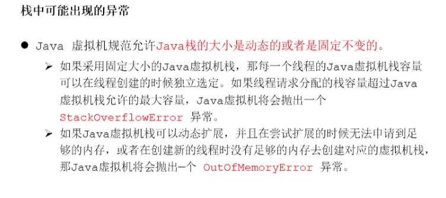
* 设置栈内存大小：-Xss，栈的大小直接决定了函数调用的最大可达深度。
* 栈的存储单元：
    * 栈中存储什么：
        * 栈中数据都是以栈帧（Stack Frame）的格式存在。
        * 在这个线程上真在执行的每个方法都各自对应一个栈帧。
        * 栈帧是一个内存区块，是一个数据集，维系着方法执行过程中的各种数据信息。
    * 栈帧的内部结构：
        * 局部变量表。
        * 操作数栈/表达式栈。
        * 动态链接/指向运行时常量池的方法引用。
        * 方法返回地址/方法正常退出或者异常退出的定义。
        * 一些附加信息。    
    
        * 局部变量表（local varibles）：局部变量表也被称之为局部变量数组或本地变量表。
        > * 定义为一个数字数组，主要用于存储方法参数和定义在方法体内的局部变量，这些数据类型包括各种基本数据类型、对象引用（reference），以及returnAddress类型。
        > * 由于局部变量表是建立在线程的栈上，是线程的私有数据，因此不存在数据安全问题。
        > * 局部变量表所需的容量大小是在编译期确定下来的，并保存在方法的Code属性的maximum local variables数据项中。在方法运行期间是不会改变局部变量表的大小的。

            * 关于Slot的理解：
                * 局部变量表，最基本的存储单元是Slot（变量槽）。
                * 参数值得存放总是在局部变量数组的index0开始，到数组长度-1的索引结束。
                * 局部变量表存放编译期可知的各种基本数据类型（8种），引用类型（reference），returnAddress类型的变量。
                * 在局部变量表中，32位以内的类型只占用一个slot（包括returnAddress类型），64位的类型（long和double）占用两个slot。
                    * byte、short、char在存储前被转换为int，boolean也被转换为int，0表示false，非0表示true。
                    * long和double则占据两个Slot。
                * Slot的重复利用：栈帧中的局部变量表中的槽位是可以重用的，如果一个局部变量过了其作用域，那么在其作用域之后声明的新的局部变量就很有可能会复用过期局部变量的槽位，从而达到节省资源的目的。

        * 操作数栈（Operand Stack）：
            * 数组实现。
            * 每一个独立的栈帧中除了包含局部变量表以外，还包含一个后进先出（Last-In-First-Out）的操作数栈，也可以称之为表达式栈（Expression Stack）。
            * 操作数栈，在方法执行过程中，根据字节码指令，往栈中写入数据或提取数据，即入栈（push）/出栈(pop)。
                * 某些字节码指令将值压入操作数栈，其余的字节码指令将操作数取出栈。使用它们后再把结果压入栈。
                * 比如：执行复制、交换、求和等操作。
                * 操作数栈，主要用于保存计算过程的中间结果，同事时作为计算过程中变量临时的存储空间。
                * 操作数栈就是JVM执行引擎的一个工作区，当一个方法刚开始执行的时候，一个新的栈帧也会随之被创建处理，这个方法的操作数栈是空的。
                * 每一个操作数栈都会拥有一个明确的栈深度用于存储数值，其所需的最大深度在编译期就定义好了，保存在方法的Code属性中，为max_stack的值。
                * 栈中的任何一个元素都是可以任意的Java数据类型。
                    * 32bit的类型占用一个栈单位深度。
                    * 64bit的类型占用两个栈单位深度。
                * 操作数栈并非采用访问索引的方法来进行数据访问的，而是只能通过标准的入栈（push）和出栈（pop）操作来完成一次数据访问。
                * 如果被调用的方法带有返回值的话，其返回值将会被压入当前栈帧的操作数栈中，并更新PC寄存器中下一条需要执行的字节码指令。
                * 操作数栈中元素的数据类型必须与字节码指令的序列严格匹配，这由编译器在编译期进行验证，同时在类加载过程中的类检验阶段的数据流分析阶段要再次验证。
                * 另外，我们说Java虚拟机的解释引擎是基于栈的执行引擎，其中的栈指的就是操作数栈。
                
                * 栈顶缓存技术：将栈顶元素全部缓存在物理CPU的寄存器中，以此降低对内存的读/写次数，提升执行引擎的执行效率。
    
        * 动态链接：或指向运行时常量池的方法引用。
            * 每一个栈帧内部都包含一个指向运行时常量池中该栈帧所属方法的引用。包含这个引用的目的就是为了支持当前方法的代码能够实现动态链接（Dynamic Linking）。比如：invokedynamic指令。
            * 在Java源文件被编译到字节码文件中时，所有的变量和方法引用都作为符号引用（Symbolic Reference）保存在class文件的常量池中指向方法的符号引用来表示的，那么动态链接的作用就是为了将这些符号引用转换为调用方法的直接引用。
    
            * 为什么需要常量池？：常量池的作用，就是为了提供一些符号和常量，便于指令的识别。
            

        * 方法的调用：在JVM中，将符号引用转换为调用方法的直接引用与方法的绑定机制相关。
            * 静态链接：当一个字节码文件被装载进JVM内部时，如果被调用的目标方法在编译期可知，且运行期保持不变时。这种情况下将调用方法的符号引用转换为直接引用的过程称之为静态链接。
            * 动态链接：如果被调用的方法在编译期无法被确定下来，也就是说，只能够在程序运行期将被调用方法的符号引用转换为直接引用，由于这种引用转换过程具备动态性，因此也就被称之为动态链接。
        对应的方法的绑定机制为：早期绑定（Early Binding）和晚期绑定（Late Binding）。绑定是一个字段、方法或者类在符号引用被替换为直接引用的过程，这仅仅发生一次。
              * 早期绑定： 指被调用的目标方法如果在编译期可知，且运行期保持不变时，即可将这个方法与所属的类型进行绑定，这样一来，由于明确了被调用的目标方法究竟是哪一个，因此也就可以使用静态链接的方式将符号引用转换为直接引用。
              * 晚期绑定：如果被调用的方法在编译期无法被确定下来，只能够在程序运行期根据实际的类型绑定相关的方法，这种绑定方式也就被称之为晚期绑定。

            * 方法的调用：虚方法与非虚方法。
                * 如果方法在编译期就确定了具体的调用版本，这个版本在运行时是不可变得。这样的方法称为非虚方法。
                * 静态方法、私有方法、final方法、实例构造器、父类方法都是非虚方法。
                * 其他方法称为虚方法。
                
                * 虚拟机中提供了以下几条方法调用指令：
                    * 普通调用指令：
                        > 1. invokestatic：调用静态方法，解析阶段确定唯一方法版本。
                        > 2. invokespecial：调用<init>方法、私有及父类方法，解析阶段确定唯一方法版本。
                        > 3. invokevirtual：调用所有虚方法。
                        > 4. invokeinterface：调用接口方法。 
                    * 动态调用指令：
                        > 5. invokedynamic：动态解析式出需要调用的方法，然后执行。
                    > 前四条指令固化在虚拟机内部，方法的调用执行不可人为干预，而invokedynamic指令则支持由用户确定方法版本。其中invokestatic指令和invokespecial指令调用的方法称为非虚方法，其余的（final修饰的除外）称为虚方法。
        * 方法返回地址（return address）:
            * 存放调用该方法的pc寄存器的值。
            * 一个方法的结束，有两种方式：
                * 正常执行完成。
                  > 一个方法在正常完成之后究竟需要使用哪一个返回指令还需要根据方法返回值的实际数据类型而定。
                  > 在字节码指令中，返回指令包含ireturn（当返回值是boolean、byte、char、short和int类型时使用）、lreturn、freture、dreturn、dreture以及areturn，
                  > 另外还有一个return指令供声明为void的方法、实例初始化方法、类和接口的初始化方法使用。
                * 出行未处理的异常，非正常退出。
                  > 方法执行过程中抛出异常时的异常处理，存储在一个异常处理表，方便在发生异常的时候找到处理异常的代码。
            > 无论通过哪种方式退出，在方法退出后都返回到该方法被调用的位置。方法正常退出时，调用者的pc计数器的值作为返回地址，即调用该方法的指令的下一条指令的地址。
            > 而通过异常退出的，返回地址是要通过异常表来确定，栈帧中一般不会保存这部分信息。
            
            > 本质上，方法的退出就是当前栈帧出栈的过程。此时，需要恢复上层方法的局部变量表、操作数栈、将返回值压入调用者栈帧的操作数栈、设置PC寄存器值等，让调用者继续执行下去。
            > 正常完成出口和异常完成出口的区别在于：通过异常完成出口退出的不会给他的上层调用者产生任何的返回值。 
        * 一些附加信息：
        > 栈帧中还运行携带与Java虚拟机实现相关的一些附加信息。例如，对程序调试提供支持的信息。
        * 栈的相关面试题：
            * 举例栈溢出的情况？（StackOverflowError）: 通过-Xss设置栈的大小。 OOM（没有可分配空间）。
            * 调整栈大小，就能保证不出现溢出吗？不能。
            * 分配的栈内存越大越好吗？不是！
            * 垃圾回收是否会涉及到虚拟机栈？不会的！
            * 方法中定义的局部变量是否线程安全？具体问题具体分析。方法能产生方法内消亡的线程安全，否则不安全。


## 本地方法                                                 

* 什么是本地方法：
> 简单地讲，一个Native Method就是一个Java调用非Java代码的接口。在定义一个native method时，并不提供实现体（有些像定义一个Java interface），因为其实现体是由非java语言在外面实现的。
> 本地接口的作用是融合不同的编程语言为Java所用，它的初衷是融合C/C++程序。
* 为什么需要本地方法：
    * 与Java环境外交互。
    * 与操作系统交互。
    * sun的解释器是用C实现的。

## 本地方法栈：
* Java虚拟机栈用于管理Java方法的调用，而本地方法栈用于管理本地方法的调用。
* 本地方法栈，也是线程私有的。
* 允许被实现成固定或者可动态扩展的内存大小。（在内存溢出方法是相同的）
    * 如果线程请求的栈容量超过本地方法栈允许的最大容量，Java虚拟机将会抛出一个StackOverflowError异常。
    * 如果本地方法栈可以动态扩展，并且在尝试扩展的时候无法申请到足够的内存，或者在创建新的线程时没有足够的内存去创建对应的本地方法栈，那么Java虚拟机将会抛出一个OutOfMemoryError异常。
* 本地方法是使用C语言实现的。
* 他的具体做法是Native Method Stack中登记native方法，在Execution Engine执行时加载本地方法库。
* 当某个线程调用一个本地方法时，它就进入了一个全新的并且不再受虚拟机限制的世界。 它和虚拟机拥有同样的权限。
    * 本地方法可以通过本地方法接口来访问虚拟机内部的运行时数据区。
    * 它甚至可以直接使用本地处理器中寄存器。
    * 直接从本地的堆中分配任意数量的内存。
* 并不是所有的JVM都支持本地方法。因为Java虚拟机规范并没有明确要求本地方法栈的使用语言、具体实现方式、数据结构等。如果JVM产品不打算支持native方法，也可以无需实现本地方法栈。
* 在Hotspot JVM中，直接将本地方法栈和虚拟机栈合二为一。


## 堆
* 一个JVM实例只存在一个堆内存，堆也是Java内存管理的核心区域。
* Java堆区在JVM启动的时候即被创建，其空间大小也就确定了。是JVM管理的最大一块内存空间。
    * 堆内存的大小是可以调节的。-Xms初始化堆空间。-Xmx最大堆空间。
* 《Java虚拟机规范》规定，堆可以处于物理上不连续的内存空间中，但在逻辑上它应该被视为连续的。
* 所有的线程共享Java堆，在这里还可以划分线程私有的缓冲器（Thread Local Allocation Buffer,TLAB）。
* 《Java虚拟机规范》中堆Java堆的描述是：所有的对象实例以及数组都应当在运行时分配在堆上。（The heap is the run-time data area from which memory for all class instances and arrays is allacated）
    * 我要说的是：“几乎”所有的对象实例都在这里分配内存。——从实际使用角度看得。
* 数组和对象可能永远不会存储在栈上，因为栈帧中保存引用，这个引用指向对象或者数组在堆中的位置。
* 在方法结束后，堆中的对象不会马上被移除，仅仅在垃圾收集的时候才会被移除。
* 堆，是GC（Garbage Collection,垃圾收集器）执行垃圾回收的重点区域。

* 堆的核心概述：内存细分》现代垃圾收集器大部分都基于分代收集理论设计，堆空间细分为：
    * Java 7及之前堆内存逻辑上分为三部分：新生区+养老区+永久区。
    > * Young Generation Space 新生区 Young/New。
    >       * 又被划分为Eden区和Surivivor区 
    > * Tenure Generation space 养老区 Old/Tenure
    > * Permanent Space 永久区     Perm
    * Java 8及之后堆内存逻辑上分为三部分：新生区+养老区+元空间
    > * Young Generation Space 新生区 Young/New
    >   * 又被划分为Eden区和Survivor区 
    > Tenure generation space养老区 Old/Tenure
    > Meta Space 元空间 Meta 
> 约定：新生区《》新生代《》年轻代      养老区《》老年区《》老年代       永久区《》永久代

* 年轻代与老年代
    * 存储在JVM中的Java对象可以被划分为两类：
        * 一类是生命周期较短的瞬时对象，这类对象的创建和消亡都非常迅速。
        * 另一类对象的生命周期却非常长，在某些极端的情况下还能够与JVM的生命周期保持一致。
    * Java堆区进一步细分的话，可以划分为年轻代（YoungGen）和老年代（OldGen）
    * 其中年轻代又可以划分为Eden空间、Survivor0空间和Survivor1空间（有时也叫做from区、to）。
   
    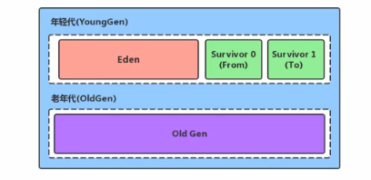
    * 下面这参数开发中一般不会调：
    
    
    * 配置新生代与老年代在堆结构的占比。
        * 默认-XX:NewRatio=2,表示新生代占1,老年代占2,新生代占整个堆的1/3。
        * 可以修改-XX:NewRation=4，表示新生代占1，老年代占4，新生代占整个堆的1/5。
        * 在HotSpot中，Eden空间和另外两个Survivor空间缺省所占的比例是8:1:1。（官方文档包括打印参数是该比例，实际是6:1:1）。
        * 可以通过选项“-XX：SurvivorRation”调整这个空间比例。比如-XX:SurvivorRatio=8。
        * 绝大部分的Java对象的销毁都在新生代进行了。
            * IBM公司的专门研究表明，新生代中80%的对象都是“朝生夕死”的。
        * 可以使用选项“-Xmn”设置新生最大内存大小。
            * 这个参数一般使用默认值就可以了。
* 对象分配过程：概述
> 为新对象分配内存是一件非常严谨和复杂的任务，JVM的设计者们不仅需要考虑内存如何分配、在哪里分配等问题，并且由于内存分配算法与内存回收算法密切相关，所以还需要考虑GC执行完内存回收后是否在内存空间中产生内存碎片。
> 1. new的对象先放伊甸园区。此区有大小限制。
> 2. 当伊甸园区的空间填满时，程序又需要创建对象，JVM的垃圾回收器将对伊甸园区进行垃圾回收（Minor GC）,将伊甸园区中的不再被其他对象所引用的对象进行销毁。再加载新的对象放到伊甸园区。
> 3. 然后将伊甸园区中的剩余对象移动到幸存者0区。
> 4. 如果再次触发垃圾回收，此时上次幸存下来的放到幸存者0区的，如果没有回收，就会放到幸存者1区。
> 5. 如果再次经历垃圾回收，此时会重新放回幸存者0区，接着再去幸存者1区。
> 6. 啥时候能去养老区呢？可以设置次数。默认是15次。
>   * 可以设置参数：-XX:MaxTenuringThreshold=<N>进行设置。
> 7. 在养老区，相对悠闲。当养老区内存不足时，再次触发GC：Major GC，进行养老区的内存清理。
> 8. 养老区执行了Major GC之后发现依然无法进行对象的保存，就会产生OOM异常。【java.lang.OutOfMemoryError:Java heap space】
> 总结：
> * 针对幸存者s0，s1区的总结：复制之后有交换，谁空谁是to。
> * 关于垃圾回收：频繁在新生区收集，很少在养老区收集，几乎不在永久区/元空间收集。
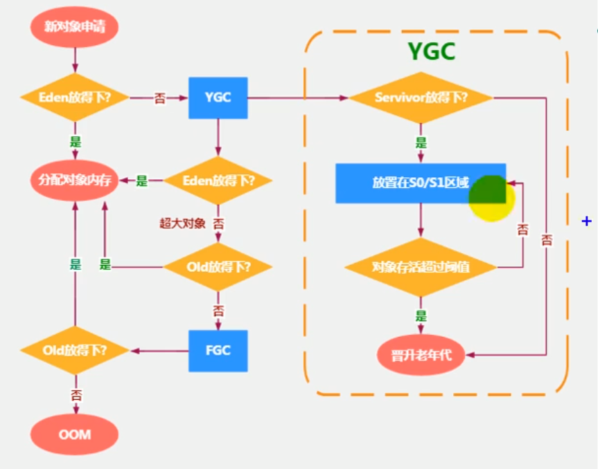

* 常用调优工具
    * JDK命令行。
    * Eclipse:Memory Analyzer Tool。
    * Jconsole。
    * VisualVm。
    * Jprofiler。
    * Java Flight Recorder。
    * GCViewer。
    * GC Easy。

* Minor GC、Major GC 与 Full GC
> JVM在进行GC时，并非每次都对上面三个内存（新生代、老年代：方法区）区域一起回收的，大部分时候回收的都是指新生代。
> 针对HotSpot VM的实现，它里面的GC按照回收区域又分为两大种类型：一种是部分收集（Partial GC），一种是整堆收集（Full GC）。
* 部分收集：不是完整收集整个Java堆的垃圾收集。其中又分为：
    * 新生代收集（Minor GC/Young GC）：只是新生代（Eden\s0,s1）的垃圾收集。
    > 年轻代GC（Minor GC）触发机制：
    > * 当年轻代空间不足时，就会触发Minor GC，这里的年轻代满指的时Eden代满，Survivor满不会引发GC。（每次Minor GC会清理年轻代的内存）。
    > * 因为Java对象大多都具备朝生夕灭的特性，所以Minor GC非常频繁，一般回收速度也比较快。这一定义既清晰又易于理解。
    > * Minor GC会引发STW，暂停其它用户的线程，等垃圾回收结束，用户线程才恢复运行。 
    * 老年代收集（Major GC / Old GC）：只是老年代的垃圾收集。
        * 目前，只有CMS GC会单独收集老年代的行为。
        * 注意，很多时候Major GC会和Full GC混淆使用，需要具体分辨是老年代回收还是整堆回收。
    > 老年代GC（Major GC/Full GC）触发机制：
    > * 指发生在老年代的GC,对象从老年代消失时，我们说“Major GC”或“Full GC”发生了。
    > * 出现了Major GC，经常会伴随至少一次的Minor GC（但非绝对的，在Parallel Scavenge收集器的收集策略里就直接进行Major GC的策略选择过程）。
    >   * 也就是在老年代空间不足时，会先尝试触发Minor GC。如果之后空间还不足，则Major GC。
    > * Major GC的速度一般会比Minor GC慢10倍以上，STW的时间更长。
    > * 如果Major GC后，内存还不足，就报OOM了。
    * 混合收集（minxed GC）：收集整个新生代以及部分老年代的垃圾收集。
        * 目前，只有G1 GC会有这种行为。
* 整堆收集（Full GC）：收集整个java堆和方法区的垃圾收集。
    > FUll GC 触发机制：触发Full GC执行的情况有如下五种：
    > 1. 调用System.gc()时，系统建议执行Full GC，但是不必然执行。
    > 2. 老年代空间不足。
    > 3. 方法区空间不足。
    > 4. 通过Minor GC后进入老年代的平均大小大于老年代的可用内存。
    > 5. 由Eden区、survivor space0（From Space）区向survivor space1（To Space）区复制时，对象大小大于To Space可用内存，则把对象转存到老年代，且老年代的可用内存小于该对象大小。
    > 说明：full gc是开发或调优中尽量要避免的。这样暂停时间会短一些。 

* 堆空间分代思想：为什么需要把Java堆分代？不分代就不能正常工作了吗？
    * 经研究，不同对象的生命周期不同。70%-99%的对象是临时对象。
        * 新生代：有Eden、两块大小相同的Survivor（又称为from/to，s0/s1）构成，to总为空。
        * 老年代：存放新生代中经历多次GC仍然存活的对象。
    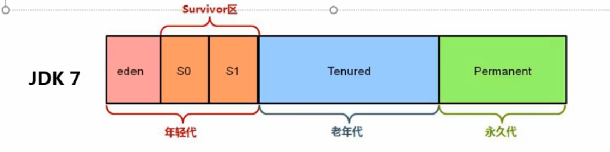
    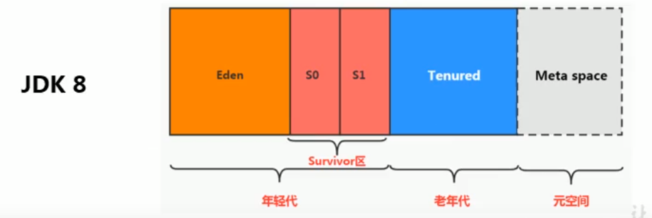

* 内存分配策略：（总结）针对不同年龄段的对象分配原则如下所示：
    * 优先分配到Eden。
    * 大对象直接分配到老年代。
        * 尽量避免程序中出现过多的大对象。
    * 长期存活的对象分配到老年代。
    * 动态对象年龄判断。
        * 如果Survivor 区中相同年龄的所有对象大小的总和大于Survivor空间的一半，年龄大于或等于该年龄的对象可以直接进入老年代，无须等到MaxTenuringThreshold中要求的年龄。
    * 空间分配担保：指大量对象放Survivor，放不下直接放老年代。
        * -XX:HandlePromotionFailure。

* 为对象分配内存：TLAB。为什么有TLAB（Thread Local Allocation Buffer）？
    * 堆区是线程共享区域，任何线程都可以访问到堆区中的共享数据。
    * 由于对象实例的创建在JVM中非常频繁，因此在并发环境中从堆区中划分内存空间是不安全的。
    * 为避免多个线程操作同一地址，需要使用加锁等机制，进而影响分配速度。
    * 从内存模型而不是垃圾收集的角度，堆Eden区域继续进行划分，JVM为每个线程分配了一个私有缓存区域，它包含在Eden空间。
    * 多线程同时分配内存时，使用TLAB可以避免一系列的非线程安全问题，同时还能够提升内存分配的吞吐量，因此我们可以将这种内存分配方式称之为快速分配策略。
    * 所有OpenJDK衍生处理的JVM都提供了TLAB的设计。
    * 尽管不是所有的对象实例都能够在TLAB中成功分配内存，但JVM确实是将TLAB作为内存分配的首选。
    * 在程序中，开发人员可以通过选项“-XX:UseTLAB”设置是否开启TLAB空间。
    * 默认情况下，TLAB空间的内存非常小，仅占整个Eden空间的10%，当然我们可以通过选项“-XX：TLABWasteTargetPercent”设置TLAB空间所占用Eden空间的百分比大小。
    * 一旦对象在TLAB空间分配内存失败时，JVM就会尝试着通过使用加锁机制确保数据操作的原子性，从而直接在Eden空间中分配内存。
    * 对象分配过程：TLAB
    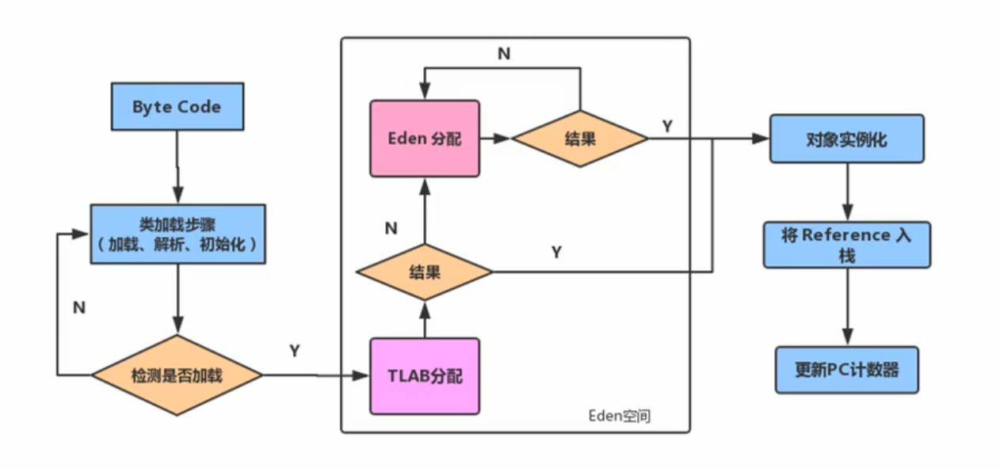

* 堆空间参数设置：
    * 官网说明：https://docs.oracle.com/javase/8/docs/technotes/tools/unix/java.html
    * -XX:+PrintFlagsInitial：查看所有参数的默认值。
    * -XX:+PrintFlagFinal：查看所有的参数的最终值（可能会存在修改，不再是默认值）。
    * -Xms：初始堆空间内存（默认是物理内存的1/64）。
    * -Xmx：最大堆空间内存（默认物理内存的1/4）。
    * -Xmn：设置新生代的大小。（初始值及最大值）。
    * -XX: NewRatio：配置新生代与老年代在堆结构的占比。
    * -XX:SurvivorRatio：设置新生代中Eden和s0/s1空间的比例。
    * -XX:MaxTenuringThreshold：设置新生代垃圾的最大年龄。
    * -XX:+PrintGCDetails：输出详细的GC处理日志
        * 打印gc简要信息：-XX:+PrintGC。-verbose:gc。
    * -XX:HandlePromotionFailure：是否设置空间分配担保。
    > 在发生Minor GC之前，虚拟机会检查老年代最大可用的连续空间是否大于新生代所有对象的总空间。
    > * 如果大于，则此次Minor GC是安全的。
    > * 如果小于，则虚拟机会查看-XX:HandlePromotionFaliure设置值是否允许担保失败。
    >   * 如果HandlePromotionFailure=true，那么会继续检查老年代最大可用连续空间是否大于历次晋升到老年代对象的平均大小。
    >       * 如果大于，则尝试进行一次Minor GC，但这次Minor GC依然是由风险的。
    >       * 如果小于，则改为进行一次Full GC。
    > * 如果HandlePromotionFailure=false，则改为进行一次Full GC。 
    > 注：在JDK 6 Update24之后（JDK7），HandlePromotionFailure参数不会再影响到虚拟机的空间分配担保策略，观察OpenJDK中的源代码变化，虽热源代码中还定义了HandlePromotionFailure参数，但是在代码中已经不会再使用它。
    > JDK6 Update 24之后的规则变为只要老年代的连续空间大于新生代对象总大小或者历次晋升的平均大小时就会进行Minor GC，否则将进行Full GC。 

* 堆是分配对象存储的唯一选择吗？
> 在《深入理解Java虚拟机》中关于Java堆内存有这样一段描述：
> 随着JIT编译期的发展与 逃逸分析技术 逐渐成熟， 栈上分配、标量替换优化技术 将会导致一些微妙的变化，所有的对象都分配到堆上也渐渐变得不那么“绝对”了。
> 
> 在Java虚拟机中，对象是在Java堆中分配内存的，这是一个普遍的常识。但是，有一种特殊情况，那就是 如果经过逃逸分析（Escape Analysis）后发现，一个对象并没有逃逸出方法的话，那么就可能被优化成栈上分配。 这样就无需在堆上分配内存，也无须进行垃圾回收了。这也是最常见的堆外存储技术。
> 
> 此外，前面提到的基于OpenJDK深度定制的TaoBaoVM，其中创新的GCIH（GC invisible heap）技术实现off-heap，将生命周期较长的Java对象从heap中移至heap外，并且GC不能管理GCIH内部的Java对象，以此达到降低GC的回收频率和提升GC的回收效率的目的。

* 逃逸分析概述：
    * 如何将堆上的对象分配到栈，需要使用逃逸分析手段。
    * 这是一种可以有效减少Java程序中同步负载和内存堆分配压力的跨函数全局数据流分析算法。
    * 通过逃逸分析，Java Hotspot编译器能够分析出一个新的对象的引用的使用范围从而决定是否要将这个对象分配到堆上。
    * 逃逸分析的基本行为就是分析对象动态作用域：
        * 当一个对象在方法中被定义后，对象只在方法内部使用，则认为没有发生逃逸。
        * 当一个对象在方法中被定义后，它被外部方法所引用，则认为发生逃逸。例如作为调用参数传递到其他地方中。
    * 参数设置：
        * 在JDK 6u23版本之后，HotSpot中默认就已经开启了逃逸分析。
        * 如果使用的是较早的版本，开发人员则可以通过：
            * 选项“-XX:+DoEscapeAnalysis”显示开启逃逸分析。
            * 通过选项“-XX:+PrintEscapeAnalysis”查看逃逸分析的筛选结果。
    * 逃逸分析：代码优化。使用逃逸分析，编译器可以对代码做如下优化：
        * 栈上分配。 将堆分配转化为栈分配。如果一个对象在子程序中被分配，要使指向该对象的指针永远不会逃逸，对象可能是栈分配的候选，而不是堆分配。
          > JIT编译器在编译期根据逃逸分析的结果，发现如果一个对象并没有逃逸出方法的话，就可能被优化成栈上分配。分配完成后，继续在调用栈内执行，最后线程结束，栈空间被回收，局部变量对象也被回收。这样就无须进行垃圾回收了。
          > 常见的栈上分配的场景。分别是成员变量赋值、方法返回值、实例引用传递。
        * 同步省略。如果一个对象被发现只能从一个线程被访问到，那么对于这个对象的操作可以不考虑同步。
          > 线程同步的代价是相当高的，同步的后果是降低并发性和性能。
          > 在动态编译同步块的时候，JIT编译器可以借助逃逸分析来判断同步块所使用的锁对象是否只能够被一个线程访问而没有被发布到其他线程。如果没有，那么JIT编译器在编译这个同步块的时候就会取消对这部分代码的同步。这样就能大大提高并发性和性能。这个取消同步的过程就叫同步省略，也叫锁消除。
        * 分离对象或标量替换。有的对象可能不需要作为一个连续的内存结构存在也可以被访问到，那么对象的部分(或全部)可以不存储在内存，而是存储在CPU寄存器中。
          > 标量（Scalar）是指一个无法再分解成更小的数据的数据。Java中的原始数据类型就是标量。
          > 相对的，那些可以分解的数据叫做 聚合量（Aggregate），Java中的对象就是聚合量，因为他可以分解成其他聚合量和标量。
          > 在JIT阶段，如果经过逃逸分析，发现一个对象不会被外界访问的话，那么经过JIT优化，就会把这个对象拆解成若干个其中包含的若干个成员变量来代替。这个过程就是 标量替换。
> 结论：开发中能使用局部变量的，就不要使用方法外定义。

* 小结：
    * 年轻代是对象的诞生、生长、消亡的区域，一个对象在这里产生、应用，最后被垃圾回收器收集、结束生命。
    * 老年代放置长生命周期的对象，通常都是从Survivor区域筛选拷贝过来的Java对象。当然，也有特殊情况，我们知道普通的对象会被分配到TLAB上；如果对象较大，JVM会试图直接分配在Eden其他位置上；如果对象太大，完全无法在新生代找到足够长的连续空闲空间，JVM就会直接分配到老年代。
    * 当GC发生在年轻代中，回收年轻代对象的行为称为MinorGC。当GC发生在老年代时则被称为MajorGC或者FullGC。一般的，MinorGC的发生频率要比MajorGC高很多，即老年代中垃圾回收发生的频率将大大低于年轻代。

https://www.bilibili.com/video/BV1PJ411n7xZ?p=86

## 方法区
* 栈、堆、方法区的交互关系：
    * 运行时数据区结构图：从线程共享与否的角度来看。
    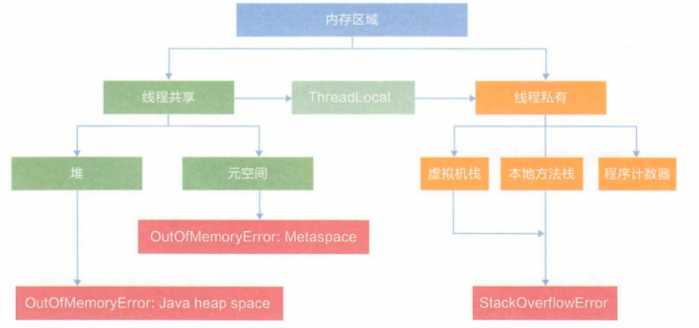
    * 栈、堆、方法区的交互关系：
    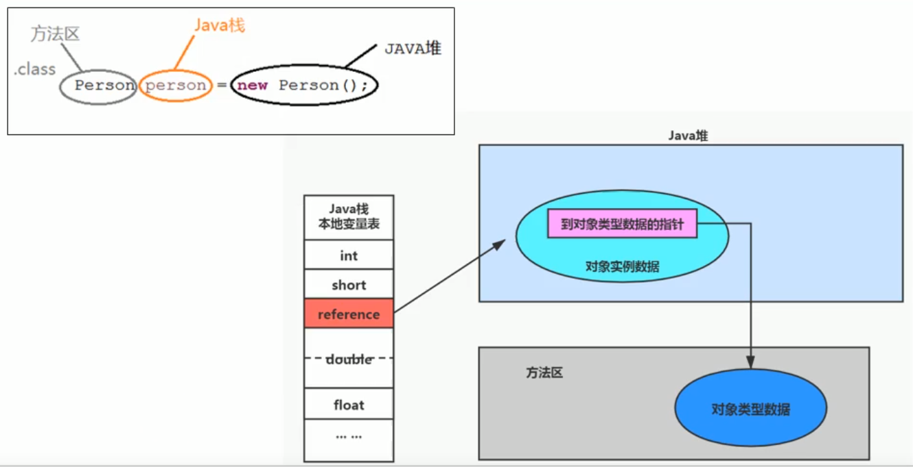

* 方法区在哪里？
> 《Java虚拟机规范》中明确说明：“尽管所有的方法区在逻辑上是属于堆的一部分，但一些简单的实现可能不会选择去进行垃圾收集或者进行压缩。”但对于HotSpotJVM而言，方法区还有一个别名叫做Non-Heap（非堆），目的就是要和堆分开。
> 所以，方法区看作是一块独立于Java堆的内存空间。
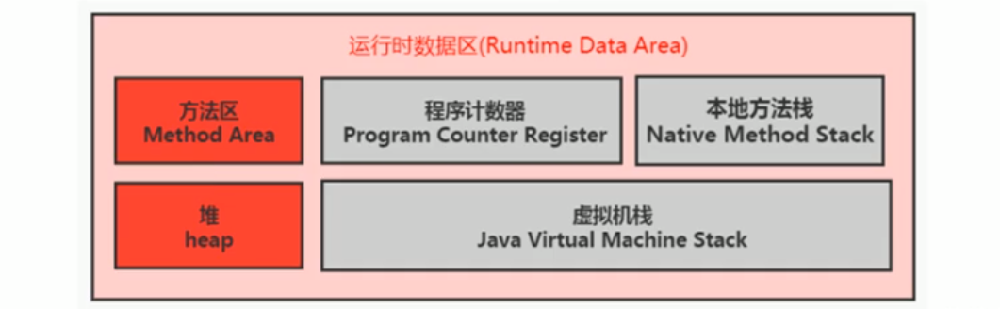

* 方法区的基本理解：
    * 方法区（Method Area）与Java堆一样，是各个线程共享的内存区域。
    * 方法区在JVM启动的时候被创建，并且它的实际的物理内存空间中和Java堆区一样都可以是不连续的。
    * 方法区的大小，跟堆空间一样，可以选择固定大小或者可扩展。
    * 方法区的大小决定了系统可以保存多少个类，如果系统定义了太多的类，导致方法区溢出，虚拟机统一会抛出内存溢出错误：java.lang.OutOfMemoryError：PermGen space或者java.lang.OutOfMemoryError:Metaspace。
        * 加载大量的第三方的jar包；Tomcat部署的工程过多（30-50个）；大量动态的生成反射类。
    * 关闭JVM就会释放这个区域的内存。

* Hotspot中方法区的演进：
    * 在jdk7及以前，习惯上把方法区，称为永久代。jdk8开始，使用元空间取代了永久代。
    * 本质上，方法区和永久代并不等价。仅是对hotspot而言的。《Java虚拟机规范》对如何实现方法区，不做统一要求。例如：EBA JRockit/IBM J9中不存在永久代的概念。
        * 现在来看，当年使用永久代，不是好的idea。导致Java程序更容易OOM（超过-XX:maxPermSize上限）。
    * 方法区概述：
    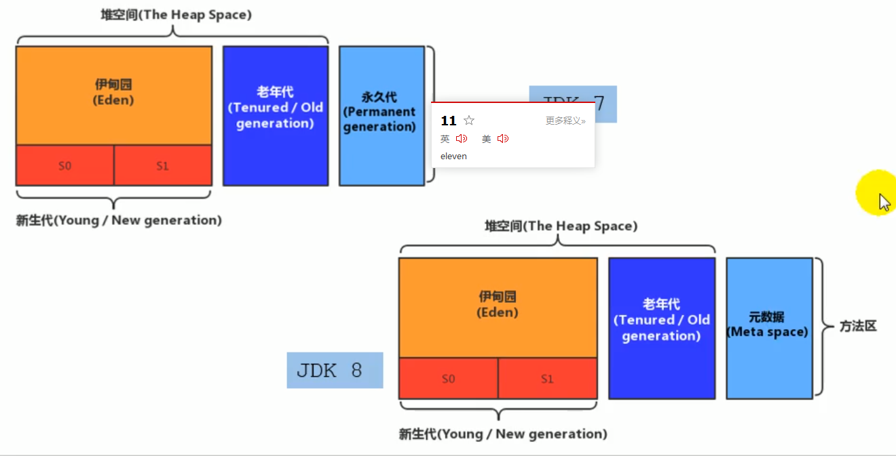
    * 到了JDK 8，终于完全废弃了永久代的概念，改用与JRockit、J9一样在本地内存中实现的元空间（Metaspace）来代替。
    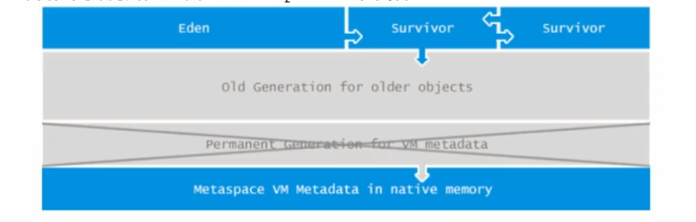
    * 元空间的本质和永久代类似，都是对JVM规范中方法区的实现。不过元空间与永久代最大的区别在于：元空间不在虚拟机设置的内存中，而是使用本地内存。
    * 永久代、元空间二者并不只是名字变了，内部结构也调整了。
    * 根据《Java虚拟机规范》的规定，如果方法区无法满足新的内存分配需求时，将抛出OOM异常。

* 设置方法区大小与OOM：
    * 方法区的大小不必是固定的，jvm可以根据应用的需要动态调整。
    * JDK 7及以前：
        * 通过-XX:PermSize来设置永久代初始分配空间。默认值是20.75M。
        * -XX:MaxPermSize来设定永久代最大可分配空间。32位机器默认是64M,64位机器模式是82M。
        * 当JVM加载的类信息容量超过了这个值，会报异常OutOfMemoryError:PermGen space。
    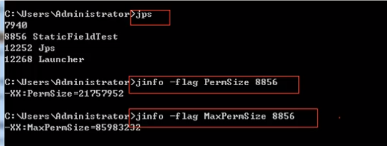
    * JDK 8及以后：
        * 元数据区大小可以使用参数-XX:MetaspaceSize和-XX:MaxMetaspaceSize指定，替代上述原有的两个参数。
        * 默认值依赖于平台。windows下，-XX:MetaspaceSize是21M,-XX:MaxMetaspaceSize的值是-1，即没有限制。
        * 与永久代不同，如果不指定大小，默认情况下，虚拟机会耗尽所有的可用系统内存。如果元数据区发生溢出，虚拟机一样会抛出异常OutOfMemoryError:Metaspace。
        * -XX:MetaspaceSize：设置初始的元空间大小。对于一个64位的服务器端JVM来说，其默认的-XX:MetaspaceSize值为21MB。这就是初始的高水位线，一旦触及这个水位线，
          Full GC将会被触发兵卸载没用的类（即这些类对应的类加载器不再存活），然后这个高水位线将会重置。新的高水位线的值取决于GC后释放了多少元空间。如果释放的空间不足，
          那么在不超过MaxMetaspaceSize时，适当提高该值。如果释放空间过多，则适当降低该值。
        * 如果初始化的高水位线设置过低，上述高水位线调整情况会发生很多次。通过垃圾回收器的日志可以观察到Full GC多次调用。为了避免频繁地GC，建议将-XX:MetaspaceSize设置为一个相对较高的值。          

* 如何解决这些OOM？
    * 要解决OOM异常或heap space的异常，一般的手段是首先通过内存映像分析工具（如Eclipse Memory Analyzer）对dump出来的堆转储快照进行分析，
      重点是确认内存中的对象是否是必要的，也就是要先分清楚到底是出现了内存泄漏（Memory Leak）还是内存溢出（Memory Overflow）。
    * 如果是内存泄漏，可进一步通过工具查看泄漏对象到GC Roots的引用链。于是就能找到泄漏对象是通过怎样的路径与GC Roots相关联并导致垃圾收集器无法
      自动回收它们的。掌握了泄漏对象的类型信息。以及GC Roots引用链的信息， 就可以比较准确地定位出泄漏代码的位置。
    * 如果不存在内存泄漏，换句话说就是内存中的对象确实都还必须存活着，那就应当检查虚拟机的堆参数（-Xmx与-Xms），与机器物理内存对比看是否还可以调
      大，从代码上检查是否在某些对象生命周期过长、持有状态时间过长的情况，尝试减少程序运行期的内存消耗。      

* 方法区的内部结构：
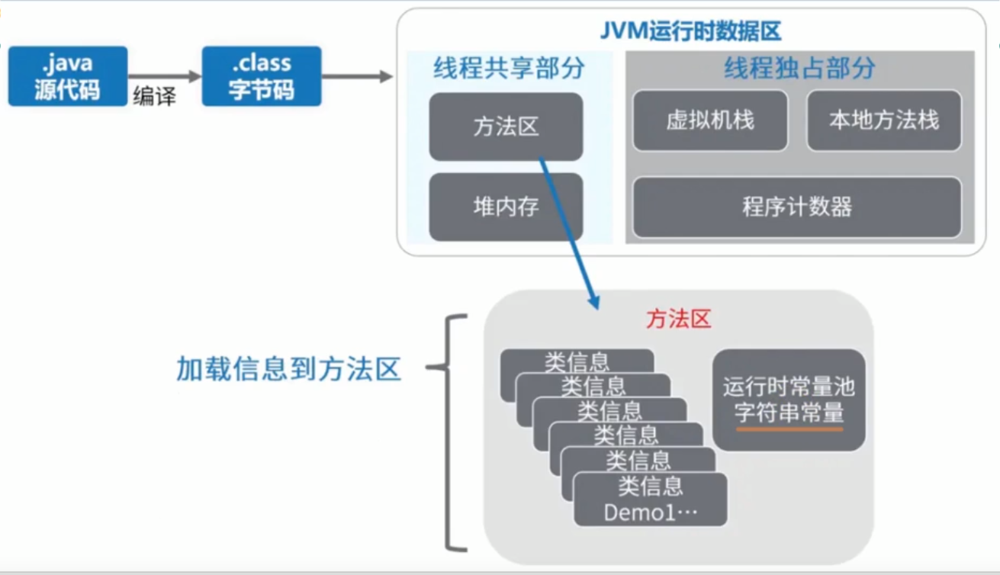

* 方法区（Method Area）存储什么？
    > 《深入理解Java虚拟机》书中对方法区（Method Area）存储内存描述如下：
    > 它用于存储已被虚拟机加载的类型信息、常量、静态变量、即时编译器编译后的代码缓存等。
    
    * 类型信息：对每个加载的类型（类class、接口interface、枚举enum、注解annotation）,JVM必须在方法区中存储以下类型信息：
        * 1.这个类型的完整有效名称（全称=包名.类名）。
        * 2.这个类型直接父类的完整有效名（对于interface或是java.lang.Object，都没有父类）。
        * 3.这个类型的修饰符（public、abstract、final的某个子集）。
        * 4.这个类型直接接口的一个有序列表。
    * 域（Field）信息：
        * JVM必须在方法区中保持类型的所有域的相关信息以及域的声明顺序。
        * 域的相关信息包括：域名称、域类型、域修饰符（public、private、protected、static、final、volatile、transient的某个子集）。
    * 方法（Method）信息：JVM必须保存所有方法的以下信息，同域信息一样包括声明顺序：
        * 方法名称
        * 方法的返回类型（或 void）
        * 方法参数的数量和类型（按顺序）
        * 方法的修饰符（public、private、protected、static、final、synchronized、native、abstract的一个子集）
        * 方法的字节码（bytecodes）、操作数栈、局部变量表及大小（abstract和native方法除外）
        * 异常表（abstract和native方法除外）
            * 每个异常处理的开始位置、结束位置、代码处理在程序计数器中的偏移地址、被捕获的异常类的常量池索引。
        
* 运行时常量池vs常量池：
    * 方法区，内部包含了运行时常量池。
    * 字节码文件，内部包含了常量池。
    * 要弄清楚方法区，需要理解ClassFile，因为加载类的信息都在方法区。
    * 要弄清楚方法区的运行时常量池，需要理解清楚ClassFile中的常量池。
      > https://docs.oracle.com/javase/specs/jvms/se8/html/jvms-4.html。
    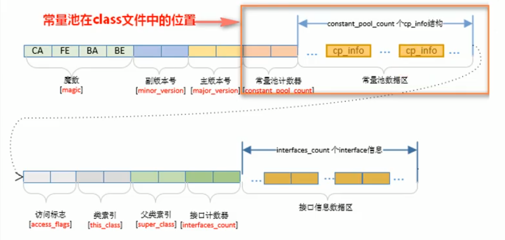
      > 一个有效的字节码文件中除了包含类的版本信息、字段、方法以及接口等描述信息外，还包含一项信息那就是常量池表（Constant Poll Table），包含各种字面量和对类型、域和方法的符号引用。
    * 为什么需要常量池？
        * 一个Java源文件中的类、接口，编译后产生一个字节码文件。而Java中的字节码需要数据支持，通常这种数据会很大以至于不能直接存到字节码里，换另
          一种方式，可以存到常量池，这个字节码包含了指向常量池的引用。在动态链接的时候会用到运行时常量池，之前有介绍。
    * 常量池中有什么？
        * 数量值
        * 字符串值
        * 类引用
        * 字段引用
        * 方法引用
> 小结：常量池，可以看做是一张表，虚拟机指令根据这张常量表找到要执行的类名、方法名、参数类型、字面量等类型。    

* 运行时常量池：
    * 运行时常量池（Runtime Constant Poll）是方法区的一部分。
    * 常量池表（Constant Pool Table）是Class文件的一部分，用于存放编译期生成的各种字面量与符号引用，这部分内容将在类加载后存放到方法区的运行时常量池中。
    * 运行时常量池，在加载类和接口到虚拟机后，就会创建对应的运行时常量池。
    * JVM为每个已加载的类型（类或接口）都维护一个常量池。池中的数据项像数组项一样，是通过索引访问的。
    * 运行时常量池中包含多种不同的常量，包括编译期就已经明确的数值字面量，也包括到运行期解析后才能够获得的方法或者字段引用。此时不再是常量池中的符号地址了，这里换为真实地址。
        * 运行时常量池，相对于Class文件常量池的另一个重要特征是：具备动态性。
    * 运行时常量池类似于传统编程语言中的符号表（symbol table），但是它所包含的数据却比符号表要更加丰富一些。
    * 当创建类或接口的运行时常量池时，如果构造运行时常量池所需的内存空间超过了方法区所能提供的最大值，则JVM会抛出OutOfMemoryError异常。

* 方法区的演进细节：
    * 首先明确：只有HotSpot才有永久代。
    BEA JRockit、IBM J9等来世，是不存在永久代的概念的。原则上如何实现方法区属于虚拟机实现细节，不受《Java虚拟机规范》管束，并不要求统一。
    * Hotspot中方法区的变化：
    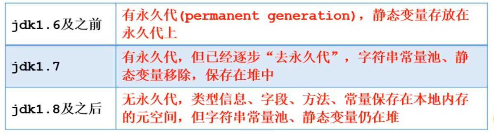

* 永久代为什么要被元空间替换？
    * 随着Java 8的到来，HotSpot VM中再也见不到永久代了。但是这并不意味着类的元数据信息也消失了。这些数据被移到了一个与堆不相连的本地内存区域，这个区域叫做元空间（Metaspace）。
    * 由于类的元数据分配在本地内存中，元空间的最大可分配空间就是系统可用的内存空间。
    * 这项改动是很有必要的，原因有：
    > 1.永久代设置空间大小是很难确定的。
    > 在某些场景下，如果动态加载的类过多，容易产生Perm区的OOM。比如某个实际Web工程中，因为功能点较多，在运行过程中，要不断动态加载很多类，经常出现致命错误。
    > 而元空间和永久代最大的区别在于：元空间并不在虚拟机中，而是使用本地内存。因此，默认情况下，元空间的大小受本地内存限制。
    > 2. 对永久代进行调优是很困难的。 

* StringTable为什么要调整？
    * jdk7中将StringTable放到了堆空间中。因为永久代的回收效率很低，在full gc的时候才会触发。而full gc是老年代的空间不足、永久代不足时才会触发。
    这就导致String Table回收效率不高。而我们开发中有大量的字符串被创建，回收效率低，导致永久代内存不足。放到堆里，能及时回收内存。

* 方法区的垃圾回收：
> 有些人认为方法区（如HotSpot虚拟机中的元空间或者永久代）是没有垃圾收集行为的，其实不然。《Java虚拟机规范》对方法区的约束是非常宽松的，提到过可以
> 不要求虚拟机在方法区实现垃圾收集。事实上也确实未实现或未能完整实现方法区类型卸载的收集器存在（如JDK 11时期的ZGC收集器就不支持类卸载）。
> 
> 一般来说这个区域的回收效果比较难令人满意，尤其是类型的卸载，条件相当苛刻。但是这部分区域的回收有时又确实是必要的。以前Sun公司的Bug列表中，曾出现
> 过的若干个严重的Bug就是由于低版本的HotSpot虚拟机对此区域未完全回收导致内存泄漏。
* 方法区的垃圾收集注要回收两部分内容：常量池中废弃的常量和不再使用的类型。
    * 先来说说方法区内常量池之中主要存放的两大类常量：字面量和符号引用。
    字面量比较接近Java语言层次的常量概念，如文本字符串、被声明为final的常量值等。而符号引用则属于编译原理方面的概念，包括下面三类常量：
        * 类和接口的全限定名。
        * 字段的名称和描述符。
        * 方法的名称和描述符。
    * HotSpot虚拟机堆常量池的回收策略是很明确的，只要常量池中的常量没有被任何地方引用，就可以被回收。
    * 回收废弃常量与回收Java堆中的对象非常类似。
    * 判定一个常量是否“废弃”还是相当简单，而要判定一个类型是否属于“不再被使用的类”的条件就比较苛刻了。需要同时满足下面三个条件：
        * 该类所有的实例都已经被回收，也就是Java堆中不存在该类及其任何派生子类的实例。
        * 加载该类的类加载器已经被回收，这个条件除非是经过精心设计的可替换类加载器的场景，如OSGi、JSP的重加载等，否则通常很难达成的。
        * 该类对应的java.lang.Class对象没有在任何地方被引用，无法在任何地方通过反射访问该类的方法。
    * Java虚拟机被允许对满足上述三个条件的无用类进行回收，这里说的仅仅是“被允许”，而并不是和对象一样，没有引用了就必然会回收。关于是否要对类型进行回收，HotSpot
    虚拟机提供了-Xnoclassgc参数进行控制，还可以使用-verbose:class以及-XX:+TraceClass-Loading、-XX:TraceClassUnLading查看类加载和卸载信息。
    * 在大量使用反射、动态代理、CGLib等字节码框架，动态生成JSP以及OSGi这类频繁自定义类加载器的场景中，通常都需要Java虚拟机具备类型卸载的能力，以保证不会堆方法区造成过大的内存压力。

## 总结
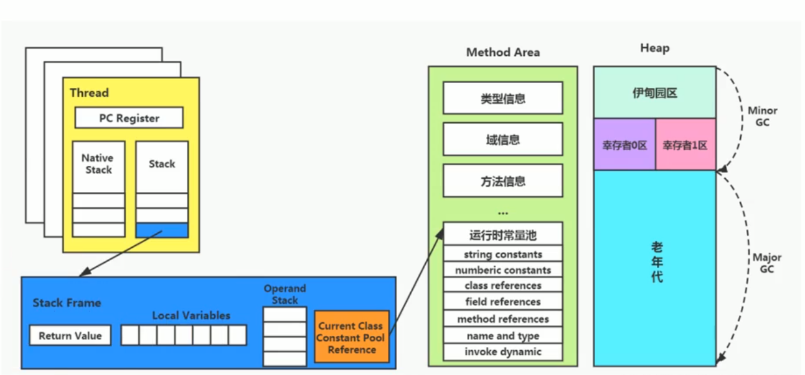

## 对象的实例化内存布局与访问定位
* 对象的实例化：
    * 创建对象的方式：
    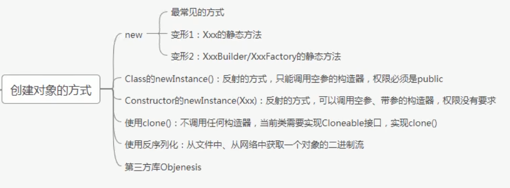
    * 创建对象的步骤：
    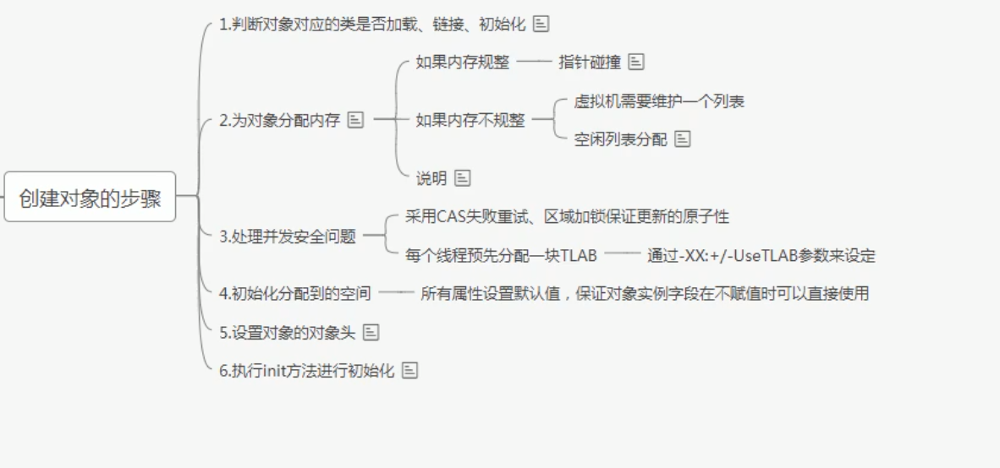

* 创建对象的步骤：
    * 1.加载类元信息：
    * 2.为对象分配内存：
    > 首先计算对象占用空间大小，接着在堆中划分一块内存给新对象。
    > 如果实例成员变量是引用变量，仅分配引用变量空间即可，即4个字节大小。
    > 
    > * 如果内存规整，使用指针碰撞 
    如果内存时规整的，那么虚拟机将采用的是指针碰撞法（Bump The Pointer） 来为对象分配内存。意思是所有用过的内存在一边，空闲的内存在
    另外一边,中间放着一个指针作为分界点的指示器，分配内存就是仅仅把指针向空闲那边挪动一段与对象大小相等的距离罢了。如果垃圾收集器选择的是
    Serial、ParNew这种基于压缩算法的，虚拟机采用这种分配方式。一般使用带有compact（整理）过程的收集器时，使用指针碰撞。
    > * 如果内存不规整，虚拟机需要维护一个列表，使用空闲列表分配如果内存不是规整的，已使用的内存和未使用的内存相互交错，那么虚拟机采用的是
    空闲列表法来为对象分配内存。意思是虚拟机维护了一个列表，记录上那些内存块是可用的，再分配的时候从列表中找到一块足够大的空间划分给对象实例，
    并更新列表上的内容。这种分配方式称为“空闲列表（Free List）”。
    > 
    > 说明：选择哪种分配方式由Java堆是否规整决定，而Java堆是否规整又由所采用的垃圾收集器是否带有压缩整理功能决定。 
    * 3.处理并非安全问题：
    > 在分配内存空间时，另外一个问题是及时保证new对象时候的线程安全性：创建对象是非常频繁的操作，虚拟机需要解决并发问题。虚拟机采用了两种
    方式解决并发问题：
    > * CSA(Compare And Swap)失败重试、区域加锁：保证指针更新操作的原子性；
    > * TLAB 把内存分配的动作安装线程划分在不同的空间之中进行，即每个线程在Java堆中预先分配一小块内存，称为本地线程分配缓冲区，（TLAB,
    Thread Local Allocation buffer）虚拟机是否使用TLAB，可以通过-XX:+/-UseTLAB参数来设定。
    * 4.初始化分配到的空间：
    > 内存分配结束，虚拟机将分配到的内存空间都初始化为零值（不包括对象头）。这一步保证了对象实例字段在Java代码中可以不用赋初始值就可以直接使用，
    程序能访问到这些字段的数据类型所对应的零值。
    * 5.设置对象的对象头：
    > 将对象的所属类（即类的元数据信息）、对象的HashCode和对象的GC信息、所信息等数据存储在对象的对象头中。这个过程的具体设置方式取决于JVM实现。
    * 6.执行init方法进行初始化：
    > 在Java程序的视角来看，初始化才正式开始。初始化成员变量，执行实例化代码块，调用类的构造方法，并把堆内对象的首地址赋值给引用变量。
    >
    > 因此一般来说（由于字节码中是否跟随有invokespecial指令所决定），new指令之后会接着就是执行方法，把对象按照程序员的意愿进行初始化，这样
    一个真正可用的对象才算完全创建出来。 

* 对象内存布局：
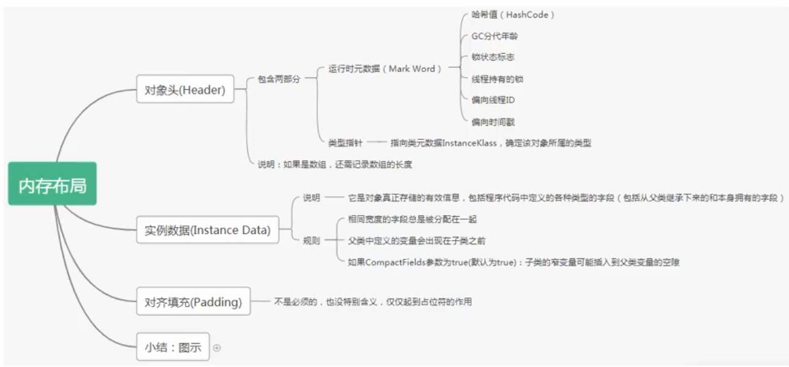
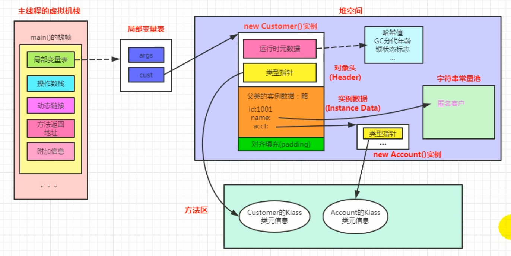

* 对象访问定位：
    * JVM是如何通过栈帧中的对象引用访问到其内部的对象实例的呢？
    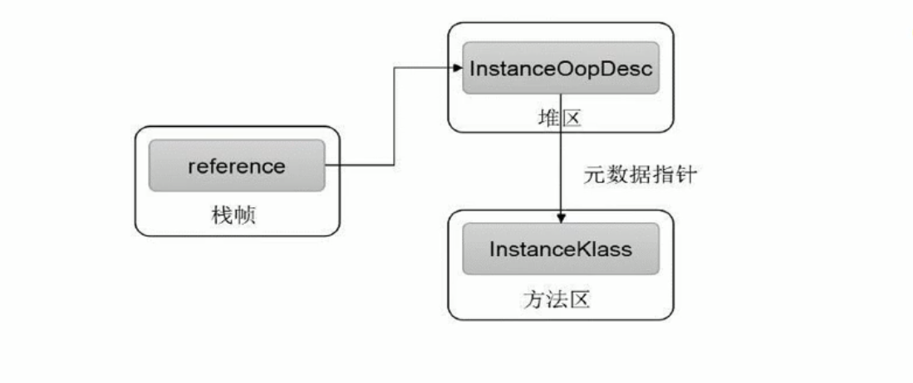
    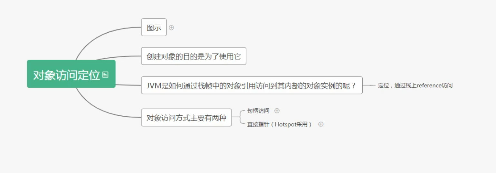

* 直接内存：
    * 不是虚拟机运行时数据区的一部分，也不是《Java虚拟机规范》中定义的内存区域。
    * 直接内存时在Java堆外的、直接向系统申请的内存区间。
    * 来源于NIO,通过存在堆中的DirectByteBuffer操作Native内存。
    * 通常，访问直接内存的速度会优于Java堆。即读写性能高。
        * 因此出于性能考虑，读写频繁的场合可能会考虑使用直接内存。
        * Java的NIO库允许Java程序使用直接内存，用于数据缓冲区。
        > 读写文件，需要与磁盘交互，需要由用户态切换到内核态。在内核态时，需要内存如下图的操作。这里需要两份内存存储重复数据，效率低。
        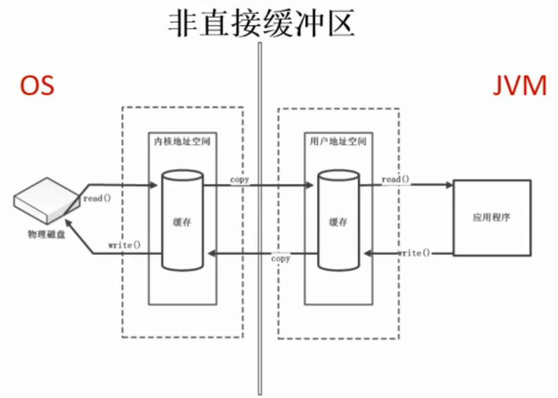
        > 使用NIO时，操作系统划出的直接缓冲区可以被java代码直接访问，只有一份。NIO适合对大文件的读写操作。
        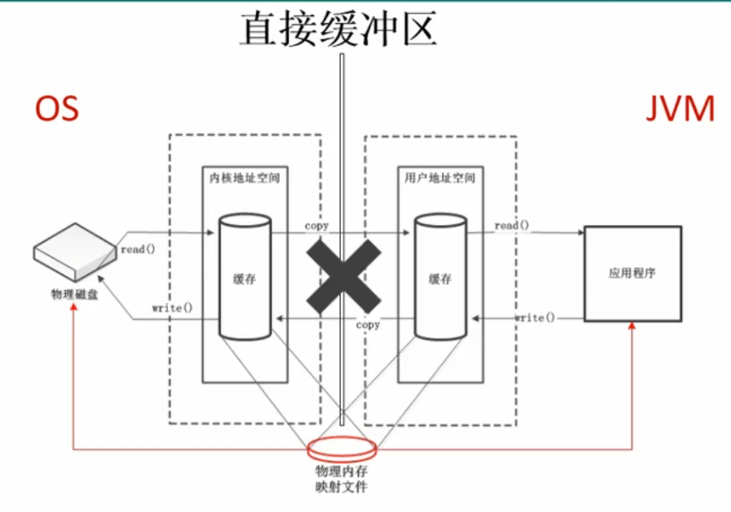
    * 也可能导致OutOfMemoryError异常
    * 由于直接内存在Java堆外，因此它的大小不会直接受限于-Xmx指定的最大堆大小，但是系统内存是有限的，Java堆和直接内存的总和依然受限于操作
      系统能给出的最大内存。
    * 缺点：
        * 分配回收成本较高
        * 不受JVM内存回收管理
    * 直接内存大小可以通过MaxDirectMemorySize设置
    * 如果不指定，默认与堆的最大值-Xmx参数值一致

## 执行引擎
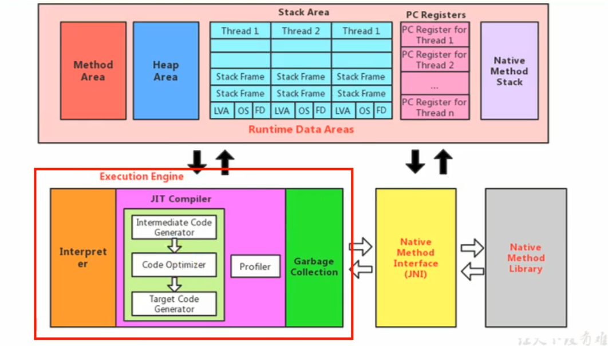
* 执行引擎是Java虚拟机核心的组成部分之一。
* “虚拟机”是一个相对于“物理机”的概念，这两种机器都有代码执行能力，其区别是物理机的执行引擎是直接建立在处理器、缓存、指令集和操作系统层面上的，
而虚拟机的执行引擎是由软件自行实现的，因此可以不受物理条件制约地定制指令集与执行引擎的结构体系，能够执行那些不被硬件直接支持的指令集格式。

* 执行引擎概述：
> JVM的主要任务是负责装载字节码到其内部，但字节码并不能够直接运行在操作系统之上，因为字节码指令并非等价于本地机器指令，它内部包含的仅仅只是一些
> 能够被JVM所识别的字节码指令、符号表，以及其他辅助信息。
> 
> 那么，如果想要让一个Java程序运行起来，执行引擎（Execution Engine）的任务就是讲字节码指令解释/编译为对应平台上的本地机器指令才可以。简单
> 来说，JVM中的执行引擎充当了将高级语言反应为机器语言的译者。

* 执行引擎的工作过程：
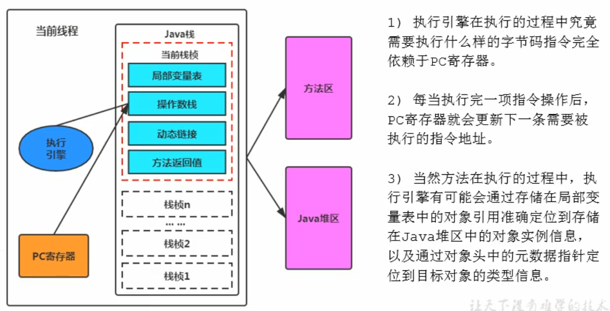
> 从外观上看，所有的Java虚拟机的执行引擎输入、输出都是一致的：输入的是字节码二进制流，处理过程是字节码解析执行的等效过程，输出的是执行结果。

## Java代码编译和执行的过程
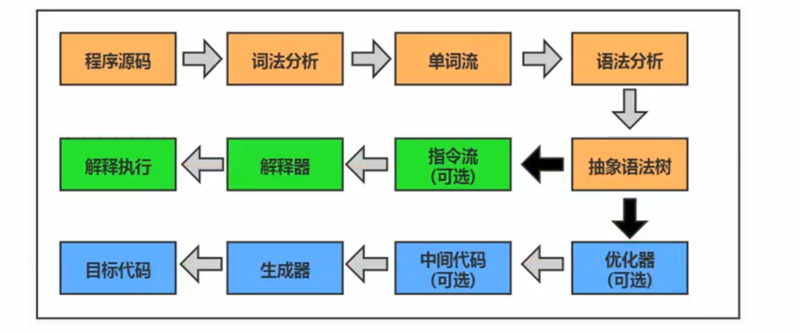
> 大部分的程序代码转换成物理机的目标代码或虚拟机能执行的指令集之前，都需要经过上图中的各个步骤。

* 问题：什么是解释器（Interpreter），什么是JIT编译器？
    * 解释器：当Java虚拟机启动时会根据预定义的规范对字节码采用逐行解释的方式执行，将每条字节码文件中的内容“翻译”为对应平台的本地机器指令执行。
    * JIT(Just In Time Compiler)编译器：就是虚拟机将源代码直接编译成和本地机器平台相关的机器语言。

* 解释器：逐行编译执行。
> JVM设计者们的初衷仅仅只是单纯地为了满足Java程序实现跨平台特性，因此避免采用静态编译的方式直接生成本地机器指令，从而诞生了实现解释器在运行时采用逐行解释字节码执行程序的想法。
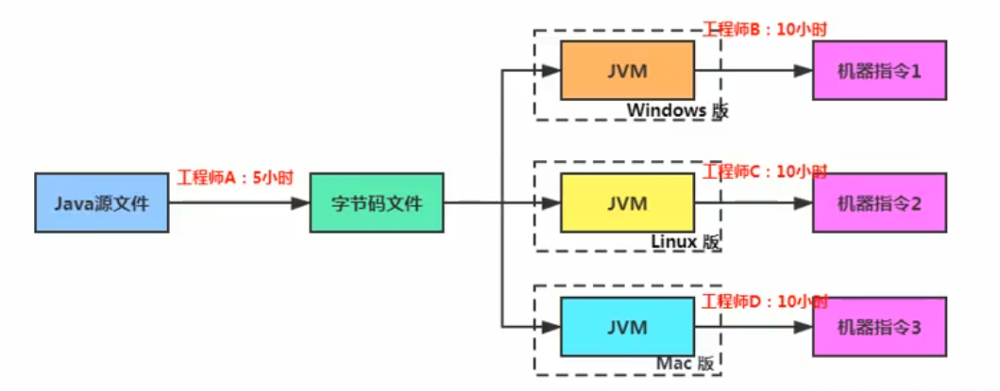
* JIT: 整体编译缓存。

* 如何选择？解释器OR及时编译器（JIT）:
> 热点代码及探测方式：
> 
> 当然是否需要启动JIT编译器将字节码直接编译为对应平台的本地机器指令，则需要根据代码被调用的执行的频率而定。关于那些需要被编译为本地代码的
> 字节码，也被称之为“热点代码”，JIT编译器在运行时会针对那些频繁被调用的“热点代码”做出深度优化，将其直接编译为对应平台的本地机器指令，以此提升
> Java程序的执行性能。
* 热点代码及探测方式：
    * 一个被多次调用的方法，或者是一个方法体内部循环次数较多的循环体都可以被称之为“热点代码”，因此都可以通过JIT编译器编译为本地机器指令。
    由于这种编译方式发生在方法的执行过程中，因此也被称之为栈上替换，或简称为OSR（On Stack Replacement）编译。
    * 一个方法究竟要被调用多少次，或者一个循环体究竟需要执行多少次循环才可以达到这个标准？必然需要一个明确的阈值，JIT编译器才会将这些“热点代码”
    编译为本地机器执行指令。这里主要依靠热点探测功能。
    * 目前HotSpot VM所采用的热点探测方式是基于计数器的热点探测。
    * 采用基于计数器的热点探测，HotSpot VM将会为每一个方法都建立2个不同类型的计数器，分别为方法调用计数器（Invocation Counter）和回边计数器
    （Back Edge Counter）。
        * 方法调用计数器用于统计方法的调用次数
        > * 这个计数器就用于统计方法被调用的次数，它的默认阈值在Client模式下是1500次，在Server模式下是10000次。超过这个阈值，就会触发JIT编译。
        > * 这个阈值可以通过虚拟机参数-XX:CompileThreshold来人为设定。
        > * 当一个方法被调用时，会先检查该方法是否存在被JIT编译过的版本，如果存在，则优先使用编译后的本地代码来执行。如果不存在已被编译过的版本，
        则将此方法的调用计数器值加1，然后判断方法调用计数器与回边计数器值之和是否超过方法调用计数器的阈值。如果已经超过阈值，那么将会向及时编译器
        提交一个该方法的代码编译请求。 
        >
        > * 热度衰减：
        >   * 如果不做任何设置，方法调用计数器统计的并不是方法被调用的绝对此时，而是一个相对的执行频率，即一段时间之内方法被调用的次数。当超过
        >   一定的时间限度，如果方法的调用次数仍然不足以让它提交给及时编译器编译，那这个方法的调用计数器就会被减少一半，这个过程称为方法调用计数器
        >   热度的衰减（Counter Decay）,而这段时间就称为此方法统计的半衰周期（Counter Half Life Time）。
        >   * 进行热度衰减的动作是在虚拟机进行垃圾收集时顺便进行的，可以使用虚拟机参数-XX:-UseCounterDecay 来关闭热度衰减，让方法计数器统计方法调用的
        >   绝对次数，这样，只要系统运行时间足够长，绝大部分方法都会被编译成本地代码。
        >   * 另外，可以使用-XX:CounterHalfLifeTime参数设置半衰周期的时间，单位是秒。
        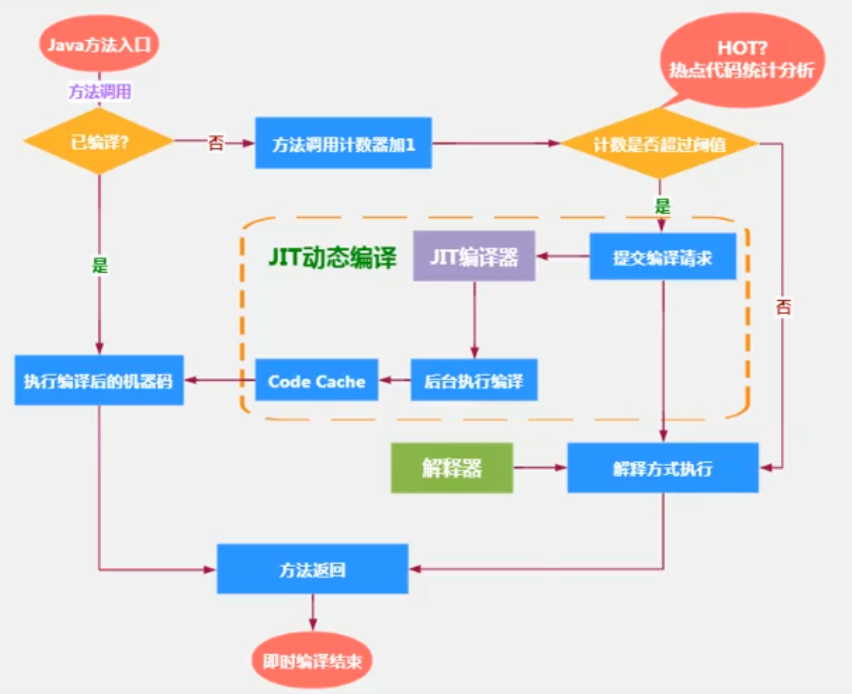
        * 回边计数器则用于统计循环体执行的循环次数
        > 它的作用是统计一个方法中循环体代码执行的次数，在字节码中遇到控制流向后调整的指令称为“回边”（Back Edge）。陷入，建立回边计数器统计的目的就是为了触发OSR编译。
        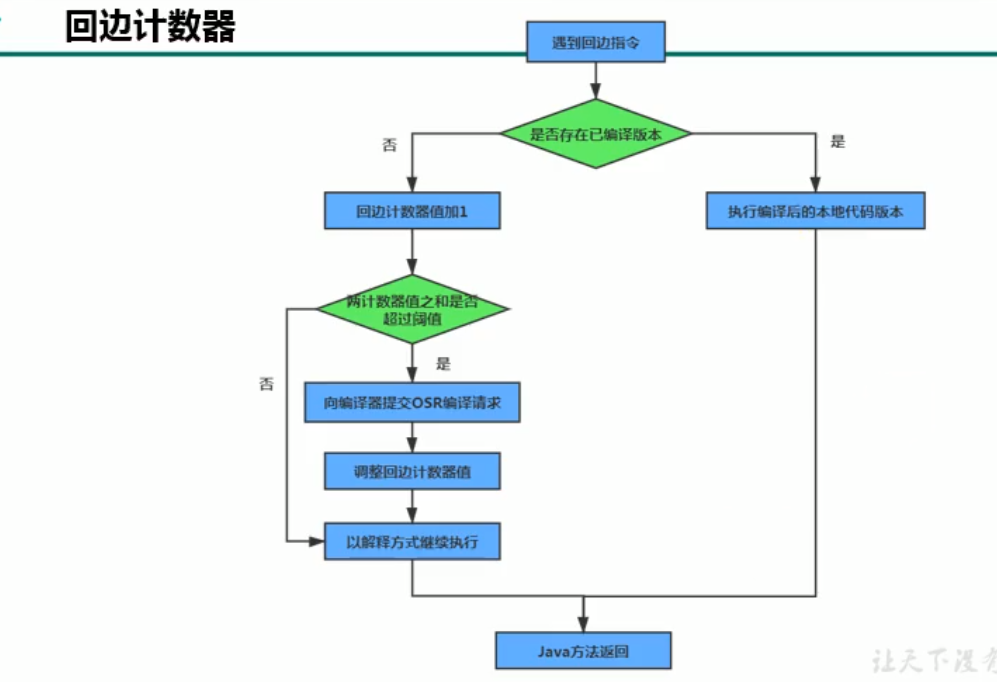

* HotSpot VM可以设置程序执行方式：
> 缺省情况下HotSpot VM是采用解释器与即时编译器并存的架构，当然开发人员可以根据具体的应用场景，通过命令显式地为Java虚拟机指定在运行时到底是完全采用解释器执行，
> 还是完全采用即时编译器执行。如下所示：
    * -Xint：完全采用解释器模式执行程序；
    * -Xcomp：完全采用即时编译器模式执行程序。如果即时编译出现问题，解释器会介入执行。
    * -Xmixed：采用解释器+即时编译器的混合模式共同执行程序。

* HotSpot VM的JIT分类:在HotSpot VM中内嵌有两个JIT编译器，分别为Client Compiler和Server Compiler，但大多数情况下我们简称C1编译器和
C2编译器。开发人员可以通过如下命令显式指定Java虚拟机在运行时到底使用哪一种及时编译器，如下所示：
  * -client：指定Java虚拟机运行在Client模式下，并使用C1编译器；
    * C1编译器会对字节码进行简单和可靠的优化，耗时短。以达到更快的编译速度。
  * -server：指定Java虚拟机运行在Server模式下，并使用C2编译器。
    * C2进行耗时较长的优化，以及激进优化。但优化的代码执行效率更高。
  * C1和C2编译器不同的优化策略：
    * 在不同的编译器上有不同的优化策略，C1编译器上主要有方法内联，去虚拟化、冗余消除。
        * 方法内联：将引用的函数代码编译到引用点处，这样可以减少栈帧的生成，减少参数传递以及跳转过程。
        * 去虚拟化：对唯一的实现类进行内联。
        * 冗余消除：在运行期间把一些不会执行的代码折叠掉。
    * C2的优化主要是在全局层面，逃逸分析是优化的基础。基于逃逸分析在C2上有如下几种优化：
        * 标量替换：对标量值代替聚合对象的属性值。
        * 栈上分配：对于未逃逸的对象分配对象在栈而不是堆。
        * 同步消除：消除同步操作，通常指synchronized。

* Graal编译器：
    * 自JDK10起，HostSpot又加入一个全新的即时编译器：Graal编译器。
    * 编译效果短短几年就追平了C2编译器。未来可期。
    * 目前，带着“实验状态”标签，需要使用开关参数
    -XX:+UnlockExperimentalVMOPtions -XX:+UseJVMCIComplier去激活，才可以使用。

## String
* String的基本特性：
    * String:代表不可变的字符序列。简称：不可变性。
        * 当对字符串重新赋值时，需要重写指定内存区域赋值，不能使用原有的value进行赋值。
        * 当堆现有的字符串进行连接操作时，也需要重新指定内存区域赋值，不能使用原有的value进行赋值。
        * 放覅有String的replace()方法修改指定字符或字符串时，也需要重新指定内存区域赋值，不能使用原有的value进行赋值。
    * 通过字面量的方式（区别于new）给一个字符串赋值，此时的字符串值声明在字符串常量池中。
    * 字符串常量池中时不会存储相同内容的字符串的。
    * String的String Poll是一个固定大小的Hashtable，默认值大小长度是1099。如果放进String Pool的String非常多，就会造成Hash冲突严重，
    从而导致链表会很长，而链表长了后直接会造成的影响就是当调用String.intern时性能会大幅下降。
    * 使用-XX:StringTableSize可设置StringTable的长度。
    * 在jdk6中StringTable是固定的，就是1009的长度，所以如果常量池中的字符串过多就会导致效率下降很快。StringTableSize设置没有要求。
    * 在jdk7中，StringTable的长度默认值是60013，StringTableSize长度设置没限制。 
    * JDK8开始，设置StringTable的长度的话，1009是可设置的最小值。
      
* String的内存分配：
    * 在Java语言中有8种基本数据类型和一种比较特殊的类型String。这些类型为了使它们在运行过程中速度更快、更节省内存，都提供了一种常量池的概念。
    * 常量池就类似于一个Java系统基本提供的缓存。8中基本数据类型的常量池都是系统协调的，String类型的常量池比较特殊。它的主要使用方法有两种。
        * 直接使用双引号声明出来的String对象会直接存储在常量池中。
            比如： String info = "test";
        * 如果不是双引号声明的String对象，可以使用String提供的intern()方法。这个后面重点谈。
    * Java 6及以前，字符串常量池存放在永久代。
    * Java 7中Oracle的工程师对字符串池的逻辑做了很大的改变，即将字符串常量池的位置调整到Java堆内。
        * 所有的字符串都保持在堆（Heap）中，和其他普通对象一样，这样可以让你在进行调优应用时仅需要调整堆大小就可以了。
        * 字符串常量池概念原本使用得比较多，但是这个动作使得我们有足够的理由让我们重新考虑在Java 7中使用String.intern()。
    * Java8元空间，字符串常量在堆。

* 字符串拼接操作：
    * 1.常量与常量的拼接结果在常量池，原理是编译期优化。
    * 2.常量池中不会存在相同内容的常量。
    * 3.只要其中有一个是变量，结果就在堆中。变量拼接的原理是StringBuilder。
    * 4.如果拼接的结果调用intern()方法，则主动将常量池中还没有的字符串对象放入池中，并返回此对象地址。

* intern()的使用：jdk6 vs jdk7/8
    * jdk1.6中，将这个字符串对象尝试放入串池。
        * 如果串池中有，则并不会放入。返回已有的串池的对象的地址。
        * 如果没有，会把此对象复制一份，放入串池，并返回串池中的对象地址。
    * Jdk1.7起，将这个字符串对象尝试放入串池。
        * 如果串池中有，则并不会放入。返回已有的串池中的对象的地址。
        * 如果没有，则会把对象的引用地址复制一份，放入串池，并返回串池中的引用地址。
````String s1 = new String("iafoot");//执行完以后，会在字符串常量池中生成“iafoot”，同时，堆中有相应对象。
    String s1 = new String("i")+ new String("afoot");//执行完成以后，不会在字符串常量池中生成“iafoot”
````
* -XX:+PrintStringTableStatistics: 打印字符串常量池的信息。

* G1的String去重操作：
    * 背景：对许多Java应用（有大的也有小的）做的测试得出以下结果：
        * 堆存活数据集合里面String对象占了25%
        * 堆存活数据集合里面重复的String对象有13.5%
        * String对象的平均长度是45
    * 许多大规模的Java应用的瓶颈在于内存，测试表明，在这些类型的应用里面，Java堆中存活的数据集合差不多25%是String对象。更进一步，这里面差不多
    一半的String对象是重复的，重复的意思是说：
      string1.equals(string2)=true。堆上存在重复的String对象必然是一种内存的浪费。这个项目将在G1垃圾收集器中实现自动持续对重复的String
      对象进行去重，这样就能避免浪费内存。
    * 实现
        * 当垃圾收集器工作的时候，会访问堆上存活的对象。堆每一个访问的对象都会检查是否候选的要去重的String对象。
        * 如果是，把这个对象的一个引用插入到队列中等待后续的处理。一个去重的线程在后台运行，处理这个队列。处理队列的一个元素意味着从队列删除
    这个元素，然后尝试去重它引用的String对象。
        * 使用一个hashtable来记录所有的被String对象使用的不重复的char数组。当去重的时候，会查这个hashtable,来看堆上是否已经存在一个
    一模一样的char数组。
    * 如此存在，String对象会被调整引用那个数组，释放对原来的数组的引用，最终会被垃圾收集器回收掉。
    * 如果查找失败，char数组会被插入到hashtable，这样以后的时候就可以共享这个数组了。
    * 命令行选项
        * UseStringDeduplication（bool）：开启String去重，默认是不开启的，需要手动开启。
        * PrintStringDeduplicationStatistics（bool）：打印详细的去重统计信息。
        * StringDeduplicationAgeThreshold（uintx）：达到这个年龄的String对象被任务是去重的候选对象。
    
## 垃圾回收
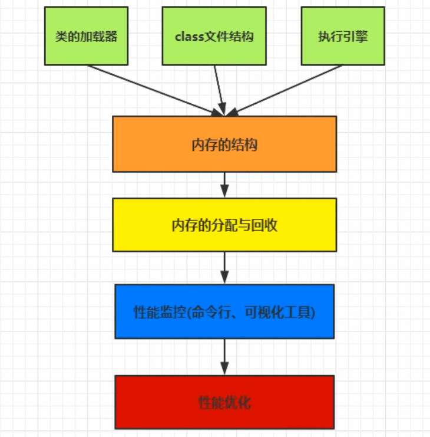
* 什么是垃圾（Garbage）呢？
    * 垃圾是指在程序中没有任何指针指向的对象，这个对象就是需要被回收的垃圾。
    > 如果不及时对内存中的垃圾进行清理，那么，这些垃圾对象所占的内存空间会一直保留到应用程序结束，被保留的空间无法被其他对象使用。甚至可能导致内存溢出。
* 为什么需要GC
    * 对于高级语言来说，一个基本认知是如果不进行垃圾回收，内存迟早会被消耗完，因为不断地分配内存空间而不进行回收，就好像不停地生产生活垃圾而从来不扫一样。
    * 除了释放没用的对象，垃圾回收也可以清除内存里的记录碎片。碎片整理将所占用的堆内存移到堆的一端，以便JVM将整理出的内存分配给新的对象。
    * 随着应用程序所应付的业务越来越庞大、复杂、用户越来越多，没有GC就不能保证应用程序的正常进行。而经常造成STW的GC又跟不上实际的需求，所以才会不断地尝试对GC进行优化。
* 早期垃圾回收行为
    * 在早期的C/C++时代，垃圾回收基本上是手工进行的。开发人员可以使用new关键字进行内存申请，并使用delete关键字进行内存释放。
    * 这种方式可以灵活控制内存释放的时间，但是会给开发人员带来频繁申请和释放内存的管理负担。倘若有一处内存区间由于程序员编码的问题忘记被回收
    ，那么就会产生内存泄漏，垃圾对象永远无法被清除，随着系统运行时间的不断增长，垃圾对象所耗内存可能持续上升，直到出现内存溢出并造成应用程序崩溃。
      
* Java的垃圾回收机制
    * 自动内存管理，无需开发人员手动参与内存的分配与回收，这样降低内存泄漏和内存溢出的风险。
        * 没有垃圾收集器，java也会和cpp一样，各种悬垂指针，野指针，泄漏问题让你头疼不已。
    * 自动内存管理机制，将程序员从繁重的内存管理中释放出来，可以更专心专注于业务开发。
    * oracle官网关于垃圾回收的介绍。
        * https://docs.oracle.com/javase/8/docs/technotes/guides/vm/gctuning/toc.html
    
    * 担忧：
        * 对于Java开发人员而言，自动内存管理就像是一个黑匣子，如果过度依赖于“自动”,那么这将会是一场灾难，最严重的就会弱化Java开发人员在程序出现溢出时定位问题和解决问题的能力。
        * 此时，了解JVM的自动内存分配和内存垃圾回收原来就显得非常重要，只有在真正了解JVM是如何管理内存后，我们才能够在遇见OutOfMemoryError时，快速地根据错误异常日志定位问题和解决问题。
        * 当需要排查各种内存溢出、内存泄漏问题时，当垃圾收集成为系统达到更高并发量的瓶颈时，我们就必须对这些“自动化”的技术实施必要的监控和调节。

    * 垃圾回收器可以对年轻代回收，也可以对老年代回收，甚至是全堆和方法区的回收。
        * 其中，Java堆是垃圾收集器的工作重点。
    * 从次数上讲：
        * 频繁收集Young区
        * 较少收集Old区
        * 基本不动Perm区（或元空间）

## 垃圾回收相关算法：
* 垃圾标记阶段的算法之 引用计数算法
* 垃圾标记阶段：对象存活判断
    * 在堆里存放着几乎所有的Java对象实例，在GC执行垃圾回收之前，首先需要区分出内存中那些事存活对象，那些事已经死亡的对象。只有被标记为已经死亡的对象，
    GC才会在执行垃圾回收时，释放掉其所占用的内存空间，因此这个过程我们可以称为垃圾标记阶段。
    * 那么在JVM中究竟是如何标记一个死亡对象呢？简单来说，当一个对象已经不再被任何的存活对象继续引用时，就可以宣判为已经死亡。
    * 判断对象存活一般有两种方式：引用计数算法和可达性分析算法。
        * 引用计数算法：
            * 引用计数算法（Reference Counting）比较简单，对每个对象保持一个整形的引用计数器属性。用于记录对象被引用的情况。
            * 对于一个对象A，只要有任何一个对象引用了A，则A的引用计数器就加1;当引用失效时，引用计数器就减1。只要对象A的引用计数器的值为0，即表示对象A
            不能再被使用，可进行回收。
            * 优点：实现简单，垃圾对象便于辨识；判定效率高，回收没有延迟性。
            * 缺点：
                * 它需要单独的字段存储计数器，这样的做法增加了存储空间的开销。
                * 每次赋值都需要更新计数器，伴随着加法和减法操作，这增加了时间开销。
                * 引用计数器有一个严重的问题，即无法处理循环引用的情况。这是一条致命缺陷，导致在Java的垃圾回收器中没有使用这类算法。
> 小结
> * 引用计数算法，是很多语言的资源回收选择，例如因人工智能而更加火热的Python，它便是同时支持引用计数和垃圾收集机制。
> * 具体哪种最优要看场景，业界有大规模实践中仅保留引用计数机制，已提供吞吐量的尝试。
> * Java并没有选择引用计数，是因为其存在一个基本的难题，也就是很难处理循环引用关系。
> * Python如何解决循环引用？
>   * 手动解除：很好理解，就是在合适的时机，解除引用关系。
>   * 使用弱引用weakref，weakref是Python提供的标准库，旨在解决循环引用。

* 垃圾标记阶段的算法之 可达性分析算法：（或根搜索算法、追踪性垃圾收集）
    * 相对于引用计数算法而言，可达性分析算法不仅同样具备实现简单和执行高效等特点，更重要的是该算法可以有效地解决在引用计数算法中 循环引用 的问题，防止内存泄漏的发生。
    * 相较于引用计数算法，这里的可达性分析就是Java、C#选择的。这种类型的垃圾收集通常也叫做 追踪性垃圾收集（Tracing Garbage Collection）。
    * 所谓“GC Roots”根集合就是一组必须活跃的引用。
    * 基本思路：
        * 可达性分析算法是以根对象集合（GC Roots）为起点，按照从上至下的方式搜索被根对象集合所连接的目标对象是否可达。
        * 使用可达性分析算法后，内存中的存活对象都会被根对象集合直接或间接连接着，搜索所走过的路径称为引用链（Reference Chain）
        * 如果目标对象没有任何引用链相连，则是不可达的，就意味着该对象已经死亡，可以标记为垃圾对象。
        * 在可达性分析算法中，只有能够被根对象集合直接或者间接连接的对象才是存活对象。

* 在Java语言中，GC Roots包含以下几类元素：
    * 虚拟机栈中引用的对象
        * 比如：各个线程被调用的本地方法中使用到的参数、局部变量等。
    * 本地方法栈内JNI（通常说的本地方法）引用的对象
    * 方法区中静态属性引用的对象
        * 比如：Java类的引用类型静态变量
    * 方法区中常量引用的对象
        * 比如：字符串常量池（String Table）里的引用。
    * 所有被同步锁synchronized持有的对象
    * Java虚拟机内部的引用。
        * 基本数据类型对应的Class对象，一些常驻的异常对象（如：NullPointerException、OutOfMemoryError），系统类加载器。
    * 反映java虚拟机内部情况的JMXBean、JVMTI中注册的回调、本地代码缓存等。
    * 除了这些固定的GC Roots集合以外，根据用户所选用的垃圾收集器以及当前回收的内部区域不同，还可以有其他对象“临时性”地加入，共同构成完整FC Roots集合。
    比如：分代收集和局部回收（Partial GC）.
      * 如果只针对Java堆中的某一块区域进行垃圾回收（比如：典型的只针对新生代），必须考虑到内存区域是虚拟机自己的实现细节，更不是孤立封闭的，这个区域的对象
        完全有可能被其他区域的对象所引用，这时候就需要一并将关联的区域对象也加入GC Roots集合中去考虑，才能保证可达性分析的准确性。
    > 小技巧：
    > 由于Root采用栈方式存放变量和指针，所以如果一个指针，它保存了堆内存里面的对象，但是自己又不存放在堆内存里面，那它就是一个Root。 
>
> 注意：
> * 如果要使用可达性分析算法来判断内存是否可回收，那么分析工作必须在一个能保障一致性的快照中进行。这点不满足的话分析结果的准确性就无法保证。
> * 这点也是导致GC进行时必须“Stop The World”的一个重要原因。
>   * 即使是号称（几乎）不会发生停顿的CMS收集器中，枚举根节点时也是必须要停顿的。

* 对象的finalization机制：
    * Java语言提供了对象终止（finalization）机制来允许开发人员提供对象被销毁之前的自定义处理逻辑。
    * 当垃圾回收器发现没有引用指向一个对象，即：垃圾回收此对象之前，总会先调用这个对象的finalize()方法。
    * finalize()方法允许在子类中被重写，用于在对象被回收时进行资源释放。通过在这个方法中进行一些资源释放和清理的工作，比如关闭文件、套接字和数据库连接等。
    * 永远不要主动调用某个对象的finalize()方法，应该交给垃圾回收机制调用。理由包括下面三点：
        * 在finalize()时可能会导致对象复活。
        * finalize()方法的执行时间是没有保障的，它完全由GC线程决定，极端情况下，若不发生GC，则finalize()方法将没有执行机会。
        * 一个糟糕的finalize()会严重影响GC的性能。
    * 从功能上来说，finalize()方法与C++中的析构函数比较相似，但是Java采用的是基于垃圾回收器的字动内存管理机制，所以finalize()方法在本质上不同于C++中的析构函数。
    * 由于finalize()方法的存在，虚拟机中的对象一般处于三种可能的状态。
    * 如果从所有的根节点都无法访问到某个对象，说明对象已经不再使用了。一般来说，此对象需要被回收。但事实上，也并非是“非死不可”的，这时候它们暂时处于“缓刑”
    阶段。一个无法触及的对象有可能在某一个条件下“复活”自己，如果这样，那么对它的回收就是不合理的，为此，定义虚拟机中的对象可能的三种状态。如下：
      * 可触及的：从根节点开始，可以达到这个对象。
      * 可复活的：对象的所有引用都被释放，但是对象有可能在finalize()中复活。
      * 不可触及的：对象的finalize()被调用，并且没有复活，那么就会进入不可触及状态。不可触及的对象不可能被复活，因为finalize()只会被调用一次。
    * 以上3种状态中，是由于finalize()方法的存在，进行的区分。只有在对象不可触及时才可以被回收。
    * 判断一个对象objA是否可回收，至少要经历两个标记过程：
        * 1.如果对象objA到GC Roots没有引用链，则进行第一次标记。
        * 2.进行筛选，判断此对象是否有必要执行finalize()方法。
            * 1.如果对象objA没有重写finalize()方法，或者finalize()方法已经被虚拟机调用过，则虚拟机视为“没有必要执行”，objA被判断为不可触及的。
            * 2.如果对象objA重写了finalize()方法，且还未执行过，那么objA会被插入到F-Queue队列中，由一个虚拟机自动创建的、低优先级的Finalizer线程触发其finalize()方法执行。
            * 3.finalize()方法是对象跳脱死亡的最后机会，稍后会对F-Queue队列中的对象进行第二次标记时，objA会被移出“即将回收”集合。之后，对象会再次
            出现没有引用存在的情况。在这个情况下，finalize方法不会被再次调用，对象会直接变成不可触及的状态，也就是说，一个对象的finalize方法只会被调用一次。


* 垃圾标记阶段的算法之可达性分析算法：
* 获取dump文件：（堆空间运行的文件）；可参阅：https://www.bilibili.com/video/BV1PJ411n7xZ?p=144
    * 方式1：命令行使用jmap
    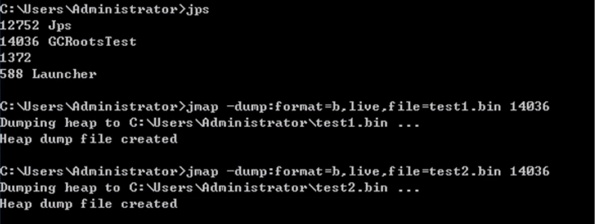
    * 方式2：使用JVisualVM导出
        * 捕获的heap dump文件是一个临时文件，关闭JVisualVM后自动删除，若要保留，需要将其另存为文件。
        * 可通过以下方式捕获heap dump:
            * 在左侧“Application”（应用程序）子窗口中单击相应的应用程序，选择Heap Dump（堆Dump）。
            * 在Monitor（监视）子标签页中点击Heap Dump（堆Dump）按钮。
        * 本地应用程序的Heap dumps作为应用程序标签页的一个子标签页打开。同时，heap dump在左侧的Application(应用程序)栏中堆应一个含有
        时间戳的节点。右击这个节点选择save as（另存为）即可将heap dump保存到本地。
> Eclipse GC Roots说明：https://help.eclipse.org/2020-12/index.jsp?topic=%2Forg.eclipse.mat.ui.help%2Fconcepts%2Fgcroots.html&resultof%3D%2522%2572%256f%256f%2574%2573%2522%2520%2522%2572%256f%256f%2574%2522%2520          
* MAT与JProfile的GC Roots溯源：可参阅：https://www.bilibili.com/video/BV1PJ411n7xZ?p=145


* 垃圾清除阶段算法之标记—清除算法：
> 当成功区分出内存中存活对象和死亡对象后，GC接下来的任务就是执行垃圾回收，释放掉无用对象所占用的内存空间，以便有足够的可用内存空间为新对象分配内存。
> 目前在JVM中比较常见的三种垃圾收集算法是标记-清除算法（Mark-Sweep）、复制算法（Copying）、标记-压缩算法（Mark-Compact）。
* 标记-清除（Mark-Sweep）算法：
    * 背景：标记-清除算法（Mark-Sweep）是一种非常基础和常见的垃圾收集算法，该算法被J.McCarthy等人在1960年提出并应用于Lisp语言。
    * 执行过程：当堆中的有效内存空间（available memory）被耗尽的时候，就会停止整个程序（也被称为stop the world），然后进行两项工作，第一项则是标记，第二项则是清除。
        * 标记：Collector从引用根节点开始遍历，标记所有被引用的对象。一般是在对象的Header中记录为可达对象。
        * 清除：Collector对堆内存从头到尾进行线性的遍历，如果发现某个对象在其Header中没有标记为可达对象，则将其回收。
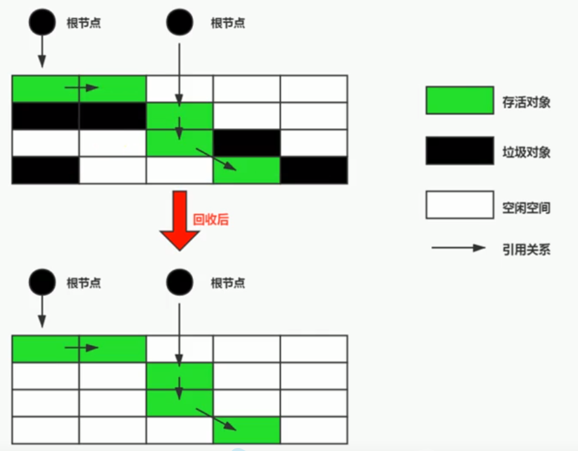
* 复制（Copying）算法：
    * 背景：为了解决标记-清除算法在垃圾收集效率方面的缺陷，M.L.Minsky于1963年发表了著名的论文，“使用双存储区的Lisp语言垃圾收集器CA LISP Carbage 
      Collector Algorithm Using Serial Secondary Storage ”。M.L.Minsky在该论文中描述的算法被人们称为复制（Copying）算法，它也被M.L.Minsky
      本人成功地引入到了Lisp语言的一个实现版本中。
    * 核心思想：将活着的内存空间分为两块，每次只使用其中一块，在垃圾回收时将正在使用的内存中的存活对象复制到未被使用的内存块中，之后清除正在使用的内存块中
    的所有对象，交换两个内存块的角色，最后完成垃圾回收。
    * 优点：
        * 没有标记和清除过程，实现简单，运行高效
        * 复制过去以后可以保证空间的连续性，不会出现“碎片”问题。
    * 缺点：
        * 此算法的缺点也是很明显的，就是需要两倍的内存空间。
        * 对于G1这种分拆成为大量region的GC。复制而不是移动，意味着GC需要维护region之间对象引用关系，不管是内存占用或者时间开销也不小。
    > 特别的：如果垃圾不多，复制算法不会很理想，因为复制算法需要复制的存活对象数量非常低才行。
    * 应用场景：在新生代，对常规应用的垃圾回收，一次通常可以回收70%-99%的内存空间。回收性价比很高。所以现在的商业虚拟机都是用这种收集算法回收新生代。
    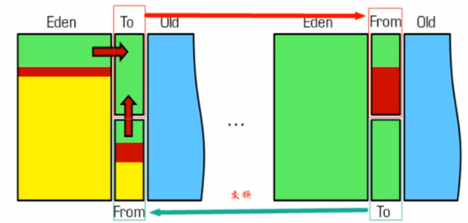
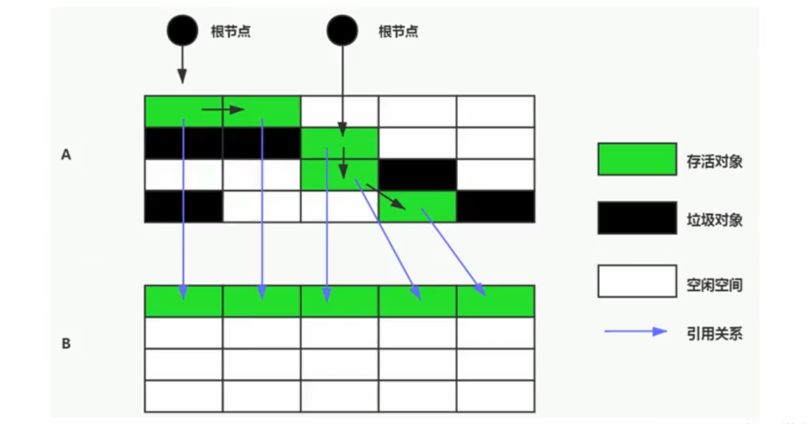
* 垃圾清除阶段算法之标记-压缩（整理）算法：
    * 背景：
    > 复制算法的高效性是建立在存活对象少、垃圾对象多的前提下的。这种情况在新生代经常发生，但是在老年代，更常见的情况是大部分对象都是存活对象。如果依然
    > 使用复制算法，由于存活对象较多，复制的成本也将很高。因此，基于老年代垃圾回收的特性，需要使用其他的算法。
    > 
    > 标记-清除算法的确可以应用在老年代中，但是该算法不仅执行效率低下，而且在执行完内存回收后还会产生内存碎片，所以JVM的设计者需要在此基础之上进行改进。
    > 标记-压缩（Mark - Compact）算法由此诞生。
    >  
    > 1970年前后，G.L.Steele、C.j.Chene和D.S.Wise等研究者发布标记-压缩算法。在许多现代的垃圾收集器中，人们都使用了标记-压缩算法或其他改进版本。 
    * 执行过程：
        * 第一阶段和标记-清除算法一样，从根节点开始标记所有被引用对象。
        * 第二阶段将所有的存活的对象压缩到内存的一端，按顺序排放。
        * 之后，清理边界外所有的空间。
        > 标记-压缩算法的最终效果等同于标记-清除算法执行完成后，再进行一次内存碎片整理，因此，也可以把它称为标记-清除-压缩（Mark-Sweep-Compact）算法。
        > 二者的本质差异在于标记-清除算法是一种非移动式的回收算法，标记-压缩是移动式的。是否移动回收后的存活对象是一项优缺点并存的风险决策。
        > 可以看到，标记的存活对象将会被整理，按照内存地址依次排列，而未被标记的内存会被清理掉。如此一来，当我们需要给新对象分配内存时，JVM只需要持有一个内存
        > 的起始地址即可，这比维护一个空闲列表显然少了许多开销。 
        * 优点：
            * 消除了标记-清除算法中，内存区域分散的缺点，我们需要给新对象分配内存时，JVM只需要持有一个内存的起始地址即可。
            * 消除了复制算法当中，内存减半的高额代价。
        * 缺点： 
            * 从效率上来说，标记-整理算法要低于复制算法。
            * 移动对象的同时，如果对象被其他对象引用，则还需要调整引用的地址。
            * 移动过程中，需要全程暂停用户应用程序。即：STW。
    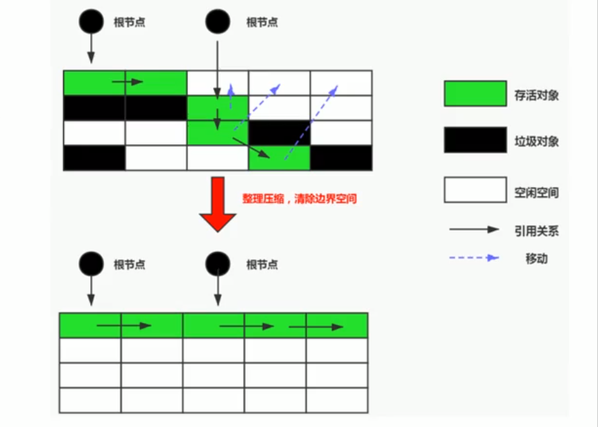
    * 指针碰撞（Bump the Pointer）:
    > 如果内存空间以规整和有序的方式分布，即已用和未用的内存各自一边，彼此之间维系着一个记录下一次分配起始点的标记指针，当为新对象分配内存时，只需要通过修改指针
    >  的偏移量将新对象分配在第一个空闲内存位置，这种分配方式就叫做指针碰撞（Bump the Pointer）。
* 小结：
> 效率上来说，复制算法是当之无愧的老大，但是却浪费了太多内存。
> 而为了尽量兼顾上面提到的三个指标，标记-整理算法相对来说更平滑一些，但是效率上不仅如人意，它比复制算法多了一个标记的阶段，比标记-清除多了一个整理内存的阶段。
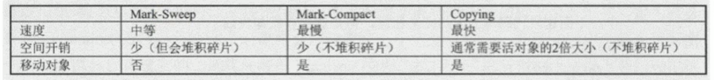

* 分代收集算法：
> 签名所有这些算法中，并没有一种算法可以完全替代其他算法，它们都具有自己独特的优势和特点。分代收集算法应运而生。
> 
> 分代收集算法，是基于这样一个事实：不同的生命周期是不一样的。因此，不同生命周期的对象可以采取不同的收集方式，以便提高回收效率。一般是把Java堆分为新生代
> 和老年代，这样就可以根据各个年代的特点使用不同的回收算法，以提高垃圾回收的效率。
> 
> 在Java程序运行的过程中，会产生大量的对象，其中有些对象是与业务信息相关，比如Http请求中的Session对象、线程、Socket链接，这类对象跟业务直接挂钩，因此生命周期
> 比较长。但是还有一些对象，主要是程序运行过程中生成的临时变量，这些对象生命周期会比较短，比如：String对象，由于其不变性的特性，系统会产生大量的这些对象，有些
> 对象甚至只用一次即可回收。
> 
> 目前几乎所有的GC都是采用分代收集（Generational Collecting）算法执行垃圾回收的。
> 
> 在HotSpot中，基于分代的概念，GC所使用的内存回收算法必须结合年轻代和老年代各自的特点。 
> * 年轻代（Young Gen）
> 年轻代特点：区域相对老年代较小，对象生命周期短、存活率低，回收频繁。
> 这种情况复制算法的回收整理，速度是最快的。复制算法的效率只和当前存活对象大小有关，因此很适用于年轻代的回收。而复制算法内存利用率不高的问题，通过hotspot
> 中的两个survivor的设计得到缓解。
> * 老年代（Tenured Gen）
> 老年代特点：区域比较大，对象生命周期长、存活率高，回收不及年轻代频繁。
> 这种情况存在大量存活率高的对象，复制算法明显变得不合适。一般是由标记-清除或者是标记-清除与标记-整理的混合实现。
>   * mark阶段的开销与存活对象的数量成正比。
>   * Sweep阶段的开销与所管理区域的大小成正相关。
>   * Compact阶段的开销与存活对象的数据成正比。
> 
> 以HotSpot中的CMS回收器为例，CMS是基于Mark-Sweep实现的，对于对象的回收效率很高。而对于碎片问题，CMS采用基于Mark-Compact算法的Serial Old
> 回收器作为补偿措施：当内存回收不佳（碎片导致的Concurrent Mode Failure时），将采用Serial Old执行Full GC以达到对老年代内存的整理。
> 
> 分代的思想被现有的虚拟机广泛使用。几乎所有的垃圾收集器都区分新生代和老年代。

* 增量收集算法、分区算法：
> 上述现有的算法，在垃圾回收过程中，应用软件将处于一种Stop the World的状态。在Stop the World状态下，应用程序所有的线程都会挂起，暂停一切正常的工作，
> 等待垃圾回收的完成。如果垃圾回收时间过长，应用程序会被挂起很久，将严重影响用户体验或者系统的稳定性。为了解决这个问题，即对实时垃圾收集算法的研究直接导致
> 了增量收集（Incremental Collection）算法的诞生。
* 增量收集算法：
    * 基本思想：
    > 如果一次性将所有的垃圾进行处理，需要造成系统长时间的停顿，那么就可以让垃圾收集线程和应用程序线程交替执行。每次，垃圾收集线程只收集一小片区域的内存空间，
    >  接着切换到应用程序线程。依次反复，直到垃圾收集完成。
    > 
    > 总的来说，增量收集算法的基础仍是传统的标记-清除和复制算法。增量收集算法通过对线程间冲突的妥善处理，允许垃圾收集线程以分阶段的方式完成标记、清理或复制工作。
    * 缺点：
    > 使用这种方式，由于在垃圾回收过程中，间断性地还执行了应用程序代码，所以能减少系统的停顿时间。但是，因为线程切换和上下文转换的消耗，会是的垃圾回收的总成本上升，造成系统吞吐量的下降。
* 分区算法：
> 一般来说，在相同条件下，堆空间越大，一次GC时所需要的时间就越长，有关GC产生的停顿也越长。为了更好地控制GC产生的停顿时间，将一块大的内存区域分割成
> 多个小块，根据目标的停顿时间，每次合理地回收若干个小区间，而不是整个堆空间，从而减少一次GC所产生的停顿。
> 
> 分代算法将按照对象的生命周期长短划分成两个部分，分区算法将整个堆空间划分成连续的不同小区间region。
> 
> 每一个小区间都独立使用，独立回收。这种算法的好处是可以控制一次回收多少个小区间。
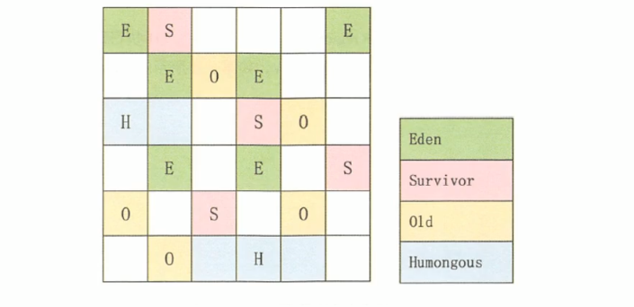

> 小结：
> 注意，这些只是基本的算法思路，实际GC实现过程要复杂的多，目前还在发展中的前沿GC都是复合算法，并且并行和并发兼备。


## 垃圾回收的相关概念
* 1.System.gc()的理解：
    * 在默认情况下，通过System.gc()或者Runtime.getRuntime().gc()的调用，会显式触发Full GC，同时对老年代和新生代进行回收，尝试释放被丢弃对象占用的内存。
    * 然而System.gc()调用附带一个免责声明，无法保证对垃圾收集器的调用。
    * JVM实现者可以通过System.gc()调用来决定JVM的GC行为。而一般情况下，垃圾回收应该是自动进行的，无须手动触发，否则就太过于麻烦了。在一些特殊情况下，
    如我们正在编写一些性能基准，我们可以再运行之间调用System.gc()。
    > System.runFinalization();//强制调用失去引用的对象的finalize()方法。      

* 2.内存溢出与内存泄漏：
    * 内存溢出相对于内存泄漏来说，尽管更容易被理解，但是同样的，内存溢出也是引发程序崩溃的罪魁祸首之一。
    * 由于GC一直在发展，所以一般情况下，除非应用程序占用的内存增长速度非常快，造成垃圾回收已经跟不上内存消耗的速度，否则不太容易出现OOM的情况。
    * 大多数情况下，GC会进行各种年龄段的垃圾回收，实在不行了就放大招，来一次独占式的Full GC操作，这时候会回收大量的内存，供应用程序继续使用。
    * javadoc中堆OutOfMemoryError的解释是，没有空闲内存，并且垃圾收集器也无法提供更多内存。
    * 内存溢出（OOM）:
        * 首先说没有空闲的内存情况：说明Java虚拟机的堆内存不够。原因有二：
            * 1.Java虚拟机的堆内存设置不够。
            > 比如：可能存在内存泄漏问题；也很有可能就是堆的大小不合理，比如我们要处理比较可观的数据量，但是没有显式指定JVM堆大小或者指定数值偏小。
            > 我们可以通过参数-Xms、-Xmx来调整。
            * 2.代码中创建了大量对象，并且长时间不能被垃圾收集器收集（存在被引用）：
            > 对于老版本的Oracle JDK，因为永久代的大小是有限的，并且JVM对永久代垃圾回收（如，常量池回收、卸载不再需要的类型）非常不积极，所以我们不断
            > 添加新类型的时候，永久代出现OutOfMemoryError也非常多见，尤其是在运行时存在大量动态类型生成的的场合；类似intern字符串缓存占用太多空间，
            > 也会导致OOM问题。对应的异常信息，会标记出来和永久代相关：“java.lang.OutOfMemoryError:PermGen space”。
            > 
            > 随着元数据区的引入，方法区内存已经不再那么窘迫，所以相应的OOM有所改观，出现OOM，异常信息则变成了：“java.lang.OutOfMemoryError:Metaspace”。
            > 直接内存不足，也会导致OOM。              
        * 这里面隐患着一层意思是，在抛出OutOfMemoryError之前，通常垃圾收集器会被触发，尽其所能去清理出空间。
            * 例如：在引用机制分析中，涉及到JVM会去尝试回收 软引用指向的对象等。
            * 在java.nio.BIts.reserveMemory()方法中，我们能清楚的看到，System.gc()会被调用，以清理空间。
        * 当然，也不是在任何情况下垃圾收集器都会被触发的。
            * 比如，我们去分配一个超大对象，类似一个超大数组超过堆的最大值，JVM可以判断出垃圾收集并不能解决这个问题，所以直接抛出OutOfMemoryError。
    * 内存泄漏（MemoryLeak）:
    > 也称作“内存渗透”。严格来说，只有对象不会再被程序用到了，但是GC又不能回收他们的情况，才叫做内存泄漏。
    > 
    > 但实际情况很多时候一些不太好的实践（或疏忽）会导致对象的生命周期变得很长甚至导致OOM，也被叫做宽泛意义上的“内存泄漏”。
    > 
    > 尽管内存泄漏并不会立刻引起程序崩溃，但是一旦发生内存泄漏，程序中可用的内存就会被逐步蚕食，直至耗尽所有内存，最终出现OutOfMemory异常，导致程序崩溃。
    > 
    > 注意，这里的存储空间并不是指物理内存，而是指虚拟内存大小，这个虚拟内存大小取决于磁盘交换区设定的大小。
    > 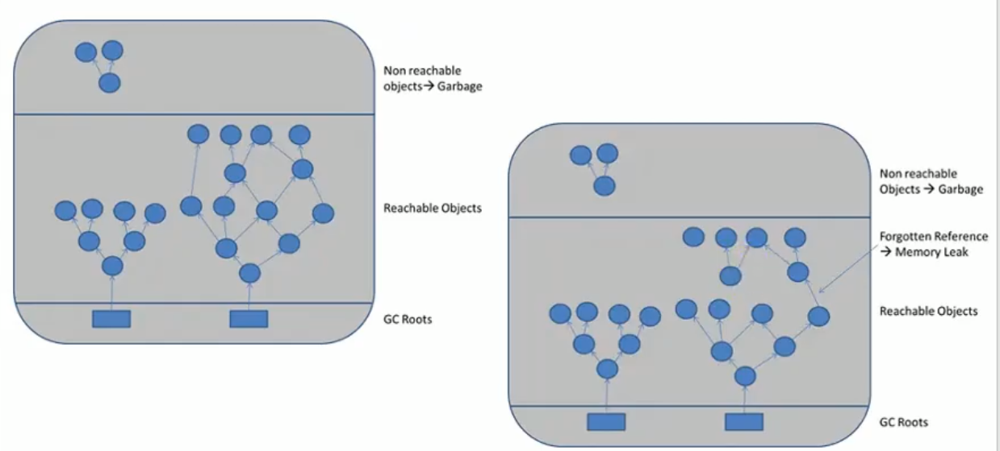
    * 内存泄漏-举例：
        * 单例模式：单例的生命周期和应用程序是一样长的，所以单例程序中，如果有对外部对象的引用的话，那么这个外部对象是不能被回收的，则会
        导致内存泄漏的产生。
        * 一些提供close的资源未关闭导致内存泄漏：数据库连接（dataSource.getConnection()）,网络连接（socket）和io连接必须手动close，
        否则是不能被回收的。

* 3.Stop The World：
    * Stop-the-World，简称STW，指的是GC事件发生过程中，会产生应用程序的停顿。停顿产生时整个应用程序线程都会被暂停，没有任何响应，
    有点像卡死的感觉，这个停顿称为STW。
        * 可达性分析算法中枚举根节点（GC Roots）会导致所有Java执行线程停顿。
            * 分析工作必须在一个能确保一致性的快照中进行
            * 一致性指整个分析期间整个执行系统看起来像被冻结在某个时间点上
            * 如果出现分析中对象引用关系还在不断变化，则分析结果的准确性无法保证
        * 被STW中断的应用程序线程会在完成GC之后恢复，频繁中断会让用户感觉像是网速不快造成电影卡带一样，所以我们需要减少STW的发生。
        * STW事件和采用哪款GC无关，所有的GC都有这个事件。
        * 哪怕是G1也不能完全避免Stop-the-world情况发生，只能说垃圾回收器越来越优秀，回收效率越来越高，尽可能地缩短了暂停时间。
        * STW是JVM在后台自动发起和自动完成的。在用户不可见的情况下，把用户正常的工作线程全部停掉。
        * 开发中不用用System.gc()；会导致Stop-the-world的发生。

* 4.垃圾回收的并行与并发：
* 并发（Concurrent）：
    * 在操作系统中，是指一个时间段中有几个程序都处于已启动运行到运行完毕之间，且这几个程序都是在同一个处理器上运行。
    * 并发并不是真正意义上的“同时进行”，只是CPU把一个时间段划分成几个时间片段（时间区间），然后在这几个时间区间之间来回切换，由于CPU处理的速度
    非常快，只要时间间隔处理得当，即可让用户感觉是多个应用程序同时在进行。
    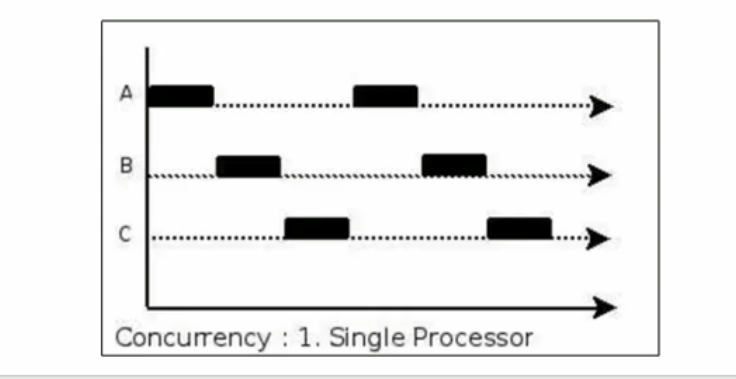
* 并行（Parallel）：
    * 当系统中有一个以上CPU时，当一个CPU执行一个进程时，另一个CPU可以执行另一个进程，两个进程互不抢占CPU资源，可以同时进行，我们称之为并行（Parallel）。
    * 其实决定并行的因素不是CPU的数量，而是CPU的核心数量，比如一个CPU多个核也可以并行。
    * 适合科学计算，后台处理等弱交互场景。
    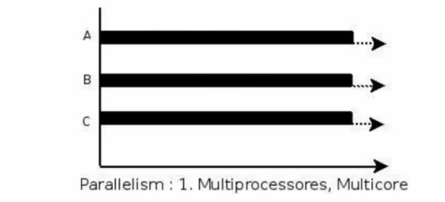
* 并发vs并行
    * 二者对比：
    > 并发，指的是多个事情，在同一时间段内同时发生了。
    > 并行，指的是多个事情，在同一时间点上同时发生了。
    >  
    > 并发的多个任务之间是互相抢占资源的。 
    > 并行的多个任务之前是不互相抢占资源的。
    >  
    >  只有在多CPU或者一个CPU多核的情况下，才会发生并行。
    >  否则，看似同时发生的事情，其实都是并发执行的。

* 垃圾回收的并发与并行：
    * 并行（Parallel）：指多条垃圾收集线程并行工作，但此时用户线程仍处于等待状态。
        * 如ParNew、Parallel Scavenge、Parallel Old；
    * 串行（Serial）
        * 相较于并行的概念，单线程执行。
        * 如果内存不够，则程序暂停，启动JVM垃圾回收器进行垃圾回收。回收完，再启动程序的线程。
    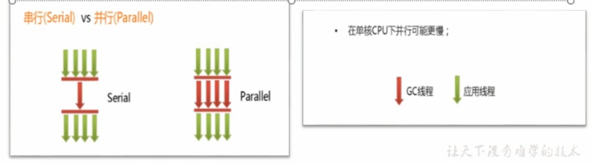    
    * 并发（Concurrent）：指用户线程与垃圾收集线程同时执行（但不一定是并行的，可能会交替执行），垃圾回收线程在执行时不会停顿用户程序的运行。
        * 用户程序在继续运行，而垃圾收集程序线程运行与另一个CPU上；
        * 如：CMS、G1。
    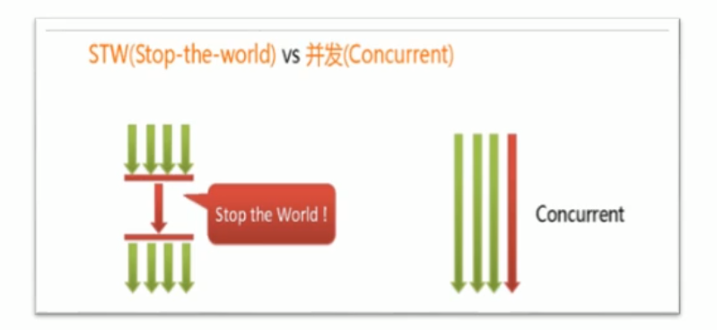

* 5.安全点和安全区域：
> 程序执行时并非在所有地方都能停顿下来开始GC,只有在特定的位置才能停顿下来开始GC,这些位置称为“安全点（Safepoint）”。
> Safe Point的选择很重要，如果太少可能导致GC等待的时间太长，如果太频繁可能导致运行的性能问题。大部分指令的执行时间都非常短暂，通常会根据
> “是否具有让程序长时间执行的特征”为标准。比如：选择一些执行时间较长的指令作为Safe Point，如方法调用、循环跳转和异常跳转等。
>
* 如何在GC发生时，检查所有线程跑到最近的安全点停顿下来呢？
    * 抢先式中断：（目前没有虚拟机采用了）
        > 首先中断所有线程。如果还有线程不再安全点，就恢复线程，让线程跑到安全点。
    * 主动式中断：
        > 设置一个中断标志，各个线程运行到Safe Point的时候主动轮询这个标志，如果中断标志为真，则将自己进行中断挂起。
* 安全区域（safe Region）：
> Safepoint机制保证了程序执行时，在不太长的时间内就会遇到可进入GC的Safepoint。但是，程序“不执行”的时候呢？如果线程处于Sleep状态或
> Blocked状态，这时候线程无法响应JVM的中断请求，“走”到安全点去中断挂起，JVM也不太可能等待线程被唤醒。对于这种情况，就需要安全区域（Safe Region）来解决。
> 
> 安全区域是指一段代码片段中，对象的引用关系不会发生变化，在这个区域中的任何位置开始GC都是安全的。我们也可以把Safe Region看作是被扩展的safepoint。
>
> 实际执行时：
> 1.当线程运行到Safe Region的代码时，首先标识已经进入了SafeRegion,如果这段时间内发生GC，JVM会忽略标识为Safe Region状态的线程；
> 2.当线程即将离开Safe Region时，会检查JVM是否已经完成GC,如果完成了，则继续运行，否则线程必须等待直到收到可以安全离开Safe Region的信号为止。
> 

* 再谈引用
> 我们希望能描述这样一类对象：当内存空间还足够时，则能保留在内存中；如果内存空间在进行垃圾收集后还是很紧张，则可以抛弃这些对象。
> 
> 强引用、软引用、弱引用、虚引用有什么区别？具体使用场景是什么？
> 在JDK 1.2版之后，Java对引用的概念进行了扩充，将引用分为强引用（Strong Reference）、软引用（Soft Reference）、弱引用（Week Reference）
> 和虚引用（Phantom Reference）4种，这4种引用强度依次逐渐减弱。
> 
> 除强引用外，其他3种引用均可在java.lang.ref包中找到它们的身影。如下图，显式了这3种引用类型对应的类，开发人员可以在应用程序中直接使用它们。
> 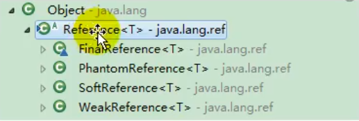
> 
> Reference子类中只有终结器引用时包可见的，其他3种引用类型均为public，可以在应用程序中直接使用。
> 
> * 强引用（StrongReference）：最传统的“引用”的定义，是指在程序代码之中普遍存在的引用赋值，即类似“Object obj=new Object()”这种引用关系。
> 无论任何情况下，只要强引用关系还存在，垃圾收集器就永远不会回收掉被引用的对象。
> * 软引用（SoftReference）：在系统将要发生内存溢出之前，将会把这些对象列入回收范围之中进行第二次回收。如果这次回收后还没有足够的内存，才会抛出内存溢出异常。
> * 弱引用（WeekReference）：被弱引用关联的对象只能生存到下一次垃圾收集之前。当垃圾收集器工作时，无论内存空间是否够，都会回收掉被弱引用关联的对象。
> * 虚引用（PhantomReference）：一个对象是否有虚引用的存在，完全不会对其生存时间构成影响，也无法通过虚引用来获得一个对象的实例。为一个对象设置虚引用
> 关联的唯一目的就是能够在这个对象被收集器回收时收到一个系统通知。
>  

* 6.强引用
> 在Java程序中，场景的引用类型是强引用（普通系统99%以上都是强引用），也就是我们最场景的普通对象引用，也是默认的引用类型。
> 
> 当在Java语言中使用new操作符创建一个新的对象，并将其赋值给一个变量的时候，这个变量就成为指向该对象的一个强引用。
> 
> 强引用的对象是可触及的，垃圾收集器就永远不会回收掉被引用的对象。
> 
> 对于一个普通的对象，如果没有其他的引用关系，只有超过了引用的作用域或者显式地将相应（强）引用赋值为null，就是可用当做垃圾被收集了，当然具体回收时机还是要看垃圾收集策略。
> 
> 相对的，软引用、弱引用和虚引用的对象都是软可触及、弱可触及和许可触及的，在一定条件下，都是可以被回收的。所以，强引用是造成Java内存泄漏的主要原因之一。

* 软引用（Soft Reference）——内存不足即回收
> 软引用时用来描述一下还有用，但非必要的对象。只被软引用关联着的对象，在系统将要发生内存溢出异常前，会把这些对象列进回收范围之中进行第二次回收，
> 如果这次回收还没有足够的内存，才会抛出内存溢出异常。
> 
> 软引用通常用来实现内存敏感的缓存。比如：高速缓存就有用到软引用。如果还有空闲内存，就可以暂时保留缓存，当内存不足时清理掉，这样就保证了使用缓存的同时，不会耗尽内存。
> 
> 垃圾回收器在某个时刻决定回收软可达的对象的时候，会清理软引用，并可选地把引用存放到一个引用队列（Reference Queue）。
> 
> 类似弱引用，只不过Java虚拟机会尽量让软引用的存活时间长一些，迫不得已才清理。

* 弱引用（Weak Reference）——发现即回收
> 弱引用也是用来描述那些非必要对象，只被弱引用关联的对象只能生存到下一次垃圾收集发生为止。在系统GC时，只要发现弱引用，不管系统堆空间使用是
> 否充足，都会回收掉只被弱引用关联的对象。
> 
> 但是，由于垃圾回收器的线程通常优先级很低，因此，并不一定能很快地发现持有弱引用的对象。在这种情况下，弱引用对象可以存在较长的时间。
> 
> 弱引用和软引用一样，在构造弱引用时，也可以指定一个引用队列，当弱引用对象被回收时，就会加入指定的引用队列，通过这个队列可以跟踪对象的回收情况。
> 
> 软引用、弱引用都非常适合来保存那些可有可无的缓存数据。如果这么做，当系统内存不足时，这些缓存数据会被回收，不会导致内存溢出。而当内存资源充足
> 时，这些缓存数据又可以存在相当长的时间，从而起到加速系统的作用。

* 虚引用（Phantom Reference）——对象回收跟踪
> 也称为“幽灵引用”或者“幻影引用”，是所有引用类型中最弱的一个。
> 
> 一个对象是否有虚引用的存在，完全不会决定对象的生命周期。如果一个对象仅持有虚引用，那么它和没有引用几乎是一样的，随时都可能被垃圾回收器回收。
> 
> 它不能单独使用，也无法通过虚引用来获取被引用的对象。当试图通过虚引用的get()方法获取对象时，总是null。
> 
> 为一个对象设置虚引用关联的唯一目的在于跟踪垃圾回收过程。比如：能在这个对象被收集器回收时收到一个系统通知。
> 
> 虚引用必须和引用队列一起使用。虚引用在创建时必须提供一个引用队列作为参数。当垃圾回收器准备回收一个对象时，如果发现它还有虚引用，就会在
> 回收对象后，将这个虚引用加入引用队列，以通知应用程序对象的回收情况。
> 
> 由于虚引用可以跟踪对象的回收时间，因此，也可以将一些资源释放操作放置在虚引用中执行和记录。

* 终结器引用（Final reference）
    * 它用以实现对象的finalize()方法，也可以称为终结器引用。
    * 无需手动编码，其内部配合引用队列使用。
    * 在GC时，终结器引用入队。由Finalize线程通过终结器引用找到被引用对象并调用它的finalize()方法，第二次GC时才能回收被引用对象。


## 垃圾回收器

### GC分类与性能指标
* 垃圾回收器概述
    * 垃圾收集器没有在规范中进行过多的规定，可以由不同的厂商、不同版本的JVM来实现。
    * 由于JDK的版本处于高速跌的过程中，因此Java发展至今已经衍生了众多的GC版本。
    * 从不同角度分析垃圾收集器，可以将GC分为不同的类型。
* 垃圾回收器分类
    * 按线程数分，可以分为串行垃圾回收器和并行垃圾回收器。
        * 串行回收指的是在同一时间段内只允许有一个CPU用于执行垃圾回收操作，此时工作线程被暂停，直至垃圾收集工作结束。
            * 在诸如单CPU处理器或者较小的应用内存等硬件平台不是特别优越的场合，串行回收器的性能表现可以超过并行回收器和并发回收器。所以，串行回收
            默认被应用在客户端的Client模式的JVM中。
            * 在并发能力比较强的CPU上，并行回收器产生的停顿时间要短于串行回收器。
        * 和串行回收相反，并行收集可以运用多个CPU同时执行垃圾回收，因此提升了应用的吞吐量，不过并行回收仍然与串行回收一样，采用独占式，使用了“Stop-the-world”机制。
    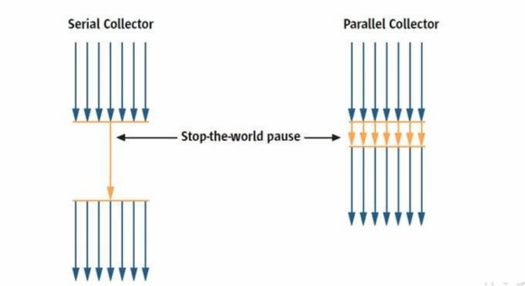
    * 按照工作模式分，可以分为并发式垃圾回收器和独占式垃圾回收器。
        * 并发式垃圾回收器与应用程序交替工作，已尽可能减少应用程序的停顿时间。
        * 独占式垃圾回收器（Stop the world）一旦运行，就停止应用程序中的所有用户线程，直到垃圾回收过程完全结束。
        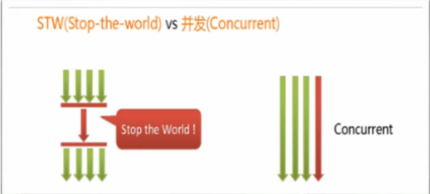
    * 按照碎片处理方式分，可分为压缩式垃圾回收器和非压缩式垃圾回收器。
        * 压缩式垃圾回收器会在回收完成后，堆存活对象进行压缩整理，消除回收后的碎片。
            * 再分配对象空间使用：指针碰撞
        * 非压缩式的垃圾回收器不进行这步操作。
            * 再分配对象空间使用：空闲列表
    * 按照工作的内存区间分，可分为年轻代垃圾回收器和老年代垃圾回收器。

### 评估GC的性能指标
* 吞吐量：运行用户代码的时间占总运行时间的比例
    * （总运行时间：程序的运行时间+内存回收的时间）
* 垃圾收集开销：吞吐量的补数，垃圾收集所用的时间与总运行时间的比例。
* 暂停时间：执行垃圾收集时，程序的工作线程被暂停的时间。
* 收集频率：相对于应用程序的执行，收集操作发生的频率。
* 内存占用：Java堆区所占的内存大小。
* 快速：一个对象从诞生到被回收所经历的时间。
* 不可能三角（吞吐量、暂停时间、内存占用）：
    * 这三者共同构成一个“不可能三角”。三者总体的表现会随着技术进步而越来越好。一款优秀的收集器通常最多同时满足其中的两项。
    * 这三项里，暂停时间的重要性日益凸显。因为随着硬件发展，内存占用多些越来越能忍受，硬件性能的提升也有助于降低收集器运行时对应用程序的影响，即提高了吞吐量。
    而内存的扩大，堆延迟反而带来负面效果。
* 简单来说，主要抓住两点：
    * 吞吐量
    * 暂停时间

* 评估GC的性能指标：吞吐量（throughput）
    * 吞吐量是CPU用于运行用户代码的时间与CPU总消耗时间的比值，即吞吐量=运行用户代码时间 / （运行用户代码时间 + 垃圾收集时间）。
        * 比如：虚拟机总共运行了100分钟，其中垃圾收集花掉1分钟，那吞吐量就是99%。
    * 这种情况下，应用程序能容忍较高的暂停时间，因此，高吞吐量的应用程序又更长的时间基准，快速响应不必考虑的。
    * 吞吐量优先，意味着在单位时间内，STW的时间更短：0.2+0.2 = 0.4
* 评估GC的性能指标：暂停时间（pause time）
    * “暂停时间”是指在一个时间段内应用程序线程暂停，让GC线程执行的状态
        * 例如，GC期间100毫秒的暂停时间意味着在这100毫秒期间没有应用程序线程时活动的。
    * 暂停时间优先，意味着尽可能让单次STW的时间最短：0.1+0.1+0.1+0.1+0.1=0.5
* 评估GC的性能指标：吞吐量vs暂停时间
    * 高吞吐量较好因为这会让应用程序的最终用户感觉只有应用程序线程在做“生成性”工作。直觉上，吞吐量越高程序运行越快。
    * 低暂停时间（低延迟）较好因为从最终用户的角度来看不管是GC还是其他原因导致一个应用被挂起始终是不好的。这取决于应用程序的类型，有时候甚至短暂的200毫秒
    暂停都可能打断终端用户体验。因此，具有较低的较大暂停时间是非常重要的，特别是对于一个交互式应用程序。
    * 不幸的是“高吞吐量”和“低暂停时间”是一对相互竞争的目标（矛盾），
        * 因为如果选择以吞吐量优先，那么必然需要降低内存回收的执行频率，但是这样会导致GC需要更长的暂停时间来执行内存回收。
        * 相反的，如果选择以低延迟优先为原则，那么为了降低每次执行内存回去时的暂停时间，也只能频繁地执行内存回收，但这又引起了年轻代内存的缩减和导致程序吞吐量的下降。
    > 在设计（或使用）GC算法时，我们必须确定我们的目标：一个GC算法只可能对两个目标之一（即只专注于较大吞吐量或最小暂停时间），或尝试找到一个二者的折衷。
    > 
    >现在的标准：在最大吞吐量优先的情况下，降低停顿时间。 
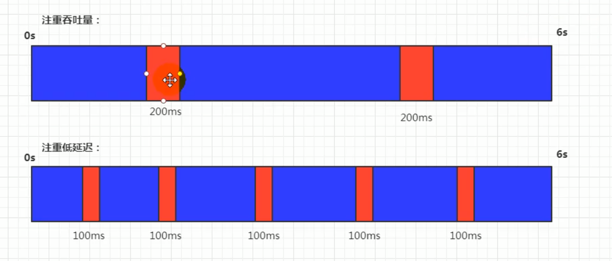

### 不同的垃圾回收器概述
* 垃圾收集器发展史：垃圾回收Garbage Collection，对应的产品我们称之为 垃圾回收器Garbage Collector。
    * 1999年随JDK1.3.1一起来的是串行方式的Serial GC，它是第一款GC。ParNew垃圾收集器时Serial收集器的多线程版本
    * 2002年2月26日，Parallel GC和Concurrent Mark Sweep GC跟随JDK1.4.2一起发布。
    * Parallel GC在JDK6之后成为HotSpot默认GC。
    * 2012年，在JDK1.7u4版本中，G1可用。
    * 2017年，JDK9中G1变成默认的垃圾收集器，以替代CMS。
    * 2018年3月，JDK10中G1垃圾回收器的并行完整垃圾回收，实现并行性来改善最坏情况下的延迟。
    * 2018年9月，JDK11发布。引入Epsilon垃圾回收器，又被称为“No-Op（无操作）”回收器。同时，引入ZGC：可伸缩的低延迟垃圾回收器（Experimental）。
    * 2019年3月，JDK12发布。增强G1,自动返回未用堆内存给操作系统。同时，引入Shenandoah GC：低停顿时间的GC(Experimental)。
    * 2019年9月，JDK13发布。增强ZGC，自动返回未用堆内存给操作系统。
    * 2020年3月，JDK14发布。删除CMS垃圾回收器。扩展ZGC在macOS和Windows上的应用。

* 7款经典的垃圾收集器
    * 串行收集器：Serial、Serial Old
    * 并行回收器：ParNew、Parallel Scavenge、Parallel Old
    * 并发回收器：CMS、G1
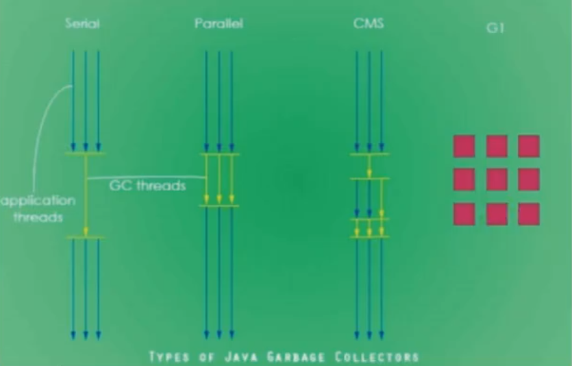
* 参考官方文档：https://www.oracle.com/technetwork/java/javase/tech/memorymanagement-whitepaper-1-150020.pdf

* 7款经典收集器与垃圾分代之间的关系
    * 新生代收集器：Serial、ParNew、Parallel Scavenge；
    * 老年代收集器：Serial Old、Parallel Old、CMS;
    * 整堆收集器：G1；
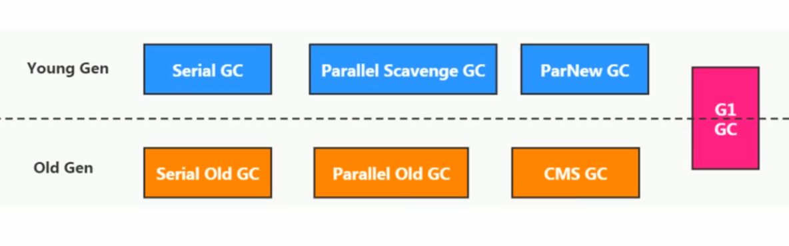

* 垃圾收集器的组合关系
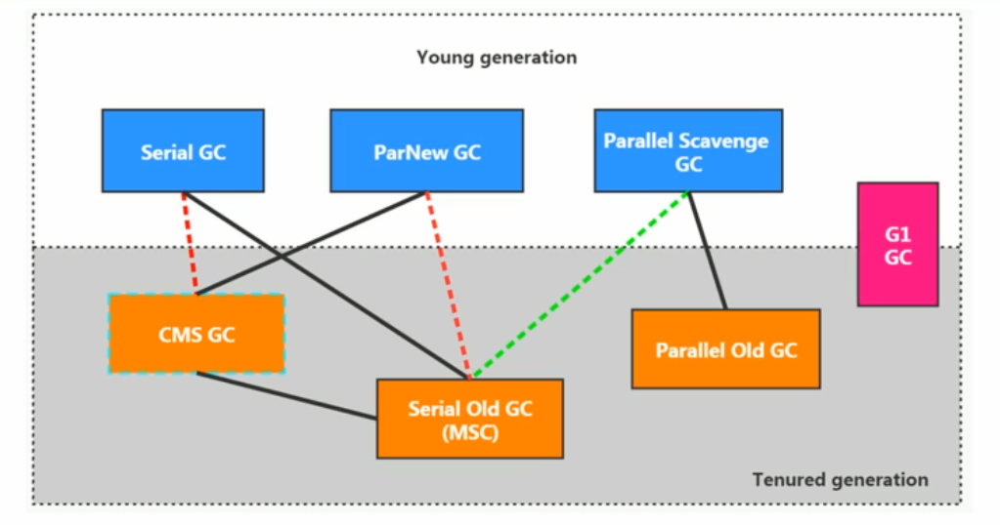
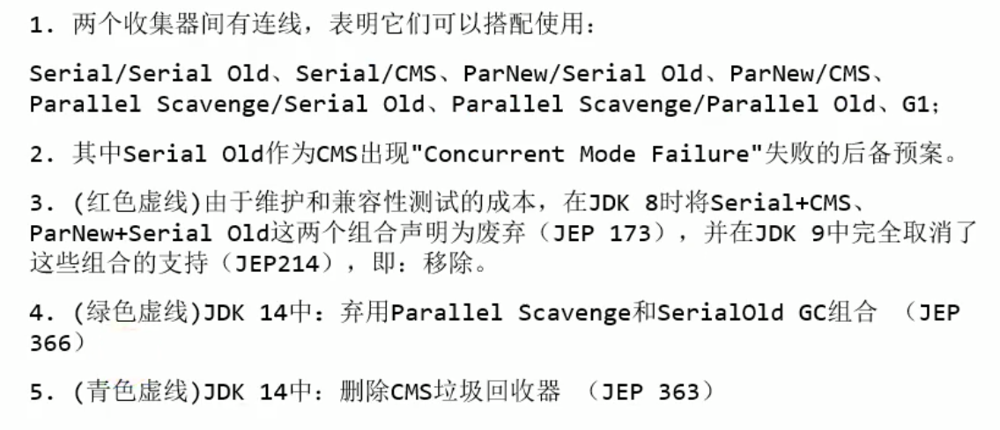
* 为什么要有很多收集器，一个不够吗？
> * 因为Java的使用场景很多，移动端，服务器等。所以就需要针对不同的场景，提供不同的垃圾收集器，提高垃圾收集的性能。
> * 虽热我们会对各种收集器进行比较，但并非为了挑选一个最好的收集器出来。没有一种放之四海皆准、任何场景下都适用的完美收集器存在，更加没有万能的收集器。
> 所以我们选择的只是对具体应用最合适的收集器。

* Serial回收器：串行回收
    * Serial收集器时最基本、历史最悠久的垃圾收集器了。JDK1.3之前回收新生代唯一的选择。
    * Serial收集器作为HotSpot中Client模式下的默认新生代垃圾收集器。
    * Serial收集器采用复制算法、串行回收和“Stop-the-World”机制的方式执行内存回收。
    * 除了年轻代之外，Serial收集器还提供了用于执行老年代垃圾收集的Serial Old收集器。Serial收集器还提供用于执行老年代垃圾收集的Serial Old收集器。
    Serial Old收集器同样也采用了串行回收和“Stop the World”机制，只不过内存回收算法使用的是标记-压缩算法。
        * Serial Old是运行在Client模式下默认的老年代的垃圾回收器。
        * Serial Old是Server模式下主要有两个用途：①与新生代的Parallel Scavenge配合使用 ②作为老年代CMS收集器的后备垃圾收集方案。
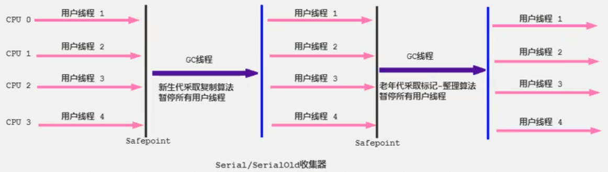
    
    * 优势：简单而高效（与其他收集器的单线程比），对于限定单个CPU的环境来说，Serial收集器由于没有线程交互的开销，专心做垃圾收集自然可以获得最高的单线程收集效率。
        * 运行在Client模式下的虚拟机是个不错的选择。
    * 在用户的桌面应用场景中，可用内存一般不大（几十MB至一两百MB）,可以在较短时间内完成垃圾收集（几十ms至一百多ms），只要不频繁发生，使用串行回收器是可以接受的。
    * 在HotSpot虚拟机中，使用-XX:+UserSerialGC参数可以指定年轻代和老年代都使用串行收集器。
        * 等价于 新生代用Serial GC，且老年代用Serial Old GC
> 总结：
> 这种垃圾收集器大家了解，现在已经不用串行的了。而且限定单核cpu才可以用。现在都不是单核的了。
> 
> 对于交互较强的应用而言，这种垃圾收集器时不能接受的。一般在Java web应用程序中时不会采用串行垃圾收集器的。

* ParNew回收器：并行回收
    * 如果说Serial GC是年轻代的单线程垃圾收集器，那么ParNew收集器则是Serial收集器的多线程版本。
        * Par是Parallel的缩写，New:只能处理的是新生代。
    * ParNew收集器除了采用并行回收的方式执行内存回收外，两款垃圾收集器之间几乎没有任何区别。ParNew收集器在年轻代中同样也是采用复制算法、“Stop-the-World”机制。
    * ParNew是很多JVM运行在Server模式下新生代的默认垃圾收集器。
    
    * 对于新生代，回收次数频繁，使用并行方式高效。
    * 对于老年代，回收次数少，使用串行方式节省资源。（CPU并行需要切换线程，串行可以省去切换线程的资源）。
    * 由于ParNew收集器是基于并行回收的，那么是否可以断定ParNew收集器的回收效率在任何场景下都会比Serial收集器更高效？
        * ParNew收集器运行在多CPU的环境下，由于可以充分利用多CPU、多核心等物理硬件资源优势，可以更快速地完成垃圾收集，提升程序的吞吐量。
        * 但是在单个CPU的环境下，ParNew收集器不比Serial收集器更高效。虽热Serial收集器是基于串行回收，但是由于CPU不需要频繁地做任务切换，
        因此可以有效避免多线程交互过程中产生的一些额外开销。
    * 除了Serial外，目前只有ParNew GC能与CMS收集器配合工作。
    * 在程序中，开发人员可以通过选项“-XX:+UseParNewGC”手动指定使用ParNew收集器执行内存回收任务。它表示年轻代使用并行收集器，不影响老年代。
    * -XX:ParallelGCThreads限制线程数量，默认开启和CPU数据相同的线程数。

* Parallel回收器：吞吐量优先
    * HotSpot的年轻代中除了拥有ParNew收集器时基于并行回收的以外，Parallel Scavenge收集器同样采用了复制算法、并行回收和“Stop the World”机制。
    * 那么Parallel收集器的出现是否多此一举？
        * 和ParNew收集器不同，Parallel Scavenge收集器的目标是达到一个可控制的吞吐量（Throughput），它也被称为吞吐量优先的垃圾收集器。
        * 自适应调节策略也是Parallel Scavenge与ParNew一个重要区别。
    * 高吞吐量则可以高效地利用CPU时间，尽快完成程序的运算任务，主要适合在后台运算而不需要太多交互的任务。因此，场景在服务器环境中使用。例如，
    那些执行批量处理、订单处理、工资支付、科学计算的应用程序。
    * Parallel 收集器在JDK1.6时提供了用于执行老年代垃圾收集的Parallel Old收集器，用来代替老年代的Serial Old收集器。
    * Parallel Old收集器采用了标记-压缩算法，但同样也是基于并行回收和“Stop-the-World”机制。
    
    * 在程序吞吐量优先的应用场景中，Parallel收集器和Parallel Old收集器的组合，在Server模式下的内存回收性能很不错。
    * 在Java8中，默认是此垃圾收集器。
    * 参数配置：
        * -XX:+UseParallelGC 手动指定年轻代使用Parallel并行收集器执行内存回收任务。
        * -XX:+UseParallelOldGC 手动指定老年代都是使用并行回收收集器。
            * 分别适用于新生代和老年代。默认jdk8是开启的。
            * 上面两个参数，默认开启一个，另一个也会被开启。（互相激活）
        * -XX:ParallelGCThreads 设计年轻代并行收集器的线程数。一般地，最好与CPU数量相等，以避免过多的线程数影响垃圾收集性能。
            * 在默认情况下，当CPU数量小于8个，ParallelGCThreads的值等于CPU数量。
            * 当CPU数量大于8个，ParallelGCThreads的值等于3+[5*CPU_Count]/8。
        * -XX:MaxGCPauseMillis 设置垃圾收集器最大停顿时间（即STW的时间）。单位是毫秒。
            * 为了尽可能地把停顿时间控制在MaxGCPauseMills以内，收集器在工作时会调整Java堆大小或者其他一些参数。
            * 对于用户来讲，停顿时间越短体验越好。但是在服务器端，我们注重高并发，整体的吞吐量。所以服务器端适合Parallel，进行控制。
            * 该参数使用需谨慎。
        * -XX:GCTimeRatio 垃圾收集时间占总时间的比例（=1/(N+1)）。用于衡量吞吐量的大小。
            * 取值范围（0,100）。默认值99，也就是垃圾回收时间不超过1%。
            * 与前一个-XX:MaxGCPauseMillis参数有一定矛盾性。暂停时间越长，Radio参数就容易超过设定的比例。
        * -XX:+UseAdaptiveSizePolicy 设置Parallel Scavenge收集器具有自适应调节策略
            * 在这种模式下，年轻代的大小、Eden和Survivor的比例、晋升老年代的对象年龄等参数会被自动调整，已达到在堆大小、吞吐量和停顿时间之间的平衡点。
            * 在手动调优比较困难的场合，可以直接使用这种自适应的方式，仅指定虚拟机的最大堆、目标的吞吐量（GCTimeRatio）和停顿时间（MaxGCPauseMills），
            让虚拟机自己完成调优工作。

* CMS回收器：低延迟
    * 在JDK 1.5时期，HotSpot退出了一款在强交互应用中几乎可任务有划时代意义的垃圾收集器：CMS（Concurrent-Mark-Sweep）收集器，这款收集器
    是HotSpot虚拟机第一款真正意义上的并发收集器，它第一次实现了让垃圾收集线程与用户线程同时工作。
    * CMS收集器的关注点是尽可能缩短垃圾收集时用户线程的停顿时间。停顿时间越短（低延迟）就越适合用户交互的程序，良好的响应速度能提升用户体验。
        * 目前很大一部分的Java应用程序集中在互联网站或者B/S系统的服务端上，这类应用尤其重视服务的响应速度，希望系统停顿时间最短，以给用户带来较好的体验。
          CMS收集器就非常符合这类应用的需求。
        * CMS的垃圾收集算法采用 标记-清除 算法，并且也会“Stop-the-world”。          
> 不幸的是，CMS作为老年代的收集器，却无法与JDK 1.4.0中已经存在的新生代收集器Parallel Scavenge配合工作，所以在JDK 1.5中使用CMS来收集
> 老年代的时候，新生代只能选择ParNew或者Serial收集器中的一个。
> 
> 在G1出现之前，CMS使用的还是非常广泛的。一直到今天，仍然有很多系统使用CMS GC。
* CMS的工作原理
    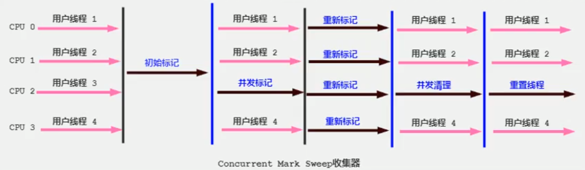
> CMS整个过程比之前的收集器要复杂，整个过程分为4个主要阶段，即初始标记阶段、并发标记阶段、重新标记阶段和并发清除阶段。
* CMS的工作原理：
    * 初始标记（Initial-Mark）阶段：在这个阶段中，程序中所有的工作线程都会因为“Stop-the-World”机制而出现短暂的暂停，这个阶段的主要任务
    仅仅是标记处GC Roots能直接关联到的对象。一旦标记完成之后就会恢复之前被暂停的所有应用线程。由于直接关联对象比较小，所以这里的速度非常快。
    * 并发标记（Concurrent-Mark）阶段：从GC Roots的直接关联对象开始遍历整个对象图的过程，这个过程耗时比较长但是不需要停顿用户线程，可以与
    垃圾收集线程一起并发运行。
    * 重新标记（Remark）阶段：由于在并发标记阶段中，程序的工作线程会和垃圾收集线程同时运行或者交叉运行，因此为了修正并发标记期间，因用户程序
    继续运作而导致标记产生变动的那一部分对象的标记记录，这个阶段的停顿时间通常会比初始标记阶段稍长一些，但也远比并发标记阶段的时间短。
    * 并发清除（Concurrent-Sweep）阶段：此阶段清理删除掉标记阶段判断的已经死亡的对象，释放内存空间。由于不需要移动存活对象，所以这个阶段也是
    可以和用户线程同时并发的。
> CMS回收器：低延迟
> 尽管CMS收集器采用的是并发回收（非独占式），但是在其初始化标记和再次标记这两个阶段中仍然需要执行“Stop-the-World”机制暂停程序中的工作线程，
> 不过暂停时间不会太长，因此可以说明目前所有的垃圾收集器都做不到完全不需要“Stop-the-World”，只是尽可能地缩短暂停时间。
> 
> 由于最耗时的并发标记与并发清除阶段都不需要暂停工作，所以整体的回收时低停顿的。
> 
> 另外，由于在垃圾收集阶段用户线程没有中断，所以在CMS回收过程中，还应该确保应用程序线程时足够的内存可用。因此，CMS收集器不能像其他收集器那也等
> 到老年代几乎完全被填满了再进行收集，而是当堆内存使用率达到某一阈值时，便开始进行回收，以确保应用程序在CMS过程中依然有足够的空间支持应用程序
> 运行。要是CMS运行期间预留的内存无法满足程序需要，就会出现一次“Concurrent Mode Failure”失败，这时虚拟机将启动后备预案：临时启用
> Serial Old收集器来重新进行老年代的垃圾收集，这样停顿时间就很长了。
> 
> CMS收集器的垃圾收集算法采用的是 标记-清除算法，这意味着每次执行完内存回收后，由于被执行内存回收的无用对象所占用的内存空间极有可能是不连续的一些内存块，
> 不可避免地将会产生一些内存碎片。那么CMS在为新对象分配内存空间时，将无法使用指针碰撞（Bump the Pointer）技术，而只能够选择空闲列表（Free List）执行内存分配。
> 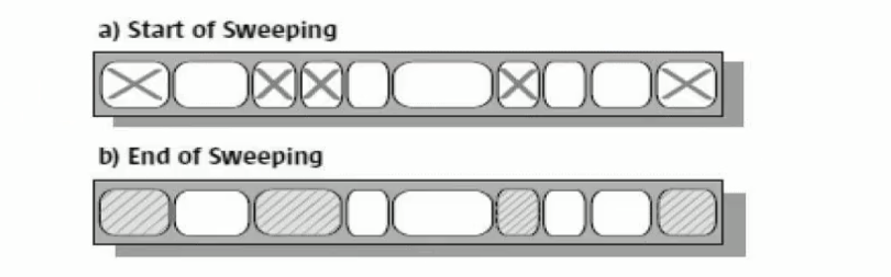
* CMS回收器：低延迟
    * CMS的优点：
        * 并发收集
        * 低延迟
    * CMS的弊端：
        * 会产生内存碎片，导致并发清除后，用户线程可用的空间不足。在无法分配大对象的情况下，不得不提前触发Full GC。
        * CMS收集器对CPU非常敏感。在并发阶段，它虽然不会导致用户停顿，但是会因为占用了一部分线程而导致应用程序变慢，总吞吐量会降低。
        * CMS收集器无法处理浮动垃圾。可能出现“Concurrent Mode Failure”收集而导致另一次Full GC的产生。在并发标记阶段由于程序的工作线程
        和垃圾收集线程时同时运行或者交叉运行的，那么在并发标记阶段如果产生的垃圾对象，CMS将无法对这些垃圾对象进行标记，最终会导致这些新产生的垃圾
        对象没有被及时回收，从而只能在下一次执行GC时是否这些之前未被回收的内存空间。
* CMS收集器可以设置的参数：          
    * -XX:+UseConcMarkSweepGC 手动指定使用CMS收集器执行内存回收任务。
        * 开启该参数后会自动将-XX:UseParNewGC打开。即：ParNew(Young区用)+CMS(OLD区用)+Serial Old的组合。
    * -XX:CMSlnitiatingOccupanyFraction设置堆内存使用率的阈值，一旦达到该阈值，便开始进行回收。
        * JDK 5及以前版本的默认值是68，即当老年代的空间使用率达到68%时，会执行一次CMS回收。JDK6及以上版本默认值为92%。
        * 如果内存增长缓慢，则可以设置一个稍大的值，大的阈值可以有效降低CMS的触发频率，减少老年代回收的次数可以较为明显地改善应用程序性能。
        反之，如果应用程序内存使用率增长很快，则应该降低这个阈值，以避免频繁触发老年代串行收集器。因此通过该选择便可以有效降低Full GC的执行次数。
    * -XX:+UseCMSCompactAtFullCollection 用于指定在执行完Full GC后对内存空间进行压缩整理，以此避免内存碎片的产生。不过由于内存压缩
    整理过程无法并发执行，所以带来的问题就是停顿时间变得更长了。
    * -XX:CMSFullGCsBeforeCompaction 设置在执行多少次FullGC后对内存空间进行压缩整理。
    * -XX:ParallelCMSThreads 设置CMS的线程数量。
        * CMS 默认启动的线程数是（ParallelGCThreads+3）/4,ParallelGCThreads是年轻代并行收集器的线程数。当CPU资源比较紧张时，受到CMS
        收集器线程的影响，应用程序的性能在垃圾回收阶段可能会非常糟糕。
          
> 小结：
> HotSpot有这么多的垃圾收集器，那么如果有人问，Serial GC、Parallel GC、Concurrent Mark Sweep GC这三个GC有什么不同呢？
> 口令：
>   如果你想要最小化地使用内存和并行开销，请选Serial GC；
>   如果你想要最大化应用程序的吞吐量，请选Parallel GC；
>   如果你想要最小化GC的中断和停顿时间，请选CMS GC。

* JDK后续版本中CMS的变化
    * JDK9新特性：CMS被标记为Deprecate了（JEP291）
        * 如果对JDK 9及以上版本的HotSpot虚拟机使用参数-XX:+UseConcMarkSweepGC来开启CMS收集器的话，用户会受到一个警告信息，提示CMS未来将会被废弃。
    * JDK14新特性：删除CMS垃圾回收器（JEP363）
        * 移除了CMS垃圾收集器，如果在JDK14中使用-XX:+UseConcMarkSweepGC的话，JVM不会报错，只是给出一个warning信息，但是不会exit。JVM会自动回退以默认GC方式启动JVM.
    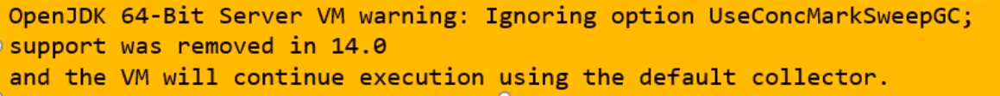


* G1回收器：区域化分代式
> 既然我们已经有了前面几个强大的GC，为什么还要发布Garbage First（G1）GC?
> 原因就是因为应用程序所应对的业务越来越庞大、复杂，用户越来越多，没有GC就不能保证应用程序正常进行，而经常造成STW的GC又跟不上实际的需求，所以才会
> 不断地尝试对GC进行优化。G1（Garbage-First）垃圾回收器是在Java7 update 4之后引入的一个新的垃圾回收器，是当今收集器技术发展的最前沿成果之一。
> 
> 与此同时，为了适应现在不断扩大的内存和不断增加的处理器数量，进一步降低暂停时间（pause time），同时兼顾良好的吞吐量。
> 
> 官方给G1设定的目标是在延迟可控的情况下获得尽可能高的吞吐量，所以才担当起“全功能收集器”的重任与期望。
* 为什么明知叫做Garbage First（G1）呢？
    * 因为G1是一个并行回收器，它把堆内存分割为很多不相关的区域（Region）物理上不连续的。使用不同的Region来表示Eden、幸存者0区，幸存者1区，老年代等。
    * G1 GC有计划地避免在整个Java堆中进行全区域的垃圾收集。G1跟踪各个Region里面的垃圾堆积的价值大小（回收所获得的空间大小以及回收所需时间的经验值），
    在后台维护一个优先列表，每次根据允许的收集时间，优先回收价值最大的Region。
    * 由于这种方式的侧重点在于回收垃圾最大量的区间（Region），所以我们给G1一个名字：垃圾优先（Garbage First）。
> 说明：
> G1（Garbage-First）是一款面向服务端应用的垃圾收集器，主要针对配备多核CPU及大容量内存的机器，以极高概率满足GC停顿时间的同时，还兼具高吞吐量的性能特征。
> 
> 在JDK1.7版本正式启用，移除了Experimental的标识，是JDK 9以后的默认垃圾回收器，取代了CMS回收器以及Parallel+Parallel Old组合。被Oracle官方称为“全功能的垃圾收集器”。
> 
> 与此同时，CMS以及在JDK 9中被标记为废弃（deprecated）。在jdk8中还不是默认的垃圾回收器，需要使用-XX:UseG1GC来启动。
* G1回收器的特点（优势）：与其他GC收集器相比，G1使用了全新的分区算法，其特点如下所示：
    * 并行与并发
        * 并行性：G1在回收期间，可以有多个GC线程同时工作，有效利用多核计算能力。此时用户线程STW
        * 并发性：G1拥有与应用程序交替执行的能力，部分工作可以和应用程序同时执行，因此，一般来说，不会在整个回收阶段发生完全阻塞应用程序的情况。
    * 分代收集
        * 从分代上看，G1依然属于分代型垃圾回收器，它会区分年轻代和老年代，年轻代依然有Eden区和Survivor区。但从堆的结构上看，它不要求整个Eden区、
        年轻代或者老年代都是连续的，也不再坚持固定大小和固定数量。
        * 将堆空间分为若干个区域（Region），这些区域中包含了逻辑上的年轻代和老年代。
        * 和之前的各类回收器不同，它同时兼顾年轻代和老年代。对比其他回收器，或者工作在年轻代，或者工作在老年代；
    * 空间整合
        * CMS：“标记-清除”算法、内存碎片、若干次GC后进行一次碎片整理
        * G1将内存划分为一个个的region。内存的回收是以region作为基本单位的。Region之间是 复制算法 ，但整体上实际可看作是 标记-压缩
        （Mark-Compact）算法，两种算法都可以避免内存碎片。这种特征有利于程序长时间运行，分配大对象时不会因为无法找到连续内存空间而提前触发
          下一次GC。尤其是当Java堆非常大的时候，G1的优势更加明显。
    * 可预测的停顿时间模型（即：软实时soft real-time）
    这是G1相对于CMS的另一大优势，G1除了追求低停顿外，还能建立可预测的停顿时间模型，能让使用者明确指定一个长度为M毫秒的时间片段内，消耗在垃圾收集上的时间不超过N毫秒。
        * 由于分区的原因，G1可以只选择部分区域进行内存回收，这样缩小了回收的范围，因此对于全局停顿情况的发生也能得到较好的控制。
        * G1跟踪各个 Region 里面的垃圾堆积的价值大小（回收获得的空间大小以及回收所需时间的经验值），在后台维护一个优先列表，每次根据允许的收集
        时间，优先回收价值最大的Region。保证了 G1 收集器在有限的时间内可以获取尽可能高的收集效率。
        * 相比于CMS GC，G1未必能做到CMS最好情况下的延时停顿，但是最差情况要好很多。          
* G1回收器的缺点：
> 相较于CMS,G1还不具备全方位、压倒性优势。比如在用户程序运行过程中，G1物理是为了垃圾收集产生的内存占用（Foorprint）还是程序运行的额外执行负载（Overload）都要比CMS要搞。
> 
> 从经验上来说，在小内存应用上CMS的表现大概率会优于G1，而G1在大内存应用上则发挥其优势。平衡点在6-8GB之间。
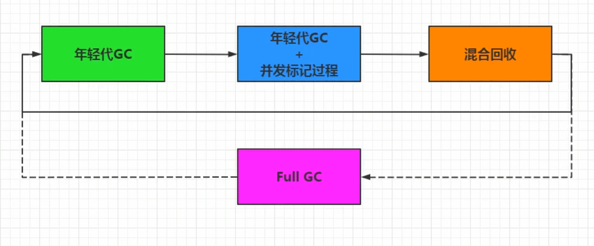
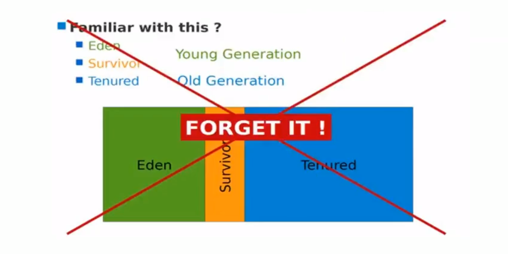
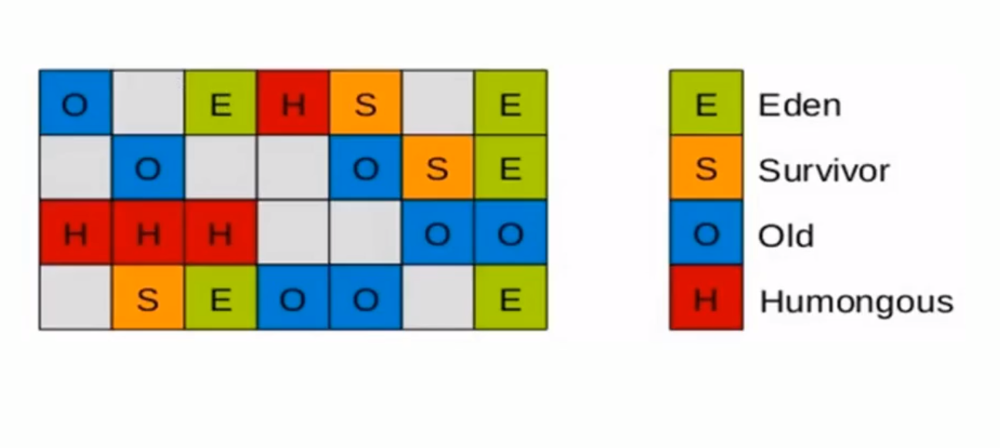
* G1回收器的参数设置：
    * -XX:+UseG1GC  手动指定使用G1收集器执行内存回收任务。
    * -XX:G1HeapRegionSize  设置每个Region的大小。值是2的幂，范围是1MB到32MB之间，目标是根据最小的Java堆大小划分出约2048个区域。
    默认是堆内存的1/2000。
    * -XX:MaxGCPauseMillis  设置期望达到的最大GC时间指标（JVM会尽力实现，但不保证达到）。默认值是200ms
    * -XX:ParallelGCThread  设置STW时GC线程数的值。最多设置为8
    * -XX:ConcGCThreads 设置并发标记的线程数。将n设置为并行垃圾回收线程数（ParallelGCThreads）的1/4左右。
    * -XX:InitiatingHeapOccupancyPercent    设置触发并发GC周期的Java堆占用率的阈值。超过此值，就触发GC。默认值是45。
* G1回收器的场景操作步骤：
> G1的设计原则就是简化JVM性能调优，开发人员只需要简单的散步即可完成调优：
> 
> 第一步：开启G1垃圾收集器
> 第二步：设置堆的最大内存
> 第三部：设置最大的停顿时间
> 
> G1中提供了三种垃圾回收模式：YoungGC、Mixed GC和Full GC，在不同的条件下被触发。
* G1回收器的适用场景
    * 面向服务端应用，针对具有大内存、多处理器的机器。（在普通大小的堆里表现并不惊喜）
    * 最主要的应用时需要低GC延迟，并具有大堆的应用程序提供解决方案
    * 如：在堆大小约6GB或更大时，可预测的暂停时间可以低于0.5秒；（G1通过每次只清理一部分而不是全部的Region的增量式来保证每次GC停顿时间不会过程长）。
    * 用来替换掉JDK1.5中的CMS收集器：在下面的情况时，使用G1可能比CMS好：
        * 超过50%的Java堆被活动数据占用：
        * 对象分配频率或年代提升频率变化很大
        * GC停顿时间过长（长于0.5至1秒）。
    * HotSpot垃圾收集器里，除了G1以外，其他的垃圾收集器使用内置的JVM线程执行GC的多线程操作，而G1 GC可以采用应用线程承担后台运行的GC工作，即当JVM的
    GC线程处理速度慢时，系统会调用应用程序线程帮助加速垃圾回收过程。
* 分区Region：化整为零
> 使用G1收集器时，它将整个Java堆划分成约 2048 个大小相同的独立Region块，每个Region块大小根据堆空间的实际大小而定，整体被控制在1MB到32MB之间，且
  为2的N次幂，即1MB、2MB、4MB、8MB、16MB、32MB。可以通过-XX:G1HeapRegionSize设定。所有的Region大小相同，且在JVM生命周期内不会被改变。
> 
> 虽然还保留有新生代和老年代的概念，但新生代和老年代不再是物理隔离的了，它们都是一部分Region（不需要连续）的集合。通过Region的动态分配方法实现逻辑上的连续。
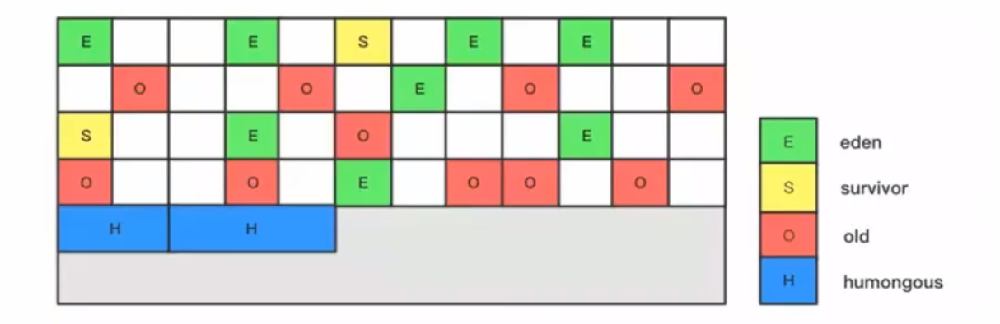
* 分区Region：化整为零 
    * 一个 region 有可能属于 Eden,Survivor 或者Old/Tenured 内存区域。但是一个region只可能属于一个角色。图中的 E 表示该region属于Eden内存区域，
    S表示属于Survivor内存区域，O表示属于Old内存区域。图中空白的表示未使用的内存空间。
    * G1 垃圾收集器还增加一个新的内存区域，叫做 Humongous 内存区域，如图中的 H 块。主要用于存储大对象，如果超过1.5个region，就当到H。    
    > 设置H的原因：
    > 
    > 对于堆中的大对象，默认直接会被分配到老年代，但是如果他是一个短期存在的大对象，就会对垃圾收集器造成负面影响。为了解决这个问题，G1划分了一个Humongous区，
    > 它用来专门存放大对象。如果一个H区装不下一个大对象，那么G1会寻找连续的H区来存储。为了能找到连续的H区，有时候不得不启动Full GC。G1的大多数行为都
    > 把H区作为老年代的一部分来看待。
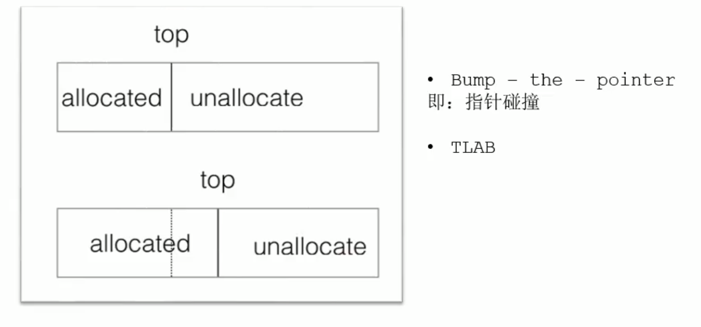
* G1回收器垃圾回收过程：G1 GC的垃圾回收过程主要包括如下三个环节：
    * 年轻代GC (Young GC)  
    * 老年代并发标记过程（Concurrent Marking）
    * 混合回收（Mixed GC）
    * (如果需要，单线程、独占式、高强度的Full GC还是继续存在的。它针对GC的评估失败提供了一种失败保护机制，即强力回收。)
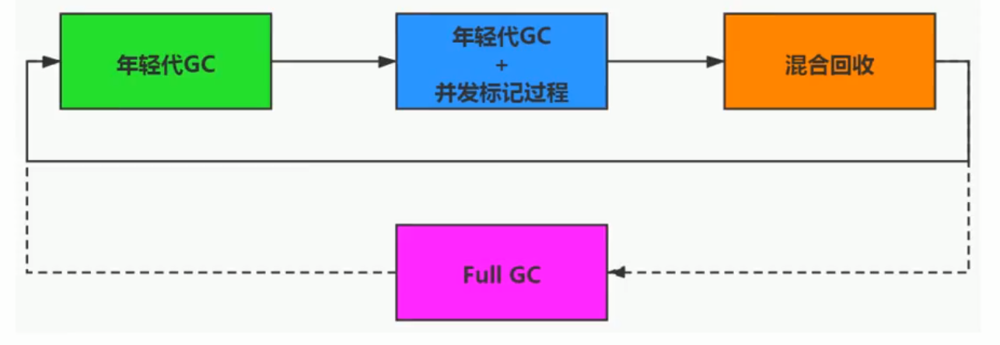
> 顺时针，young gc -> young gc + concurrent mark -> Mixed GC顺序，进行垃圾回收。
>
> 应用程序分配内存，当年轻代的Eden区用尽时开始年轻代回收过程；G1的年轻代收集阶段是一个并行的独占式收集器。在年轻代回收期，G1 GC暂停所有应用程序线程，
> 启动多线程执行年轻代回收。然后从年轻代区间移动存活对象到Survivor区间或者老年区间，也有可能是两个区间都会涉及。
> 
> 当堆内存使用达到一定值（默认45%）时，开始老年代并发标记过程。
> 
> 标记完成马上开始混合回收过程。对于一个混合回收器，G1 GC从老年区间移动存活对象到空闲区间，这些空闲区间也就成为了老年代的一部分。和年轻代不同，老年代的G1
> 回收器和其他GC不同，G1的老年代回收器不需要整个老年代被回收，一次只需要扫描/回收一小部分老年代的Region就可以了。同时，这个老年代Region是和年轻代一起被回收的。
> 
> 举个例子：一个Web服务器，Java进程最大堆内存为4G，每分钟响应15000个请求，每45秒会新分配大约2GB的内存。G1会每45秒钟进行一次年轻代回收，每31个小时
> 整个堆的使用率达到45%，会开始老年代并发标记过程，标记完成后开始四到五次的混合回收。
* G1回收器垃圾回收过程：Remembered Set
    * 一个对象被不同区域引用的问题
    * 一个Region不可能是孤立的，一个Region中的对象可能被其他任意Region中对象引用，判断对象存活时，是否需要扫描整个Java堆才能保证准确？
    * 在其他的分代收集器，也存在这一的问题（而G1更突出）
    * 回收新生代也不得不同时扫描老年代？
    * 这样的话会降低Minor GC的效率
    *
    * 解决办法：
        * 无论G1还是其他分代收集器，JVM都是使用Remembered Set来避免全局扫描：
        * 每个Region都有一个对应的Remembered Set：
        * 每次Reference类型数据写操作时，都会产生一个Write Barrier暂时中断操作
        * 然后检查将要写入的引用指向的对象是否和该Reference类型数据在不同的Region（其它收集器：检查老年代对象是否引用了新生代对象）
        * 如果不同，通过CardTable把相关引用信息记录到引用指向对象的所在Region对应的Remembered Set中
        * 当进行垃圾收集时，在GC根节点的枚举范围加入Remembered Set；就可以保证不进行全局扫描，也不会有遗漏。
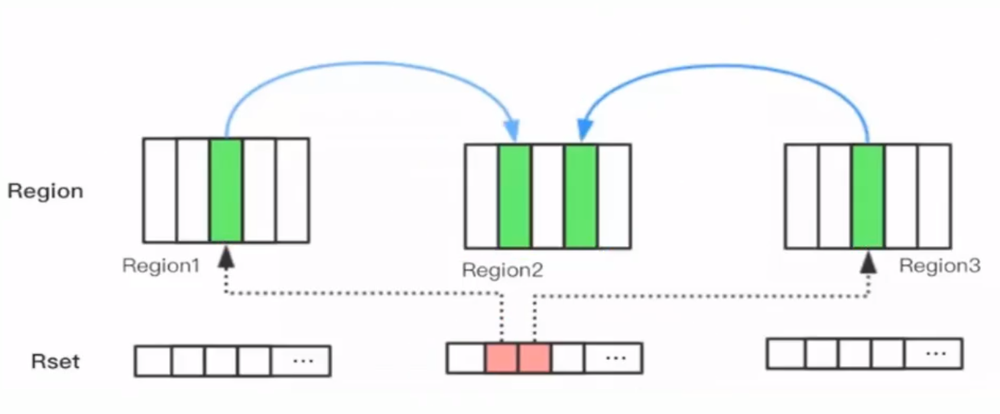
* G1回收过程：年轻代GC
> JVM启动时，G1先准备好Eden区，程序在运行过程中不断创建对象到Eden区，当Eden空间耗尽时，G1会启动一次年轻代垃圾回收过程。
> 
> 年轻代垃圾回收只会回收Eden区和Survivor区。
> 
> YGC时，首先G1停止应用程序的执行（Stop-The-World），G1创建回收集（Collection Set），回收集是指需要被回收的内存分段的集合，年轻代回收的过程包含年轻代Eden区
> 和Survivor区所有的内存分段。

* G1回收过程一：年轻代GC:
    * 第一阶段，扫描根。根是指static变量指向的对象，正在执行的方法调用链条上的局部变量等。根引用连同RSet记录的外部引用作为扫描存活对象的入口。
    * 第二阶段，更新RSet。处理dirty card queue（见备注）中的card，更新RSet。此阶段完成后，RSet可以准确的反映老年代对所在的内存分段中对象的引用。
    > 对于应用程序的引用赋值语句object.field=object，JVM会在之前和之后执行特殊的操作以在dirty card queue中入队一个保持了对象引用信息的card。
    > 在年轻代回收的时候，G1会对Dirty Card Queue中所有的card进行处理，以更新RSet，保证RSet实时准确的反映引用关系。 
    >  
    >  那为什么不在引用赋值语句处直接更新RSet呢？这是为了性能的需要，RSet的处理需要线程同步，开销会很大，使用队列性能会好很多。
    * 第三阶段，处理RSet。识别被老年代对象指向的Eden中的对象，这些被执行的Eden中的对象被认为是存活的对象。
    * 第四阶段，复制对象。此阶段，对象树被变量，Eden区内存段中存活的对象会被复制到Survivor区中空的内存分段，Survivor区内存段中存活的对象如果年龄未
    达阈值，年龄会加1，达到阈值会被复制到Old区中空的内存分段。如果Survivor空间不够，Eden空间的部分数据会直接晋升到老年代空间。
    * 第五阶段，处理引用。处理Soft、Weak，Phantom，Final,JNI Weak等引用。最终Eden空间的数据为空，GC停止工作，而目标内存中的对象都是连续存储的，没有碎片，
    所以复制过程可以达到内存整理的效果，减少碎片。
* G 回收过程二：并发标记过程（主要针对老年代）
    * 1.初始标记阶段：标记从根节点直接可达的对象。这个阶段是STW的，并且会触发一次年轻代GC。
    * 2.跟区域扫描（Root Region Scanning）：G1 GC扫描Survivor区直接可达的老年代区域对象，并标记被引用的对象。这一过程必须在young GC之前完成。
    * 3.并发标记（Concurrent Marking）：在整个堆中进行并发标记（和应用程序并发执行），此过程可能被young GC中断。在并发标记阶段，若发现区域对象中的
    所有对象都是垃圾，那这个区域会被立即回收。同时，并发标记过程中，会计算每个区域的对象活性（区域中存活对象的比例）。
    * 4.再次标记（Remark）：由于应用程序持续进行，需要修正上一次的标记结果。是STW的。G1中采用了比CMS更快的初始快照算法：snapshot-at-the-beginning(SATB)。
    * 5.独占清理（cleanup,STW）：计算各个区域的存活对象和GC回收比例，并进行排序，识别可以混合回收的区域。为下阶段做铺垫。是STW的。
        * 这个阶段并不会实际上去做垃圾的收集。
    * 6.并发清理阶段：识别并清理完全空闲的区域。
* G1回收过程三：混合回收
    * 并发标记结束以后，老年代中百分百为垃圾的内存分段被回收了，部分为垃圾的内存分段被计算了出来。默认情况下，这些老年代的内存分段会分8次（可以通过-XX:G1MixedGCCountTarget设置）被回收。
    * 混合回收的回收集（Collection Set）包括八分之一的老年代内存分段，Eden区内存分段，Survivor区内存分段。混合回收的算法和年轻代回收的算法完全一样，
    只是回收集多了老年代的内存分段。具体过程请参考上面的年轻代回收过程。
    * 由于老年代中的内存分段默认分8次回收，G1会优先回收垃圾过的内存分段。垃圾占内存分段比例越高的，越会被先回收。并且有一个阈值决定内存分段是否被回收，-XX:G1MixedGCLiveThresholdPercent，默认为65%，意思是
    垃圾占内存分段比例要达到65%才会被回收。如果垃圾占比太低，意味着存活的对象占比高，在复制的时候会花费更多的时间。
    * 混合回收并不一定要进行8次。有一个阈值-XX:G1HeapWastePercent，默认值为10%，意思是允许整个堆内存中有10%的空间被浪费，意味着如果发现可以回收的垃圾占
    堆内存的比例低于10%，则不再进行混合回收。因为GC会花费很多的时间但是回收到的内存却很少。
> 当越来越多的对象晋升到老年代old ragion时，为了避免堆内存被耗尽，虚拟机会触发一个混合的垃圾收集器，即Mixed GC，该算法并不是一个Old GC，处理回收整个
> Young Ragion。这里需要注意： 是一部分老年代，而不是全部老年代。可以选择那些Old Region进行收集，从而可以对垃圾回收的耗时时间进行控制。也需要注意的是Mixed GC并不是Full GC。
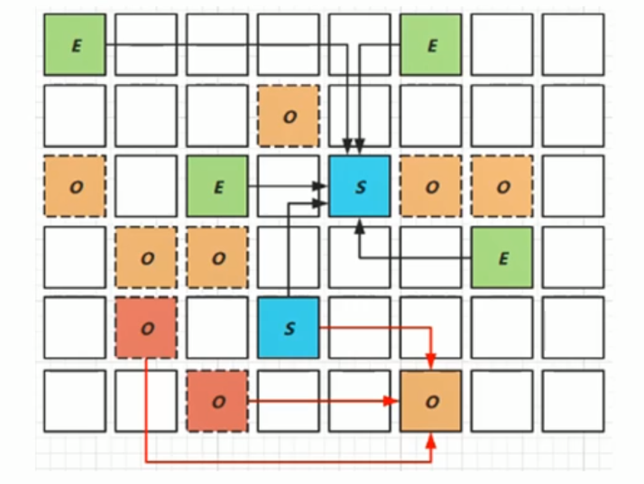
* G1回收可选的过程四：Full GC
    * 导致G1 Full GC的原因可能有两个：
        * 1.Evavuation的时候没有足够的to-space来存放晋升的对象。
        * 2.并发处理过程完成之前空间耗尽。
> G1的初衷就是要避免Full GC的出现。但是如果上述方式不能正常工作，G1会停止应用程序的执行（Stop-The-World），使用单线程的内存回收算法进行垃圾回收，性能会非常差，应用程序停顿时间会很长。
> 
> 要避免Full GC的发生，一旦发生需要进行调整。什么时候会发生Full GC呢？比如堆内存大小，当G1在复制存活对象的时候没有空的内存分段可用，则会回退到full gc,这种情况可用通过增大内存解决。
* G1回收过程：补充
> 从Oracle官网透露处理的信息可获知，回收阶段（Evacuation）其实奔也有想过设计成与用户程序一起并发执行，但这件事情做起来比较复杂，考虑到G1只是回收一部分
> Region ,停顿时间时用户可控的，所以并不迫切去实现，而选择把这个特性放到了G1之后出现的低延迟垃圾收集器（即ZGC）中。另外，还考虑到G1不是仅仅面向低延迟，停顿用户
> 线程能够最大幅度提高垃圾收集效率，为了保证吞吐量所以才选择了完全暂停用户线程的实现方案。
* G1回收器优化建议
    * 年轻代大小
        * 避免使用-Xmn或-XX:NewRation等相关选项显式设置年轻代大小
        * 固定年轻代的大小会覆盖暂停时间目标
    * 暂停时间目标不要太过严苛
        * G1 GC的吞吐量目标是90%的应用程序时间和10%的垃圾回收时间
        * 评估G1 GC的吞吐量时，暂停时间目标不要太严苛。目标太过严苛表示你原因承受更多的垃圾回收开销，而这些会直接影响到吞吐量。

* 垃圾回收器总结
> 截止JDK 1.8，一共有7款不同的垃圾收集器。每一款不同的垃圾收集器都有不同的特点，在具体使用的时候，需要根据具体的情况选用不同的垃圾收集器。
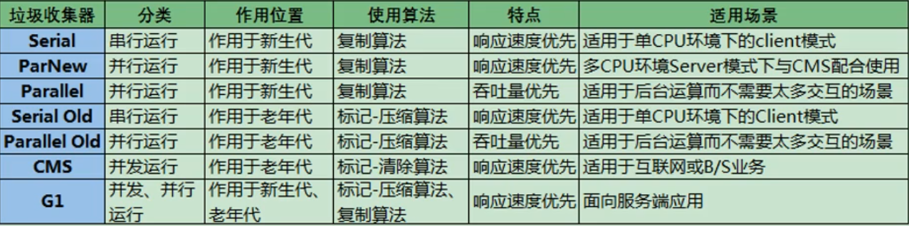


> 不同厂商、不同版本的虚拟机实现差别很大。HotSpot虚拟机在JDK7/8后所有收集器及组合（连续），如下图：（更新到了JDK14）
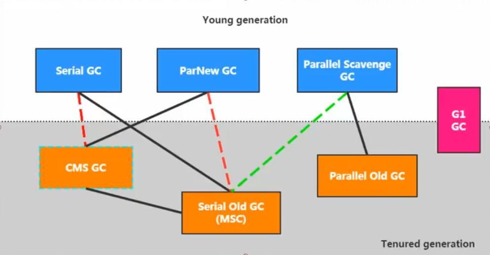
> 1.两个收集器间有连续，表明它们可以搭配使用：
> Serial/Serial Old、Serial/CMS、ParNew/Serial Old、ParNew/CMS、Parallel Scavenge/Serial Old、Parallel Scavenge/Parallel Old、G1；
> 
> 2.其中Serial Old作为CMS出现“Concurrent Mode Failure”失败的后备预案。
> 
> 3. （红色虚线）由于维护和兼容性测试的成本，在JDK 8时将Serial+CMS、ParNew+Serial Old这两个组合声明为Deprecated（JEP 173），
> 并在JDK 9中晚期取消了这些组合的支持（JEP214），即：移除。
> 
> 4.（绿色虚线）JDK 14中：弃用ParallelScavenge和SerialOld GC组合（JEP 366）
> 
> 5.（青色虚线）JDK 14中：删除CMS垃圾收集器（JEP 363）
* 怎么选择垃圾回收器：
    * Java垃圾收集器的配置对于JVM优化来说是一个很重要的选择，选择合适的垃圾收集器可以让JVM的性能有一个很大的提升。
    * 怎么选择垃圾收集器？
        * 1.优先调整堆的大小让JVM自适应完成。
        * 2.如果内存小于100M，使用串行收集器。
        * 3.如果是单核、单机程序，并且没有停顿时间的要求，串行收集器。
        * 4. 如果是多CPU、需要高吞吐量、允许停顿时间超过1秒，选择并行或者JVM自己选择          
        * 5.如果是多CPU、追求低停顿时间，需快速响应（比如延迟不能超过1秒，如互联网应用），使用并发收集器。
           官方推荐G1，性能高。现在互联网的项目，基本都是使用G1。 
> 最后性需要明确一个观点：
>   1. 没有最好的收集器，更没有万能的收集；
>   2.调优永远是针对特定场景、特定需求，不存在一劳永逸的收集。

### GC日志分析
* GC日志分析：通过阅读GC日志，我们可以了解Java虚拟机内存分配与回收策略。
* 内存分配与垃圾回收的参数列表
    * -XX:+PrintGC              输出GC日志。类似：-verbose:gc
    * -XX:+PrintGCDetails       输出GC的详细日志
    * -XX：+PrintGCTimeStamps    输出GC的时间戳（以基准时间的形式）
    * -XX:+PrintGCDateStamps    输出GC的时间戳（以日期的形式，如2013-05-04T21:53:599.234+0800）
    * -XX:+PrintHeapAtGC        在进行GC的前后打印出堆的信息
    * -Xloggc:../logs/gc.log    日志文件的输出路径
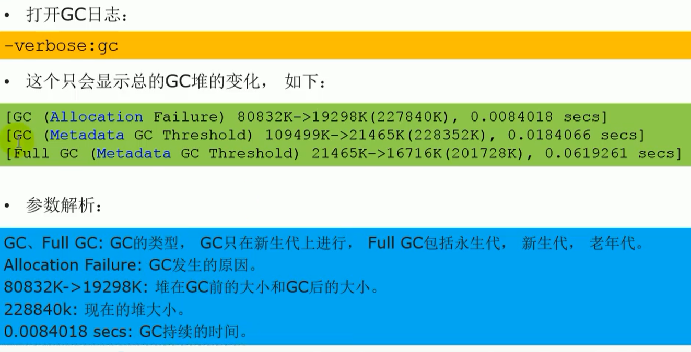

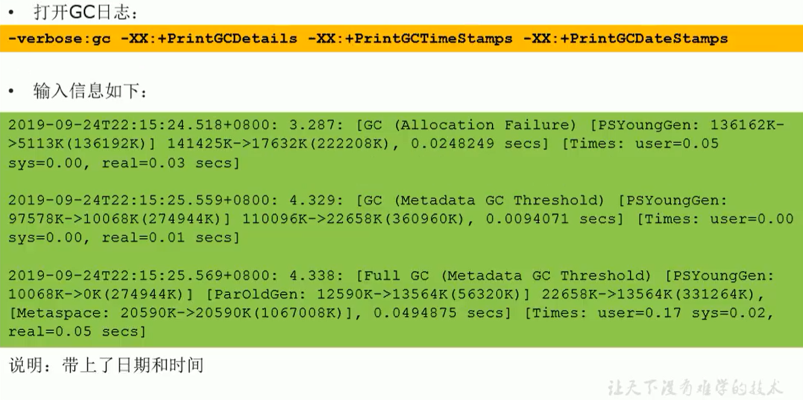
* 日志补充说明：
    * "[GC"和"[Full GC"说明了这次垃圾收集的停顿类型，如果有"Full"则说明GC发生了“Stop The World”
    * 使用serial收集器在新生代的名字是Default New Generation，因此显示的是"[DefNew"
    * 使用ParNew收集器在新生代的名字会变成"[parNew",意思是"Parallel New Generation"
    * 使用Parallel Scavenge收集在新生代的名字是“[PSYoungGen”
    * 老年代的收集和新生代道理一样，名字也是收集器决定的
    * 使用G1收集的话，会显示“garbage-first heap”
    * Allocation Failure：表明本次引起GC的原因是因为在年轻代中没有足够的空间能够存储新的数据了。
    * [PSYoungGen: 5986k->696K(8704K) 5986K->704K(9216K)]：中括号内：GC回收前年轻代大小，回收后大小，（年轻代总大小）
    括号外：GC回收前年轻代和老年代大小，回收后大小，（年轻代和老年代总大小）
    * user代表用户态回收耗时，sys内核态回收耗时，rea实际耗时。由于多核的原因，时间总和可能会超过real时间
    * 堆空间占用情况说明：
    
    * Full GC:
    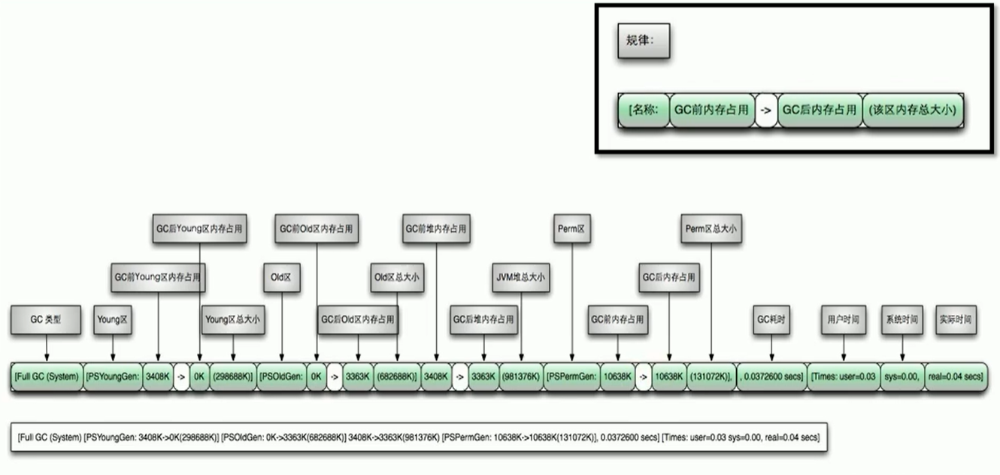
    * 可以使用一些工具去分析这些gc日志（-Xloggc:../logs/gc.log    日志文件的输出路径）：常用的日志分析工具有：
    GCViewer、GCEasy、GCHisto、GCLogViewer、Hpjmeter、garbagecat等。

* 垃圾回收器的新发展：
    * GC仍然处于飞速发展之中，目前的默认选项G1 GC在不断地进行改进，很多我们原来认为的缺点，例如串行的Full GC、Card Table扫描的
    低效等，都已经被大幅改进，例如，JDK 10以后，Full GC已经是并行运行，在很多场景下，其表现还优于Parallel GC的并行Full GC实现。
    * 即使是Serial GC,虽然比较古老，但是简单的设计和实现未必就是过时的，它本身的开销，不管是GC相关数据结构的开销，还是线程的开销，
    都是非常小，所以随着云计算的兴起，在Serverless等新的应用场景下，Serial GC找到了新的舞台。
    * 比较不幸的是CMS GC，因为其算法的理论缺陷等原因，虽然现在还有非常大的用户群体，但在JDK 9中已经被标记为废弃，并在JDK14版本中移除。
    * JDK11新特性：
    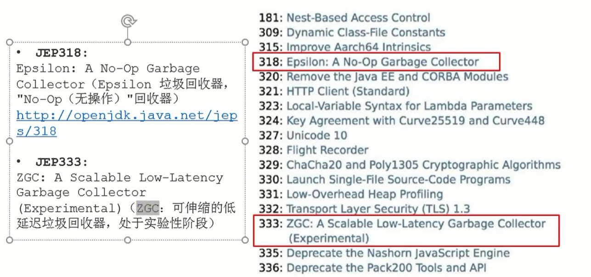
    * Open JDK12的Shenandoah GC
        * 现在G1回收器已成为默认回收器好几年了。
        * 我们还看到了引入了两个新的收集器：ZGC(JDK11出现)和Shenandoah（Open JDK12）。
            * 主打特点：低停顿时间
    * Open JDK12的Shenandoah GC
    > Open JDK12的Shenandoah GC：低停顿时间的GC（实验性）
    > 
    > Shenandoah，无疑是众多GC中最孤立的一个。是第一款不由Oracle公司团队领导开发的HotSpot垃圾收集器。不可避免的收到官方的排挤。
    > 比如号称Open JDK和OracleJDK没有区别的Oracle公司仍拒绝在OracleJDK12中支持Shenandoah。
    > 
    > Shenandoah垃圾回收器最初由RedHat进行的一项垃圾收集器研究项目Pauseless GC的实现，旨在针对JVM上的回收实现低停顿的需求。在2014
    > 年贡献给OpenJDK。
    > 
    > Red Hat研发Shenandoah团队对外宣称，Shenandoah垃圾回收器的暂停时间与堆大小无关，这意味着无论将堆设置为200MB还是200GB,
    > 99.9%的目标都可以把垃圾收集的停顿时间限制在十毫秒以内。不过实际使用性能将取决于实际工作堆的大小和工作负载。
    
    > * 这是RedHat在2016年发表的论文数据，测试内容是使用ES对200GB的维基百科数据进行索引。从结果看：
    >    * 停顿时间比其他几款收集器确实有了质的飞跃，但也未实现最大停顿时间控制在十毫秒以内的目标。
    >    * 而吞吐量方面出现了明显的下降，总运行时间是所有测试收集器里最长的。
    > * 总结：
    >   * Shenandoah GC的弱项：高运行负担下的吞吐量下降。
    >   * Shenandoah GC的强项：低延迟时间。
    > 
    > Shenandoah GC的工作过程大致分为九个阶段，这里就不再赘述。在之前Java12新特性视频里有过介绍。
    > 【Java12新特性地址】
    > http://www.atguigu.com/download_detail.shtml?v=222
    > 或 https://www.bilibili.com/video/BV1jJ411M7kQ?from=search&seid=123390699673726242866

* 革命性的ZGC：官方对垃圾回收的介绍：https://docs.oracle.com/en/java/javase/12/gctuning/
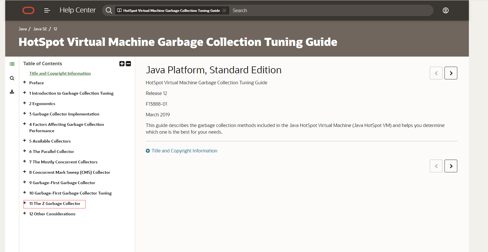
> ZGC与Shenandoah目标高度相似，在尽可能对吞吐量影响不大的前提下，实现在任意堆内存大小下都可以把垃圾收集的停顿时间限制在十毫秒以内的低延迟。
> 
> 《深入理解Java虚拟机》一书中这样定义ZGC:ZGC收集器时一款基于Region内存布局的，（暂时）不设分代的，使用了读屏障、染色指针和内存多重映射等技术来实现可并发标记-压缩算法的，
> 以低延迟为首要目标的一款垃圾收集器。
> 
> ZGC的工作过程可以分为4个阶段：并发标记——并发预备重分配——并发重分配——并发映射等。
> 
> ZGC几乎在所有地方并发执行的，除了初始标记的是STW的。所有停顿时间几乎就耗费在初始标记上，这部分的实际时间非常少的。
> 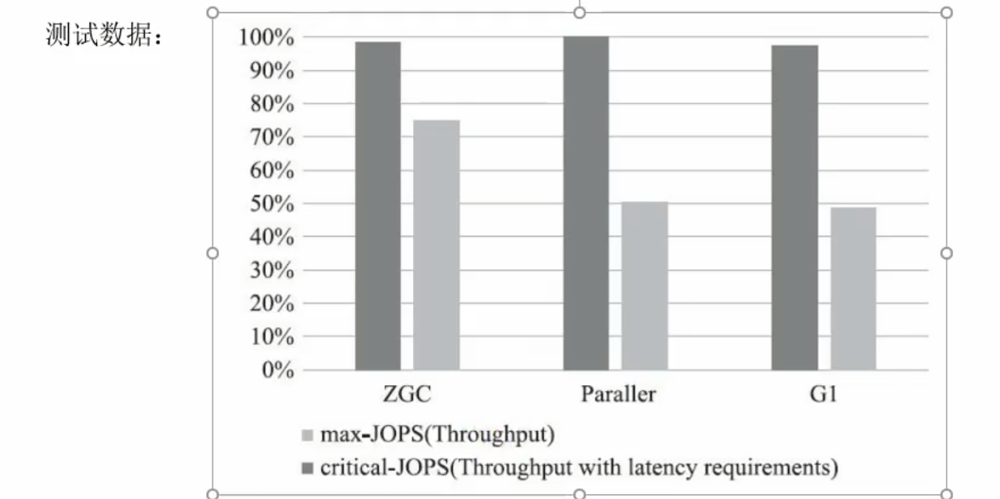
> 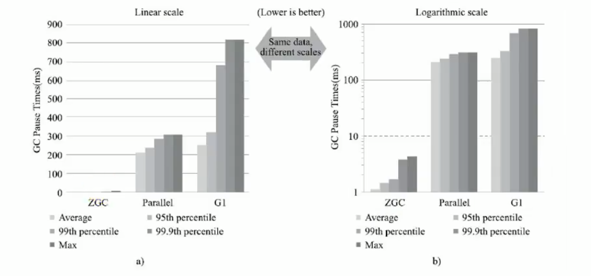
> 在ZGC的强项停顿时间测试上，它毫不留情的将Parallel、G1拉开了两个数量级的差距。无论平均停顿、95%停顿、99%停顿、99.9%停顿，还是最大停顿时间，ZGC都能
> 好不费力控制在10毫秒以内。
> 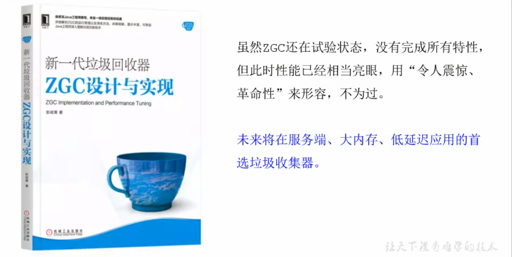
> JEP 364：ZGC应用在macOS上
> JEP 365: ZGC应用在Windows上
> * JDK14之前，ZGC仅Linux才支持。
> * 尽管许多实用ZGC的用户都使用类Linux的环境，但在Windows和maxOS上，人们也需要ZGC进行开发部署和测试。许多桌面应用也可以从ZGC中受益。因此，ZGC
> 特性被移至到了Windows和macOS上。
> * 现在mac或Windows上也能使用ZGC了，示例如下：
>   * -XX:+UnlockExperimentalVMOptions -XX:+UseZGC

* 其他垃圾回收器：AliGC。  
    * AliGC是阿里巴巴JVM团队基于G1算法，面向大堆（LargeHeap）应用场景。指定场景下的对比：
    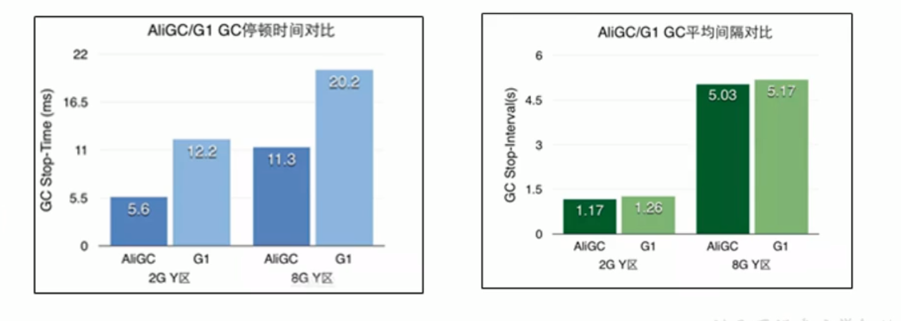
    * Zing：https://www.infoq.com/articles/azul_gc_in_detail

# JVM 中篇 CLASS结构
## 概述


### 字节码文件的跨平台性
1. Java语言：跨平台语言
* 当Java源代码成功编译成字节码后，如果想在不同的平台上面运行，则无须再次编译
* 这个又是不再那么吸引人了。Python、PHP、Perl、Ruby、Lisp等有强大的解释器。
* 跨平台似乎已经快称为一门语言必选的特性。

2. Java 虚拟机：跨语言的平台
> Java 虚拟机不和包括Java在内的任何语言绑定，它只与“Class文件”这种特定的二进制文件格式所关联。    无论使用何种语言进行软件开发，只要能将源文件
> 编译为正确的Class文件，那么这种语言就可以在Java虚拟机上执行。可以说，统一而强大的Class文件结构，就是Java虚拟机的基石、桥梁。
> 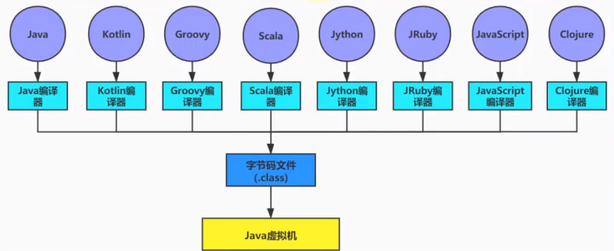
* Java虚拟机规范：https://docs.oracle.com/javase/specs/index.html
* 所有的JVM全部遵守Java虚拟机规范，也就是说所有的JVM环境都是一样的，这样一来字节码文件可以在各种JVM上运行。

3. 想要让一个Java程序正确地运行在JVM中，Java源码就必须要被编译为符号JVM规范的字节码文件。
* 前端编译器的主要任务是负责将符合Java语法规范的Java代码转换为符号JVM规定的字节码文件。
* javac是一种能将Java源码编译为字节码的前端编译器。
* Javac编译器在将Java源码编译为一个有效的字节码文件过程中经历了4个步骤，分别是词法解析、语法解析、语义解析以及生成字码。

Oracle的JDK软件包括两部分内容：
    * 一部分是将Java源代码编译成Java虚拟机的指令集的编译器
    * 另一部分是用于实现Java虚拟机的运行时环境。    





https://www.bilibili.com/video/BV1PJ411n7xZ?p=206&spm_id_from=pageDriver

### OutOfMemory举例
* OutOfMemoryError：Java heap space。 堆空间占满。
* OutOfMemoryError：操作系统内存占满。
* OutOfMemoryError：堆外空间占满。
* OutOfMemoryError：栈空间占满。




















