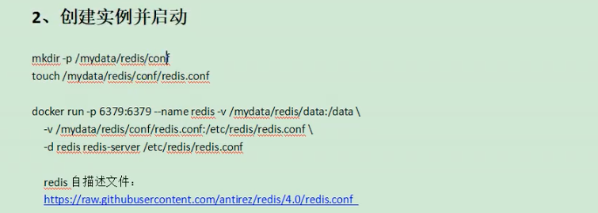
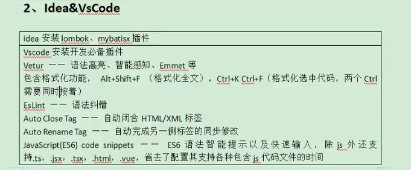
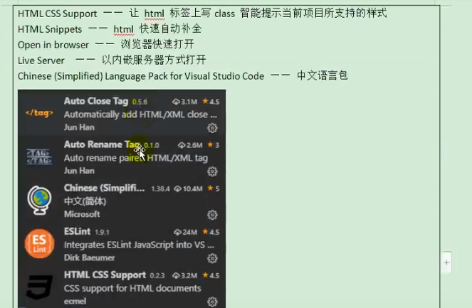
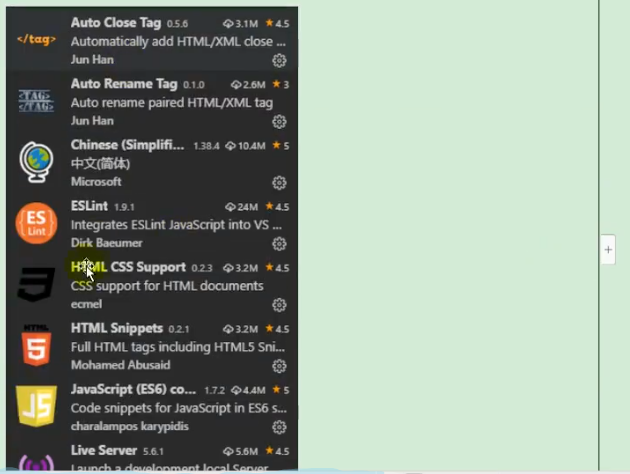
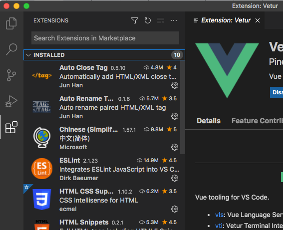
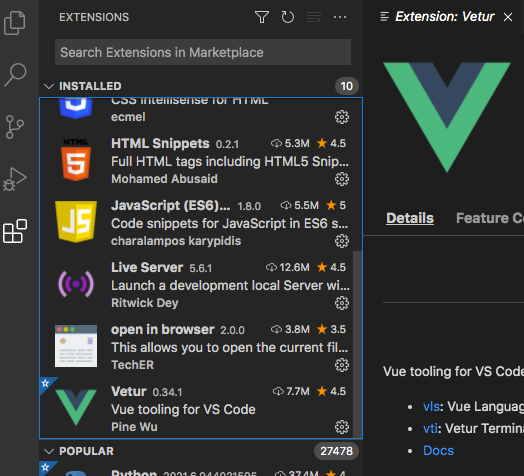
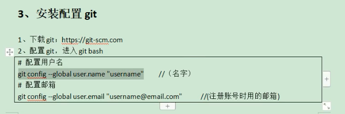
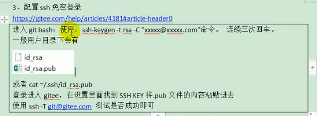
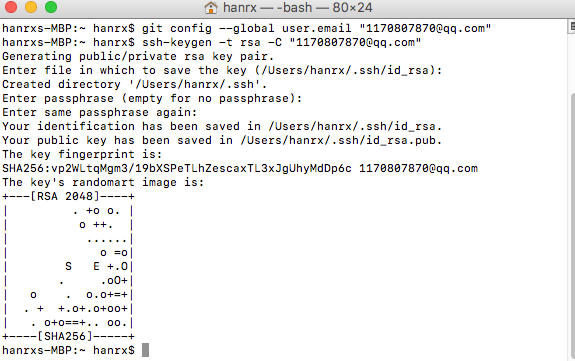
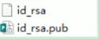

# 安装Docker
虚拟化容器技术。Docker基于镜像，可以秒级启动各种容器。每一种容器都是一个完整的运行环境，容器之间互相隔离。

参考：https://docs.docker.com/engine/install/centos/

## 安装Docker MySQL
下载镜像文件
docker pull mysql:5.7

创建实例并启动
docker run -p 3306:3306 --name mysql\
-v /mydata/mysql/log:/mydata/mysql/log\
-v /mydata/mysql/data:/var/lib/mysql\
-v /mydata/mysql/conf:/etc/mysql\
-e MYSQL_ROOT_PASSWORD=root\
-d mysql:5.7

常用命令：
> docker images :查看有哪些镜像
> docker ps：查看有哪些容器
> doker exec -it 容器id|容器名字 /bin/bash ：进入容器 
> docker restart 容器名：重启容器
> 容器中安装vim：doker exec -it 容器id|容器名字 /bin/bash ：进入容器 》apt-get update 》apt-get install vim

MySQL配置：
vi /etc/mysql/my.cnf
[client]
default-character-set=utf8

[mysql]
default-character-set=utf8

[mysqlld]
init_connect='SET collation_connection = utf8_unicode_ci'
init_connect='SET NAMES utf8'
character-set-server=utf8
collation-server=utf_unicode_ci
skip-character-set-client-handshake
skip-name-resolve

## docker 安装Redis
下载镜像文件
docker pull redis

创建实例并启动
mkdir -p /mydata/redis/conf
touch /mydata/redis/conf/redis.conf

docker run -p 16379:6379 --name redis -v /mydata/redis/data:/data\
-v /mydata/redis/conf/redis.conf:/etc/redis/redis.conf\
-d redis redis-server /etc/redis/redis.conf

命令行连接docker：docker exec -it 镜像名|镜像ID redis-cli

配置Redis持久化：appendonly yes

配置参考
https://raw.githubusercontent.com/redis/redis/6.0/redis.conf

## 其他
Maven
JDK1.8
开发工具
idea
vscode

## git配置

安装配置git
> 1. 下载git：http://git-scm.com
> 2. 配置git,进入git bash
>   * 配置用户名：git config --global user.name "iafoot" //名字
>   * 配置邮箱：git config --global user.email "1170807870@qq.com" //注册账号时用的邮箱
> 3. 配置ssh免密登录
> https://gitee.com/help/articles/4181#article-header0
> 进入git bash；使用：ssh-keygen -t rsa -C "1170807870@qq.com"  命令。连续三次回车。
> 
> 一般用户下会有
> 或者 cat ~/.ssh/id_rsa.pub
> 登录进入gitee，在设置里面找的SSH KEY将.pub文件的内容拷贝进去
> 使用ssh -T git@gitee.com测试是否成功即可
> 

## 从gitee初始化一个项目

