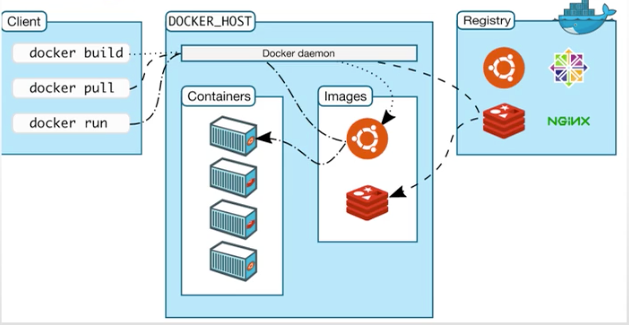
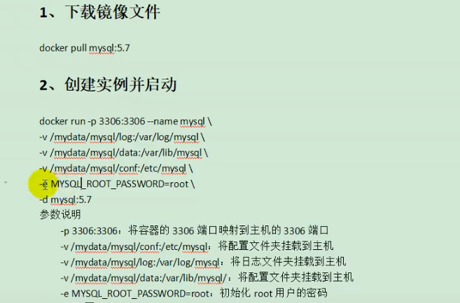

# 安装Docker
虚拟化容器技术。Docker基于镜像，可以秒级启动各种容器。每一种容器都是一个完整的运行环境，容器之间互相隔离。

参考：https://docs.docker.com/engine/install/centos/

## 安装Docker MySQL
下载镜像文件
docker pull mysql:5.7

创建实例并启动
docker run -p 3306:3306 --name mysql\
-v /mydata/mysql/log:/mydata/mysql/log\
-v /mydata/mysql/data:/var/lib/mysql\
-v /mydata/mysql/conf:/etc/mysql\
-e MYSQL_ROOT_PASSWORD=root\
-d mysql:5.7

常用命令：
> docker images :查看有哪些镜像
> docker ps：查看有哪些容器
> doker exec -it 容器id|容器名字 /bin/bash ：进入容器 
> docker restart 容器名：重启容器
> 容器中安装vim：doker exec -it 容器id|容器名字 /bin/bash ：进入容器 》apt-get update 》apt-get install vim

MySQL配置：
vi /etc/mysql/my.cnf
[client]
default-character-set=utf8

[mysql]
default-character-set=utf8

[mysqlld]
init_connect='SET collation_connection = utf8_unicode_ci'
init_connect='SET NAMES utf8'
character-set-server=utf8
collation-server=utf_unicode_ci
skip-character-set-client-handshake
skip-name-resolve

