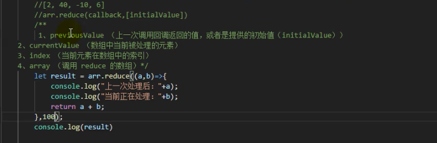

# 安装Docker
虚拟化容器技术。Docker基于镜像，可以秒级启动各种容器。每一种容器都是一个完整的运行环境，容器之间互相隔离。


参考：https://docs.docker.com/engine/install/centos/

## 安装Docker MySQL
下载镜像文件
docker pull mysql:5.7

创建实例并启动
docker run -p 3306:3306 --name mysql\
-v /mydata/mysql/log:/mydata/mysql/log\
-v /mydata/mysql/data:/var/lib/mysql\
-v /mydata/mysql/conf:/etc/mysql\
-e MYSQL_ROOT_PASSWORD=root\
-d mysql:5.7


常用命令：
> docker images :查看有哪些镜像
> docker ps：查看有哪些容器
> doker exec -it 容器id|容器名字 /bin/bash ：进入容器 
> docker restart 容器名：重启容器
> 容器中安装vim：doker exec -it 容器id|容器名字 /bin/bash ：进入容器 》apt-get update 》apt-get install vim

MySQL配置：
vi /etc/mysql/my.cnf
[client]
default-character-set=utf8

[mysql]
default-character-set=utf8

[mysqlld]
init_connect='SET collation_connection = utf8_unicode_ci'
init_connect='SET NAMES utf8'
character-set-server=utf8
collation-server=utf_unicode_ci
skip-character-set-client-handshake
skip-name-resolve

## docker 安装Redis
下载镜像文件
docker pull redis

创建实例并启动
mkdir -p /mydata/redis/conf
touch /mydata/redis/conf/redis.conf

docker run -p 16379:6379 --name redis -v /mydata/redis/data:/data\
-v /mydata/redis/conf/redis.conf:/etc/redis/redis.conf\
-d redis redis-server /etc/redis/redis.conf

命令行连接docker：docker exec -it 镜像名|镜像ID redis-cli


配置Redis持久化：appendonly yes


让docker自动启动
mysql：sudo docker update mysql --restart=always

配置参考
https://raw.githubusercontent.com/redis/redis/6.0/redis.conf

## 其他
Maven
JDK1.8
开发工具
idea
vscode


## git配置


安装配置git
> 1. 下载git：http://git-scm.com
> 2. 配置git,进入git bash
>   * 配置用户名：git config --global user.name "iafoot" //名字
>   * 配置邮箱：git config --global user.email "1170807870@qq.com" //注册账号时用的邮箱
> 3. 配置ssh免密登录
> https://gitee.com/help/articles/4181#article-header0
> 进入git bash；使用：ssh-keygen -t rsa -C "1170807870@qq.com"  命令。连续三次回车。
> 
> 一般用户下会有
> 或者 cat ~/.ssh/id_rsa.pub
> 登录进入gitee，在设置里面找的SSH KEY将.pub文件的内容拷贝进去
> 使用ssh -T git@gitee.com测试是否成功即可
> 

## 从gitee初始化一个项目


## 使用脚手架
https://gitee.com/renrenio


依赖工程： 
  * renren-generator：人人开源项目的代码生成器
  * renren-fast: 是一个轻量级的，前后端分离的Java快速开发平台，能快速开发项目并交付
  * renren-fast-vue基于vue、element-ui构建开发，实现renren-fast后台管理前端功能，提供一套更优的前端解决方案

## 安装node.js 
https://nodejs.org/zh-cn/

前端开发，少不了node.js；Node.js是一个基于Chrome V8引擎的JavaScript运行环境。http://nodejs.cn/api/
我们暂时只关注node.js的npm功能就行。

NPM是随同NodeJS一起安装的包管理工具，JavaScript-NPM，类似 Java-Maven；

1.官网下载安装nodes.js,并使用node -v检查版本
2.配置npm使用淘宝镜像。
> npm config set registry http://registry.npm.taobao.org/

前端项目第一次运行控制台使用命令：npm install。相当于下载依赖组件。依赖package.json配置下载，下载完后在node_modules显示。
前端项目运行：npm run dev

## 微服务-注册中、配置中心、网关


结合SpringCloud Alibaba 我们最终的技术到方案：
> SpringCloud Alibaba- Nacos:注册中心（服务发现/注册）
> SpringCloud Alibaba- Nacos：配置中（动态配置管理）
> SpringCloud - Ribbon：负载均衡
> SpringCloud - Feign：声明式HTTP客户端（调用远程服务）
> SpringCloud Alibaba- Sentinel：服务容错（限流、降级、熔断）
> SpringCloud - Gateway：API网格（webflux编程模式）
> SpringCLoud - Sleuth：调用链监控
> SpringCloudAlibaba - Seata：原Fescar，即分布式事务解决方案。


# Feign
Feign是一个声明式的HTTP客户端，它的目的就是让远程调用更加简单。Feign提供了HTTP请求的模板，通过编写简单的接口和插入
注解，就可以定义好HTTP请求的参数、格式、地址等信息。

Feign整合了Ribbon(负载均衡)和Hystrix（服务熔断），可以让我们不再需要显式地使用这两个组件。

SpringCloudFeign在NetflixFeign的基础上扩展了对SpringMVC注解的支持，在其实现下，我们只需创建一个借口并用注解的方式
来配置它，即可完成对服务提供方接口绑定。简化了SpringCloudRibbon自行封装服务调用客户端的开发量。

/**
* 1、想要远程调用别的服务
*  1）、要引入Open-feign
*  2）、编写一个接口，告诉SpringCloud这个接口需要调用远程服务 【列：CouponFeignService】
*      1、声明接口的每一个方法都是调用哪个远程服务的那个请求【列：CouponFeignService.memberCoupon】
*  3）、开启远程调用功能【列：@EnableFeignClients(basePackages = "com.iafoot.iafootmall.member.feign")】
   */


# Nacos 配置中心、注册中心
/**
* 1.如何使用Nacos作为配置中心统一管理配置
*  1）、引入依赖
*      <dependency>
*             <groupId>com.alibaba.cloud</groupId>
*             <artifactId>spring-cloud-starter-alibaba-nacos-config</artifactId>
*         </dependency>
*  2）、创建一个bootstrap.yml。配置关键的【spring.application.name】和【spring.cloud.nacos.config.server-addr】
*  spring:
*   application:
*     name: iafootmall-coupon
*   cloud:
*     nacos:
*       config:
*         server-addr: 192.168.20.19:8848
*         namespace: iafoot-mall
*         group: iafoot-mall
*         name: coupon
*         file-extension: yaml
*  3）、需要给配置中心添加相应配置。默认应用名.properties
*  @RefreshScope// 配置自动刷新配置
*
*  如果配置中心和当前应用的配置文件中都配置了相同的配置，优先使用配置中心的。
*
* 2. 细节
*  1）、命名空间：配置隔离。
*      默认：public(保留空间)；默认新增的所有配置都在public空间。
*      1、开发、测试、生产：利用命名空间来做环境隔离。
*      注意：在【bootstrap.yml】配置需要使用哪个命名空间下的配置。【例:spring:cloud:nacos:config:namespace: iafoot-mall】
*      2、每一个微服务之间互相隔离配置，每一个微服务都创建自己的命名空间，只加载自己命名空间下的所有配置。
*  2）、配置集：所有配置的集合
*  3）、配置集ID：类似配置文件名。
*      Data ID：类似文件名
*  4）、配置分组：
*      默认所有的配置集都属于：DEFAULT_GROUP
*  每个微服务创建自己的命名空间，使用配置分组区分环境，dev test prod
*
*  3、同时加载多个配置集
*      1）、微服务任何配置信息，任何配置文件都可以放在配置中心中。
*      2）、只需要在bootstrap.properties说明加载配置中心那些配置文件即可。
*      3）、以前SpringBoot任何方法从配置文件中获取值，都能使用。配置中心有的优先使用配置中心的。
*
*/


# Gateway
网关作为流量的入口，常用功能包括路由转发、权限校验、限流控制等。而springCloud gateWay作为SpringCloud官网
推出的第二代网关框架，取代了Zuul网关。
性能测试：Gateway、Zuul、Linkerd对比


# 前端技术
前后端技术栈类比


## ES6
ECMAScript6.0是JavaScript语言的下一代标准。

ECMAScript是浏览器脚本语言的规范，而JavaScript则是规范的具体实现。

### ES6新特性

#### let声明变量
```js
   //var 声明的变量往往会越域
   //let 声明的变量有严格局部作用域
   // {
   //     var a = 1;
   //     let b = 2;
   // }
   // console.log(a);//1
   // console.log(b);// ReferenceError：b is not defined
   
   // var 可以声明多次
   // let 只能声明一次
   // var m = 1
   // var m = 2
   // let n = 3 
   // let n = 4
   // console.log(m)// 2
   // console.log(n) // Identifier 'n' has already been declared
   
   
   //var 会变量提升
   // let 不存在变量提升
   // console.log(x); // undefined
   // var x = 10;
   // console.log(y); // Uncaught ReferenceError: Cannot access 'y' before initialization
   // let y = 20;
```


#### const声明变量（只读变量）
```js
  //begin const
      //1.声明之后不允许改变
      //2.一旦声明必须初始化，否则会保持
      const a = 1;
      a = 3;// 1、Uncaught TypeError: Assignment to constant variable.
      //end const
```
#### 解构表达式：
```js
<script>
        // //数组解构
        // let arr = [1,2,3];
        // // let a = arr[0];
        // // let b = arr[1];
        // // let c = arr[2];

        // let [a,b,c] = arr;

        // console.log(a,b,c);

        //对象结构
        const person = {
            name: "jack",
            age: 21,
            language:['java','js','css']
        }
        // const name = person.name;
        // const age = person.age;
        // const language = person.language;
        const {name,age,language} = person;
        //person中拿出name值付给abc
        // const {name:abc,age,language} = person;
        // console.log(abc,age,language);

        console.log(name,age,language);
    </script>
```
#### 字符串扩展
1）几个新的API
ES6为字符串扩展了几个新的API:
   * includes()：返回布尔值，表示是否找到了参数字符串。
   * startsWith()：返回布尔值，表示参数字符串是否在原字符串的头部。
   * endsWith()：返回布尔值，表示参数字符串是否在原字符串的尾部。
   

2）字符串模板
模板字符串相当于加强版的字符串，用反引号【`】，除了作为普通字符串，还可以用来定义多行字符串，还可以在字符串中加入变量和表达式。


#### 函数优化
1）函数参数默认值


2）不定参数
不定参数用来表示不确定参数个数，形如，...变量名，由...加上一个具体参数标识符组成。具名参数只能放在参数列表的最后，并且有且只有一个不定参数。


3）箭头函数
ES6中定义函数的简写方式


4）箭头结合表达式


#### 对象优化
1）、新增的API
ES6给Object拓展了许多新的方法，如：
* keys(obj)：获取对象的所有key形成的数组。
* values(obj)：获取对象的所有value形成的数组。
* entries(obj)：扩展对象的所有key和value形成的二维数组。格式：[[k1,v1],[k2,v2]]
* assign(dest,...src)：将多个src对象的值 拷贝到 dest中。（第一层为深拷贝，第二层为浅拷贝）


2）声明对象简写


3）对象的函数属性简写


4）对象拓展运算符
拓展运算符（...）用于取出参数对象所有可遍历属性然后拷贝到当前对象。


#### map和reduce



#### Promise


封装的方法


#### 模块化


### Babel
Babel是一个JavaScript编译器，我们可以使用es的最新语法编程，而不用担心浏览器兼容性问题。他会自动转化为浏览器兼容的代码。


# Vue
初始化环境：npm init -y
安装依赖：$ npm install vue

浏览器安装插件：Vue-Devtools--master

Visual安装插件


## 简单示例：
```js
<!DOCTYPE html>
<html lang="en">
<head>
    <meta charset="UTF-8">
    <meta http-equiv="X-UA-Compatible" content="IE=edge">
    <meta name="viewport" content="width=device-width, initial-scale=1.0">
    <title>Document</title>
</head>
<body>
    <div id="app"> // 2、v-model 双向绑定
        <input type="text" v-model="num">
        <button v-on:click="num++"> 点赞</button>
        <button v-on:click="cancle">取消</button>
        <h1>{{name}}, 非常帅，有{{num}}个人为他点赞</h1>
    </div>

    <script src="./dist/vue.js"></script>
    //1 声明式渲染
    <script>
        let vm = new Vue({
            el:"#app",// 绑定元素
            data:{//封装数据
                name:"张三",
                num:1
            },
            methods:{//封装方法
                cancle(){
                    this.num -- ;
                }
            }
        });
        // 2、双向绑定，模型变化，视图变化。反之亦然。

        // 3、事件处理 参见点赞

        //步骤
        //1、创建vue实例，关联页面的模板，将字节的数据（date）渲染到关联的模板，响应式的
        //2、指令来简化对dom的一些操作。
        //3、声明方法来做更复杂的操作。methods里面可以封装方法。


    </script>


</body>
</html>
```
## 指令
1、v-test、v-html.html


