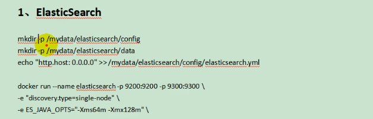
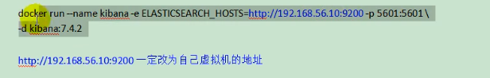
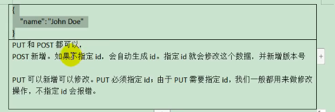
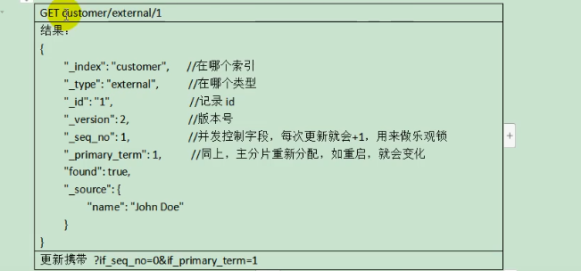
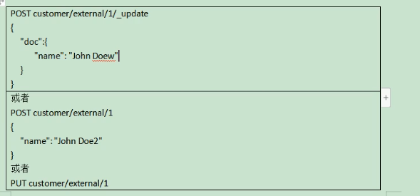
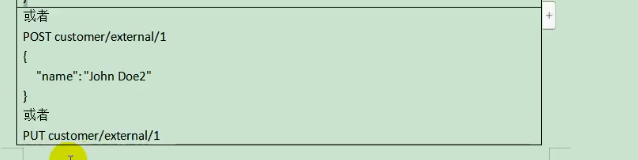
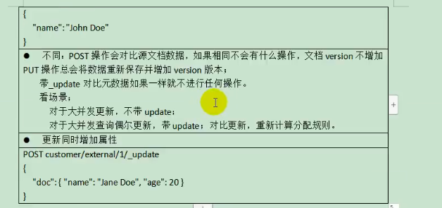
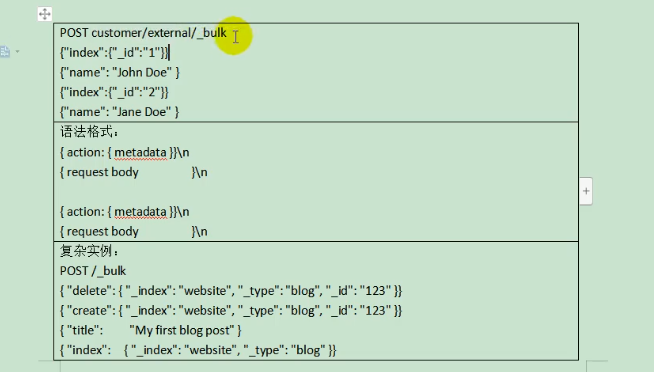
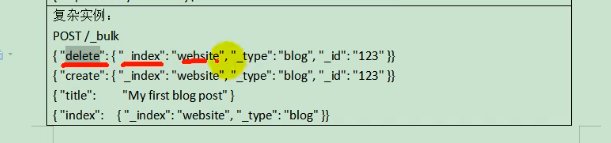

# Docker 安装
## 1、下载镜像文件
docker pull elasticsearch:7.4.2 ：存储和检索数据
docker pull kibana:7.4.2 : 可视化检索数据

## 2、创建实例

## 3、Kibana

# 初步检索
## 1、_cat

## 2、索引一个文档（保持）

## 3、查询文档

## 4、更新文档

## 5、删除文档&索引

## 6、bulk批量API

