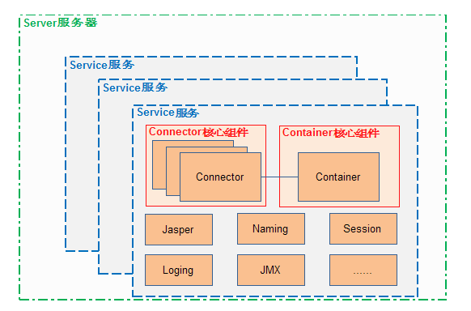

# Tomcat 

## 总体结构

## 参考：
> https://developer.ibm.com/zh/articles/j-lo-tomcat1/

# Docker Compose入门学习

## 参考：
> http://www.moguit.cn/#/info?blogOid=568

# Java诊断工具

## Arthas Alibaba开源的Java诊断工具
* 当你遇到以下类似问题而束手无策时，Arthas可以帮助你解决：
> 1. 这个类从哪个 jar 包加载的？为什么会报各种类相关的 Exception？
> 2. 我改的代码为什么没有执行到？难道是我没 commit？分支搞错了？
> 3. 遇到问题无法在线上 debug，难道只能通过加日志再重新发布吗？
> 4. 线上遇到某个用户的数据处理有问题，但线上同样无法 debug，线下无法重现！
> 5. 是否有一个全局视角来查看系统的运行状况？
> 6. 有什么办法可以监控到JVM的实时运行状态？
> 7. 怎么快速定位应用的热点，生成火焰图？

### 参考 https://arthas.aliyun.com/doc/

