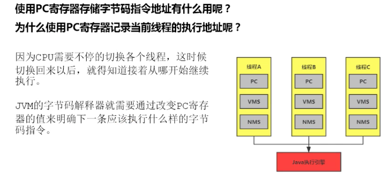
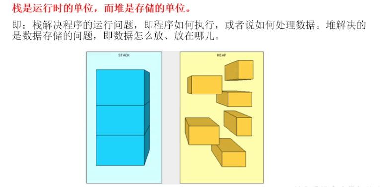

# Tomcat 

## 总体结构

## 参考：
> https://developer.ibm.com/zh/articles/j-lo-tomcat1/

# Docker Compose入门学习

## 参考：
> http://www.moguit.cn/#/info?blogOid=568

# Java诊断工具

## Arthas Alibaba开源的Java诊断工具
* 当你遇到以下类似问题而束手无策时，Arthas可以帮助你解决：
> 1. 这个类从哪个 jar 包加载的？为什么会报各种类相关的 Exception？
> 2. 我改的代码为什么没有执行到？难道是我没 commit？分支搞错了？
> 3. 遇到问题无法在线上 debug，难道只能通过加日志再重新发布吗？
> 4. 线上遇到某个用户的数据处理有问题，但线上同样无法 debug，线下无法重现！
> 5. 是否有一个全局视角来查看系统的运行状况？
> 6. 有什么办法可以监控到JVM的实时运行状态？
> 7. 怎么快速定位应用的热点，生成火焰图？

### 参考 
> https://arthas.aliyun.com/doc/
> https://www.bilibili.com/video/BV12t4y197QW

# 好用的插件
* jclasslib：解析字节码。

# JVM

## 类加载器
* 类加载器分类：
    * 启动类加载器/引导类加载器：Bootstrap ClassLoader.
        * 使用C/C++实现，嵌套在JVM内部。
        * 用来家庄Java核心库：JAVA_HOME/jar/lib/rt.jar、resources.jar或sun.boot.class.path路径下的内容，用于提供JVM自身需要的类。
    * 扩展类加载器：Extension ClassLoader。
        * Java语言编写，由sun.misc.Launcher$ExtClassLoader实现。
        * 派生于ClassLoader.
        * 父类为启动类加载器。
        * 从java.ext.dirs系统属性所指定的目录中加载类库，或从JDK的安装目录的jar/lib/ext子系统（扩展系统）加载类库，如用户创建的JAR创建的JAR放在此目录也会由扩展类加载器加载。
    * 应用程序类加载器/系统类加载器：AppClassLoader。
        * java语言编写，有sum.misc.launcher$AppClassLoader实现。
        * 派生于ClassLoader类。
        * 父类加载器为扩展类加载器。
        * 负责加载环境变量classpath或系统属性java.class.path指定路径下的类库。
        * 该类是程序中默认的加载器，一般来说，Java应用程序类都是它来完成加载。
        * 通过ClassLoader#getSysClassLoader()方法可以获取到该类加载器。
    * 自定义类加载器：
        * 目的：
            * 隔离加载类。
            * 修改类加载的方式。
            * 扩展加载源。
            * 防止源码泄漏。
        * 实现步骤：
            * 继承java.lang.ClassLoader类的方式，实现自己的类加载器。
            * JDK1.2之前，会继承ClassLoader并重写loadClass()方法，从而实现自定义加载类。JDK1.2之后建议把自定义的类加载逻辑写在findClass()方法中。
            * 在编写类加载器时，如果没有太过于复杂的需要，可以直接继承URLClassLoader类，这样避免自己编写findClass()方法极其获取字节流的方式。
    * ClassLoader：除引导类加载器，其他类加载器都继承ClassLoader抽象类。
    * 获取ClassLoader几种方式：
    
    * 双亲委派机制：
    > Java虚拟对class文件采用的按需加载的方式，也就是说当需要使用该类时才会将它的class文件加载到内存生成class对象。而且加载某个类的class文件时，Java虚拟机采用的时双亲委派机制，即把请求交由父类处理，它是一种任务委派模式。
        * 工作原理： 
        * 举例2：
        * 优势：
            * 避免重复加载。
            * 保护程序安全，防止核心API被篡改。
        * 沙箱安全机制：即引导类加载的过程中会首先加载jdk自带的文件，可以保证对java核心源代码的保护。
    
    * 补充：
        * JVM表示两个class对象是否同一个类两个必要条件：
            * 类完整名称必须一致，包括包名。
            * 加载这个类的ClassLoader（ClassLoad实例）必须相同。
        * 对类加载器的引用：
        > JVM必须知道一个类型是由启动加载器还是由用户加载器加载的。如果一个类型是由用户类加载器加载的，那么JVM会将这个类加载器的一个引用作为类型信息的一部分保存在方法区。当解析一个类型到另一个类型的引用的时候，JVM需要保证这两个类型的类加载器时相同的。

## 运行时数据区：
* 总览：

* 区域划分：

    * 方法区和堆：
    > 随着虚拟机启动而创建，随着虚拟机退出而销毁。线程共享(堆、堆外内存（永久代/元空间、代码缓存))。
    * 程序计数器、本地方法站、虚拟机站：
    > 单独线程私有。
* JVM角度看线程：
    * 在Hotspot JVM里，每个线程与操作系统的本地线程直接映射。
    > 当一个Java线程准备好执行以后，此时一个操作系统线程也同时创建。Java线程执行终止后，本地线程也会回收。操作系统负责所有线程的安排调度到任何一个可用的CPU上。一旦本地线程初始化成功，它就会调用Java线程中的run()方法。
    * Hotspot JVM后台主要线程有：
* 程序计数器（PC寄存器）：
    > 寄存器存储指令相关的现场信息。CPU只有把数据装载到寄存器才能够运行。并非广义所指物理寄存器。JVM中的PC寄存器是对物理PC寄存器的一种抽象模拟。
    * 作用：PC寄存器用来存储指向下一条指令的地址，也即将要执行的指令代码。由执行引擎读取下一条指令。
参见： 
    * 是一块很小内存空间，几乎可以忽略不计，也是运行最快的存储区域。
    * JVM规范中，每个线程都有它自己的程序计数器，是线程私有的，生命周期与线程一致。
    * 任何时间一个线程都只有一个方法在执行，就是所谓的当前方法。程序计数器会存储当前线程正在执行的Java方法的JVM指令地址。如果是native（本地）方法，则是未指定。
    * 是程序控制流的指示器，分支、循环、跳转、异常处理、线程恢复等基础功能需要依赖这个计数器来完成。
    * 字节码解释器的工作时就是通过改变这个计数器的值来选取下一条需要执行的字节码指令。
    * 它时唯一一个在Java虚拟机规范中没有规定任何OutMemoryError情况的区域。
    * PC寄存器的作用/好处：
    
    * PC寄存器为什么设置为私有：
     
        

## 虚拟机栈：
* 背景：
 > 由于跨平台设计，Java的指令根据栈来设计。不同平台CPU架构不同，所以不能设计为基于寄存器的。
* 优点：
> 跨平台，指令集小（8位），编译器容易实现。
* 缺点：
> 性能下降，实现同样功能需要更多的指令。
* 内存中栈和堆：栈是运行时的单位，堆是存储的单位。

* Java虚拟机栈是什么？
> 早期也叫Java栈，每个线程在创建时都会创业一个虚拟机栈，其内部保存一个个的栈针，对应一次次的Java方法调用。是线程私有的。
* 生命周期：生命周期和线程一致。
* 作用：主管Java程序的运行，它保存方法的局部变量（8种基本数据类型、对象类型的引用地址），部分结果，并参与方法的调用和返回。
* 栈中可能出现的异常：

* 设置栈内存大小：-Xss，栈的大小直接决定了函数调用的最大可达深度。
* 栈的存储单元：
    * 栈中存储什么：
        * 栈中数据都是以栈帧（Stack Frame）的格式存在。
        * 在这个线程上真在执行的每个方法都各自对应一个栈帧。
        * 栈帧是一个内存区块，是一个数据集，维系着方法执行过程中的各种数据信息。
    * 栈帧的内部结构：
        * 局部变量表。
        * 操作数栈/表达式栈。
        * 动态链接/指向运行时常量池的方法引用。
        * 方法返回地址/方法正常退出或者异常退出的定义。
        * 一些附加信息。    
    
        * 局部变量表（local varibles）：局部变量表也被称之为局部变量数组或本地变量表。
        > * 定义为一个数字数组，主要用于存储方法参数和定义在方法体内的局部变量，这些数据类型包括各种基本数据类型、对象引用（reference），以及returnAddress类型。
        > * 由于局部变量表是建立在线程的栈上，是线程的私有数据，因此不存在数据安全问题。
        > * 局部变量表所需的容量大小是在编译期确定下来的，并保存在方法的Code属性的maximum local variables数据项中。在方法运行期间是不会改变局部变量表的大小的。

            * 关于Slot的理解：
                * 局部变量表，最基本的存储单元是Slot（变量槽）。
                * 参数值得存放总是在局部变量数组的index0开始，到数组长度-1的索引结束。
                * 局部变量表存放编译期可知的各种基本数据类型（8种），引用类型（reference），returnAddress类型的变量。
                * 在局部变量表中，32位以内的类型只占用一个slot（包括returnAddress类型），64位的类型（long和double）占用两个slot。
                    * byte、short、char在存储前被转换为int，boolean也被转换为int，0表示false，非0表示true。
                    * long和double则占据两个Slot。
                * Slot的重复利用：栈帧中的局部变量表中的槽位是可以重用的，如果一个局部变量过了其作用域，那么在其作用域之后声明的新的局部变量就很有可能会复用过期局部变量的槽位，从而达到节省资源的目的。

        * 操作数栈（Operand Stack）：
            * 数组实现。
            * 每一个独立的栈帧中除了包含局部变量表以外，还包含一个后进先出（Last-In-First-Out）的操作数栈，也可以称之为表达式栈（Expression Stack）。
            * 操作数栈，在方法执行过程中，根据字节码指令，往栈中写入数据或提取数据，即入栈（push）/出栈(pop)。
                * 某些字节码指令将值压入操作数栈，其余的字节码指令将操作数取出栈。使用它们后再把结果压入栈。
                * 比如：执行复制、交换、求和等操作。
                * 操作数栈，主要用于保存计算过程的中间结果，同事时作为计算过程中变量临时的存储空间。
                * 操作数栈就是JVM执行引擎的一个工作区，当一个方法刚开始执行的时候，一个新的栈帧也会随之被创建处理，这个方法的操作数栈是空的。
                * 每一个操作数栈都会拥有一个明确的栈深度用于存储数值，其所需的最大深度在编译期就定义好了，保存在方法的Code属性中，为max_stack的值。
                * 栈中的任何一个元素都是可以任意的Java数据类型。
                    * 32bit的类型占用一个栈单位深度。
                    * 64bit的类型占用两个栈单位深度。
                * 操作数栈并非采用访问索引的方法来进行数据访问的，而是只能通过标准的入栈（push）和出栈（pop）操作来完成一次数据访问。
                * 如果被调用的方法带有返回值的话，其返回值将会被压入当前栈帧的操作数栈中，并更新PC寄存器中下一条需要执行的字节码指令。
                * 操作数栈中元素的数据类型必须与字节码指令的序列严格匹配，这由编译器在编译期进行验证，同时在类加载过程中的类检验阶段的数据流分析阶段要再次验证。
                * 另外，我们说Java虚拟机的解释引擎是基于栈的执行引擎，其中的栈指的就是操作数栈。
                
                * 栈顶缓存技术：将栈顶元素全部缓存在物理CPU的寄存器中，以此降低对内存的读/写次数，提升执行引擎的执行效率。
    
        * 动态链接：或指向运行时常量池的方法引用。
            * 每一个栈帧内部都包含一个指向运行时常量池中该栈帧所属方法的引用。包含这个引用的目的就是为了支持当前方法的代码能够实现动态链接（Dynamic Linking）。比如：invokedynamic指令。
            * 在Java源文件被编译到字节码文件中时，所有的变量和方法引用都作为符号引用（Symbolic Reference）保存在class文件的常量池中指向方法的符号引用来表示的，那么动态链接的作用就是为了将这些符号引用转换为调用方法的直接引用。
    
            * 为什么需要常量池？：常量池的作用，就是为了提供一些符号和常量，便于指令的识别。
            

        * 方法的调用：在JVM中，将符号引用转换为调用方法的直接引用与方法的绑定机制相关。
            * 静态链接：当一个字节码文件被装载进JVM内部时，如果被调用的目标方法在编译期可知，且运行期保持不变时。这种情况下将调用方法的符号引用转换为直接引用的过程称之为静态链接。
            * 动态链接：如果被调用的方法在编译期无法被确定下来，也就是说，只能够在程序运行期将被调用方法的符号引用转换为直接引用，由于这种引用转换过程具备动态性，因此也就被称之为动态链接。
        对应的方法的绑定机制为：早期绑定（Early Binding）和晚期绑定（Late Binding）。绑定是一个字段、方法或者类在符号引用被替换为直接引用的过程，这仅仅发生一次。
              * 早期绑定： 指被调用的目标方法如果在编译期可知，且运行期保持不变时，即可将这个方法与所属的类型进行绑定，这样一来，由于明确了被调用的目标方法究竟是哪一个，因此也就可以使用静态链接的方式将符号引用转换为直接引用。
              * 晚期绑定：如果被调用的方法在编译期无法被确定下来，只能够在程序运行期根据实际的类型绑定相关的方法，这种绑定方式也就被称之为晚期绑定。

            * 方法的调用：虚方法与非虚方法。
                * 如果方法在编译期就确定了具体的调用版本，这个版本在运行时是不可变得。这样的方法称为非虚方法。
                * 静态方法、私有方法、final方法、实例构造器、父类方法都是非虚方法。
                * 其他方法称为虚方法。
                
                * 虚拟机中提供了以下几条方法调用指令：
                    * 普通调用指令：
                        > 1. invokestatic：调用静态方法，解析阶段确定唯一方法版本。
                        > 2. invokespecial：调用<init>方法、私有及父类方法，解析阶段确定唯一方法版本。
                        > 3. invokevirtual：调用所有虚方法。
                        > 4. invokeinterface：调用接口方法。 
                    * 动态调用指令：
                        > 5. invokedynamic：动态解析式出需要调用的方法，然后执行。
                    > 前四条指令固化在虚拟机内部，方法的调用执行不可人为干预，而invokedynamic指令则支持由用户确定方法版本。其中invokestatic指令和invokespecial指令调用的方法称为非虚方法，其余的（final修饰的除外）称为虚方法。
        * 方法返回地址（return address）:
            * 存放调用该方法的pc寄存器的值。
            * 一个方法的结束，有两种方式：
                * 正常执行完成。
                  > 一个方法在正常完成之后究竟需要使用哪一个返回指令还需要根据方法返回值的实际数据类型而定。
                  > 在字节码指令中，返回指令包含ireturn（当返回值是boolean、byte、char、short和int类型时使用）、lreturn、freture、dreturn、dreture以及areturn，
                  > 另外还有一个return指令供声明为void的方法、实例初始化方法、类和接口的初始化方法使用。
                * 出行未处理的异常，非正常退出。
                  > 方法执行过程中抛出异常时的异常处理，存储在一个异常处理表，方便在发生异常的时候找到处理异常的代码。
            > 无论通过哪种方式退出，在方法退出后都返回到该方法被调用的位置。方法正常退出时，调用者的pc计数器的值作为返回地址，即调用该方法的指令的下一条指令的地址。
            > 而通过异常退出的，返回地址是要通过异常表来确定，栈帧中一般不会保存这部分信息。
            
            > 本质上，方法的退出就是当前栈帧出栈的过程。此时，需要恢复上层方法的局部变量表、操作数栈、将返回值压入调用者栈帧的操作数栈、设置PC寄存器值等，让调用者继续执行下去。
            > 正常完成出口和异常完成出口的区别在于：通过异常完成出口退出的不会给他的上层调用者产生任何的返回值。 
        * 一些附加信息：
        > 栈帧中还运行携带与Java虚拟机实现相关的一些附加信息。例如，对程序调试提供支持的信息。
        * 栈的相关面试题：
            * 举例栈溢出的情况？（StackOverflowError）: 通过-Xss设置栈的大小。 OOM（没有可分配空间）。
            * 调整栈大小，就能保证不出现溢出吗？不能。
            * 分配的栈内存越大越好吗？不是！
            * 垃圾回收是否会涉及到虚拟机栈？不会的！
            * 方法中定义的局部变量是否线程安全？具体问题具体分析。方法能产生方法内消亡的线程安全，否则不安全。
https://www.bilibili.com/video/BV1PJ411n7xZ?p=62

https://www.bilibili.com/video/BV1PJ411n7xZ?p=63                                                   

