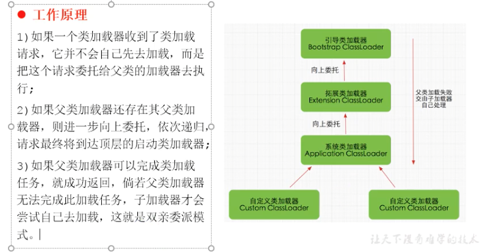

# Tomcat 

## 总体结构

## 参考：
> https://developer.ibm.com/zh/articles/j-lo-tomcat1/

# Docker Compose入门学习

## 参考：
> http://www.moguit.cn/#/info?blogOid=568

# Java诊断工具

## Arthas Alibaba开源的Java诊断工具
* 当你遇到以下类似问题而束手无策时，Arthas可以帮助你解决：
> 1. 这个类从哪个 jar 包加载的？为什么会报各种类相关的 Exception？
> 2. 我改的代码为什么没有执行到？难道是我没 commit？分支搞错了？
> 3. 遇到问题无法在线上 debug，难道只能通过加日志再重新发布吗？
> 4. 线上遇到某个用户的数据处理有问题，但线上同样无法 debug，线下无法重现！
> 5. 是否有一个全局视角来查看系统的运行状况？
> 6. 有什么办法可以监控到JVM的实时运行状态？
> 7. 怎么快速定位应用的热点，生成火焰图？

### 参考 
> https://arthas.aliyun.com/doc/
> https://www.bilibili.com/video/BV12t4y197QW

# JVM

## 类加载器
* 类加载器分类：
    * 启动类加载器/引导类加载器：Bootstrap ClassLoader.
        * 使用C/C++实现，嵌套在JVM内部。
        * 用来家庄Java核心库：JAVA_HOME/jar/lib/rt.jar、resources.jar或sun.boot.class.path路径下的内容，用于提供JVM自身需要的类。
    * 扩展类加载器：Extension ClassLoader。
        * Java语言编写，由sun.misc.Launcher$ExtClassLoader实现。
        * 派生于ClassLoader.
        * 父类为启动类加载器。
        * 从java.ext.dirs系统属性所指定的目录中加载类库，或从JDK的安装目录的jar/lib/ext子系统（扩展系统）加载类库，如用户创建的JAR创建的JAR放在此目录也会由扩展类加载器加载。
    * 应用程序类加载器/系统类加载器：AppClassLoader。
        * java语言编写，有sum.misc.launcher$AppClassLoader实现。
        * 派生于ClassLoader类。
        * 父类加载器为扩展类加载器。
        * 负责加载环境变量classpath或系统属性java.class.path指定路径下的类库。
        * 该类是程序中默认的加载器，一般来说，Java应用程序类都是它来完成加载。
        * 通过ClassLoader#getSysClassLoader()方法可以获取到该类加载器。
    * 自定义类加载器：
        * 目的：
            * 隔离加载类。
            * 修改类加载的方式。
            * 扩展加载源。
            * 防止源码泄漏。
        * 实现步骤：
            * 继承java.lang.ClassLoader类的方式，实现自己的类加载器。
            * JDK1.2之前，会继承ClassLoader并重写loadClass()方法，从而实现自定义加载类。JDK1.2之后建议把自定义的类加载逻辑写在findClass()方法中。
            * 在编写类加载器时，如果没有太过于复杂的需要，可以直接继承URLClassLoader类，这样避免自己编写findClass()方法极其获取字节流的方式。
    * ClassLoader：除引导类加载器，其他类加载器都继承ClassLoader抽象类。
    * 获取ClassLoader几种方式：
    
    * 双亲委派机制：
    > Java虚拟对class文件采用的按需加载的方式，也就是说当需要使用该类时才会将它的class文件加载到内存生成class对象。而且加载某个类的class文件时，Java虚拟机采用的时双亲委派机制，即把请求交由父类处理，它是一种任务委派模式。
        * 工作原理： 
        * 举例2：
        * 优势：
            * 避免重复加载。
            * 保护程序安全，防止核心API被篡改。
        * 沙箱安全机制：即引导类加载的过程中会首先加载jdk自带的文件，可以保证对java核心源代码的保护。
    
    * 补充：
        * JVM表示两个class对象是否同一个类两个必要条件：
            * 类完整名称必须一致，包括包名。
            * 加载这个类的ClassLoader（ClassLoad实例）必须相同。
        * 对类加载器的引用：
        > JVM必须知道一个类型是由启动加载器还是由用户加载器加载的。如果一个类型是由用户类加载器加载的，那么JVM会将这个类加载器的一个引用作为类型信息的一部分保存在方法区。当解析一个类型到另一个类型的引用的时候，JVM需要保证这两个类型的类加载器时相同的。

