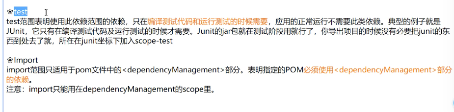

# 10.1 Maven构建工具
* dependencyManagement：提供了一种管理依赖版本号的方式。通常会在项目的最顶层中看到dependencyManagement元素。只是声明依赖，并不实现引入，因此子项目需要显示的声明需要用的依赖。
  > 
  * dependencies：

* 简单说明：

  

* 常见插件：
  * 编辑插件：
  > 
  * 资源配置插件：
  > 
  * tomcat插件：
  > 
  > 

* maven常见命令：
