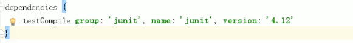

* Gradle项目目录结构
  * src/main/java：放置正式代码目录。
  * src/main/resouces：放置正式配置文件目录。
  * src/test/java放置单元测试代码目录。
  * src/test/resoures放置测试配置文件目录。
  * src/main/webapp放置页面元素，比如：js,css，img,jsp，html等等。
* grovvy中的闭包：闭包其实就是一段代码块。在gradle中，我们主要是把闭包当参数来使用。
  * 定义一个无参数闭包：
    > 
  * 定义一个闭包，带参数
    > 
* dependencies：gradle工程所有的jar包的坐标都在dependencies属性内放置。
  * 每个jar包的坐标都有三个基本元素组成：group，name,version。
  * testCompile表示该jar包在测试的时候起作用，该属性为jar包的作用域。在gradle里面添加坐标的时候都要带上jar包的作用域。
  * provided：只在编译阶段起作用，运行阶段不起作用。
  * compile project(":gradle_02_service")：依赖其他项目模块。  
  * compile:
  >   
* group：组织    
* version：版本
* apply plugin:'java'：运行的环境 打jar包。
* apply plugin:'war'：运行的环境 打war包。
* sourceCompatibility = 1.8: Java运行的版本。
* repositories：指定所使用的仓库，mavenCentral()表示使用中央仓库，此刻项目所需要的jar包都会默认从中央仓库下载到本地指定目录。
  > 
* allprojects：gradle 父工程，放入该标签下，所有子过程可用。

