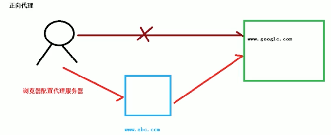

# 1、基本概念

## 1.1、nginx是什么
Nginx(engine x)是一个高性能的HTTP和反向代理服务器，特点是占有内存少，并发能力强，事实上nginx的并发能力确实在同类型的网页服务器中表现较好。

Nginx可以作为静态页面的web服务器，同时还支持cGI协议的动态语言，比如perl、php等。但是不支持java。Java程序只能通过与tomcat配合完成。Nginx专为性能
优化而开发，性能是其最重用的考量，实现上非常注重效率，能经受高负载的考验，有报告表明能支持高达50，000个并发连接数。
https://lnmp.org/nginx.html

## 1.2、反向代理
* 正向代理：在客户端（浏览器）配置代理服务器，通过代理服务器进行互联网访问
  > Nginx不仅可以做反向代理，实现负载均衡。还能用作正向代理来进行上网等功能。
  > 正向代理：如果把局域网外的Internet想象成一个巨大的资源库，则局域网中的客户端想要访问Internet，则需要通过代理服务器来访问，这种代理服务就称为正向代理。
  > 
  > 
* 反向代理：
  > 反向代理，其实客户端对代理是无感知的，因为客户端不需要任何配置就可以访问，我们只需要请求发送到方向代理服务器，由反向代理服务器去选择目标服务器获取数据后，
  > 再返回给客户端，此时反向代理服务器和目标服务器对外就是一个服务器，暴露的是代理服务器地址，隐藏了真实服务器IP地址。
  > 
  > 

## 1.3、负载均衡

## 1.4、动静分离

# 2、nginx安装、常用命令和配置文件

## 2.1、在linux系统中安装nginx
## 2.2、nginx常用命令
## 2.3、nginx配置文件

# 3、nginx配置实例 1-反向代理

# 4、nginx配置实例 2-负载均衡

# 5、nginx配置实例 3-动静分离

# 6、nginx配置高可用集群

# 7、nginx原理

