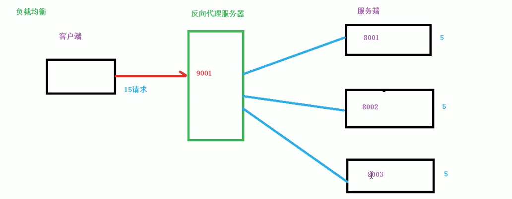
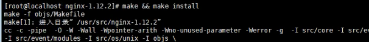
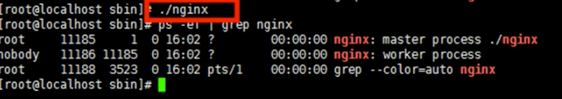
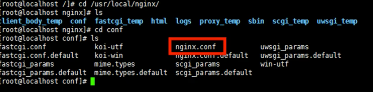
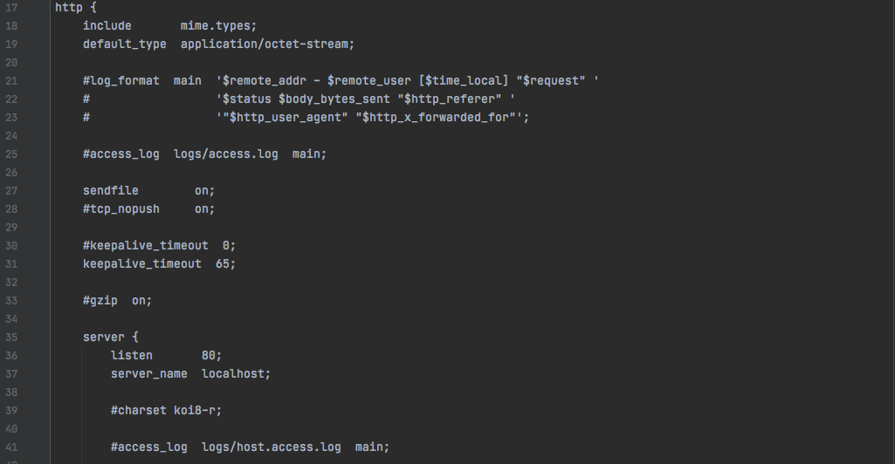
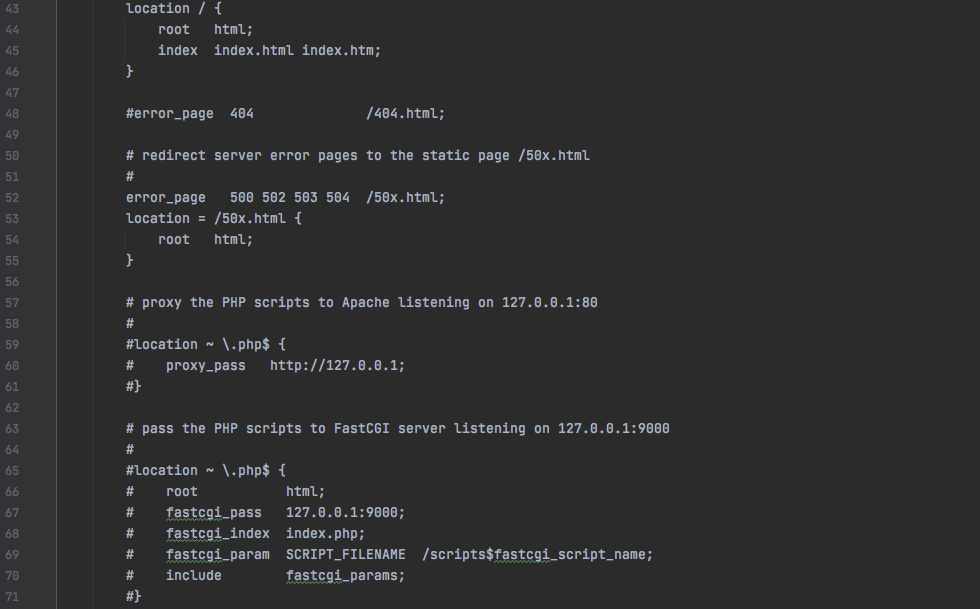
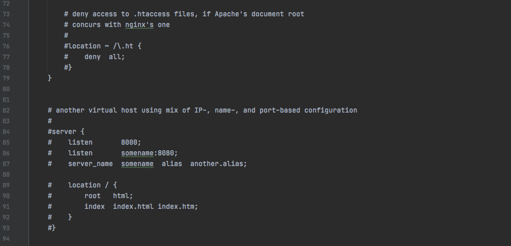

# 1、基本概念

## 1.1、nginx是什么
Nginx(engine x)是一个高性能的HTTP和反向代理服务器，特点是占有内存少，并发能力强，事实上nginx的并发能力确实在同类型的网页服务器中表现较好。

Nginx可以作为静态页面的web服务器，同时还支持cGI协议的动态语言，比如perl、php等。但是不支持java。Java程序只能通过与tomcat配合完成。Nginx专为性能
优化而开发，性能是其最重用的考量，实现上非常注重效率，能经受高负载的考验，有报告表明能支持高达50，000个并发连接数。
https://lnmp.org/nginx.html

## 1.2、反向代理
* 正向代理：在客户端（浏览器）配置代理服务器，通过代理服务器进行互联网访问
  > Nginx不仅可以做反向代理，实现负载均衡。还能用作正向代理来进行上网等功能。
  > 正向代理：如果把局域网外的Internet想象成一个巨大的资源库，则局域网中的客户端想要访问Internet，则需要通过代理服务器来访问，这种代理服务就称为正向代理。
  > 
  > 
* 反向代理：
  > 反向代理，其实客户端对代理是无感知的，因为客户端不需要任何配置就可以访问，我们只需要请求发送到方向代理服务器，由反向代理服务器去选择目标服务器获取数据后，
  > 再返回给客户端，此时反向代理服务器和目标服务器对外就是一个服务器，暴露的是代理服务器地址，隐藏了真实服务器IP地址。
  > 

## 1.3、负载均衡
客户端发送多个请求到服务器，服务器处理请求，有一些可能要与数据库进行交互，服务器处理完毕后，再将结果返回给客户端。

这种架构模式对于早期的系统相对单一，并发请求相对较少的情况下是比较适合的，成本也低。但是随着信息数量的不断增长，访问量和数据量的飞速增长，以及系统业务
的复杂度增加，这种架构会造成服务器相对应客户端的请求日益缓慢，并发量特别大的时候，还容易造成服务器直接崩溃。很明显这是由于服务器性能的瓶颈造成的问题，那么如何解决这种情况呢？
 
单个服务器解决不了，我们增加服务器的数量，然后将请求分发到各个服务器上，将原先请求集中到单个服务器上的情况改为将请求分发到多个服务器上，将负载分发到不同
的服务器，也就是我们所说的负载均衡。

## 1.4、动静分离
为加快网站的解析速度，可以把动态页面和静态页面由不同的服务器来解析，加快解析速度。降低原来单个服务器的压力。

# 2、nginx安装、常用命令和配置文件

## 2.1、在linux系统中安装nginx
* 1、使用远程连接工具连接linux操作系统。
* 2、nginx需要的依赖：pcre-8.37.tar.gz、openssl-1.0.1t.tar.gz、zlib-1.2.8.tar.gz、
  * 第一步，安装pcre：wget http://downloads.sourceforge.net/project/pcre/pcre/8.37/pcre-8.37.tar.gz
    解压文件：。./configure完成后，回到pcre目录下执行make，再执行make install
    
  * 第二步，安装openssl
  * 第三步，安装zlib。
  
  * 第二种方式：yum -y install make zlib zlib-devel gcc-c++libtool openssl openssl-devel。
* 3、安装nginx
  * 解压缩nginx-xx.tar.gz包。
    
  * 进入解压缩目录，执行./configure。 (检查)
    
  * make&&make install。（编译/编译安装）
    
  安装成功之后，在/usr下多出来一个文件夹local/nginx，在nginx有sbin有启动脚本。
* 4、端口设置，开发nginx端口。
  * 查看开放的端口号：firewall-cmd --list-all
  * 设置开放的端口号：firewall-cmd --and-service=http --permanent    
    
  * 重启防火墙：firewall-cmd--reload

## 2.2、nginx常用命令
* 1、使用nginx操作命令前提条件：必须进入nginx的目录：/usr/local/nginx/sbin
* 2、查看nginx的版本号
  > ./nginx -v
  > 
* 3、启动nginx
  > ./nginx
  > 
* 4、关闭nginx
  > ./nginx -s stop
  >   
* 5、重新加载nginx
  > ./nginx -s reload
  > 

## 2.3、nginx配置文件
* 1、nginx配置文件位置:
  > /usr/local/nginx/conf/nginx.conf
  > 
* 2、nginx配置文件组成：
  > 1、nginx配置文件有三部分组成。
  > * 第一部分：全局块
  >   从配置文件开始到events块之间的内容，主要会设置一些影响nginx服务器整体运行的配置指令，主要包括配置运行Nginx服务器的用户（组）、允许生成的
  >   worker process数，进程PID存放路径、日志存放路径和类型以及配置文件的引入等。
  >   
  >   比如第一行的配置：
  >   
  >   这是Nginx服务器并发处理服务的关键配置，worker_processes值越大，可以支持的并发处理量也越多，但是会受到硬件、软件等设备的制约。
  > * 第二部分：events块
  >   比如上面的配置：
  >   
  >   events块涉及的指令主要影响Nginx服务器与用户的网络连接，常用的设置包括是否开启对多work process下网络连接进行序列化，是否允许同时接受多个
  >   网络连接，选取哪些事件驱动模型来处理连接请求，每个word process可以同时支持的最大连接数等。
  >   上述例子就表示每个work process支持的最大连接数为1024.
  >   这部分的配置对Nginx的性能影响较大，在实际中应该灵活配置。
  > 
  > * 第三部分：http块
  >   
  >   
  >   
  >   
  >   这算是Nginx服务器配置中最频繁的部分，代理、缓存和日志定义等绝大多数功能和第三方模块的配置都在这里。
  >   需要注意的是：http块也可以包括http全局块、server块。
  >   * http全局块
  >     http全局块配置的指令包括文件引入、MIME-TYPE定义、日志自定义、连接超时时间、单链接请求数上限等。 
  >   * server块
  >     这块和虚拟主机有密切关系，虚拟主机从用户角度看，和一台独立的硬件主机是完全一样的，该技术的产生是为了节省互联网服务器硬件成本。
  >     每个http块可以包括多个server块，而每个server块就相当于一个虚拟主机。
  >     而每个server块也分为全局server块，以及可以同时包含多个locaton块。
  >     * 全局server块：最常见的配置是本虚拟机主机的监听配置和本虚拟主机的名称或IP配置。
  >     * location块：
  >       一个server块可以配置多个location块。这块的主要作用是基于Nginx服务器接收到的请求字符串（例如server_name/uri-string），对虚拟主机
  >       名称（也可以是IP别名）之外的字符串（例如 前面的/uri-string）进行匹配，对特定的请求进行处理。地址定向、数据缓存和应答控制等功能，还有
  >       许多第三方模块的配置也在这里进行。

# 3、nginx配置实例 1-反向代理

# 4、nginx配置实例 2-负载均衡

# 5、nginx配置实例 3-动静分离

# 6、nginx配置高可用集群

# 7、nginx原理

