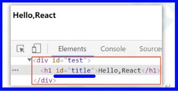

# React简介
1.是什么？
> React用于构建用户界面的JavaScript库。操作DOM呈现页面。
> 是一个将数据渲染为HTML视图的开源JavaScript库。

2.谁开发的？
> 由Facebook开发，且开源。

3.为什么要学？
> 1.原生JavaScript操作DOM繁琐、效率低（DOM-API操作UI）.
> 2.使用JavaScript直接操作DOM，浏览器会进行大量的 重绘重排。
> 3.原生JavaScript没有组件化编码方案，代码复用率低。

4.React的特点
> 1.采用 组件化 模式、 声明式编码 ，提高开发效率及组件复用率。
> 2.在React Native中可以使用React语法进行移动端开发。
> 3.使用 虚拟DOM + 优秀的 Diffing算法，尽量减少与真实DOM的交互。
> 
> 
> 

5.学习React之前，你需要掌握的JavaScript基础知识
> * 判断this的指向
> * class(类)
> * ES6语法规范
> * npm包管理器
> * 原型、原型链
> * 数组常用方法
> * 模块化

# 第1章：React入门

### 1.1.1 官网
1）英文官网：https://reactjs.org/
2) 中午官网:https://react.docschina.org/

### 1.1.2 介绍描述
1）用于动态构建用户界面的JavaScript库（只关注视图）
2）由Facebook开源

### 1.1.3 React的特点
1）声明式编码
2）组件化编码
3）React Native编写原生应用
4）高效（优秀的Diffing算法）

### 1.1.4 React高效的原因
1）使用虚拟（virtual）DOM，不总是直接操作页面真实DOM.
2）DOM Diffing算法，最小化页面重绘。

## 1.2 React的基本使用

### 1.2.1 效果
效果

代码实现：

### 1.2.2 相关js库
1）react.js：React核心库。
2）react-dom.js：提供操作DOM的react扩展库。
3）babel.min.js：解析JSX语法代码转为JS代码的库。

### 1.2.3 创建DOM的两种方式

# 

