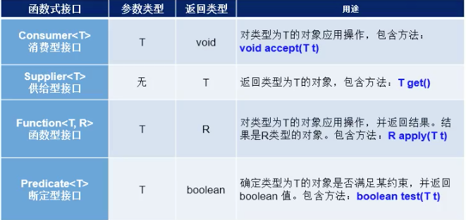
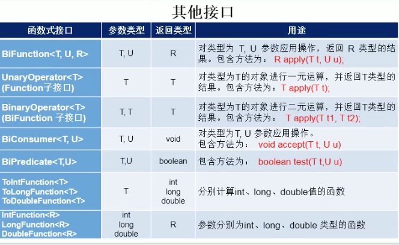
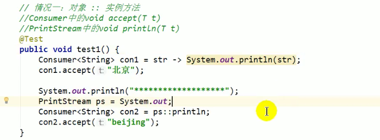
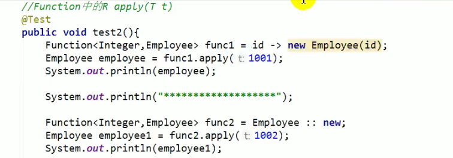
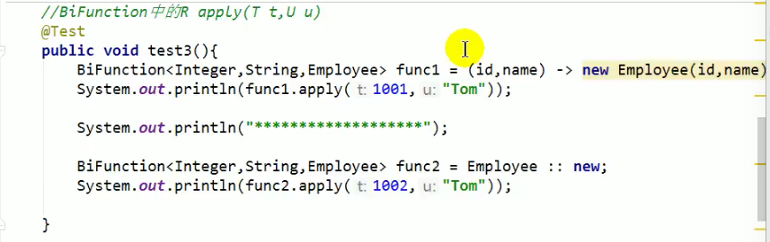
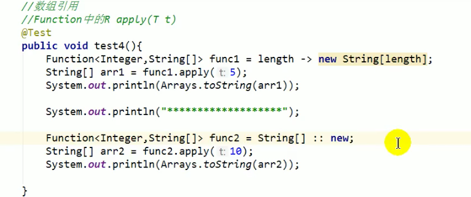
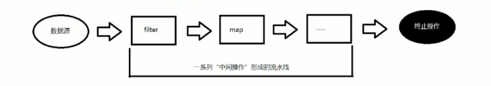

# Java 8新特性
* 简介：
  * 速度更快：如HashMap红黑树。
  * 代码更少（增加了新的语法：Lambda表达式）。
  * 强大的Stream API。
  * 便于并行。
  * 最大化减少空指针异常：Optional。
  * Nashorn引擎，允许在JVM上运行JS应用。

## 1.1 Lambda表达式 
为什么使用Lambda表达式
Lambda是一个匿名函数，我们可以把Lambda表达式理解为是一段可以传递的代码（将代码像数据一样进行传递）。使用它可以写出更简洁、更灵活的代码。作为一种更紧凑的代码风格，使
Java的语言表达能力得到了提升。
* Lambda表达式：语法
> Lambda表达式：在Java8语言中引入的一种新的语法元素和操作符。这个操作符为"->"，该操作符被称为 Lambda操作符 或 箭头操作符。它将Lambda分成两个部分：
> * 左侧：指定了Lambda表达式需要的参数列表。
> * 右侧：指定了Lambda体，是抽象方法的实现逻辑，也即Lambda表达式要执行的功能。
> * 语法格式一：无参，无返回值：Runnable r1 = () -> {System.out.println("Hello Lambda");};
> * 语法格式二：Lambda需要一个参数，但是没有返回值: Consumer<String> con = (String str) -> {System.out.println(str);};
> * 语法格式三：数据类型可以省略，因为可由编译器推断得出，称为"类型推断"：Consumer<String> con = (str) -> {System.out.println(str);};
> * 语法格式四：Lambda若只需要一个参数时，参数的小括号可以省略：Consumer<String> con = str -> {System.out.println(str);};
> * 语法格式五：Lambda需要两个或以上的参数，多条执行语句，并且可以有返回值：
>   Comparator<Integer> com (x,y) -> {
>     System.out.println("实现函数式接口方法！")；
>     return Integer.compare(x,y);
>   };
> * 语法格式六：当Lambda体只有一条语句时，return与大括号若有,都可以省略：Comparator<Integer> com = (x,y) -> Integer.compare(x,y);

## 1.2 函数式（Functional）接口
如果一个接口中，只声明了一个抽象方法，则此接口就称为函数式接口
* 什么是函数式（Functional）接口
  * 只包含一个抽象方法的接口，称为函数式接口。
  * 你可以通过Lambda表达式来创建该接口的对象。（若Lambda表达式抛出一个受捡异常（即：非运行时异常），那么该异常需要在目标接口的抽象方法上进行声明）。
  * 我们可以在一个接口上使用@FunctionalInterface注解，这样做可以检查它是否是一个函数式接口。同时javadoc也会包含一条声明，说明这个接口是一个函数式接口。
  * 在java.util.function包下定义了Java8的丰富的函数式接口。
* 如何理解函数式接口：
  * Java从诞生日起就是一直倡导"一切皆对象"，在Java里面面向对象（OOP）编程是一切。但是随着python、scala等语言的兴起和新技术的挑战，Java不得不做出调整
    以便支持更加广泛的技术要求，也即java不但可以支持OOP还可以支持OOF(面向函数编程)。
  * 在函数式编程语言当中，函数被当中一等公民对待。在将函数作为一等公民的编程语言中，Lambda表达式的类时是函数。但是在Java8中，有所不同。在Java8中，
    Lambda表达式是对象，而不是函数，它们必须依附于一类特别的对象类型——函数式接口。
  * 简单的说，在Java8中，Lambda表达式就是一个函数式接口的实例。这就是Lambda表达式和函数式接口的关系。也就是说，只要一个对象是函数式接口的实例，
    那么该对象就可以用Lambda表达式来表示。
  * 所以以前匿名实现类表示的现在都可以用Lambda表达式来写。

## 1.2.1 函数式接口
Java内置四大核心函数式接口

## 1.3 方法引用/构造器引用
* 方法引用（Method References）
  * 当要传递给Lambda体的操作，已经有实现的方法了，可以使用方法引用！
  * 方法引用可以看做是Lambda表达式更深层次的表达。换句话说，方法引用就是Lambda表达式，也就是函数式接口的一个实例，通过方法的名字来指向一个方法，可以
    认为是Lambda表达式的一个语法糖。
  * 要求：实现接口的抽象方法的参数列表和返回值类型，必须与方法引用的方法的参数列表和返回值类型保持一致！
  * 格式：使用操作符"::"将类（或对象）与方法名分割开来。
  * 如下三种主要使用情况：
    * 对象::实例方法名
    * 类::静态方法名
    * 类::实例方法名
  > 
* 构造器引用：

* 数组引用：

  
## 1.4 强大的Stream API
* Stream API说明
  * Java8中有两个最为重要的改变。第一个是Lambda表达式；另外一个则是Stream API。
  * Stream API(java.util.stream)把真正的函数式编程风格引入到Java中。这是目前为止Java类库最好的补充，因为Stream API可以极大提高Java程序员的生产力，
    让程序员写出高效率、干净、简洁的代码。
  * Stream是Java8中处理集合的关键抽象概念，它可以指定你希望对集合进行的操作，可以执行非常复杂的查找、过滤和映射数据等操作。使用Stream API对集合数据进行操作，
    这就类似于使用SQL执行的数据库查询。也可以使用Stream API来并行执行操作。简言之，Stream API提供了一种高效且易于使用的处理数据的方式。
* 为什么要使用Stream API：
  * 实际开发中，项目中多数数据源都来自于Mysql，Oracle等。但现在数据源可以更多了，有MongDB，Radis等，而这些NoSQL的数据就需要Java层面去处理。
  * Stream和Collection集合的区别：Collection是一种静态的内存数据结构，而Stream是有关计算的。前者是主要面向内存，存储在内存中，后者主要是面向
    CPU，通过CPU实现计算。
* Stream到底是什么呢？
  > 是数据渠道，用于操作数据源（集合、数组等）所生成的元素序列。"集合讲的是数据，Stream讲的是计算！"
  > 
  > 注意：
  > * 1.Stream自己不会存储元素。
  > * 2.Stream不会改变源对象。相反，他们会返回一个持有结果的新Stream。
  > * 3.Stream操作是延迟执行的。这意味着他们会等到需要结果的时候才执行。
  
* Stream的操作三个步骤：
  * 1-创建Stream：一个数据源（如：集合、数组），获取一个流。
  * 2-中间操作：一个中间操作链，对数据源的数据进行处理。
  * 3-终止操作（终端操作）：一旦执行终止操作，就执行中间操作链，并产生结果。之后，不会再被使用。
    > 

* 创建Stream的方式一：通过集合。Java8中的Collection接口被扩展，提供了两个获取流的方式：
  * default Stream<E> stream()：返回一个顺序流。
  * default Stream<E parallelStream()：返回一个并行流。
* 创建Stream方式二：通过数组。Java8中的Arrays的静态方法stream()可以获取数组流：
  * static<T> Stream<T> stream(T[] array)：返回一个流。
  * 重载形式，能够处理对应基本类型的数组：
    * public static IntStream stream(int[] array)
    * public static LongStream stream(long[] array)
    * public static DoubleStream stream(double[] array)
* 创建Stream方式三：通过Stream的of()。可以调用Stream类静态方法of()，通过显示值创建一个流。它可以接收任意数量的参数。
  * public static<T> Stream<T> of(T... values)：返回一个流
* 创建Stream方式四：创建无限流。可以使用静态方法Stream.iterate()和Stream.generate()，创建无限流。
  * 迭代：public static<T> Stream<T> iterate(final T seed，final UnaryOperator<T> f)；
  * 生成：public static<T> Stream<T> generate(Supplier<T> s);

## 

# Java 8新特性

# Java 8新特性

# Java 8新特性

# Java 8新特性

# Java 8新特性

