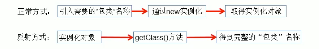
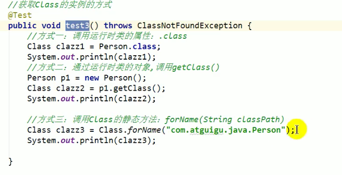
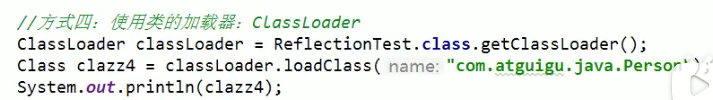

# 15.1 Java反射机制概述
* Reflection（反射）是被视为动态语言的关键，反射机制允许程序在执行期借助于Reflection API取得任何类的内部信息，并能直接操作任意对象的内部属性及方法。
* 加载完类之后，在堆内存的方法区中就产生了一个Class类型的对象（一个类只有一个Class对象），这个对象就包含了完整的类的结构信息。我们可以通过这个对象看到
  类的结构。这个对象就像一面镜子，通过这个镜子看到类的结构，所以，我们形象的称之为：反射。
> 
* 补充：动态语言 vs 静态语言
> * 1. 动态语言
>   是一类在运行时可以改变其结构的语言：例如新的函数、对象、甚至代码可以被引进，已有的函数可以被删除或是其他结构上的变化。通俗点说就是在运行时代码
>   可以根据某些条件改变自身结构。
>   主要动态语言：Object-C、C#、JavaScript、PHP、Python、Erlang。
> * 2. 静态语言
>   与动态语言相对应的，运行时结构不可变的语言就是静态语言。如Java、C、C++。
>   Java不是动态语言，但Java可以称之为"准动态语言"。即Java有一定的动态性，我们可以利用反射机制、字节码操作获得类似动态语言的特性。
>   Java的动态性让编程的时候更加灵活！
* Java反射机制研究及应用：Java反射机制提供的功能。
  * 在运行时判断任意一个对象所属的类。
  * 在运行时构造任意一个类的对象。  
  * 在运行时判断任意一个类所具有的成员变量和方法。
  * 在运行时获取泛型信息。  
  * 在运行时调用任意一个对象的成员变量和方法。  
  * 在运行时处理注解。
  * 生成动态代理。
* 反射相关的主要API:
  * java.lang.Class：代表一个类。
    > 关于java.lang.Class类的理解
    > * 1.类的加载过程：
    >   程序经过javac.exe命令后，会生成一个或多个字节码文件（.class结尾）。接着我们使用java.exe命令对某个字节码文件进行解释运行。相当于将某个字节码文件
    >   加载到内存中，此过程就称为类的加载。加载到内存中的类，我们称为运行时类，此运行时类，就作为Class的一个实例。
    > * 2.换句话说，Class的实例就对应着一个运行时类。
    > * 3.加载到内存中的运行时类，会缓存一定的时间。在此时间之内，我们可以通过不同的方式来获取此运行时类。
  * java.lang.reflect.Method：代表类的方法。
  * java.lang.reflect.Field：代表类的成员变量。
  * java.lang.reflect.Constructor：代表类的构造器。
  * ...
* 获取CLass的实例的方式
  * 调用运行时类的属性:.class
  * 通过运行时类的对象，调用getClass()
  * 调用Class的静态方法：forName(String classPath)
  * 使用类的加载器：ClassLoader
  > 
  > 
# 15.2 理解Class类并获取Class的实例
* 那些类型可以有Class对象？
  * 1.class：外部类，成员（成员内部类，静态内部类），局部内部类，匿名内部类。
  * 2.interface：接口
  * 3.[]：数组
  * 4.enum：枚举
  * 5.annotation：注解@interface
  * 6.primitive type：基本数据类型
  * 7.void

641

