# 15.1 Java反射机制概述
* Reflection（反射）是被视为动态语言的关键，反射机制允许程序在执行期借助于Reflection API取得任何类的内部信息，并能直接操作任意对象的内部属性及方法。
* 加载完类之后，在堆内存的方法区中就产生了一个Class类型的对象（一个类只有一个Class对象），这个对象就包含了完整的类的结构信息。我们可以通过这个对象看到
  类的结构。这个对象就像一面镜子，通过这个镜子看到类的结构，所以，我们形象的称之为：反射。
> 
* 补充：动态语言 vs 静态语言
> * 1. 动态语言
>   是一类在运行时可以改变其结构的语言：例如新的函数、对象、甚至代码可以被引进，已有的函数可以被删除或是其他结构上的变化。通俗点说就是在运行时代码
>   可以根据某些条件改变自身结构。
>   主要动态语言：Object-C、C#、JavaScript、PHP、Python、Erlang。
> * 2. 静态语言
>   与动态语言相对应的，运行时结构不可变的语言就是静态语言。如Java、C、C++。
>   Java不是动态语言，但Java可以称之为"准动态语言"。即Java有一定的动态性，我们可以利用反射机制、字节码操作获得类似动态语言的特性。
>   Java的动态性让编程的时候更加灵活！
* Java反射机制研究及应用：Java反射机制提供的功能。
  * 在运行时判断任意一个对象所属的类。
  * 在运行时构造任意一个类的对象。  
  * 在运行时判断任意一个类所具有的成员变量和方法。
  * 在运行时获取泛型信息。  
  * 在运行时调用任意一个对象的成员变量和方法。  
  * 在运行时处理注解。
  * 生成动态代理。
* 反射相关的主要API:
  * java.lang.Class：代表一个类。
    > 关于java.lang.Class类的理解
    > * 1.类的加载过程：
    >   程序经过javac.exe命令后，会生成一个或多个字节码文件（.class结尾）。接着我们使用java.exe命令对某个字节码文件进行解释运行。相当于将某个字节码文件
    >   加载到内存中，此过程就称为类的加载。加载到内存中的类，我们称为运行时类，此运行时类，就作为Class的一个实例。
    > * 2.换句话说，Class的实例就对应着一个运行时类。
    > * 3.加载到内存中的运行时类，会缓存一定的时间。在此时间之内，我们可以通过不同的方式来获取此运行时类。
  * java.lang.reflect.Method：代表类的方法。
  * java.lang.reflect.Field：代表类的成员变量。
  * java.lang.reflect.Constructor：代表类的构造器。
  * ...
* 获取CLass的实例的方式
  * 调用运行时类的属性:.class
  * 通过运行时类的对象，调用getClass()
  * 调用Class的静态方法：forName(String classPath)
  * 使用类的加载器：ClassLoader
  > 
  > 
# 15.2 理解Class类并获取Class的实例
* 那些类型可以有Class对象？
  * 1.class：外部类，成员（成员内部类，静态内部类），局部内部类，匿名内部类。
  * 2.interface：接口
  * 3.[]：数组
  * 4.enum：枚举
  * 5.annotation：注解@interface
  * 6.primitive type：基本数据类型
  * 7.void
> 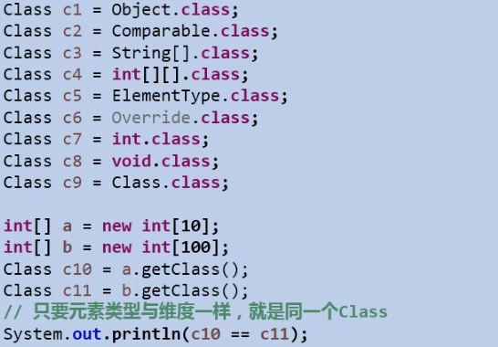

# 15.3 类的加载与ClassLoader的理解
当程序主动使用某个类时，如果该类还未被加载到内存中，则系统会通过如下三个步骤来对该类进行初始化。
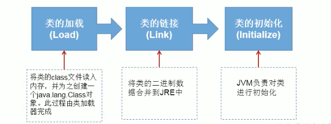
* 加载：将class文件字节码内容加载到内存中，并将这些对象数据转换成方法区的运行时数据结构，然后生成一个代表这个类的java.lang.Class对象，作为方法区
中类数据的访问入口（即引用地址）。所有需要访问和使用类数据只能通过这个Class对象。这个加载的过程需要类加载器参与。
* 链接：将Java类的二进制代码合并到JVM的运行状态之中的过程。
  * 验证：确保加载的类信息符合JVM规范，例如：以cafe开头，没有安全方面的问题。
  * 准备：正式为类变量（static）分配内存并设置类变量默认初始值的阶段，这些内存都将在方法区中进行分配。
  * 解析：虚拟机常量池内的符号引用（常量名）替换为直接引用（地址）的过程。
* 初始化：
  * 执行类构造器<clinit>（）方法的过程。类构造器<clinit>()方法是由编译期自动收集类中所有变量的赋值动作和静态代码块中的语句合并产生的。（类构造器是构造类信息的，
    不是构造该类对象的构造器）。
  * 当初始化一个类的时候，如果发现其父类还没有进行初始化，则需要先触发其父类的初始化。
  * 虚拟机保证一个类的<clinit>()方法在多线程环境中被正确的加锁和同步。
> 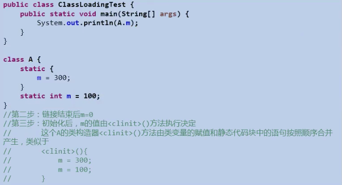

* 类的加载与ClassLoader的理解
> 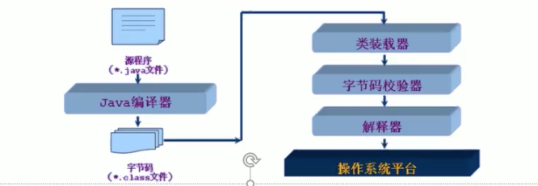
> * 类加载的作用：将class文件字节码内容加载到内存中，并将这些静态数据转换成方法区的运行时数据结构，然后在堆中生成一个代表这个类的java.lang.Class对象，
>   作为方法区中类数据的访问入口。
> * 类缓存：标准的JavaSE类加载器可以按要求查找类，但一旦某个类被加载到类加载器中，它将维持加载（缓存）一段时间。不过JVM垃圾回收机制可以回收这些Class对象。
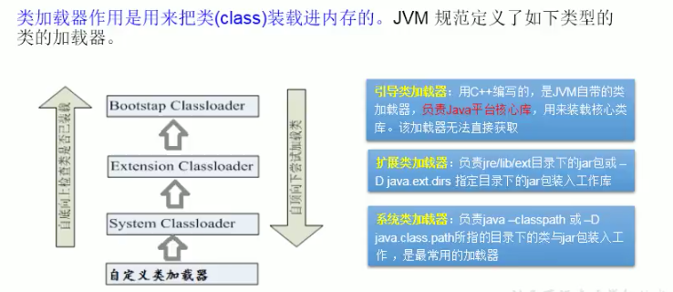
代码：
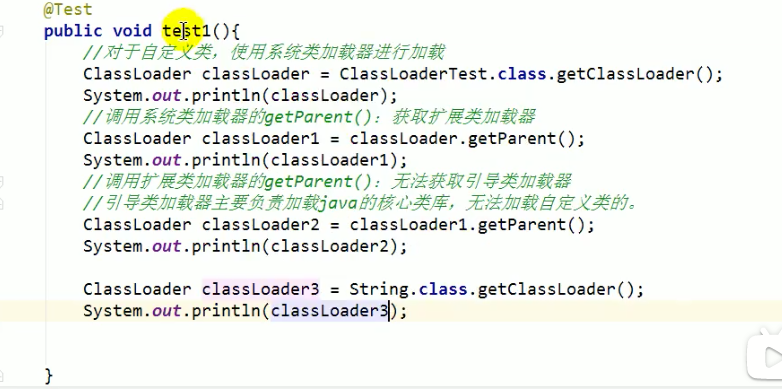
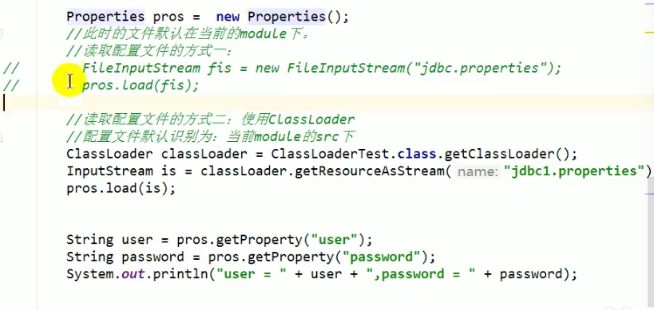

# 15.4 创建运行时类的对象
* 通过反射创建对应的运行时类的对象。
  * newInstance()：调用此方法，创建对应的运行时类的对象。
  > 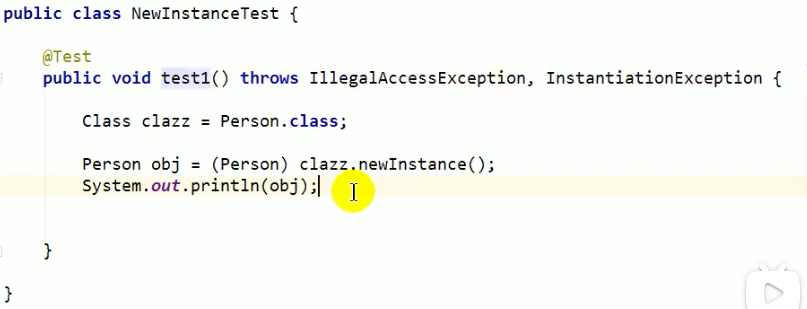
  > 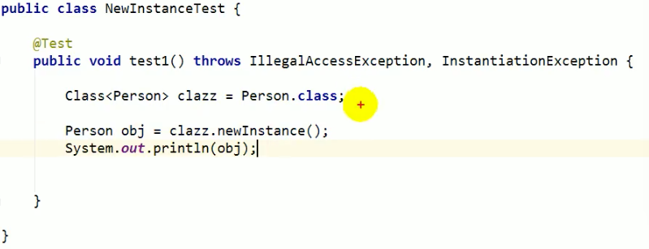

# 15.5 获取运行时类的完整结构
* 获取当前运行时类的属性结构：
  * getFields()：获取当前运行时类及父类中声明为public访问权限的属性。
  * getDeclaredFields()：获取当前运行时类中声明的所有属性。（不包含父类中声明的属性）
  * 权限修饰符、数据类型、变量名  
    * Field.getModifiers()：获取属性权限修饰符，返回int型，转换为字符Modifier.toString(Field.getModifiers());
    * Field.getType()：获取属性的数据类型。
    * Field.getName()：获取属性的变量名。
    > 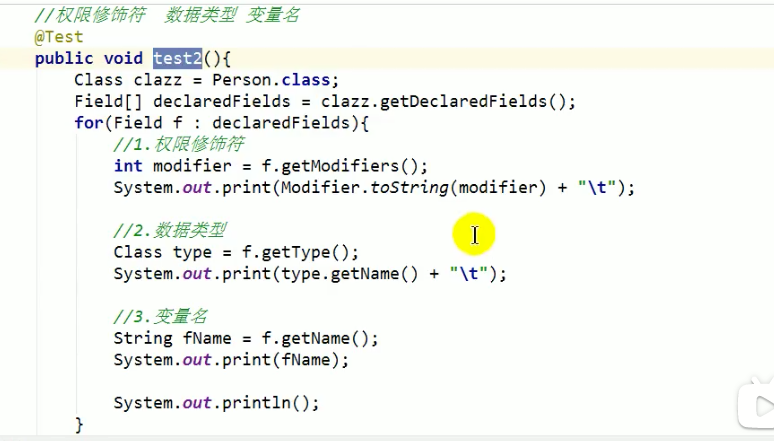
* 获取运行时类方法的内部结构 ：  
  * 1.获取方法声明的注解：Method.getAnnotations()：
  * 2.权限修饰符：Modifier.toString(Method m.getModifiers)。
  * 3.返回值类型：Method.getReturnType().getName()。
  * 4.方法名：Method.getName()。
  * 5.形参列表：Method.getParameterTypes()[0].getName()。
  * 6.抛出的异常：Method.getExceptionTypes()。
  > 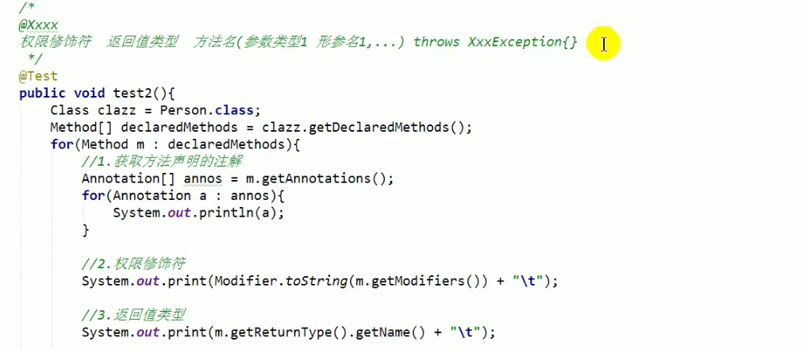
  > 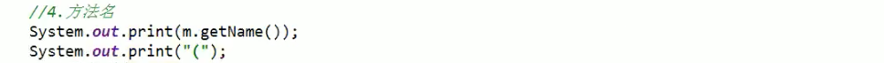
  > 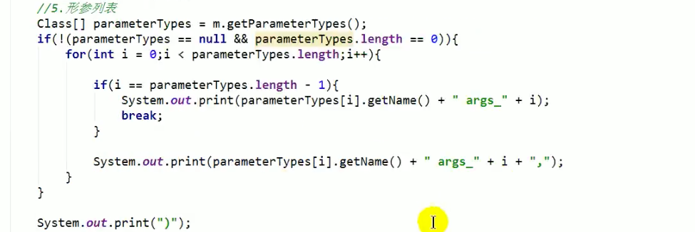
  > 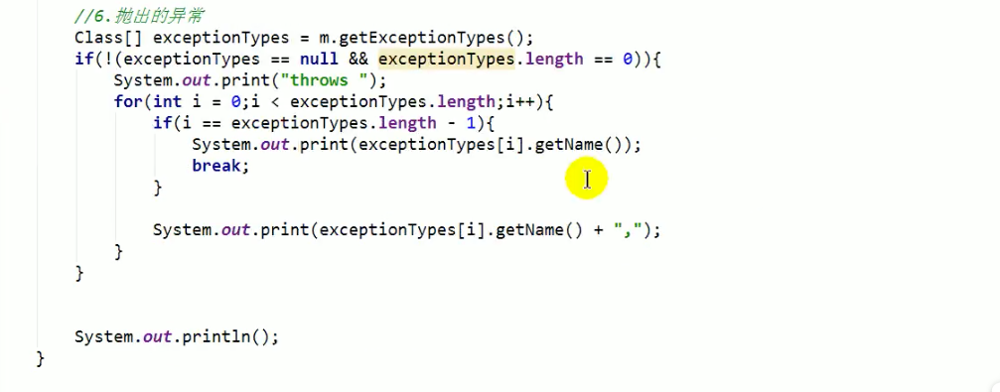
* 获取构造器结构
  * getConstructors()：获取当前运行时类中声明为public的构造器。
  * getDeclaredConstructors()：获取当前运行时类中声明的所有构造器。
  > 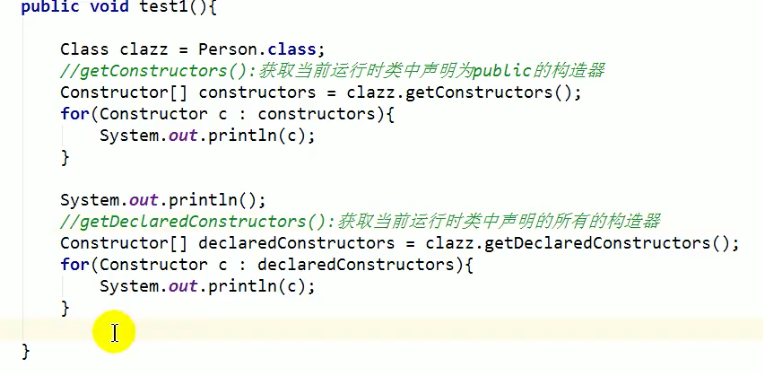
* 获取运行时类的父类：class.getSuperclass();
  > 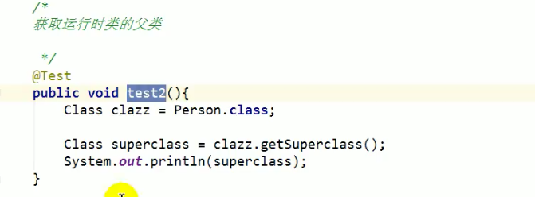
* 获取运行时类的带泛型的父类：class.getGenericSuperclass();
  > 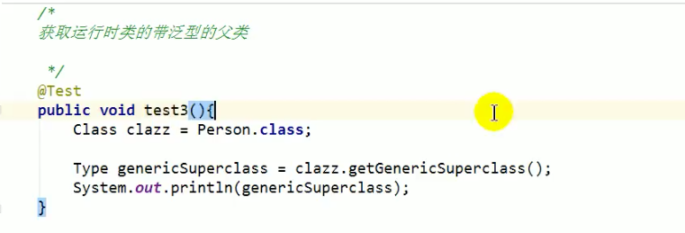
* 获取运行时类的带泛型的父类的泛型：class.getGenericSuperclass().getActualTypeArguments();
  > 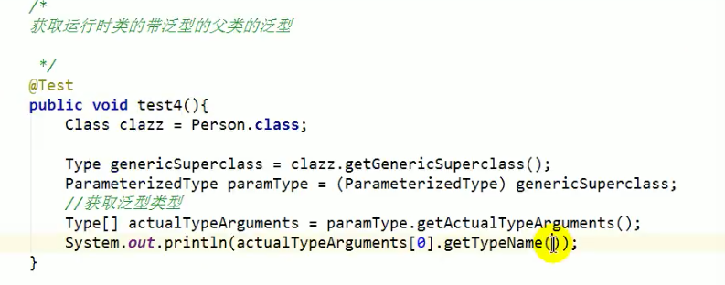
* 获取运行时类实现的接口：Class.getInterfaces()。
  > 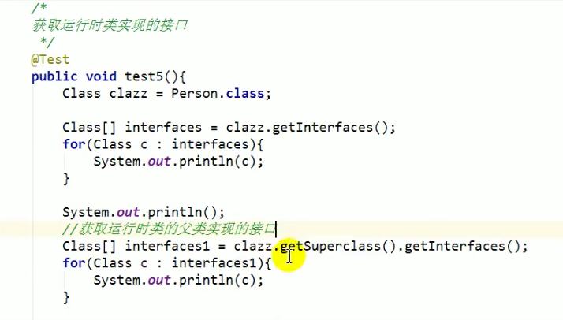
* 获取运行时类所在的包:Class.getPackage();
  > 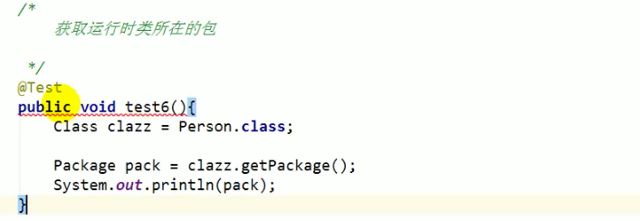
* 获取运行时类声明的注解：
  > 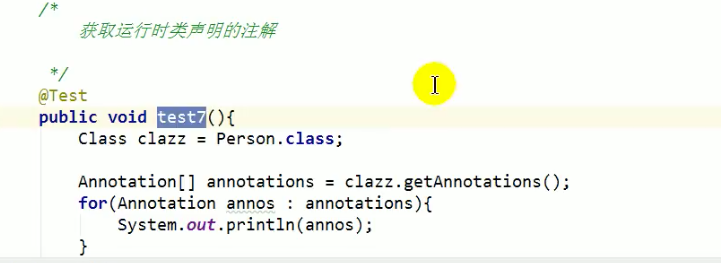

# 15.6 调用运行时类的指定结构 
属性、方法、构造器
* 属性：
> 方式1,只支持public属性
> 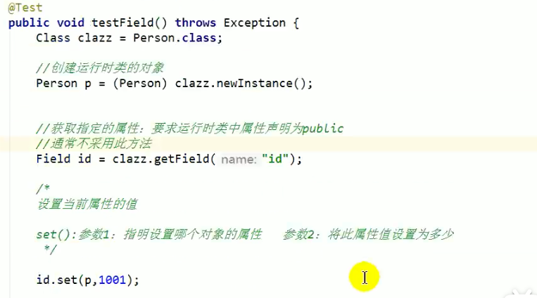
> 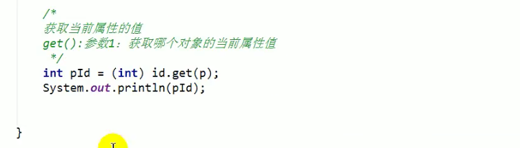
> 方式2
> 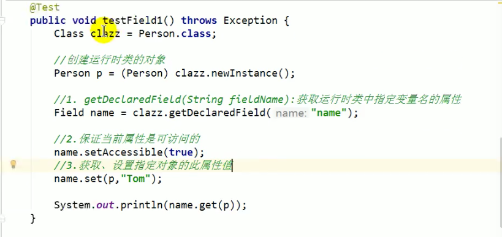
* 如何操作运行时类的指定的方法
> getDecLaredMethod()：参数1：指明获取的方法的名称 参数2：指明获取的方法的形参列表。
> invoke()：参数1：方法的调用者 参数2：给方法形参赋值的实参。
> 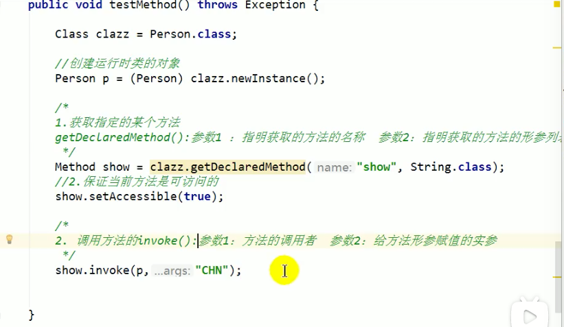
> 返回值
> 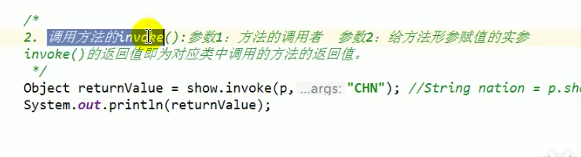
> 调用静态方法
> 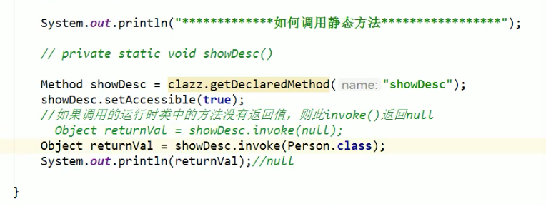
* 调用运行时类的指定的构造器
> 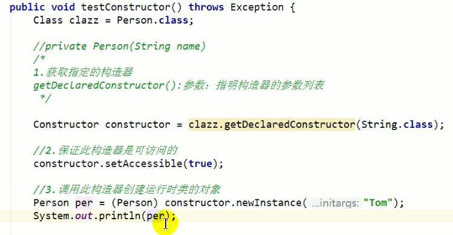

# 总结
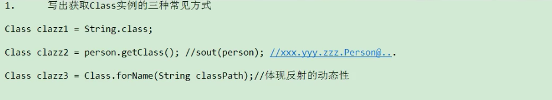
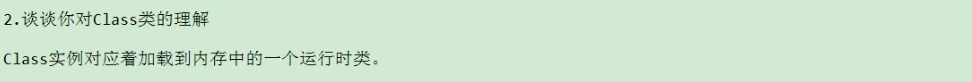
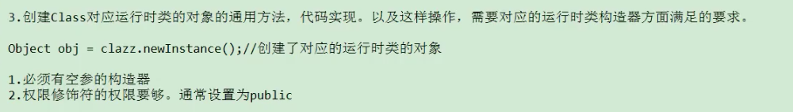

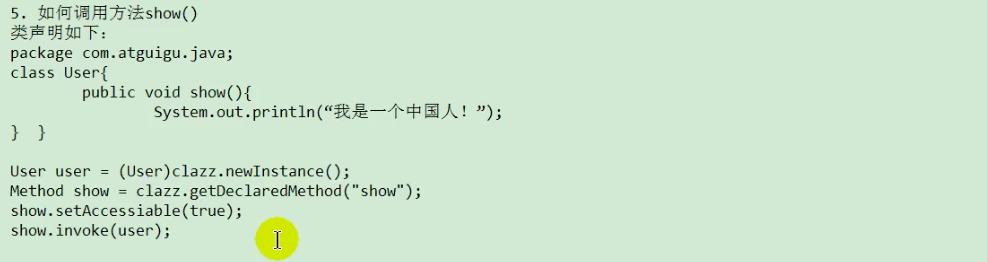

# 15.7 反射的应用 动态代理
* 代理设计模式的原理：
  使用一个代理将对象包装起来，然后用该代理对象取代原始对象。任何对原始对象的调用都要通过代理。代理对象决定是否以及何时将方法调用转到原始对象上。
* 静态代理，特征是代理类和目标对象的类都是在编译期间确定下来，不利于程序的扩展。同时每一个代理类只能为一个接口服务，这样一来程序开发中必然产生过多的代理。
  最好可以通过一个代理类完成全部的代理功能。

* 静态代理 举例 ： 
> 代理类
> 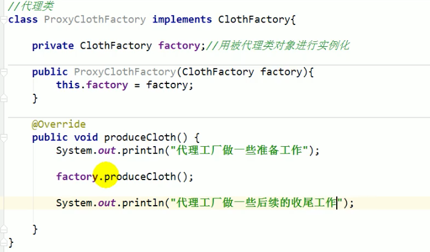
> 被代理类
> 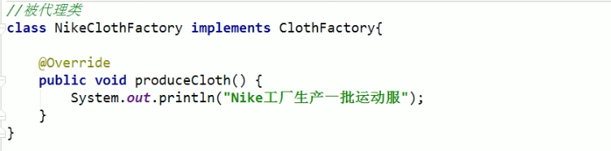
> 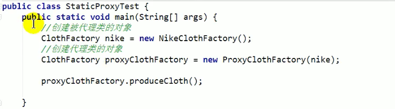

* 动态代理是指客户通过代理来调用其他对象的方法，并且是在程序运行时根据需要动态创建目标类的代理对象。
* 动态代理使用场合：
  * 调试
  * 远程方法调用
* 动态代理相比于静态代理的优点：
  * 抽象角色中（接口）声明的所有方法都被转移到调用处理器一个集中的方法中处理，这样，我们可以更加灵活和统一的处理众多的方法。
* 动态代理的举例：
> 接口：
> 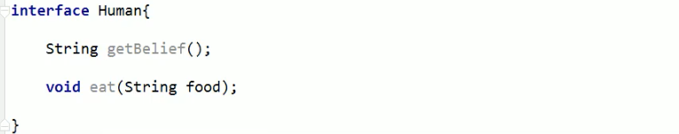
> 被代理类：
> 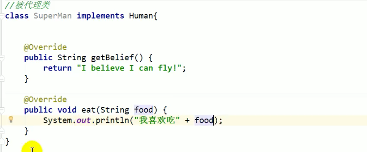
> * 要想实现动态代理，需要解决的问题？
>   * 问题一：如何根据加载到内存中的被代理类，动态的创建一个代理类及其对象。
>   * 问题二：当通过代理类对象调用方法时，如何动态的去调用被代理类中的同名方法。
> 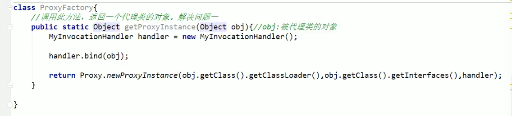
> 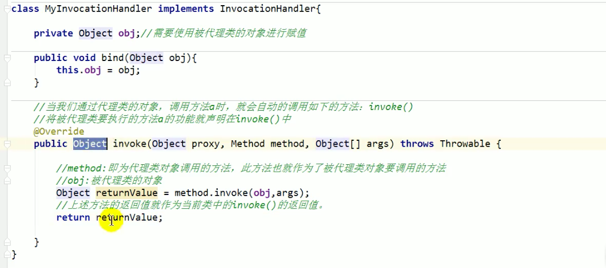
> 测试：
> 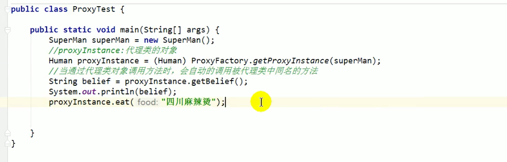

