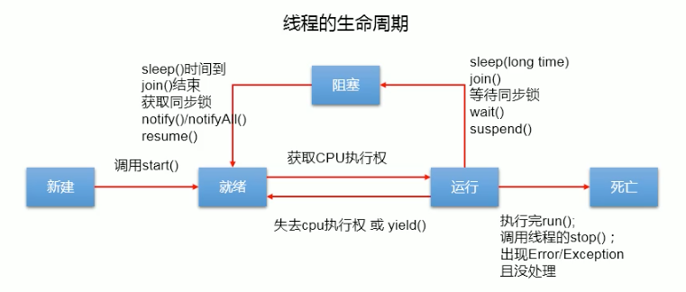

404
# 8.1 基本概念：程序、进程、线程
* 程序（program）是为完成特定任务、用某种语言编写的一组指令的集合。即指一段静态的代码，静态对象。
* 进程（process）是程序的一次执行过程，或是正在运行的一个程序。是一个动态的过程：有它自身的产生、存在和消亡的过程。——生命周期
  * 如：运行中的QQ，运行中的MP3播放器。
  * 程序是静态的，进程是动态的。
  * 进程作为资源分配的单位，系统在运行时会为每个进程分配不同的内存区域。
* 线程（thread），进程可进一步细化为线程，是一个程序内部的一条执行路径。
  * 若一个进程同一时间并行执行多个线程，就是支持多线程的。
  * 线程作为调度和执行的单位，每个线程拥有独立的运行栈和程序计数器（pc），线程切换的开销小。
  * 一个进程中的多个线程共享相同的内存单元/内存地址空间->它们从同一堆中分配对象，可以访问相同的变量和对象。这就使得线程间通信更简洁、高效。但多个线程操作共享的系统资源
  可能会带来安全的隐患。

# 8.2 线程的创建和启动
* Java语言的JVM允许程序运行多个线程，它通过java.lang.Thread类来体现。
* Thread类的特性：
  * 每个线程都是通过某个特定Thread对象的run()方法来完成操作的，经常把run()方法的主体称为线程体。
  * 通过该Thread对象的start()方法来启动这个线程，而非直接调用run()。


# 8.3 Thread类的有关方法
* void start()：启动线程，并执行run()方法
* run()：现在在被调用时执行的操作
* String getName()：返回线程的名称
* void setName(String name)：设置该线程名称
* static Thread currentThread()：返回当前线程。在Thread子类中就是this，通常用于主线程和Runnable实现类
* static void yield()：线程让步
  * 暂停当前正在执行的线程，把执行机会让给优先级相同或更高的线程
  * 若队列中没有同优先级的线程，忽略此方法
* join()：当某个程序执行流中调用其他线程的join()方法时，调用线程将被阻塞，直到join()方法加入的join线程执行完为止
  * 低优先级的线程也可以获得执行
* static void sleep(long millis):（指定时间：毫秒）
  * 令当前活动线程在指定时间段内放弃对CPU控制，使其他线程有机会被执行，时间到后重排队。
  * 抛出InterruptedException异常
* stop()：强制线程生命期结束，不推荐使用
* boolean isAlive()：返回boolean，判断线程是否还活着。

# 8.4 线程的调度
* 调度策略
  * 时间片
    
  * 抢占式：该优先级的线程抢占CPU
* Java的调度方法
  * 相同优先级的线程组成先进先出队列（先到先服务），使用时间片策略
  * 对高优先级，使用优先调度的抢占式策略
## 8.4.1 线程的优先级
* 线程的优先等级
  * MAX_PRIORITY:10
  * MIN_PRIORITY:1
  * NORM_PRIORITY:5
* 涉及的方法
  * getPriority()：返回线程优先值
    *setPriority(int newPriority)：改变线程的优先级
* 说明
  * 线程创建时继承父线程的优先级
  * 低优先级只是获得调度的概率低，并非一定是高优先级线程之后才被调用
# 8.5 线程的分类
线程的分类：Java中的线程分为两类：一种是 守护线程，一种是 用户线程。
* 它们在几乎每个方面都是相同的，唯一的区别是判断JVM何时离开。
* 守护线程是用力服务用户线程的，通过在start()方法前调用thread.setDaemon(true)可以把一个用户线程变成一个守护线程。
* Java垃圾回收就是一个典型的守护线程。
* 若JVM中都是守护线程，当前JVM将推出。

# 8.6 线程的生命周期
* JDK中用Thread.State类定义了线程的几种状态：要想实现多线程，必须在主线程中创建新的线程对象。Java语言使用Thread类及其子类
  的对象来表示线程，在它的一个完整的生命周期中通常要经历如下的五种状态：
  * 新建：当一个Thread类或其子类的对象被声明并创建时，新生的线程对象处于新建状态。
  * 就绪：处于新建状态的线程被start()后，将进入线程队列等待CPU时间片，此时它已具备了运行的条件，只是没有分配到CPU资源。
  * 运行：当就绪的线程被调度并获得CPU资源时，便进入运行状态，run()方法定义了线程的操作和功能。
  * 阻塞：在某种特殊情况下，被人为挂起或执行输入输出操作时，让出CPU并临时终止自己的执行，进入阻塞状态。
  * 死亡：线程完成了它的全部工作或线程被提前强制性地终止或出现异常导致结束。


# 8.7 线程的死锁问题
* 死锁
  * 不同的线程分别占用对方需要的同步资源不放弃，都在等待对方放弃自己需要的同步资源，就形成了线程的死锁。
  * 出现死锁后，不会出现异常，不会出现提示，只是所有的线程都处于阻塞状态，无法继续
* 解决方法
  * 专门的算法、原则
  * 尽量减少同步资源的定义
  * 尽量避免嵌套同步

* Lock(锁)
  * 从JDK5.0开始，Java提供了更强大的线程同步机制——通过显示定义同步锁对象来实现同步。同步锁使用Lock对象充当。
  * java.util.concurrent.locks.Lock接口是控制多个线程对共享资源进行访问的工具。锁提供了对共享资源的独占访问，每次只能有一个线程对Lock对象加锁，
    线程开始访问共享资源之前应先获得Lock对象。
  * ReentrantLock类实现了Lock，它拥有与synchronized相同的并发性和内存语义，在实现线程安全的控制中，比较常用的是ReentrantLock，可以显示加锁、释放锁。


# 8.8 线程的通信

线程通信的例子：使用两个线程打印1-100。线程1，线程2 交替打印
> wait(); //会释放锁 notify()//唤醒线程;
> 涉及到的三个方法：
> wait():一旦执行此方法，当前线程就进入阻塞状态，并释放同步监视器。
> notify():一旦执行此方法，就会唤醒被wait的一个线程。如果有多个线程被wait，就唤醒优先级高的那个。
> notifyAll()：一旦执行此方法，就会唤醒所有被wait的线程。
>
> 说明：
> 1. wait()，notify()，notifyAll()三个方法只能使用在同步方法或者同步代码块中.
> 2. wait()，notify()，notifyAll()三个方法的调用者必须是同步代码块或同步方法中的同步监视器。
     >   否则，会出现IllegalMonitorStateException异常。
> 3. wait()，notify()，notifyAll()三个方法定义在java.lang.Object中。
>
> * sleep()和wait()的异同？
    >   * 相同点：一旦执行到方法，都可以使得当前的线程进入阻塞状态。
>   * 不同点：
      >     * 1.两个方法声明的位置不同：Thread类中声明sleep()，Object类中声明wait()。
>     * 2.调用的要求不同：sleep()可以在任何需要的场景下调用。wait()必须使用在同步代码块或同步方法中。
>     * 3.关于是否释放同步监视器：如果两个方法都使用在同步代码块或同步方法中，sleep()不会是否同步监视器，wait()会释放同步监视器。

# 8.9 JDK5.0新增线程创建方式

新增方式一：实现Callable接口
* 与使用Runnable相比，Callable功能更强大些
  * 相比run()方法，可以有返回值
  * 方法可以跑出异常
  * 支持泛型的返回值
  * 需要借助FutureTask类，比如获取返回结果
  * Future接口
    * 可以对具体Runnable、Callable任务的执行结果进行取消、查询是否完成、获取结果等。
    * FutrueTask是Futrue接口的唯一的实现类
    * FutrueTask同时实现了Runnable、Future接口。它既可以作为Runnable被线程执行，又可以作为Future得到Callable的返回值。
  ```aidl
    FutureTask futureTask = new FutureTask(Callable接口实现)；
    new Thread(futureTask).start();
    //get()方法返回值即为FutureTask构造器参数Callable实现类重写call()的返回值。
    Object sum = futureTask.get();
  ```
* 实现步骤：
  * 1.创建一个实现Callable的实现类
  * 2.实现call方法，将此线程需要执行的操作声明在call()中
  * 3.创建Callable接口实现类的对象
  * 4.将此Callable接口实现类的对象作为参数传递到FutureTask构造器中，创建FutureTask的对象。
  * 5.将FutureTask的对象作为参数传递到Thread类的构造器中，创建Thread对象，并调用start()方法。
  * 6.获取Callable中call方法的返回值。

* Callable接口的方式创建多线程比实现Runnable接口创建多线程方式强大？
  * 1.call()可以有返回值。
  * 2.call()可以抛出异常，被外面的操作捕获，获取异常的信息。
  * 3.Callable是支持泛型的。

新增方式二：使用线程池
* 背景：经常创建和销毁、使用量特别大的资源，比如并发情况下的线程，对性能影响很大。
* 思路：提前创建好多个线程，放入线程池中，使用时直接获取，使用完放回池中。可以避免频繁创建销毁、实现重复利用。类似生活中的公共交通工具。
* 好处：
  * 提高响应速度（减少了创建新线程的时间）
  * 降低资源消耗（重复利用线程池中线程，不需要每次都创建）
  * 便于线程管理
    * corePollSize：核心池的大小
    * maximumPollSize：最大线程数
    * keepAliveTime：线程没有任务时最多保持多长时间后会终止
    * ……

线程池相关API
* JDK5.0起提供了线程池相关API:ExecutorService和Executors
* ExecutorService：真正的线程池接口。常见子类ThreadPoolExecutor
  * void execute(Runnable command)：执行任务/命令，没有返回值，一般用来执行Runnable。
  * <T>Future<T>submit(Callable<T>task)执行任务，有返回值，一般用来执行Callable。
  * void shutdown()：关闭线程池
* Executors：工具类、线程池的工厂类，用于创建并返回不同类型的线程池
  * Executors.newCachedThreadPool()：创建一个可根据需要创建的新线程的线程池
  * Executors.newFixedThreadPool(n)：创建一个可重用固定线程数的线程池
  * Executors.newSingleThreadExecutor()：创建一个只有一个线程的线程池
  * Executors.newScheduledThreadPool(n)：创建一个线程池，它可安排在给定延迟后运行命令或者定期地执行。

* 实现：
  * 1.提供指定线程数量的线程池
  * 2.执行指定的线程的操作。需要提供实现Runnable接口或Callable接口实现类的对象
  * 3.关闭连接池。
> 


# 杂谈
* ThreadLocal的作用是：提供线程内的局部变量，不同的线程之间不会相互干扰，这种变量在线程的生命周期内起作用，减少同一个线程内多个函数或组件之间一些公共变量传递的复杂性。
  * 线程并发：在多线程并发的场景下使用。
  * 传递数据：我们可以通过ThreadLocal在同一线程，不同组件中传递公共变量。
  * 线程隔离：每个线程的变量都是独立的，不会相互影响。

* ThreadLocal的常用方法：
  * ThreadLocal()创建ThreadLocal对象
  * public void set(T value)：设置当前线程绑定的局部变量。
  * public T get()：获取当前线程绑定的局部变量。
  * public void remove()：移除当前线程绑定的局部变量。

* ThreadLocal和synchronized的区别：
  > 虽然ThreadLocal模式与synchronized关键字都是用于处理多线程并发访问变量的问题，不过两者处理问题的角度和思路不同。
  > 
  > 总结：在刚刚的案例中，虽然使用ThreadLocal和synchronized都能解决问题，但是使用ThreadLocal更为合适，因为这样可以使程序拥有更高的并发性。

*  ThreadLocal现在的设计。
> JDK8中ThreadLocal的设计是：每个Thread维护一个ThreadLocalMap，这个Map的key是ThreadLocal实例本身，value才是真正要存储的值Object。具体过程是这样的：
> * 1.每个Thread线程内部都有一个Map(ThreadLocalMap)。
> * 2.Map里面存储ThreadLocal对象（key）和线程的变量副本（value）。
> * 3.Thread内部的Map是由ThreadLocal维护的，由ThreadLocal负责向map获取和设置线程的变量值。
> * 4.对于不同的线程，每次获取副本值时，别的线程并不能获取到当前线程的副本值，形成了副本的隔离，互不干扰。
> 
> 
> JDK8的设计方案两个好处：
> 1.每个Map存储的Entry数量变少。
> 2.当Thread销毁的时候，ThreadLocalMap也会随之销毁，减少内存的使用。


