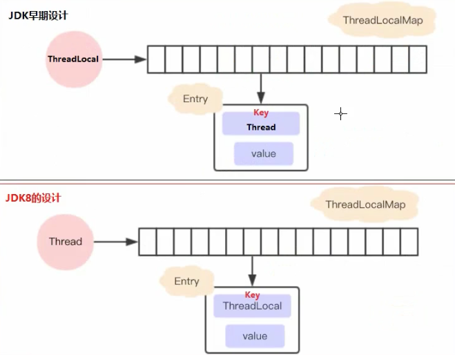

404
# 8.1 基本概念：程序、进程、线程
* 程序（program）是为完成特定任务、用某种语言编写的一组指令的集合。即指一段静态的代码，静态对象。
* 进程（process）是程序的一次执行过程，或是正在运行的一个程序。是一个动态的过程：有它自身的产生、存在和消亡的过程。——生命周期
  * 如：运行中的QQ，运行中的MP3播放器。
  * 程序是静态的，进程是动态的。
  * 进程作为资源分配的单位，系统在运行时会为每个进程分配不同的内存区域。
* 线程（thread），进程可进一步细化为线程，是一个程序内部的一条执行路径。
  * 若一个进程同一时间并行执行多个线程，就是支持多线程的。
  * 线程作为调度和执行的单位，每个线程拥有独立的运行栈和程序计数器（pc），线程切换的开销小。
  * 一个进程中的多个线程共享相同的内存单元/内存地址空间->它们从同一堆中分配对象，可以访问相同的变量和对象。这就使得线程间通信更简洁、高效。但多个线程操作共享的系统资源
  可能会带来安全的隐患。

# 8.2 线程的创建和启动
* Java语言的JVM允许程序运行多个线程，它通过java.lang.Thread类来体现。
* Thread类的特性：
  * 每个线程都是通过某个特定Thread对象的run()方法来完成操作的，

# 杂谈
* ThreadLocal的作用是：提供线程内的局部变量，不同的线程之间不会相互干扰，这种变量在线程的生命周期内起作用，减少同一个线程内多个函数或组件之间一些公共变量传递的复杂性。
  * 线程并发：在多线程并发的场景下使用。
  * 传递数据：我们可以通过ThreadLocal在同一线程，不同组件中传递公共变量。
  * 线程隔离：每个线程的变量都是独立的，不会相互影响。

* ThreadLocal的常用方法：
  * ThreadLocal()创建ThreadLocal对象
  * public void set(T value)：设置当前线程绑定的局部变量。
  * public T get()：获取当前线程绑定的局部变量。
  * public void remove()：移除当前线程绑定的局部变量。

* ThreadLocal和synchronized的区别：
  > 虽然ThreadLocal模式与synchronized关键字都是用于处理多线程并发访问变量的问题，不过两者处理问题的角度和思路不同。
  > 
  > 总结：在刚刚的案例中，虽然使用ThreadLocal和synchronized都能解决问题，但是使用ThreadLocal更为合适，因为这样可以使程序拥有更高的并发性。

*  ThreadLocal现在的设计。
> JDK8中ThreadLocal的设计是：每个Thread维护一个ThreadLocalMap，这个Map的key是ThreadLocal实例本身，value才是真正要存储的值Object。具体过程是这样的：
> * 1.每个Thread线程内部都有一个Map(ThreadLocalMap)。
> * 2.Map里面存储ThreadLocal对象（key）和线程的变量副本（value）。
> * 3.Thread内部的Map是由ThreadLocal维护的，由ThreadLocal负责向map获取和设置线程的变量值。
> * 4.对于不同的线程，每次获取副本值时，别的线程并不能获取到当前线程的副本值，形成了副本的隔离，互不干扰。
> 
> 
> JDK8的设计方案两个好处：
> 1.每个Map存储的Entry数量变少。
> 2.当Thread销毁的时候，ThreadLocalMap也会随之销毁，减少内存的使用。

