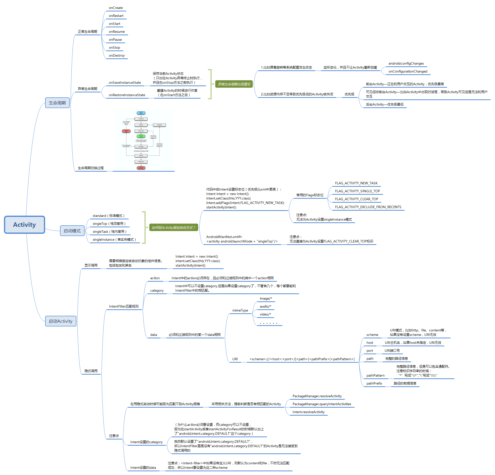
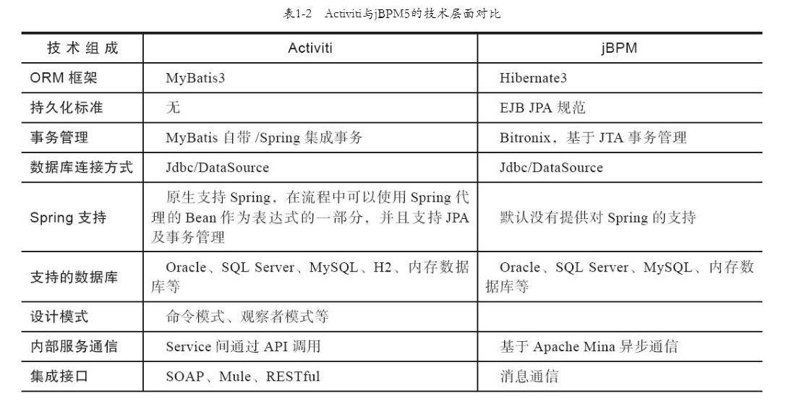
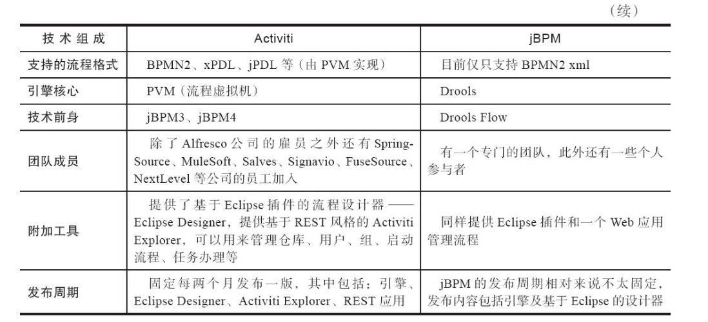

# 第3章 工作流（WorkFlow）

* 需求初衷：
    * 调度：shell脚本程序，java程序，mapreduce程序、hive脚本等。
    * 定时调度：
    * 可视化：
    * 调度过程管理：
* 定义：
    * 工作流是将一组任务组织起来一完成某个经营过程：定义了任务的出发顺序和触发条件，每个任务可以由一个或多个软件系统完成，也可以由一个或一组人完成，还可以由一个或多个人与系统软件协作完成；

* 解决问题：

3.1 Activiti 和 Activiti Cloud

* 难度

* 优点：
    * 原生支持Spring：可轻松进行Spring集成，非常方便管理事务。
    *  专门的流程设计器：Eclipse Designer、基于Web的Activiti Modeler流程设计器。

* 缺点
    * 无持久化标准。

* 支持

* 原理

* 使用

* 其他

* 对比其他：

* 参考：
    * https://www.jianshu.com/p/86c0a4afd28e
    * http://www.mossle.com/docs/activiti/index.html

Activiti Cloud版本7.x

https://activiti.gitbook.io/activiti-7-developers-guide/overview

Shark，osworkflow，jbpm！Azkaban
WorkFlowEngine

