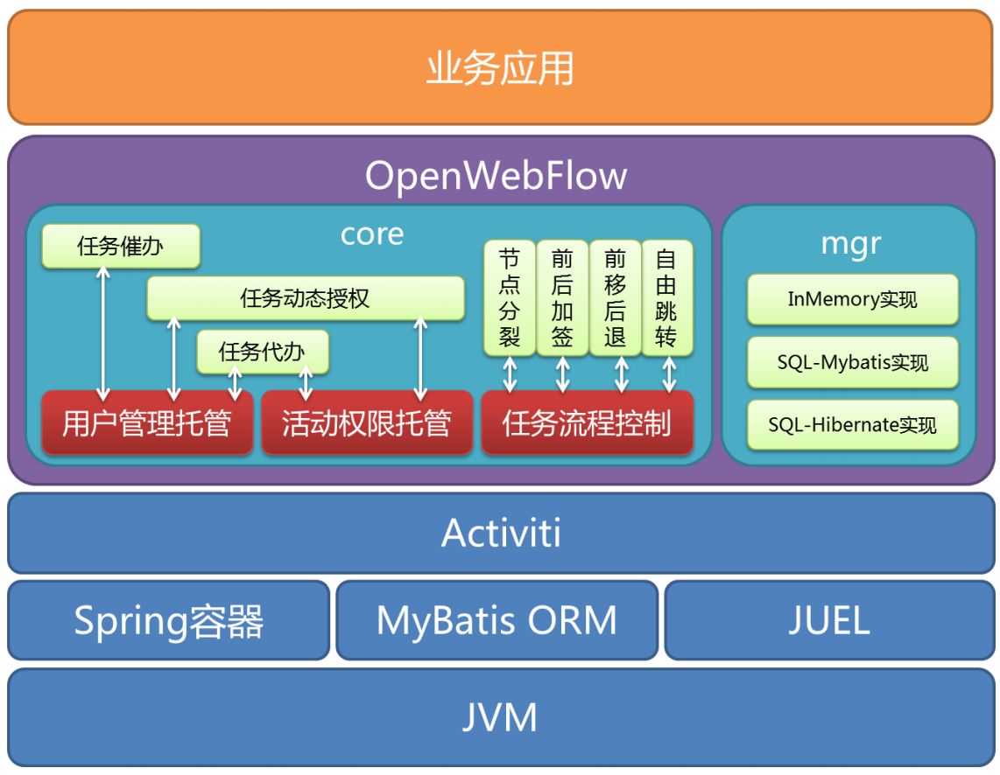

# 第3章 工作流（WorkFlow）

* 需求初衷：
    * 调度：shell脚本程序，java程序，mapreduce程序、hive脚本等。
    * 定时调度：
    * 可视化：
    * 调度过程管理：
* 定义：
    * 工作流是将一组任务组织起来一完成某个经营过程：定义了任务的出发顺序和触发条件，每个任务可以由一个或多个软件系统完成，也可以由一个或一组人完成，还可以由一个或多个人与系统软件协作完成；
工作流引擎的基本概念：

* 解决问题：比如用户A填一张表，提交后，会给另一个用户B（通常是另一类较色）审核，他们觉得没有问题就确定，最后给原来A用户发送一封邮件。在实现这一类系统时我们会设计一张任务表，这个表中有一列成为Status(状态)：用户提交后状态是0，审核通过后状态是1，审核没通过状态是2。衍生扩展性：
    * 将任务状态表和历史记录表抽象出来成为 TaskService 和 HistoryService 模块
    * 将定时任务以及抽象成 BusinessCalendar 模块
    * 将用户管理的部分抽取出来成为 Identity 模块
    * 将发送邮件抽象成 EmailTask 模块，使用的时候只需要配置一下收件人和内容即可
    * 将需要调用Java类处理业务逻辑功能抽象成 Action，使用时配置一下具体调用哪一个Java类
    * 最后做一个流程管理的通用界面，能实时监控流程的执行情况

* 语言：BMPN

## 3.1 Activiti 和 Activiti Cloud

概述：
    * Activiti Cloud是第一个Cloud Native BPM框架，旨在为源环境中的BPM实施提供可扩展和透明的解决方案。
* 难度

* 优点：
    * 原生支持Spring：可轻松进行Spring集成，非常方便管理事务。
    * 专门的流程设计器：Eclipse Designer、基于Web的Activiti Modeler流程设计器。
    * 支持启动引擎后随时热部署。
    * 依赖jar比JBPM少

* 缺点
    * 无持久化标准。

* 支持：
    * 数据库：H2、MySQL、Oracle、Postgres、MSSQL、DB2

* 原理

* 使用

* 其他

* 对比其他：

* 参考：
    * https://www.jianshu.com/p/86c0a4afd28e
    * http://www.mossle.com/docs/activiti/index.html
    * http://www.mossle.com/activiti.do

Activiti Cloud版本7.x

https://activiti.gitbook.io/activiti-7-developers-guide/overview

* Activiti实战：
    BPM：业务流程管理。
    BPMN 2.0符号参考：https://camunda.com/bpmn/reference/#!/reference

## 3.2 JBPM
概述：
    * JAVA业务流程管理，是一个可扩展、灵活、开源的流程引擎。
* 难度

* 优点：
    * 

* 缺点
    * 依赖Jar包多。
    * 一个RuntimeService只能在启动的时候指定bpmn资源，一旦启动后便不再能够去更新或者增加bpmn了。

* 支持：
    * 数据库：

* 原理

* 使用

* 其他

## 3.3 其他：
* OpenWebFlow：
    OpenWebFlow是基于Activiti扩展的工作流引擎。是一个新兴的基于 Apache 许可的支持 BPMN 2.0 标准的开源 BPM 产品，它是一个轻量级，可嵌入的 BPM 引擎，并且提供了功能丰富的开发和流程设计工具。OpenWebFlow与业务应用系统之间的关系如下图所示。

    * OpenWebFlow扩展的功能包括：
        * 完全接管了Activiti对活动（activity）权限的管理：  Activiti允许在设计model的时候指定每个活动的执行权限，但是，业务系统可能需要根据实际情况动态设置这些任务的执行权限（如：动态的Group）。OpenWebFlow完全实现了与流程定义时期的解耦，即用户对活动的访问控制信息单独管理（而不是在流程定义中预先写死），这样有利于动态调整权限，详见自定义活动权限管理；  
        * 完全接管了Activiti对用户表（IDENTITY_XXX表）的管理：  在标准的工作流定义中，每个节点可以指定其候选人和候选用户组，但是比较惨的是，Activiti绑架了用户信息表的设计！这个是真正致命的，因为几乎每个业务系统都会属于自己的用户信息结构（包括User/Group/Membership），但不一定它存储在Activiti喜欢的那个库中，表的结构也不一定一样，有的时候，某些信息（如：动态的Group）压根儿就不采用表来存储。OpenWebFlow剥离了用户信息表的统一管理，客户程序可以忘掉Activiti的用户表、群组表、成员关系表，详见自定义用户成员关系管理；  
        * 允许运行时定义activity：  彻底满足“中国特色”，并提供了安全的（同时也是优雅的）催办、代办、加签（包括前加签/后加签）、自由跳转（包括前进/后）、分裂节点等功能；
    * 缺点：
        * 代码迭代慢：最近一次更新三年前（https://github.com/bluejoe2008/openwebflow）。
        * 参考资料少。

* SWF：与其说是工作流引擎，不如说是分布式计算调度框架，SWF中只包括Task和History两部分，甚至是每个Task之间如果要传递一些数据的话，都只能通过第三方存储（比如Message Queue或者Redis），不过这也给了编程更大的灵活性，问题是这种灵活性是不是非常需要。

## 3.4 总结
    目前流行大规模使用的开源框架有Activiti和JBPM。
* 工作流引擎选择（为何使用activiti而不是jbpm）：参见 https://blog.csdn.net/classfoo/article/details/20645779
