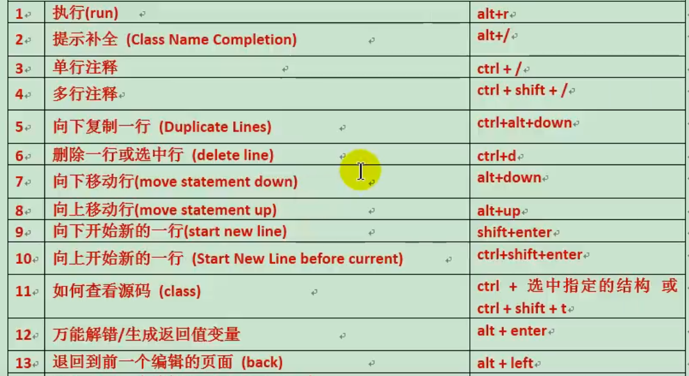
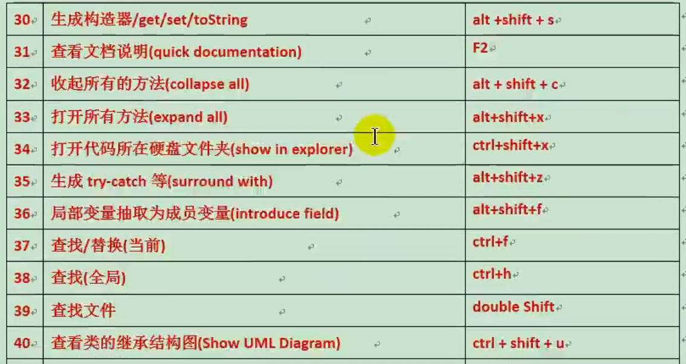
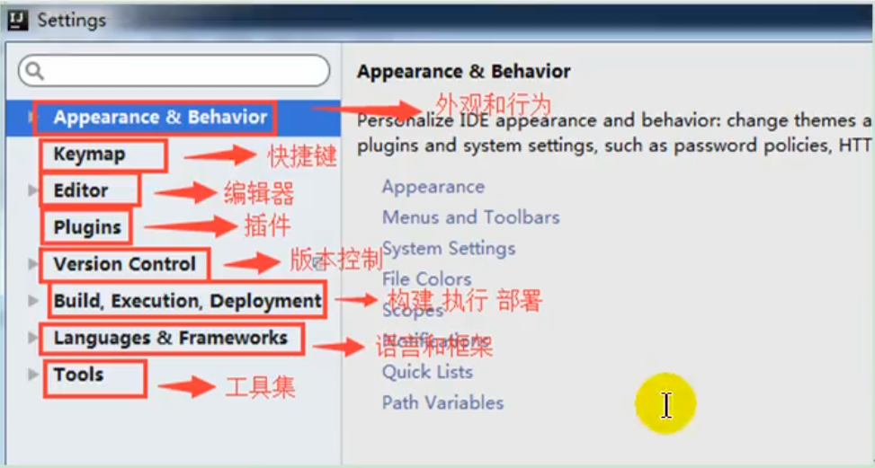

# 第5章 IDEA
# JetBrains公司介绍
https://www.jetbrains.com/
* WebStorm：用于开发JavaScript、HTML5、CSS3等前端技术。
* PyCharm：用于开发python。
* PhpStorm：用于开发PHP。
* RubyMine：用于开发Objective -C/Swift。
* Clion：用于开发C/C++。
* DataGrip：用于开发数据库和SQL。
* Rider：用于开发.NET。
* GoLand：用于开发Go。

# 安装目录说明
* bin：容器，执行文件和启动参数等。
* help：快捷键文档和其他帮助文档。
* jre64:64位java运行环境。
* lib：idea依赖的类库。
* license：各个插件许可。
* plugin：插件。

# 代码快捷键
* psvm 回车：自动生成main方法。
* sout：System.out.Println()。
* Eclipse的快捷键：
  

>常用快捷键
>* Ctrl + H ：查看 树形 的类层次结构图--子类。
>* Alt + 7 : 展示类中所有方法。

# 配置说明

