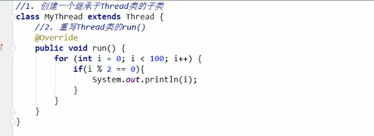
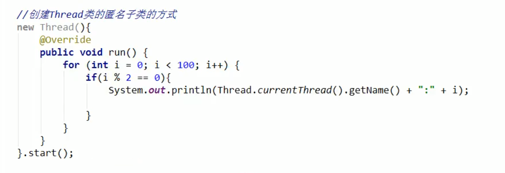
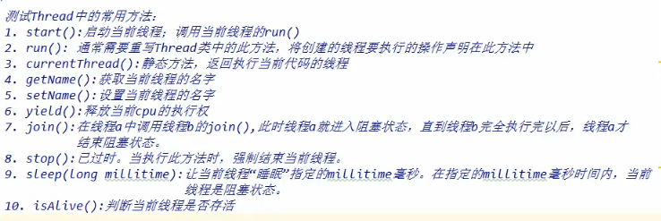
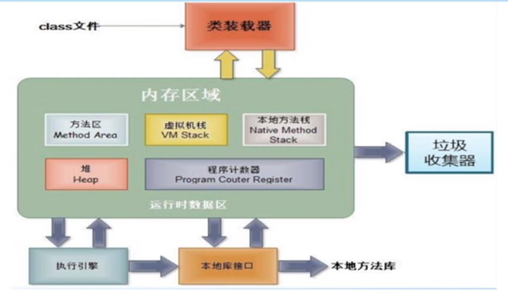
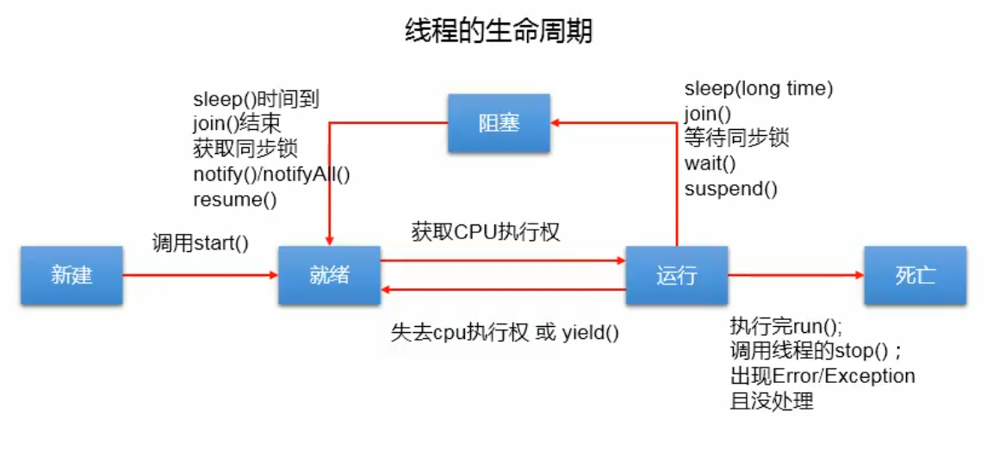
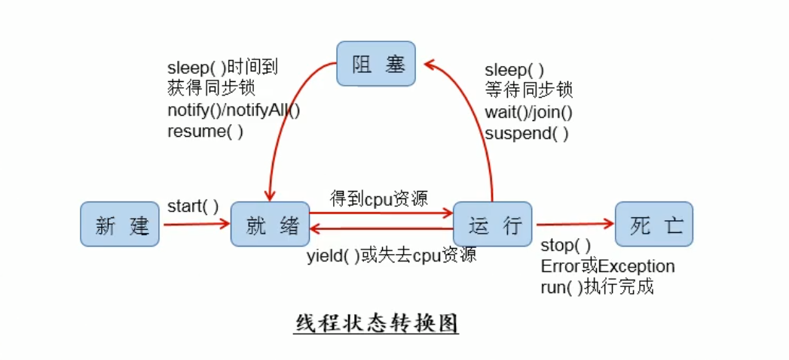

# 第6章 多线程

## 基本概念：程序、进程、线程
* 程序（program）是为完成特定任务、用某种语言编写的一组指令的集合。即指一段静态的代码，静态对象。
* 进程（process）是程序的一次执行过程，或是正在运行的一个程序。是一个动态的过程：有它自身的产生、存在和消亡的过程。——生命周期
    * 如：运行中的QQ，运行中的MP3播放器。
    * 程序是静态的，进程是动态的。
    * 进程作为资源分配的单元，系统在运行时会为每个进程分配不同的内存区域。
* 线程（thread），进程可进一步细化为线程，是一个程序内部的一条执行路径。
    * 若一个进程同一时间并行执行多个线程，就是支持多线程的
    * 线程作为调度和执行的单元，每个线程拥有独立的运行栈和程序计数器（pc），线程切换的开销小。
    * 一个进程中的多个线程共享相同的内存单元/内存地址空间->它们从同一堆中分配对象，可以访问相同的变量和对象。这就使得线程间通信更简便、高效。
    但多个线程操作共享的系统资源可能就会带来安全的隐患。
* 单核CPU和多核CPU的理解
    * 单核CPU，其实是一种假的多线程，因为在一个时间单元内，也只能执行一个线程的任务。例如：虽热有多车道，但是收费站只有一个工作人员在收费，只有
    受理费才能通过，那么CPU就好比收费人员。如果有某个人不想交钱，那么收费人员可以把他“挂起”。但是因为CPU时间单元特别短，因此感觉不出来。
    * 如果是多核的话，才能更好地发挥多线程的效率。
    * 一个Java应用程序java.exe，其实至少有三个线程：main()主线程，gc()垃圾回收线程，异常处理线程。当然如果发生一次，会影响主线程。
* 并行与并发
    * 并行：多个CPU同时执行多个任务。比如：多个人同事做不同的事。
    * 并发：一个CPU（采用时间片）同时执行多个任务。

* 使用多线程的优点： 背景：以单核CPU为例，只使用单个线程先后完成多个任务（调用多个方法），肯定比用多个线程来完成用的时间更短，为何需要多线程呢？
  * 1.提高应用程序的响应。对图形化界面更有意义，可增强用户体验。
  * 2.提高计算机系统CPU的利用率。
  * 3.改善程序结构。将既长又复杂的进程分为多个线程，独立运行，利于理解和修改。

* 何时需要多线程：
  * 程序需要同时执行两个或多个任务。
  * 程序需要实现一些需要等待的任务时，如用户输入、文件读写操作、网络操作、搜索等。
  * 需要一些后台运行的程序时。

## 线程的创建和使用

### 多线程的创建，方式一：继承Thread类
* 1.创建一个继承于Thread类的子类。
* 2.重写Thread类的run()：》將此线程执行的操作声明在run()中。
* 3.创建Thread类的子类的对象
* 4.通过此对象调用start()：》①启动当前线程 ②调用当前线程的run()

继承实现实例：

匿名内部类方式：


### Thread类的有关方法
* void start()：启动线程，并执行run()方法
* run()：现在在被调用时执行的操作
* String getName()：返回线程的名称
* void setName(String name)：设置该线程名称
* static Thread currentThread()：返回当前线程。在Thread子类中就是this，通常用于主线程和Runnable实现类
* static void yield()：线程让步
  * 暂停当前正在执行的线程，把执行机会让给优先级相同或更高的线程
  * 若队列中没有同优先级的线程，忽略此方法
* join()：当某个程序执行流中调用其他线程的join()方法时，调用线程将被阻塞，直到join()方法加入的join线程执行完为止
  * 低优先级的线程也可以获得执行
* static void sleep(long millis):（指定时间：毫秒）
  * 令当前活动线程在指定时间段内放弃对CPU控制，使其他线程有机会被执行，时间到后重排队。
  * 抛出InterruptedException异常
* stop()：强制线程生命期结束，不推荐使用
* boolean isAlive()：返回boolean，判断线程是否还活着。


### 线程的调度
* 调度策略
  * 时间片
  
  * 抢占式：该优先级的线程抢占CPU
* Java的调度方法
  * 相同优先级的线程组成先进先出队列（先到先服务），使用时间片策略
  * 对高优先级，使用优先调度的抢占式策略

### 线程的优先级
* 线程的优先等级
  * MAX_PRIORITY:10
  * MIN_PRIORITY:1
  * NORM_PRIORITY:5
* 涉及的方法
  * getPriority()：返回线程优先值
  *setPriority(int newPriority)：改变线程的优先级
* 说明
  * 线程创建时继承父线程的优先级
  * 低优先级只是获得调度的概率低，并非一定是高优先级线程之后才被调用

### 创建多线程的方式（4种）
* 继承Thread
  * 1.创建一个继承Thread类的子类
  * 2.重新Thread类的run()
  * 3.创建Thread类的子类的对象
  * 4.通过此对象调用start()
* 实现Runnable接口
  * 1.创建一个实现了Runnable接口的类
  * 2.实现类区实现Runnable中的抽象方法：run()
  * 3.创建实现类的对象
  * 4.将此对象作为参数传递到Thread类的构造器中，创建Thread类的对象
  * 5.通过Thread类的对象调用start()：启动线程。调用当前线程的run()。调用了Runnable类型的target的run()即构造器传入的。
* 比较创建线程的两种方式。（继承Thread和实现Runnable接口）
  * 开发中：优先选择，实现Runnable接口的方式
    * 原因：
      * 1.实现的方式没有类的单继承的局限性
      * 2.实现的方式更适合用来处理多个线程有共享数据的情况。
  * 联系：public class Thread implements Runnable
  * 相同点：两种方式都需要重写run()，将线程要执行的逻辑声明在run()中。

* 程序、进程、线程的理解
> 
> 进程可以细化为多个线程。
> 每个线程，拥有自己独立的：栈、程序计数器
> 多个线程，共享同一个进程中的结构：方法区、堆。
> 一个Java应用程序java.exe，其实有多个线程：main()主线程，gc垃圾回收线程，异常处理线程。

* 线程的分类：Java中的线程分为两类：一种是 守护线程，一种是 用户线程。
  * 它们在几乎每个方面都是相同的，唯一的区别是判断JVM何时离开。
  * 守护线程是用力服务用户线程的，通过在start()方法前调用thread.setDaemon(true)可以把一个用户线程变成一个守护线程。
  * Java垃圾回收就是一个典型的守护线程。
  * 若JVM中都是守护线程，当前JVM将推出。

### 线程的生命周期
* JDK中用Thread.State类定义了线程的几种状态：要想实现多线程，必须在主线程中创建新的线程对象。Java语言使用Thread类及其子类
的对象来表示线程，在它的一个完整的生命周期中通常要经历如下的五种状态：
  * 新建：当一个Thread类或其子类的对象被声明并创建时，新生的线程对象处于新建状态。
  * 就绪：处于新建状态的线程被start()后，将进入线程队列等待CPU时间片，此时它已具备了运行的条件，只是没有分配到CPU资源。
  * 运行：当就绪的线程被调度并获得CPU资源时，便进入运行状态，run()方法定义了线程的操作和功能。
  * 阻塞：在某种特殊情况下，被人为挂起或执行输入输出操作时，让出CPU并临时终止自己的执行，进入阻塞状态。
  * 死亡：线程完成了它的全部工作或线程被提前强制性地终止或出现异常导致结束。



### 线程的同步
解决思路：当一个线程A操作 数据AA 的时候，其他线程不能参与进来。知道线程A操作完 数据AA ,其他线程才可以开始操作 数据AA。这种情况即使线程A出现阻塞，也不能被改变。

Java中：通过同步机制，来解决线程安全问题。
* 方式一：同步代码块
```  
synchronized(同步监视器){
  //需要被同步的代码
  }  
  ```
> 说明：
> * 1.操作共享数据的代码，即为需要被同步的代码
> * 2.共享数据：多个线程共同操作的变量。
> * 3.同步监视器，俗称：锁。任何一个类的对象，都可以充当锁。
>     要求：多个线程必须要共同一把锁。


* 方式二：同步方法

* 同步的方式：
  * 好处：解决了线程的安全问题。
  * 局限性：操作同步代码时，只能有一个线程参与，其他线程等待。


https://www.bilibili.com/video/BV1G64y1u7zt?p=2&spm_id_from=pageDriver


