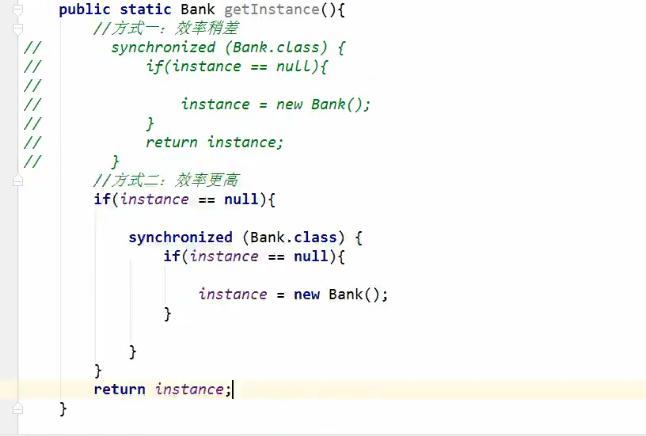

# 第6章 多线程

## 基本概念：程序、进程、线程
* 程序（program）是为完成特定任务、用某种语言编写的一组指令的集合。即指一段静态的代码，静态对象。
* 进程（process）是程序的一次执行过程，或是正在运行的一个程序。是一个动态的过程：有它自身的产生、存在和消亡的过程。——生命周期
    * 如：运行中的QQ，运行中的MP3播放器。
    * 程序是静态的，进程是动态的。
    * 进程作为资源分配的单元，系统在运行时会为每个进程分配不同的内存区域。
* 线程（thread），进程可进一步细化为线程，是一个程序内部的一条执行路径。
    * 若一个进程同一时间并行执行多个线程，就是支持多线程的
    * 线程作为调度和执行的单元，每个线程拥有独立的运行栈和程序计数器（pc），线程切换的开销小。
    * 一个进程中的多个线程共享相同的内存单元/内存地址空间->它们从同一堆中分配对象，可以访问相同的变量和对象。这就使得线程间通信更简便、高效。
    但多个线程操作共享的系统资源可能就会带来安全的隐患。
* 单核CPU和多核CPU的理解
    * 单核CPU，其实是一种假的多线程，因为在一个时间单元内，也只能执行一个线程的任务。例如：虽热有多车道，但是收费站只有一个工作人员在收费，只有
    受理费才能通过，那么CPU就好比收费人员。如果有某个人不想交钱，那么收费人员可以把他“挂起”。但是因为CPU时间单元特别短，因此感觉不出来。
    * 如果是多核的话，才能更好地发挥多线程的效率。
    * 一个Java应用程序java.exe，其实至少有三个线程：main()主线程，gc()垃圾回收线程，异常处理线程。当然如果发生一次，会影响主线程。
* 并行与并发
    * 并行：多个CPU同时执行多个任务。比如：多个人同事做不同的事。
    * 并发：一个CPU（采用时间片）同时执行多个任务。

* 使用多线程的优点： 背景：以单核CPU为例，只使用单个线程先后完成多个任务（调用多个方法），肯定比用多个线程来完成用的时间更短，为何需要多线程呢？
  * 1.提高应用程序的响应。对图形化界面更有意义，可增强用户体验。
  * 2.提高计算机系统CPU的利用率。
  * 3.改善程序结构。将既长又复杂的进程分为多个线程，独立运行，利于理解和修改。

* 何时需要多线程：
  * 程序需要同时执行两个或多个任务。
  * 程序需要实现一些需要等待的任务时，如用户输入、文件读写操作、网络操作、搜索等。
  * 需要一些后台运行的程序时。

## 线程的创建和使用

### 多线程的创建，方式一：继承Thread类
* 1.创建一个继承于Thread类的子类。
* 2.重写Thread类的run()：》將此线程执行的操作声明在run()中。
* 3.创建Thread类的子类的对象
* 4.通过此对象调用start()：》①启动当前线程 ②调用当前线程的run()

继承实现实例：

匿名内部类方式：
```aidl
    //继承方式
  new Thread(){
  public void run(){
    super.run();
  }
  }.start();
```
```aidl
    //实现Runnable接口方式
  new Thread(new Runnable(){
      public void run(){
      super.run();
     }
  }).start();
```


### Thread类的有关方法
* void start()：启动线程，并执行run()方法
* run()：现在在被调用时执行的操作
* String getName()：返回线程的名称
* void setName(String name)：设置该线程名称
* static Thread currentThread()：返回当前线程。在Thread子类中就是this，通常用于主线程和Runnable实现类
* static void yield()：线程让步
  * 暂停当前正在执行的线程，把执行机会让给优先级相同或更高的线程
  * 若队列中没有同优先级的线程，忽略此方法
* join()：当某个程序执行流中调用其他线程的join()方法时，调用线程将被阻塞，直到join()方法加入的join线程执行完为止
  * 低优先级的线程也可以获得执行
* static void sleep(long millis):（指定时间：毫秒）
  * 令当前活动线程在指定时间段内放弃对CPU控制，使其他线程有机会被执行，时间到后重排队。
  * 抛出InterruptedException异常
* stop()：强制线程生命期结束，不推荐使用
* boolean isAlive()：返回boolean，判断线程是否还活着。


### 线程的调度
* 调度策略
  * 时间片
  
  * 抢占式：该优先级的线程抢占CPU
* Java的调度方法
  * 相同优先级的线程组成先进先出队列（先到先服务），使用时间片策略
  * 对高优先级，使用优先调度的抢占式策略

### 线程的优先级
* 线程的优先等级
  * MAX_PRIORITY:10
  * MIN_PRIORITY:1
  * NORM_PRIORITY:5
* 涉及的方法
  * getPriority()：返回线程优先值
  *setPriority(int newPriority)：改变线程的优先级
* 说明
  * 线程创建时继承父线程的优先级
  * 低优先级只是获得调度的概率低，并非一定是高优先级线程之后才被调用

### 创建多线程的方式（4种）
* 继承Thread
  * 1.创建一个继承Thread类的子类
  * 2.重新Thread类的run()
  * 3.创建Thread类的子类的对象
  * 4.通过此对象调用start()
* 实现Runnable接口
  * 1.创建一个实现了Runnable接口的类
  * 2.实现类区实现Runnable中的抽象方法：run()
  * 3.创建实现类的对象
  * 4.将此对象作为参数传递到Thread类的构造器中，创建Thread类的对象
  * 5.通过Thread类的对象调用start()：启动线程。调用当前线程的run()。调用了Runnable类型的target的run()即构造器传入的。
* 比较创建线程的两种方式。（继承Thread和实现Runnable接口）
  * 开发中：优先选择，实现Runnable接口的方式
    * 原因：
      * 1.实现的方式没有类的单继承的局限性
      * 2.实现的方式更适合用来处理多个线程有共享数据的情况。
  * 联系：public class Thread implements Runnable
  * 相同点：两种方式都需要重写run()，将线程要执行的逻辑声明在run()中。

* 程序、进程、线程的理解
> 
> 进程可以细化为多个线程。
> 每个线程，拥有自己独立的：栈、程序计数器
> 多个线程，共享同一个进程中的结构：方法区、堆。
> 一个Java应用程序java.exe，其实有多个线程：main()主线程，gc垃圾回收线程，异常处理线程。

* 线程的分类：Java中的线程分为两类：一种是 守护线程，一种是 用户线程。
  * 它们在几乎每个方面都是相同的，唯一的区别是判断JVM何时离开。
  * 守护线程是用力服务用户线程的，通过在start()方法前调用thread.setDaemon(true)可以把一个用户线程变成一个守护线程。
  * Java垃圾回收就是一个典型的守护线程。
  * 若JVM中都是守护线程，当前JVM将推出。

### 线程的生命周期
* JDK中用Thread.State类定义了线程的几种状态：要想实现多线程，必须在主线程中创建新的线程对象。Java语言使用Thread类及其子类
的对象来表示线程，在它的一个完整的生命周期中通常要经历如下的五种状态：
  * 新建：当一个Thread类或其子类的对象被声明并创建时，新生的线程对象处于新建状态。
  * 就绪：处于新建状态的线程被start()后，将进入线程队列等待CPU时间片，此时它已具备了运行的条件，只是没有分配到CPU资源。
  * 运行：当就绪的线程被调度并获得CPU资源时，便进入运行状态，run()方法定义了线程的操作和功能。
  * 阻塞：在某种特殊情况下，被人为挂起或执行输入输出操作时，让出CPU并临时终止自己的执行，进入阻塞状态。
  * 死亡：线程完成了它的全部工作或线程被提前强制性地终止或出现异常导致结束。


### 线程的同步
解决思路：当一个线程A操作 数据AA 的时候，其他线程不能参与进来。知道线程A操作完 数据AA ,其他线程才可以开始操作 数据AA。这种情况即使线程A出现阻塞，也不能被改变。

Java中：通过同步机制，来解决线程安全问题。
* 方式一：同步代码块
```  
synchronized(同步监视器){
  //需要被同步的代码
  }  
  ```
> 说明：
> * 1.操作共享数据的代码，即为需要被同步的代码。-->不能包含代码多了，也不能包含代码少了。
> * 2.共享数据：多个线程共同操作的变量。
> * 3.同步监视器，俗称：锁。任何一个类的对象，都可以充当锁。
>     要求：多个线程必须要共同一把锁。

* 方式二：同步方法
```aidl//实例 同步方法

```
> 说明：
> * 1.同步方法仍然涉及到同步监视器，只是不需要我们显式的声明。
> * 2.非静态的同步方法，同步监视器是：this。
> * 3.静态的同步方法，同步监视器是：当前类本身。

* 方式三：Lock锁
```aidl//实例 Lock

```
> 说明：
> * 1.实例化ReentrantLock（Lock接口实现）。
> * 2.调用锁定lock()方法。
> * 3.调用解锁方法：unlock()方法。

* synchronized 与 Lock 的异同。
  * 相同点：都解决线程安全问题。
  * 不同点：
    * synchronized：机制在执行完相同的同步代码以后，自动的释放同步监视器。
    * Lock需要手动的启动同步（lock()），同时结束同步也需要手动的实现（unLock()）。
* synchronized与Lock的对比：
  * 1.Lock是显示锁（手动开启和关闭锁，别忘记关闭锁），synchronized是隐式锁，出了作用域自动释放。
  * 2.Lock只有代码块锁，synchronized有代码块锁和方法锁。
  * 3.使用Lock锁，JVM将花费较少的时间来调度线程，性能更好。并且具有更好的扩展性（提供更多的子类）。
> 优先使用顺序：Lock --> 同步代码块（已经进入了方法体，分配了响应资源） --> 同步方法（在方法体外）。  


* 同步的方式：
  * 好处：解决了线程的安全问题。
  * 局限性：操作同步代码时，只能有一个线程参与，其他线程等待。

* 使用同步机制将单例模式中的懒汉式改为线程安全的


### 线程的死锁问题
* 死锁
  * 不同的线程分别占用对方需要的同步资源不放弃，都在等待对方放弃自己需要的同步资源，就形成了线程的死锁。
  * 出现死锁后，不会出现异常，不会出现提示，只是所有的线程都处于阻塞状态，无法继续
* 解决方法
  * 专门的算法、原则
  * 尽量减少同步资源的定义
  * 尽量避免嵌套同步

* Lock(锁)
  * 从JDK5.0开始，Java提供了更强大的线程同步机制——通过显示定义同步锁对象来实现同步。同步锁使用Lock对象充当。
  * java.util.concurrent.locks.Lock接口是控制多个线程对共享资源进行访问的工具。锁提供了对共享资源的独占访问，每次只能有一个线程对Lock对象加锁，
  线程开始访问共享资源之前应先获得Lock对象。
  * ReentrantLock类实现了Lock，它拥有与synchronized相同的并发性和内存语义，在实现线程安全的控制中，比较常用的是ReentrantLock，可以显示加锁、释放锁。    

* 实例：


###  线程的通信

线程通信的例子：使用两个线程打印1-100。线程1，线程2 交替打印
> wait(); //会释放锁 notify()//唤醒线程;
> 涉及到的三个方法：
> wait():一旦执行此方法，当前线程就进入阻塞状态，并释放同步监视器。
> notify():一旦执行此方法，就会唤醒被wait的一个线程。如果有多个线程被wait，就唤醒优先级高的那个。
> notifyAll()：一旦执行此方法，就会唤醒所有被wait的线程。
> 
> 说明：
> 1. wait()，notify()，notifyAll()三个方法只能使用在同步方法或者同步代码块中.
> 2. wait()，notify()，notifyAll()三个方法的调用者必须是同步代码块或同步方法中的同步监视器。
>   否则，会出现IllegalMonitorStateException异常。
> 3. wait()，notify()，notifyAll()三个方法定义在java.lang.Object中。
> 
> * sleep()和wait()的异同？
>   * 相同点：一旦执行到方法，都可以使得当前的线程进入阻塞状态。
>   * 不同点：
>     * 1.两个方法声明的位置不同：Thread类中声明sleep()，Object类中声明wait()。
>     * 2.调用的要求不同：sleep()可以在任何需要的场景下调用。wait()必须使用在同步代码块或同步方法中。
>     * 3.关于是否释放同步监视器：如果两个方法都使用在同步代码块或同步方法中，sleep()不会是否同步监视器，wait()会释放同步监视器。

### JDK5.0新增线程创建方式

新增方式一：实现Callable接口
* 与使用Runnable相比，Callable功能更强大些
  * 相比run()方法，可以有返回值
  * 方法可以跑出异常
  * 支持泛型的返回值
  * 需要借助FutureTask类，比如获取返回结果
  * Future接口
    * 可以对具体Runnable、Callable任务的执行结果进行取消、查询是否完成、获取结果等。
    * FutrueTask是Futrue接口的唯一的实现类
    * FutrueTask同时实现了Runnable、Future接口。它既可以作为Runnable被线程执行，又可以作为Future得到Callable的返回值。
  ```aidl
    FutureTask futureTask = new FutureTask(Callable接口实现)；
    new Thread(futureTask).start();
    //get()方法返回值即为FutureTask构造器参数Callable实现类重写call()的返回值。
    Object sum = futureTask.get();
  ```
* 实现步骤：
  * 1.创建一个实现Callable的实现类
  * 2.实现call方法，将此线程需要执行的操作声明在call()中
  * 3.创建Callable接口实现类的对象
  * 4.将此Callable接口实现类的对象作为参数传递到FutureTask构造器中，创建FutureTask的对象。
  * 5.将FutureTask的对象作为参数传递到Thread类的构造器中，创建Thread对象，并调用start()方法。
  * 6.获取Callable中call方法的返回值。

* Callable接口的方式创建多线程比实现Runnable接口创建多线程方式强大？
  * 1.call()可以有返回值。
  * 2.call()可以抛出异常，被外面的操作捕获，获取异常的信息。
  * 3.Callable是支持泛型的。

新增方式二：使用线程池
* 背景：经常创建和销毁、使用量特别大的资源，比如并发情况下的线程，对性能影响很大。
* 思路：提前创建好多个线程，放入线程池中，使用时直接获取，使用完放回池中。可以避免频繁创建销毁、实现重复利用。类似生活中的公共交通工具。
* 好处：
  * 提高响应速度（减少了创建新线程的时间）
  * 降低资源消耗（重复利用线程池中线程，不需要每次都创建）
  * 便于线程管理
    * corePollSize：核心池的大小
    * maximumPollSize：最大线程数
    * keepAliveTime：线程没有任务时最多保持多长时间后会终止
    * ……

线程池相关API
* JDK5.0起提供了线程池相关API:ExecutorService和Executors
* ExecutorService：真正的线程池接口。常见子类ThreadPoolExecutor
  * void execute(Runnable command)：执行任务/命令，没有返回值，一般用来执行Runnable。
  * <T>Future<T>submit(Callable<T>task)执行任务，有返回值，一般用来执行Callable。
  * void shutdown()：关闭线程池
* Executors：工具类、线程池的工厂类，用于创建并返回不同类型的线程池
  * Executors.newCachedThreadPool()：创建一个可根据需要创建的新线程的线程池
  * Executors.newFixedThreadPool(n)：创建一个可重用固定线程数的线程池
  * Executors.newSingleThreadExecutor()：创建一个只有一个线程的线程池
  * Executors.newScheduledThreadPool(n)：创建一个线程池，它可安排在给定延迟后运行命令或者定期地执行。

* 实现：
  * 1.提供指定线程数量的线程池
  * 2.执行指定的线程的操作。需要提供实现Runnable接口或Callable接口实现类的对象
  * 3.关闭连接池。
> 


