# 参考资料见官网
* Spring Cloud：
  * https://cloud.spring.io/spring-cloud-static/Hoxton.SR1/reference/htmlsingle/
  * Spring Cloud中文文档：https://www.bookstack.cn/read/spring-cloud-docs/docs-index.md
* Spring Boot：https://docs.spring.io/spring-boot/docs/2.2.2.RELEASE/reference/htmlsingle/


* 内容包含：SpringCloud + SpringCLoud alibaba
* 技术储备：java8+maven+git、github+Nginx+RabbotMQ+SpringBoot2.0

* 什么是微服务：
> 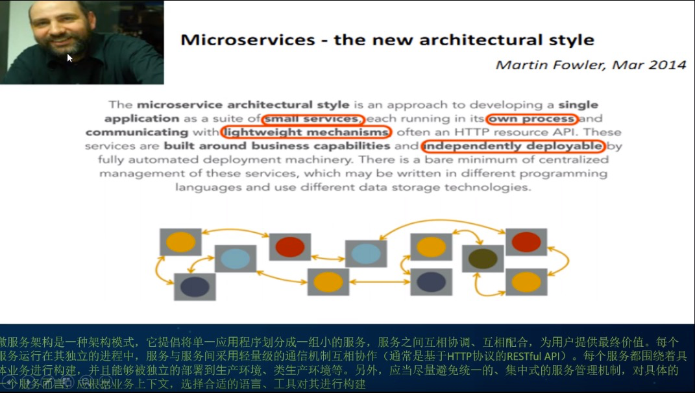

* 微服务的组成：
> 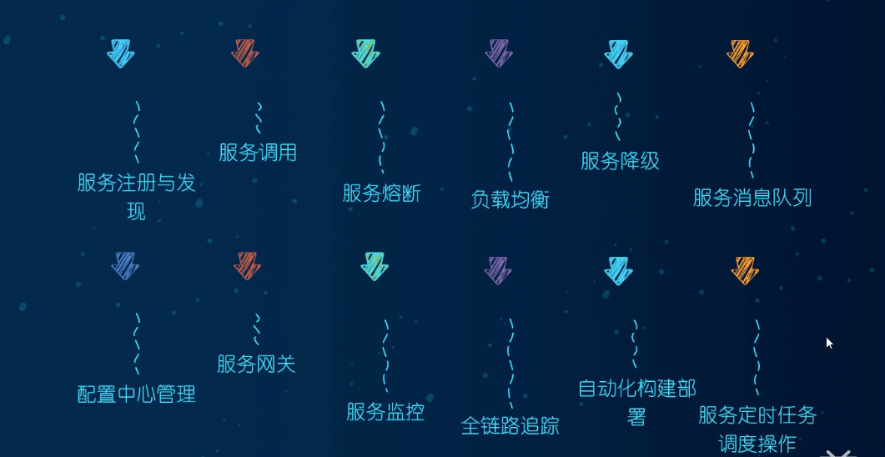

* 7.1小结大纲
> 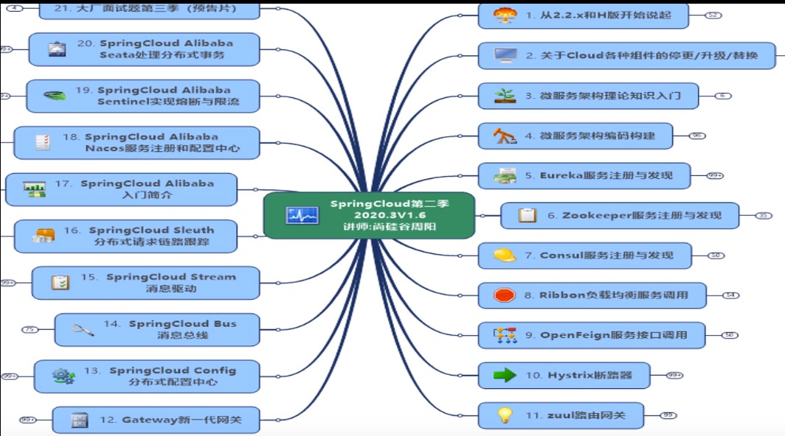


# 7.1.1.1 Springboot版本选择：
* git源码地址：https:github.com/spring-projects/spring-boot/releases/
* SpringBoot2.0新特性
  * 官网说明：https:github.com/spring-projects/spring-boot/wiki/Spring-Boot-2.0-Release-Notes。
    * Spring Framework升级：SpringBoot2.2的底层Spring Framework版本升级为5.2。
    * JMX默认禁用：默认情况下不再启用JMX。可以使用配置属性spring.jmx.enabled=true启用此功能。如果使用IDE功能来管理应用程序，则可能还需要在该位置启用该标志。
    * Java 13支持：Spring Boot2.2增加了对Java13的支持。还支持Java8和11。
    * 性能提升：
      > 通过使用proxyBeanMethods=false Spring Boot的@Configuration类，减少了启动时间和内存使用量。proxyBeanMethods是@ConfigurationSpring Framework5.2M1
      > 引入的新属性。
      > 
      > proxyBeanMethods也可作为一个属性@SpringBootApplication和@SpringBootConfiguration。
      > 
      > 在使用bootRunGradle或spring-boot:runMaven在开发时启动应用程序时，JVM将配置有标志（-Vverify:none和-XX:TieredStopAtLevel=1）
      > 以对其进行优化以减少启动时间。在JDK13上运行时，-Xverify:none未指定，因为已弃用。
      > 
      > 此版本中还进行了其他一些性能改进：
      > * 绑定大量配置属性所需的时间已大大减少。
      > * 当Spring Boot PersistenceUnit通过扫描JPA实体完全准备一个时，由于它是冗余的，因此Hibernate自己的实体扫描已被禁用。
      > * 自动配置中的注入点已经过改进，仅适用于必须创建bean的情况。
      > * 现在仅在启用和公开端点的情况下（通过JMX或HTTP）创建与Actuator端点相关的Bean。
      > * 编解码器自动配置的条件已得到改善，以便在不再使用编解码器时不再对其进行配置。
      > * Tomcat的MBean注册表默认情况下处于禁用，从而将Tomcat的内存占用量减少了大约2M。
    * 延迟初始化：
      > 现在可以通过该spring.main.lazy-initialization属性启用全局延迟初始化以减少启动时间。请注意，使用该功能可能需要付出一定的成本或代价：
      > 
      > 在进行任何的延迟的初始化时，HTTP请求的处理可能需要更长的时间。
      > 
      > 现在，通常不会在启动时发生故障，直到以后。
      > 
      > 通过使用注释各自的定义，各个bean可以选择退出延迟初始化@Lazy(false)。如果无法@Lazy(false)选择退出延迟初始化，LayzyInitializationExcludeFilter
      > 则可以使用Bean代替。例如，要永远不要将IntegrationFlowbean设置为惰性，可以使用以下代码：
      > ```java
      > @Bean
      > static LazyInitializationExcludeFilter integrationLazyInitExcludeFilter() {
      > return LazyInitializationExcludeFilter.forBeanTypes(IntegrationFlow.class);
      > }
      > ```
    * Junit5：
      > spring-boot-starter-test现在默认提供JUnit5。默认情况下，包括JUnit的老式引擎以支持现有的基于JUnit 4的测试类，以便你可以在准备好迁移到JUnit 5
      > 时进行迁移。也可以在同一模块中混合使用基于JUnit 4和基于JUnit5的测试类。这是你可以逐步迁移到JUnit 5。
      > 
      > 注意：
      > JUnit4的Maven Surefire插件不支持该listener属性。如果具有类似以下内容的Maven配置：
      > ```xhtml
      > <configuration>
      >     <properties>
      >         <property>
      >             <name>listener</name>
      >             <value>com.example.CustomRunListener</value>
      >         </property>
      >     </properties>
      > </configuration>
      >```
      > 不能使用，junit-vintage-engine而需要显式回滚到JUnit4:
      > ```xhtml
      > <dependencies>
      > <dependency>
      > <groupId>org.springframework.boot</groupId>
      > <artifactId>spring-boot-starter-test</artifactId>
      > <scope>test</scope>
      > <exclusions>
      >     <exclusion>
      >          <groupId>org.junit.jupiter</groupId>
      >          <artifactId>junit-jupiter</artifactId>
      >      </exclusion>
      >      <exclusion>
      >          <groupId>org.junit.vintage</groupId>
      >          <artifactId>junit-vintage-engine</artifactId>
      >      </exclusion>
      >      <exclusion>
      >          <groupId>org.mockito</groupId>
      >          <artifactId>mockito-junit-jupiter</artifactId>
      >      </exclusion>
      >  </exclusions>
      > </dependency>
      > <dependency>
      >  <groupId>junit</groupId>
      >  <artifactId>junit</artifactId>
      >  <version>4.12</version>
      >  </dependency>
      > </dependencies>
      > ```
    * DataSource监控监控：
      > 该DataSource健康指标包含一个额外的validationQuery与反对使用的验证查询属性DataSource。
      > 同样，该hello属性提供的查询结果以重命名为result。
    * Freemarker模板配置：
      > 此版本更改为Freemarker模板的默认版本文件扩展名。这可以使Spring Boot与Web应用程序的安全配置默认保持一致。
      > 升级时，请将现有模板从重命名*.ftl为*。ftlh。
    * DevTools配置目录：
      > 现在，全局DevTool设置的首先位置是~/.config/spring-boot。可以使用以下任何文件：
      > * spring-boot-devtools.properties。
      > * spring-boot-devtools.yaml。
      > * spring-boot-devtools.yml。
    * ConfigurationPropertiesScan：
      > @ConfigurationProperties现在可以通过类路径扫描找到带注释的类，以替代使用@EnableConfigurationProperties
      > 或@Component。添加@ConfigurationPropertiesScan到你的应用程序以启动扫描。
      > 
      > 在Spring Boot 2.2.0中默认启用了配置属性扫描，但是从Spring Boot 2.2.1开始，你必须使用进行进行选择@ConfigurationPropertiesScan。
    * @ConstructorBinding：
      > 配置属性现在支持基于构造函数的绑定，该绑定允许带@ConfigurationProperties注释的类不可变。可以通过使用注释一个@ConfigurationProperties
      > 类或其构造函数之一来启用基于构造函数的绑定@ConstructorBinding。现在可以在配置属性绑定提供的构造函数上使用诸如@DefaultValue和注释@DateTimeFormat。
    * Spring Boot 2.2中的弃用：
      > 该logging.file属性已重命名为logging.file.name。
      > 
      > 该logging.path属性已重命名为logging.file.path。
      > 
      > server.connection-timeout不建议使用该属性，而使用服务器特定的属性，因为它们的行为并不完全相同。
      > 
      > server.use-forward-headers不赞成使用该财产server.forward-headers-strategy; 以前server.use-forward-headers=true会使用Web服务器的本机支持。现在，您可以使用实现相同的功能server.forward-headers-strategy=native。由于每个服务器都有特定的行为，因此我们现在提供一种替代方法，该替代方法依赖于Spring的ForwardedHeaderFilter：server.forward-headers-strategy=framework。开发人员应使用最适合其用例的选项。
      > 
      > ReactiveWebServerApplicationContext#getWebServerFactory。
      > 
      > agentMaven插件的属性已重命名为agents。
      > 
      > 不赞成使用Joda的时间支持java.time。
      > 
      > ApplicationHealthIndicator赞成的PingHealthIndicator，就是始终贡献。
      > 
      > ConfigurationBeanFactoryMetadata赞成ConfigurationPropertiesBean。
      > 
      > ConfigurationPropertiesBindingPostProcessor赞成@EnableConfigurationProperties或register方法的构造函数。
      > ConfigurationPropertiesBindingPostProcessor.VALIDATOR_BEAN_NAME已移至EnableConfigurationProperties.VALIDATOR_BEAN_NAME。
      > 
      > ConfigurationPropertiesBindingPostProcessorRegistrar赞成@EnableConfigurationProperties。
      > 
      > WebTestClientBuilderCustomizer已移至org.springframework.boot.test.web.reactive.server。
      > 
      
  * 建议升级到2.X以上版本。  
    > 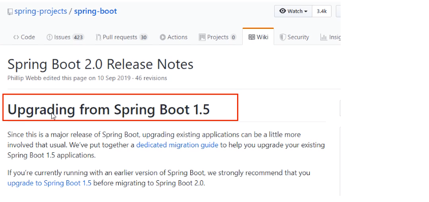

* SpringCloud版本选择：
  * git源码地址：https:github.com/spring-projects/spring-cloud/releases/
  * 官网：htts://spring.io/projects/spring-cloud
  * Cloud命名规则：
    > 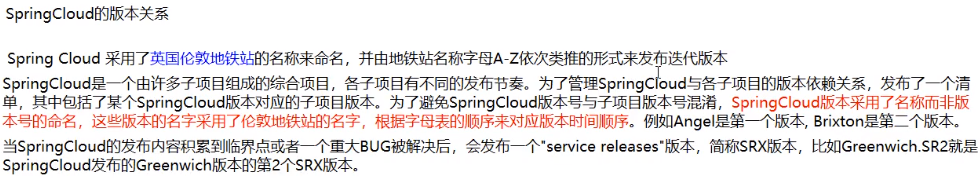
  * Springcloud和Springboot之间的依赖关系：
    * https://spring.io/projects/spring-cloud#overview
      > 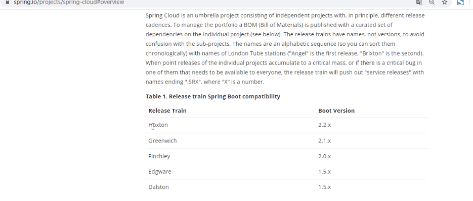
    * 更详细的版本查看方法：https://start.spring.io/actuator/info
      > ```json
      > {"git":{"branch":"7516c7445bea42b98a5837907276393358d0386c","commit":{"id":"7516c74","time":"2021-02-23T14:52:58Z"}},"build":{"version":"0.0.1-SNAPSHOT","artifact":"start-site","versions":{"spring-boot":"2.4.3","initializr":"0.10.1-SNAPSHOT"},"name":"start.spring.io website","time":"2021-02-23T14:55:02.546Z","group":"io.spring.start"},"bom-ranges":{"azure":{"2.2.4":"Spring Boot >=2.2.0.RELEASE and <2.3.0.M1","3.1.0":"Spring Boot >=2.3.0.M1 and <2.4.0-M1"},"codecentric-spring-boot-admin":{"2.2.4":"Spring Boot >=2.2.0.RELEASE and <2.3.0.M1","2.3.1":"Spring Boot >=2.3.0.M1 and <2.5.0-M1"},"solace-spring-boot":{"1.0.0":"Spring Boot >=2.2.0.RELEASE and <2.3.0.M1","1.1.0":"Spring Boot >=2.3.0.M1 and <2.5.0-M1"},"solace-spring-cloud":{"1.0.0":"Spring Boot >=2.2.0.RELEASE and <2.3.0.M1","1.1.1":"Spring Boot >=2.3.0.M1 and <2.5.0-M1"},"spring-cloud":{"Hoxton.SR10":"Spring Boot >=2.2.0.RELEASE and <2.3.10.BUILD-SNAPSHOT","Hoxton.BUILD-SNAPSHOT":"Spring Boot >=2.3.10.BUILD-SNAPSHOT and <2.4.0.M1","2020.0.0-M3":"Spring Boot >=2.4.0.M1 and <=2.4.0.M1","2020.0.0-M4":"Spring Boot >=2.4.0.M2 and <=2.4.0-M3","2020.0.0":"Spring Boot >=2.4.0.M4 and <=2.4.0","2020.0.1":"Spring Boot >=2.4.1 and <2.5.0-M1","2020.0.2-SNAPSHOT":"Spring Boot >=2.4.4-SNAPSHOT"},"spring-cloud-alibaba":{"2.2.1.RELEASE":"Spring Boot >=2.2.0.RELEASE and <2.3.0.M1"},"spring-cloud-gcp":{"2.0.0":"Spring Boot >=2.4.0-M1 and <2.5.0-M1"},"spring-cloud-services":{"2.2.6.RELEASE":"Spring Boot >=2.2.0.RELEASE and <2.3.0.RELEASE","2.3.0.RELEASE":"Spring Boot >=2.3.0.RELEASE and <2.4.0-M1"},"spring-geode":{"1.2.12.RELEASE":"Spring Boot >=2.2.0.RELEASE and <2.3.0.M1","1.3.9.RELEASE":"Spring Boot >=2.3.0.M1 and <2.4.0-M1","1.4.3":"Spring Boot >=2.4.0-M1 and <2.5.0-M1","1.5.0-M2":"Spring Boot >=2.5.0-M1"},"vaadin":{"14.4.8":"Spring Boot >=2.1.0.RELEASE and <2.5.0-M1"},"wavefront":{"2.0.2":"Spring Boot >=2.1.0.RELEASE and <2.4.0-M1","2.1.0":"Spring Boot >=2.4.0-M1"}},"dependency-ranges":{"okta":{"1.4.0":"Spring Boot >=2.2.0.RELEASE and <2.4.0-M1","1.5.1":"Spring Boot >=2.4.0-M1 and <2.4.1","2.0.1":"Spring Boot >=2.4.1 and <2.5.0-M1"},"mybatis":{"2.1.4":"Spring Boot >=2.1.0.RELEASE and <2.5.0-M1"},"camel":{"3.3.0":"Spring Boot >=2.2.0.RELEASE and <2.3.0.M1","3.5.0":"Spring Boot >=2.3.0.M1 and <2.4.0-M1","3.8.0":"Spring Boot >=2.4.0.M1 and <2.5.0-M1"},"open-service-broker":{"3.1.1.RELEASE":"Spring Boot >=2.2.0.RELEASE and <2.4.0-M1"}}}
      > ```
      > 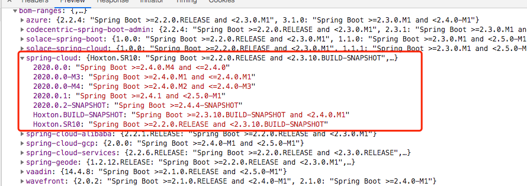 

SpringCloud版本选择：
* cloud：Hoxton.SR1。
* boot：2.2.RELEASE。
  > Boot版本由cloud版本决定：
  > 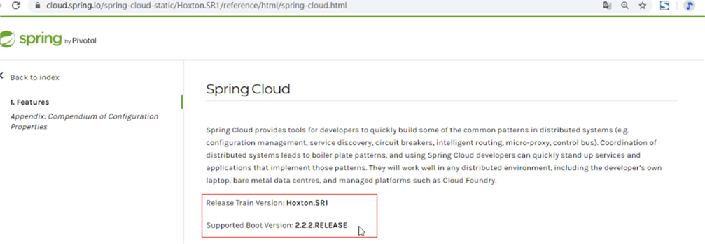
  > 
  > SpringCloud和SpringBoot的版本对应关系：
  > 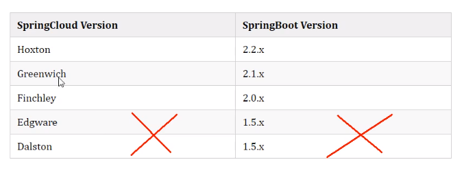
* cloud：alibaba 2.1.0.RELEASE。
* java：Java8.
* Maven：3.5及以上。

* 2.x版本常用的软件pom
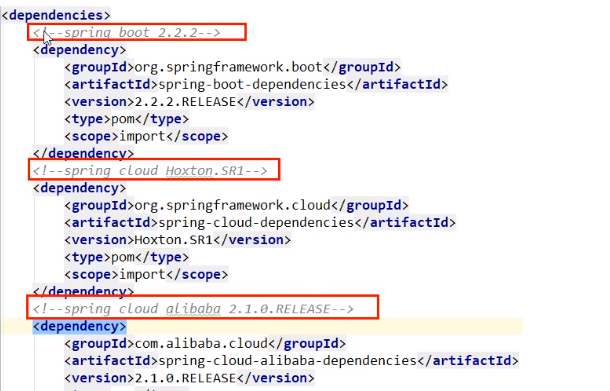
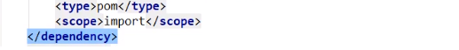  

# 7.1.1.2 关于Cloud各种组件的停更/升级/替换

* 服务注册中心：
  * Eureka：Spring Cloud原生组件。被动修复bug，不再接受合并请求，不再发布新版本。
  * Zookeeper：
  * Consul：
  * Nacos：推荐。
* 服务调用：
  * Ribbon：轻度患者。
  * LoadBalancer：Spring官方准备用它替换Ribbon。
* 服务调用：
  * Feign：停止更新。
  * OpenFeign：推荐。
* 服务降级：
  * Hystrix：X
  * resilience4j：国外使用多
  * alibaba Sentinel：国内使用更多。
* 服务网关：
  * Zuul：X
  * Zuul2：胎死腹中。
  * getway：推荐
* 服务配置：
  * Config：X
  * apollo：携程网的。  
  * Nacos：推荐。
* 服务主线：
  * Bus：X
  * Nacos：推荐。

* Spring Cloud：
  * https://cloud.spring.io/spring-cloud-static/Hoxton.SR1/reference/htmlsingle/
  * Spring Cloud中文文档：https://www.bookstack.cn/read/spring-cloud-docs/docs-index.md
* Spring Boot：https://docs.spring.io/spring-boot/docs/2.2.2.RELEASE/reference/htmlsingle/


# 7.1.1.2 关于Cloud各种组件的停更/升级/替换
https://www.bilibili.com/video/BV18E411x7eT?p=4&spm_id_from=pageDriver