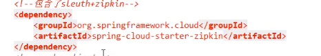

# 概述
* 为什么会出现这个技术？需要解决那些问题？
  > 在微服务框架中，一个客户端发起的请求在后端系统中会经过多个不同的服务节点调用来协同产生最后的请求结果，每一个前段请求都会形成一条复杂的分布式服务调用
  > 链路，链路中的任何一环出现高延迟或错误都会引起整个请求最后的失败。
  > 
* 是什么：
  * https://github.com/spring-cloud/spring-cloud-sleuth
  * Spring Cloud Sleuth提供了一套完整的微服务跟踪的解决方案
  * 在分布式系统中提供了追踪解决方案并兼容支持了zipkin
* 解决：    
  > 
# 搭建链路监控步骤
* 1.zipkin：
  * 下载：
    * SpringCloud从F版已不需要自己搭建Zipkin Server了，只需调用jar包即可
    * https://dl.bintray.com/openzipkin/maven/io/zipkin/java/zipkin-server/
    * zipkin-server-2.12.9-exec.jar
  * 运行jar：  java -jar zipkin-server-2.12.9-exec.jar
    > 
  * 运行控制台：
    * http://localhost:9411/zipkin/
      > 
    * 术语：
      * 完整的调用链路图：
        > 
      * 上图what:
        > 
      * 名称解释：
        * Trace：类似于树结构的Span集合，表示一条调用链路，存在唯一标识。
        * span：表示调用链路来源，通俗的理解span就是一次请求信息。
* 2.服务提供者：
  * cloud-provider-payment8001
  * POM：
    > 
    > 
  * YML:
    > 
  * 业务类PaymentController  
* 3.服务消费者（调用方）：
  * cloud-consumer-order80
  * POM：
    > 
  * YML：
    > 
  * 业务类OrderController：
    > 
* 4.依次启动eureka7001/8001/80：80调用8001几次测试一下。
* 5.打开浏览器访问：http://localhost:9411
  * 会出现一下界面：
    > 
    > 查看
    > 
  * 查看依赖关系：
    > 
  * 原理：
    > 

