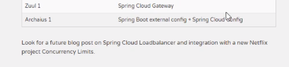

# why会出现SpringCloud alibaba:Spring Cloud Netflix项目进入维护模式
* https://spring.io/blog/2018/12/12/spring-cloud-greenwich-rc1-available-now:
  > 
  > 说明：
* Spring Cloud Netflix Projects Entering Maintenance Mode：
  * 什么是维护模式：
    > 
  * 进入维护模式意味着什么：
    > 
    > 

# SpringCLoud alibaba带来了什么
* 是什么：
  > 
* 能干嘛：
  * 1.服务限流降级，默认支持Servlet、Feign、RestTemplate、Dubbo和RocketMQ限流降级功能的接入，可以在运行时通过控制台实时修改限流降级规则，还支持
    查看限流降级Metrics监控。
  * 2.服务注册与发现：适配Spring Cloud服务注册与发现标准，默认集成Ribbon的支持。
  * 3.分布式配置管理：支持分布式系统中的外部化配置，配置更改时自动刷新。
  * 4.消息驱动能力：基于Spring Cloud Stream为微服务应用构建消息驱动能力。
  * 5.阿里云对象存储：阿里云提供的海量、安全、低成本、高可靠的云存储服务。支持在任何应用、任何时间、任何地点存储和访问任意类型的数据。
  * 分布式任务调度：提供秒级、精准、高可靠、高可用的定时（基于Cron表达式）任务调度服务。同时提供分布式的任务执行模型，如网格任务。网格任务支持
    海量子任务均匀分配到所有Worker（schedulerx-client）上执行。 
* 去哪下：https://github.com/alibaba/spring-cloud-alibaba/blob/master/README-zh.md
* 怎么玩：
  * Sentinel：阿里巴巴开源产品，把流量作为切入点，从流量控制、熔断降级、系统负载保护等几个维度保护服务的稳定性。
  * Nacos：阿里巴巴开源产品，一个更易于构建云原生应用的动态服务发现、配置管理和服务管理平台。
  * RocketMQ：Apache RocketMQ基于Java的高性能、高吞吐量的分布式消息和流计算平台。
  * Dubbo：Apache Dubbo是一款高性能Java RPC框架。
  * Seata：阿里巴巴开源产品，一个易于使用的高性能微服务分布式事务解决方案。
  * Alibaba Cloud OSS：阿里巴巴对象存储服务（Object Storage Service，简称OSS）,是阿里云提供的海量、安全、低成本、高可靠的云存储服务。你可以在
  任何应用、任何时间、任何地点存储和访问任意类型的数据。
  * Alibaba Cloud SchedulerX：阿里中间件团队开发的一款分布式任务调度产品，支持周期性的任务与固定时间点触发任务。  

# SpringCloud alibaba学习资料获取
* 官网：https://spring.io/projects/spring-cloud-alibaba
  > 
  > Spring Cloud Alibaba致力于提供微服务开发的一站式解决方案。此项目包含开发分布式应用微服务的必需组件，方便开发者通过Spring Cloud编程模型
  > 轻松使用这些组件来开发分布式应用服务。
  > 
  > 依托Spring Cloud Alibaba，你只需要添加一些注解和少量配置，就可以将Spring Cloud应用接入阿里微服务解决方案，通过阿里中间件来迅速搭建分布式应用系统。
* 英文：https://github.com/alibaba/spring-cloud-alibaba
  * Subtopic：https://spring-cloud-alibaba-group.github.io/github-pages/greenwich/spring-cloud-alibaba.html
* 中文

