# Nacos简介
* 为什么叫Nacos：前四个字母为Nameing和Configuration的前两个字母，最后的s为Service。
* 是什么：
  * 一个更易于构建原生应用的动态服务发现、配置管理和服务管理平台。
  * Nacos：Dynamic Naming and Configuration Service
  * Nacos就是注册中心+配置中心的组合：等价于Nacos=Eureka+Config+bus
* 能干嘛：
  * 替代Eureka做服务注册中心。
  * 替代Config做服务配置中心。  
* 去哪下：
  * https://github.com/alibaba/Nacos
  * 官网文档：
    * https://nacos.io/zh-ch/
    * https://spring-cloud-alibaba-group.github.io/github-pages/greenwich/spring-cloud-alibaba.html#_spring_cloud_nacos_discovery
* 各种注册中心对比：
  > 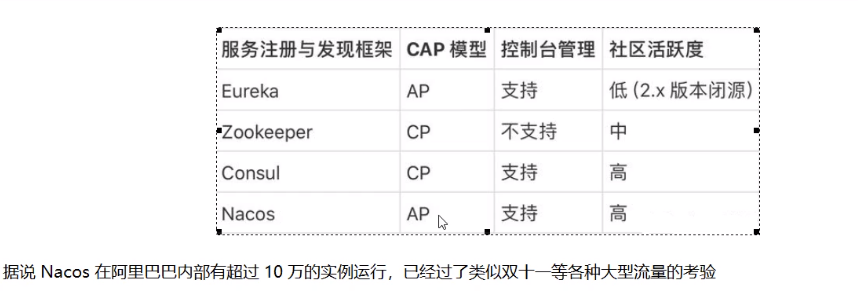
# 安装并运行Nacos
* 本地Java8+Maven环境已经OK
* 先从官网下载Nacos：https://github.com/alibaba/nacos/releases:1.1.4
* 解压安装包，直接运行bin目录下的startup.cmd：默认账户和密码是nacos
* 命令运行成功后直接访问http://localhost:8848/nacos
* 结果页面：
  > 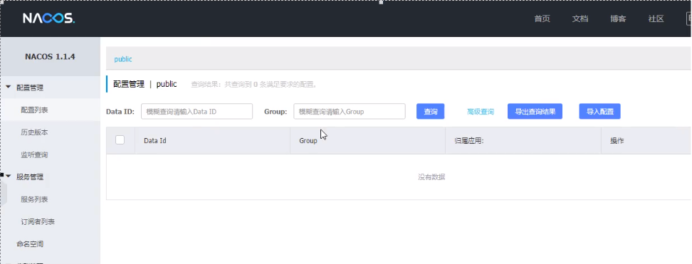

# Nacos作为服务注册中心演示
* 官网文档：https://spring-cloud-alibaba-group.github.io/github-pages/greenwich/spring-cloud-alibaba.html#_spring_cloud_alibaba_nacos_discovery
* 基于Nacos的服务提供者：
  * 新建Module：cloudalibaba-provider-payment9001
  * POM：
    * 父POM:
      > 
    * 本模块POM:
      > 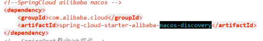
  * YML：
    > 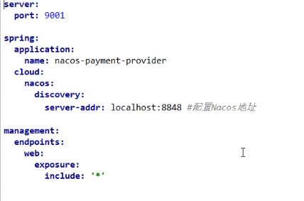
  * 主启动类
  * 业务类：PaymentController：
    > 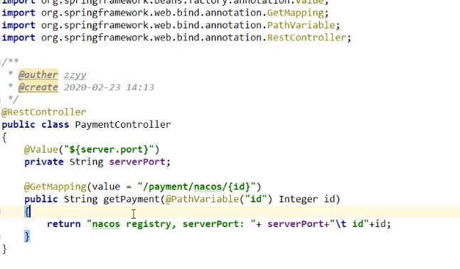
  * 测试：
    * http://localhost:9001/payment/nacos/1
    * nacos控制台：
      > 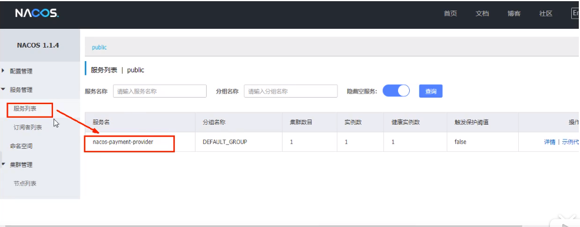
    * nacos服务注册中心+服务提供者9001都ok了
  * 为了下一章节演示nacos的负载均衡，参照9001新建9002:
    * 新建cloudalibaba-provider-payment9002
    * 9002其他步骤你懂得。
    * 或者取巧，直接拷贝虚拟端口映射：
      > 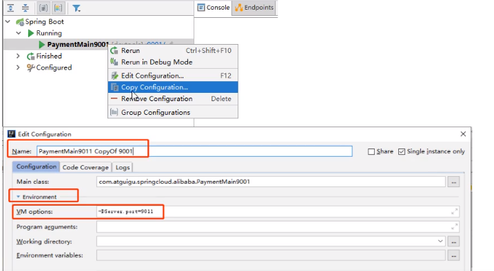
* 基于Nacos的服务消费者：
  * 新建Module：cloudalibaba-consumer-nacos-order83
  * POM：
    > 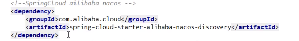 
    > 为什么nacos支持负载均衡：
    > 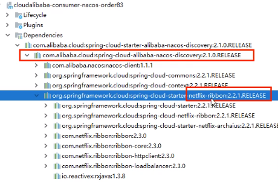
  * YML:
    > 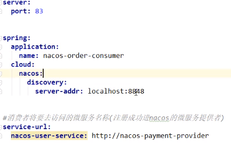
  * 主启动类：
  * 业务类：
    * ApplicationContextBean：
      > 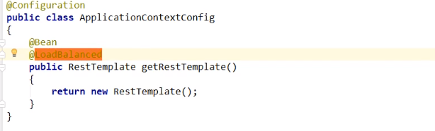
    * OrderNacosController:
      > 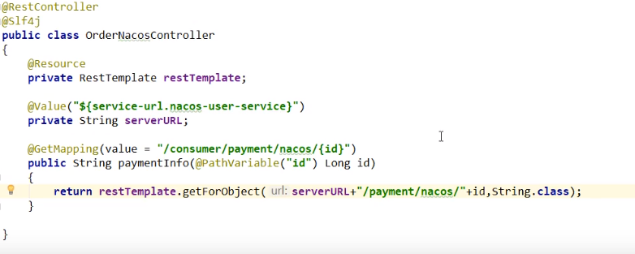
  * 测试：
    * nacos控制台：
      > 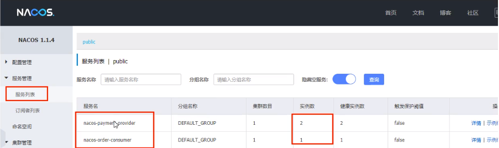
    * http://localhost:83/consumer/payment/nacos/13:83访问9001/9002，负载均衡OK  
* 服务注册中心对比：
  * 各种注册中心对比：
    * Nacos全景图展示:
      > 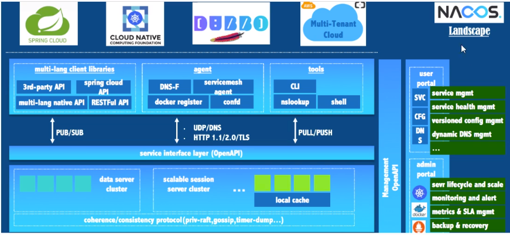
      > 
    * Nacos和其他注册中心对比：
      > 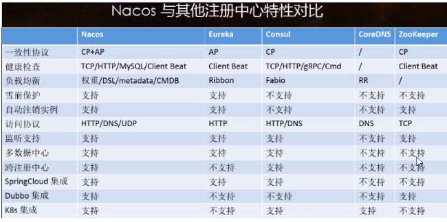
      > 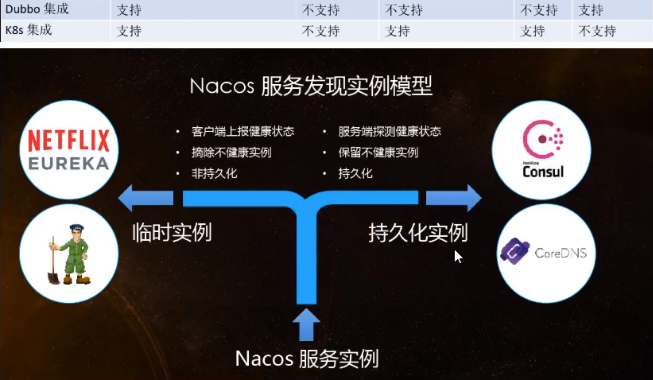
    * 切换：Nacos支持AP和CP模式的切换：
      > C是所有节点在同一时间看到的数据是一致的；而A的定义是所有的请求都会收到响应。
      > 
      > 何时选择使用何种模式？
      > 一般来说，
      > 如果不需要存储服务级别的信息且服务实例是通过nacos-client注册，并能够保持心跳上报，那么就可以选择AP模式。当前主流的服务如Spring cloud和
      > Dubbo服务，都适用于AP模式，AP模式为服务的可能性而减弱了一致性，因此AP模式下只支持注册临时实例。
      > 
      > 如果需要在服务级别编辑或者存储配置信息，那么CP是必须的，K8S服务和DNS服务则适用于CP模式。
      > CP模式下则支持注册持久化实例，此时则是以Raft协议为集群运行模式，该模式下注册实例之前必须先注册服务，如果服务不存在，则会返回错误。
      > 
      > curl -X PUT '$NACOS_SERVER:8848/nacos/vi/ns/operator/switches?entry=serverMode&value=CP'
# Nacos作为服务配置中心演示
* Nacos作为配置中心-基础配置：
  * 新建Module：cloudalibaba-config-nacos-client3377
  * POM：
    > 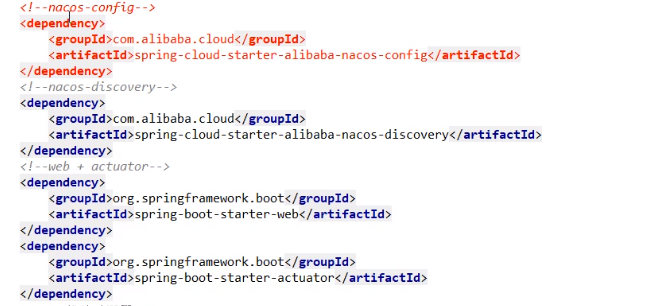
  * YML:
    * why配置两个：
      > Nacos同soringcloud-config一样，在项目初始化时，要保证先从配置中心进行配置拉取，拉取配置之后，才能保证项目的正常启动。
      > springboot中配置文件的加载是存在优先级顺序的，bootstrap优先级高于application。
    * YML:
      * bootstrap:
        > 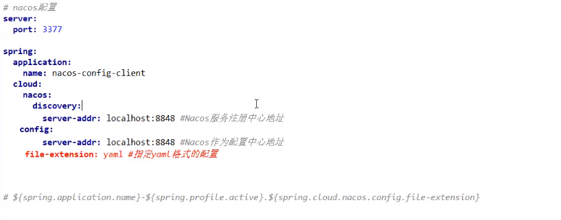
      * application:
        > 
  * 主启动类：
  * 业务类：
    * ConfigClientController：
      > 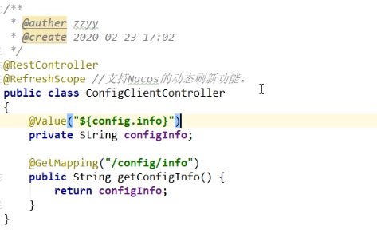
    * @RefreshScope：通过Spring Cloud原生注解@RefreshScope实现配置自动更新
  * 在Nacos中添加配置信息：Nacos中的配置规则：
    * 理论：
      > Nacos中的dataid的组成格式与SpringBoot配置文件中的匹配规则
      > 官网：https://nacos.io/zh-cn/docs/quick-start-spring-cloud.html
      > 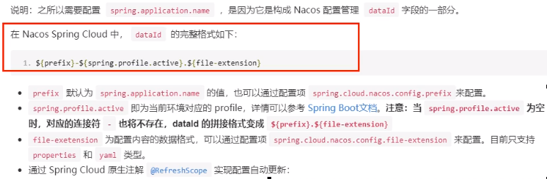
      > 最后公式
      > ${prefix}-${spring.profile.active}.${file-extension}
      > nacos-config-client-dev.yaml
      > 
      > 说明：之所以需要配置spring-application.name，是因为它是构成Nacos配置管理dataId字段的一部分。
      > 在Nacos Spring Cloud中，dataId的完整格式如下：
      > ${prefix}-${spring.profile.active}.${file-extension}
      > * prefix默认为spring.application.name的值,也可以通过配置项spring.cloud.nacos.config.prefix来配置。
      > * spring.profile.active即为当前环境对应的profile，详情可以参考Spring Boot文档。注意：当spring.profile.active为空时，对应的连接符
      >   -也将不存在，dataId的拼接格式变成${prefix}.${file-extension}
      > * file-extension：为配置内容的数据格式，可以通过配置项spring.cloud.nacos.config.file-extension来配置。目前只支持properties和yaml类型。
      > * 通过Spring Cloud原生注解@RefreshScope实现配置自动更新。
      > * 最后公式：${prefix}-${spring.profile.active}.${file-extension}。即nacos-config-client-dev.yaml
    * 实操：
      * 配置新增：
        > 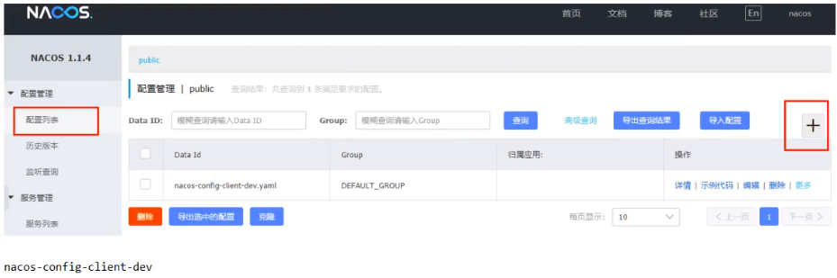
      * Nacos界面配置对应：
        > 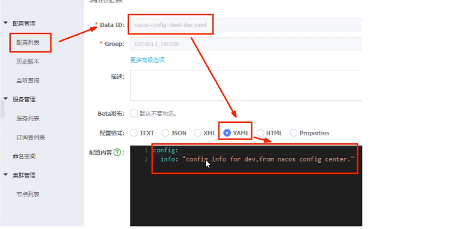
        > * 设置DataId
        >   * 公式：${prefix}-${spring.profile.active}.${file-extension}
        >   * prefix默认为spring.application.name的值。
        >   * spring.profile.active即为当前环境对应的profile
        >   * file-extension为配置内容的数据格式，可以通过配置项spring.cloud.nacos.config.file-extension来配置
        >   * 小结说明：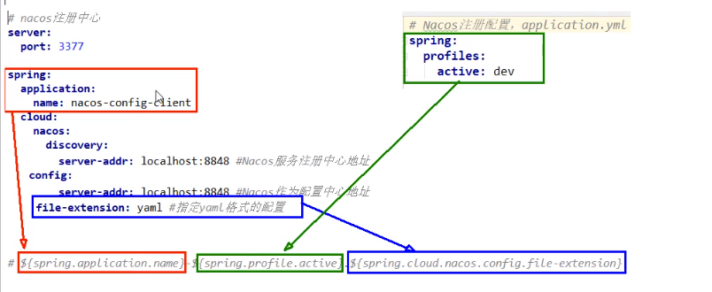
      * 历史配置：
  * 测试：
    > 
  * 自带动态刷新：修改Nacos中yaml配置文件，再次调用查看配置的接口，就会发现配置已经刷新。

* Nacos作为配置中心-分类配置：
  * 问题：多环境多项目配置：
    > 问题1：
    > 实际开发中，通常一个系统会准备。dev开发环境。test测试环境。prod生产环境。如何保证指定环境启动时服务能正确读取到Nacos上相应环境的配置文件呢？
    > 
    > 问题2：
    > 一个大型分布式微服务系统会有很多微服务子项目，每个微服务项目又都会有相应的开发环境、测试环境、预发环境、正式环境...... 那怎么对这些微服务配置进行管理呢？
  * Nacos的图形化管理界面：
    * 配置管理：
      > 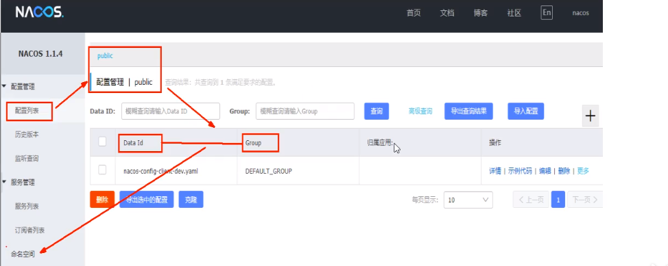
    * 命名空间：
      > 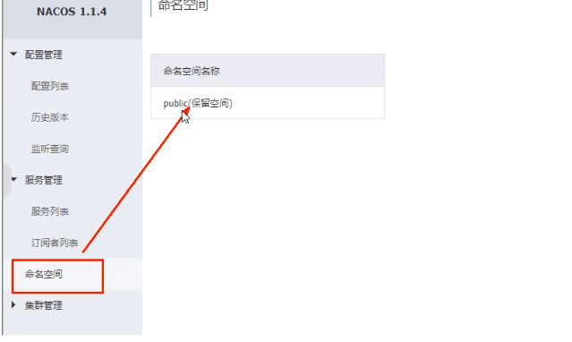
  * Namespace+Group+Data ID三者关系？为什么这么设计？
    > * 1.是什么: 
    >   类似Java里面的package名和类名。
    >   最外层的Namespace是可以用于区分部署环境的，Group和DataID逻辑上区分两个目标对象。
    > * 2.三者情况： 
    > 
    > 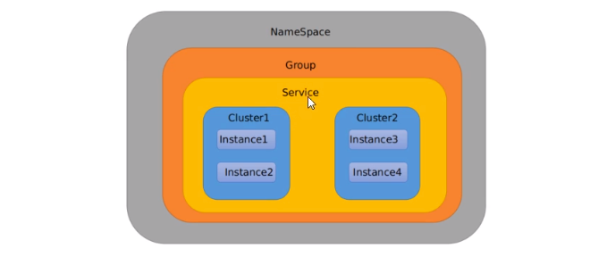
    > 默认情况：Namespace=public,Group=DEFAULT_GROUP，默认Cluster是DEFAULT
    > 
    > Nacos默认的命名空间是public，Namespace主要用来实现隔离。
    > 比方说我们现在有三个环境：开发、测试、生成环境，我们就可以创建三个Namespace，不同的Namespace之间是隔离的。
    > 
    > Group默认是DEFAULT_GROUP，GROUP可以把不同的微服务划分到同一个分组里面去。
    > 
    > Service就是微服务；一个Service可以包含多个Cluster（集群），Nacos默认Cluster是DEFAULT,Cluster是对指定微服务的一个虚拟划分。比方说为了
    > 容灾，将Service微服务分别部署在了杭州机房和广州机房，这时就可以给杭州机房的Service微服务起一个集群名称（HZ）,给广州机房的Service微服务起一个集群名称
    > （GZ）,还可以尽量让同一个机房的微服务相互调用，以提升性能。
    > 
    > 最后是Instance，就是微服务的实例。
  * Case：三种方式加载配置：
    * DataID方案：
      * 指定spring.profile.active和配置文件的DataID来使不同环境下读取不同的配置。
      * 默认空间+默认分组+新建dev和test两个DataId：
        > 新建dev配置DataId
        > 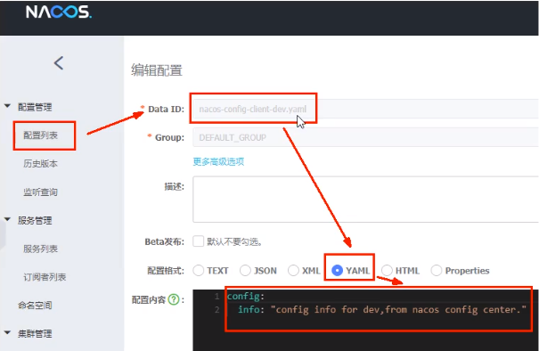
        > 新建test配置DataId
        > 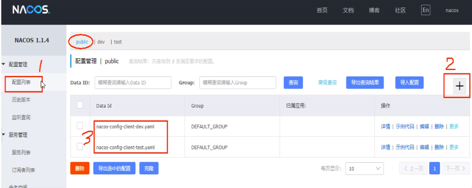
      * 通过spring.profile.active属性就能进行多环境下配置文件的读取：
        > 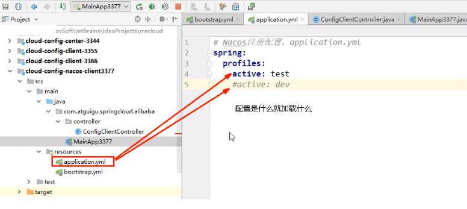
      * 测试  
        > 
    * Group方案：
      * 通过Group实现环境区分：新建Group
        > 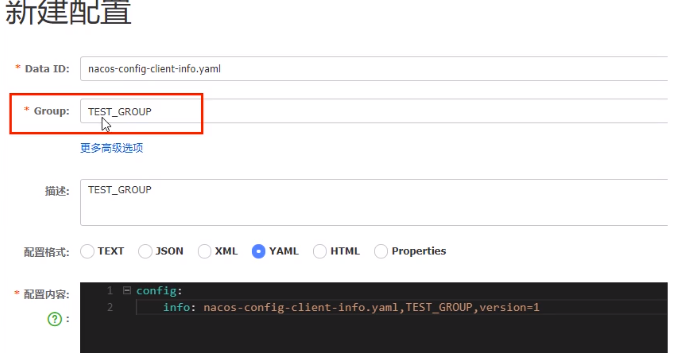
      * 在nacos图形化界面控制台上面新建配置文件DataID：
        > 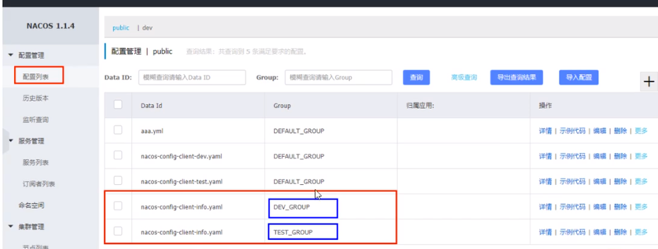
      * bootstrap+application: 在config下增加一条Group的配置即可.可配置为DEV_GROUP或TEST_GROUP。
        > 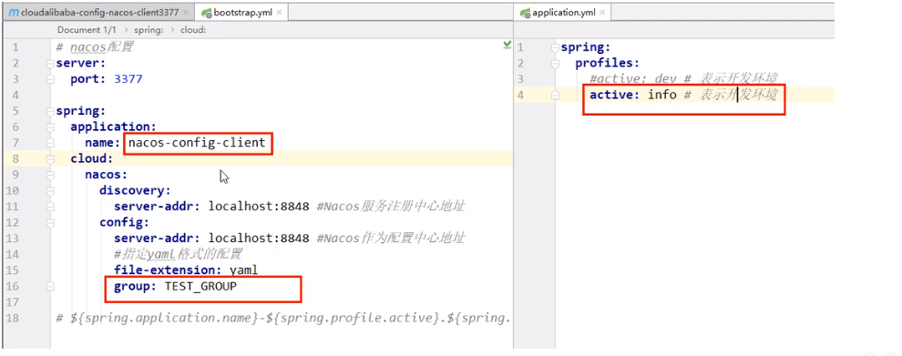
    * Namespace方案：
      * 新建dev/test的Namespace：
        > 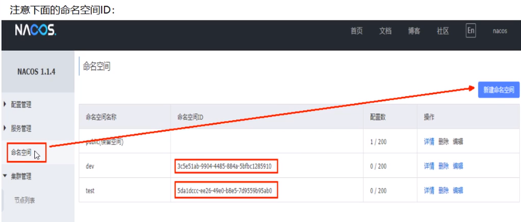
      * 回到服务管理-服务列表查看：
        > 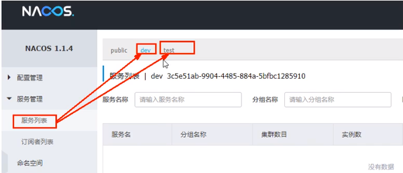
      * 按照域名配置填写：
        > 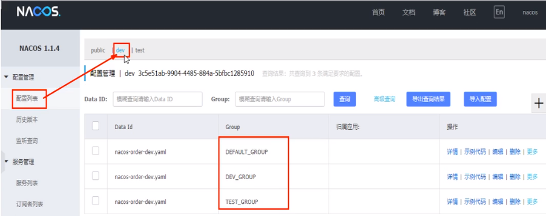
      * YML
        > bootstrap：
        > 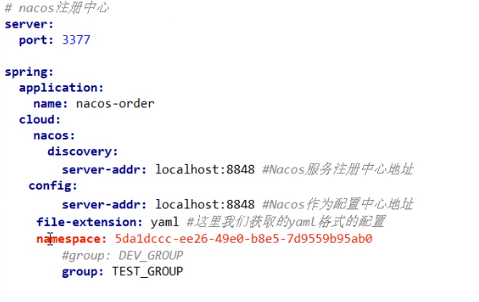
        > application
        > 

# Nacos集群和持久化配置（重要）

