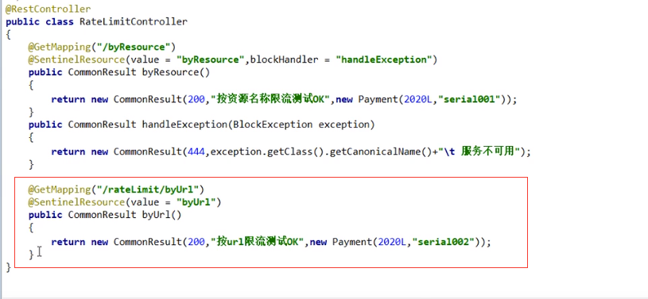
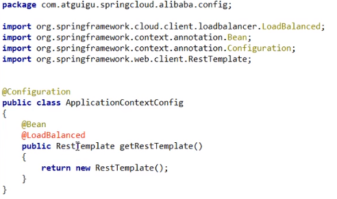

# Sentiel
* 官网：
  * http://github.com/alibaba/sentinel
  * 中文： https://github.com/alibaba/Sentinel/wiki  
* 是什么：一句话，之前我们讲过的Hystrix
  > 
  > 
* 去哪下：https://github.com/alibaba/Sentinel/releases
  > 
* 能干嘛：
  > 
* 怎么玩：
  * https://spring-cloud-alibaba-group.github.io/github-pages/greenwich/spring-cloud-alibaba.html#spring_cloud_alibaba_sentinel
  * 服务使用中的各种问题：
    * 服务雪崩
    * 服务降级
    * 服务熔断
    * 服务限流

# 安装Sentielk控制台
* sentinel由2部分组成：
  * 后台：核心库（Java客户端）不依赖任何框架/库，能够运行于所有Java运行时环境，同时对Dubbo / Spring Cloud等框架也有较好的支持。
  * 前台8080：控制台（Dashboard）基于Spring Boot开发，打包后可以直接运行，不需要额外的Tomcat等应用容器。
* 安装步骤：
  * 下载：https://github.com/alibaba/Sentinel/releases：下载到本地sentinel-dashboard-1.7.0.jar
    > 
  * 运行命令：
    * 前提：java环境OK。8080端口不能被占用
    * 命令：java -jar sentinel-dashboard-1.7.0.jar
  * 访问sentinel管理界面：
    * http://localhost:8080
      > 
    * 登录账号密码均为sentinel

# 初始化演示功能
* 启动Nacos8848成功：http://localhost:8848/nacos/#/login
* 新建Module：
  * cloudalibaba-sentinel-server8401
  * POM：
    > 
  * YML：
    > \
  * 主启动类：
    > 
  * 业务类FloLimitController：
    > 
* 启动Sentinerl8080：java -jar sentinel -dashboard-1.7.0.jar
* 启动微服务8401
* 启动8401微服务后查看sentinel控制台:
  * 空空如也，什么也没有
    > 
  * sentinel采用的是懒加载说明：
    * 访问一次即可：
      * http://localhost:8401/testA
      * http://localhost:8401/testB
    * 效果：
      > 

# 流控规则
* 基本介绍：
  > 
  > 进一步解释说明：
  > * 资源名：唯一名称，默认请求路径
  > * 针对来源：Sentinel可以针对调用者进行限流，填写微服务名，默认default（不区分来源）
  > * 阈值类型/单机阈值：
  >   * QPS（每秒钟的请求数量）：当调用该api的QPS达到阈值的时候，进行限流。
  >   * 线程数：当调用该api的线程数达到阈值的时候，进行限流。
  > * 是否集群：不需要集群
  > * 流控模式：
  >   * 直接：api达到限流条件时，直接限流。
  >   * 关联：当关联的资源达到阈值时，就限流自己
  >   * 链路：只记录指定链路上的流量（指定资源从入口资源进来的流量，如果达到阈值，就进行限流）【api级别的针对来源】
  > * 流控效果：
  >   * 快速失败：直接失败，抛异常
  >   * Warm UP：更加codeFactor（冷加载因子，默认3）的值，从阈值/codeFactor，经过预热时长，才达到设置的QPS阈值
  >   * 排队等待：匀速排队，让请求以匀速的速度通过，阈值类型必须设置为QPS，否则无效
* 流控模式：
  * 直接（默认）：
    * 直接：快速失败，系统默认。
    * 配置及说明：
      > 
      > * 阈值类型：
      >   * QPS：御敌于国外。
      >   * 线程数：关门打狗。
    * 测试：
      * 快速点击访问：http://localhost:8401/testA
      * 结果：Blocked by Sentinel(flow limiting)
      * 思考：直接调用默认报错信息，技术方面OK，but，是否应该由我们自己的后续处理？类似于有个fallback的兜底方法.
  * 关联：
    * 是什么：
      * 当关联的资源达到阈值时，就限流自己
      * 当与A关联的的资源B达到阈值后，就限流自己：支付接口达到阈值后，就限流下订单的接口，防止连坐效应。
      * B惹事，A挂了。
    * 配置：
      > 设置效果
      > 当关联资源testB的qps阀值超过1时，就限流/testA的Rest访问地址，当关联资源到阈值后限制配置好的资源名
      > 
    * postman模拟并发密集访问testB：
      > 
      > * 访问testB成功：
      > * postman里新建多线程集合组：
      > * 将访问地址添加进新线程组：
      > * Run：大批量线程高并发访问B,导致A失效了
    * 运行后发现testA挂了：
      * 点击访问http://localhost:8401/testA
      * 结果：Blocked by Sentinel(flow limiting)
  * 链路：
    * 多个请求调用同一个微服务。
* 流控效果：
  * 直接：快速失败（默认的流控处理）
    * 直接失败，抛出异常：Blocked by Sentinel（flow limiting）
    * 源码：com.alibaba.csp.sentinel.slots.block.flow.controller.DefaultController
  * 预热：
    * 说明：公式：阈值除以coldFactor（默认值为3），经过预热时长后才会达到阈值。
    * 官网：
      > 
      > 
      > * 默认coldFacotor为3，即请求QPS从threshold/3开始，经预热时长逐渐升至设定的QPS阈值
      > * 限流冷启动：https://github.com/alibaba/Sentinel/wiki/限流---冷启动
    * 源码：
      > 
      > 
    * WarmUP配置：
      > 
    * 多次点击http://localhost:8401/testB
    * 应用场景：如：秒杀系统在开启的瞬间，会有很多流量上来，很可能把系统打死，预热方式就是为了保护系统，可慢慢的把流量放进来，慢慢的把阀值增加到设置的阀值。
  * 排队等待：
    * 匀速排队，阈值必须设置为QPS：
      > 
      > 匀速排队：
      > 匀速排队（RuleConstant.CONTROL_BEHAVIOR_RATE_LIMITER）方式会严格控制请求通过的间隔时间，也即是让请求以均匀的速度通过，对应的是漏桶
      > 算法。详细文档可以参考 流量控制-匀速器模式，具体的例子可以参见PaceFlowDemo。
      > 该方式的作用如图所示：
      > 这种方式主要用于处理间隔性突发的流量，例如消息队列。想象一下这样的场景，在某一秒有大量的请求到来，而接下来的几秒则处于空闲状态，我们希望系统能够
      > 在接下来的空闲期间逐渐处理这些请求，而不是在第一秒直接拒绝多余的请求。
    * 源码：com.alibaba.csp.sentinel.slots.block.flow.controller.RateLimiterController
    * 测试：
      > 
    > 
    
# 降级规则
* 官网：https://github.com/alibaba/Sentinel/wiki/熔断降级
* 基本介绍：
  * 基本介绍：
    > 
    > * RT（平均响应时间，秒级）
    >   平均响应时间 超出阈值 且 在时间窗口内通过的请求>=5，两个条件同时满足后触发降级。
    >   窗口期过后关闭断路器。
    >   RT最大4900(更大的需要通过-Dcsp.sentinel.statistic.max.rt=XXXX才能生效)
    > * 异常比例（秒级）：
    >   QPS >= 5 且异常比例（秒级统计）超过阈值时，触发降级；时间窗口结束后，关闭降级。
    > * 异常数（分钟级）：
    >   异常数（分钟统计）超过阈值时，触发降级；时间窗口结束后，关闭降级
  * 进一步说明：
    > Sentinel熔断降级会在调用链路中某个资源出现不稳定状态时（例如调用超时或异常比例升高），对这个资源的调用进行限制。让请求快速失败，避免影响
    > 到其他的资源而导致级联错误。
    > 
    > 当资源被降级后，在接下来的降级时间窗口内，对该资源的调用都自动熔断（默认行为是抛出DegradeException）。
  * Sentinel的断路器是没有半开状态的：
    * 半开的状态系统自动去检测是否请求一次，没有异常就关闭断路器恢复使用，有异常则继续打开断路器不可用，具体可以参考Hystrix
    * 复习Hystrix：
      >  
* 降级策略实战：
  * RT：
    * 是什么：平均响应时间：
      > 平均响应时间（DEGRADE_GRADE_RT）：当1s内持续进入5个请求，对应时刻的平均响应时间（秒级）均超过阈值（count,以ms为单位），那么在接下来
      > 的时间窗口（DegradeRule中的timeWindow，以s为单位）之内，对这个方法的调用都会自动地熔断（抛出DegradeException）。注意Sentinel默认
      > 统计的RT上限是4900ms，超出此阈值的值都会算作4900 ms，若需要变更此上限可以通过启动配置项 -Dcsp.sentinel.statistic.max.rt-xxx来配置。
      > 
    * 测试：
      * 代码：
        > 
      * 配置：
        > 
      * jmetter压测：
        > 
      * 结论：
        > 
  * 异常比例：
    * 是什么：
      > 异常比例（DEGRADE_GRADE_EXCEPTION_RATIO）：当资源的每秒请求量>=5，并且每秒异常总数占通过量的比值超过阈值（DegradeRule中的count）
      > 之后，资源进入降级状态，即在接下来的时间窗口（DegradeRule中的timeWindow，以s为单位）之内，对这个方法的调用都会自动地返回。异常比例的
      > 阈值访问是[0.0,1.0],代表0%-100%。
      > 
    * 测试：
      * 代码：
        > 
      * 配置：
        > 
      * jmeter压测：
        > 
      * 结论：
        > 
  * 异常数：
    * 是什么：
      > 异常数（DEGRADE_GRADE_EXCEPTION_COUNT）：当资源接近1分钟的异常数目超过阈值之后会进行熔断。注意由于统计时间窗口是分钟级别的，若timeWindow
      > 小于60s，则结束熔断状态后仍可能再进入熔断状态。
      > 
      > 时间窗口一定要大于等于60秒。
      > 
      > 
    * 异常数是按分钟统计的：
    * 测试：
      * 代码：
        > 
      * 配置：
        > 
      * jmeter:

# 热点key限流
* 基本介绍：
  > 
* 官网：https://github.com/alibaba/Sentine/wiki/热点参数限流
* 承上启下复习start: @SentinelResource
  > 兜底方法：分为系统默认和客户自定义，两种
  > 之前的case,限流出问题后，都是用sentinel系统默认的提示：Blocked by Sentinel（flow limiting）
  > 
  > 我们能不能自定义？类似Hystrix，某个方法出问题了，就对应的兜底降级方法？
  > 
  > 结论：从HystrixCommand到@SentineResource
* 代码：com.alibaba.csp.sentinel.slots.block.BlockException
  > 
* 配置：
  * 1:
    * @SentinelResource(value="testHotKey")
    * 异常信息打到了前台用户界面看到，不友好：
      >   
  * 2:
    * @SentinelResource(value="testHotKey",blockHandler="dealHandler_testHotKey")
    * 方法testHotKey里面第一个参数只要QPS超过每秒1次，马上降级处理。
    * 用了我们自定义的。
  > 
* 测试：
  > 
* 参数列外项：
  * 上述案例演示了第一个参数p1,超过1秒钟后，达到阈值1后，马上被限流。
  * 特殊情况：
    * 普通：超过1秒钟后，达到阈值1后马上被限流。
    * 我们期望p1参数当它是某个特殊值是，它的限流和平时不一样
    * 特殊：假如当p1的值等于5时，它的阈值可以达到200。
  * 配置：
    > 
  * 测试：
    > 
  * 前提条件：热点参数注意点，参数必须是基本类型或者String。
* 其他：
  * 添加异常看看：
    > 
    > 
    > 
  * 总结：
    * @SentinelResource：处理的是Sentinel控制台配置的违规情况，有blockHandler方法配置的兜底处理：
    * RuntimeException：int age = 10/0 ,这是java运行时报出的运行时异常RunTimeException，@SentinelResource不管。

# 系统规则
* 是什么：https://github.com/alibaba/Sentine/wiki/系统自适应限流
* 各项配置说明：
  > 系统保护规则是从应用级别的入口流量进行控制，从单台机器的load、CPU使用率、平均RT、入口QPS和并发线程数等几个维度监控应用指标，让系统尽可能跑在
  > 最大吞吐量的同时保证系统整体的稳定性。
  > 
  > 系统保护规则是应用整体维度的，而不是资源维度的，并且仅对入口流量生效。入口流量值的是进入应用的流量（EntryTYpe.IN），比如Web服务或Dubbo服务
  > 端接收的请求，都属于入口流量。
  > 
  > 系统规则支持以下的模式：
  > * Load自适应（仅对Linux/Unix-like机器生效）：系统的load1作为启发指标，进入自适应系统保护。当系统load1超过设定的启发值，且系统当前的并发
  > 线程数超过估算的系统容量时才会触发系统保护（BBR阶段）。系统容量由系统的maxQps * minRt 估算得出。设定参考值一般是CPU cores * 2.5。
  > * CPU usage（1.5.0+ 版本）：当系统CPU使用率超过阈值即触发系统保护（取值范围0.0 - 1.0）,比较灵敏。
  > * 平均RT：当单台机器上所有入口流量的平均RT达到阈值即触发系统保护，单位是毫秒。
  > * 并发线程数：当单台机器上所有入口流量的并发线程数达到阈值即触发系统保护。
  > * 入口QPS：当单台机器上所有入口流量的QPS达到阈值即触发系统保护。
* 配置全局QPS：
  > 
 

# @SentinelResource
* 按资源名称+后续处理
  * 启动Nacos成功。
  * 启动Sentinel成功。
  * Modeule
    * cloudalibaba-sentinel-service8401  
    * POM
      > 
    * YML
    * 业务类RateLimitController:
      > 
    * 主启动
  * 配置流控规则：
    * 配置步骤：
    * 图形配置和代码关系：
    * 表示1秒钟内查询次数大于1，就跑到我们自定义的处流，限流
      > 
  * 测试：
    * 1秒钟点击1下.OK
    * 超过上述，疯狂点击，返回了自己定义的限流处理信息，限流发生：
      > 
  * 额外问题：
    * 此时关闭8401看看。
    * Sentinel控制台，流控规则消失了？
      > 

* 按照Url地址限流+后续处理
  * 通过访问的URL限流，会返回Sentinel自带默认的限流处理信息。
  * 业务类RateLimitController：
    > 
  * 访问一次：http://localhost:8401/rateLimit/byUrl
  * Sentinel控制台配置：
    > 
  * 测试：
    * 疯狂点击http://localhost:8401/rateLimit/byUrl
    * 结果：
      > 
      
* 上面兜底方案面临的问题
  * 1.系统默认的，没有体现我们自己的业务要求。
  * 2.依照现有条件，我们自定义的处理方法又和业务代码耦合在一块，不直观。
  * 3.每个业务方法都添加一个兜底的，那代码膨胀加剧。
  * 4.全局统一的处理方法没法体现。

* 客户自定义限流处理逻辑
  * 创建CustomBlockHandler类用于自定义限流处理逻辑
  * 自定义限流处理类；CustomerBlockHandler
    > 
  * RateLimitController：
    > 
  * 启动微服务后先调用一次：http://localhost:8401/rateLimit/customerBlockHandler
  * Sentinel控制台重置
  * 测试》我们自定义的出来了
  * 进一步说明：
    > 
    
* 更多注解属性说明
  * @SentinelResource注解。注意：注解方式埋点不支持private方法。@SentinelResource 用于定义资源并提供可选的异常处理和fallback配置项。
    @SentinelResource注解包含以下属性：
    * value：资源名称，必须项（不能为空）。
    * entryType：entry类型，可选项（默认为EntryType.OUT）
    * blockHandler / blockHandlerClass:blockHandler 对应处理BlockException的函数名称，可选项。blockHandler函数访问范围需要是public，
      返回类型需要与原方法相匹配，参数类型需要和原方法相匹配并且最后一个额外的参数，类型为BlockException。blockHandler函数默认需要和原方法在
      同一个类中。若希望使用其他类的函数，则可以指定blockHandlerClass为对应的类的Class对象，注意对应的函数必需为static函数，否则无法解析。
    * fallback：fallback函数的名称，可选项，用于在抛出异常的时候提供fallback处理逻辑。fallback函数可以针对所有类型的异常（除了exceptionsToIgnore
      里面排除掉的异常类型）进行处理。fallback函数签名和位置要求：
      * 返回值类型必须与原函数返回值类型一致；
      * 方法参数列表需要和原函数一致，或者可以额外多一个Throwable类型的参数用于接收对应的异常。
      * fallback函数默认需要和原方法在同一个类中。若希望使用其他类的函数，则可以指定fallbackClass为对应的类的Class对象，注意对应的函数必需
        为static函数，否则无法解析。
    * defaultFallback（since 1.6.0）：默认的fallback函数名称，可选项，通常用于通用的fallback逻辑（即可以用于很多服务或方法）。默认fallback函数
      可以针对所有类型的异常（除了exceptionsToIgnore里面排除掉的异常类型）进行处理。若同时处理了fallback和defaultFallback，则只有fallback
      会生效。defaultFallback函数签名要求：
      * 返回值类型必须与原函数返回值类型一致；
      * 方法参数列表需要为空，或者可以额外多一个Throwable类型的参数用于接收对应的异常。
      * defaultFallback函数默认需要和原方法在同一个类中。若希望使用其他类的函数，则可以指定fallbackClass为对应的类的Class对象，注意对应的函数
        必须为static函数，否则无法解析。
    * exceptionsToIgnore（since 1.6.0）：用于指定哪些异常被排除掉，不会计入异常统计中，也不会进入fallback逻辑中，而是会原样抛出。
  > 注：1.6.0之前的版本fallback函数只针对降级异常（DegradeException）进行处理，不能针对业务异常进行处理。
  > 
  > 特别地，若blockHandler和fallback都进行了配置，则被限流降级而抛出BlockException时只会进入blockHandler处理逻辑。若未配置blockHandler、
  > fallback和defaultFallback，则被限流降级时会将BlockException直接抛出（若方法本身未定义throws BlockException则会被JVM包装一层
  > UndeclaredThrowableException）。
  * 多说一句：
    > 
  * Sentinel主要有三个核心Api
    * SphU定义资源。
    * Tracer定义统计
    * ContextUtil定义上下文。
# 服务熔断功能
* sentinel整合ribbon+openFeign+fallback
* Ribbon系列：
  * 启动Nacos和Sentinel。
  * 提供者9003/9004：
    * 新建cloudalibaba-provider-payment9003/9004两个一样的做法
    * POM:
      > 
    * YML：记得修改不同端口
      > 
    * 主启动类：
      > 
    * 业务类：
      > 
    * 测试地址：http://localhost:9003/paymentSQL/1
  * 消费者84：
    * 新建cloudalibaba-consumer-nacos-order84
    * POM:
      > 
    * YML:
      > 
    * 业务类：
      * ApplicationContextConfig:
        > 
      * CircleBreakController：
        * 修改后重启微服务：
          * 热部署对java代码级生效及时
          * 对@SentinelResource注解内属性，有时效果不好
        * 目的：
          * fallback管 运行异常
          * blockHandler管 配置违规
        * 测试地址：http://localhost:84/consumer/fallback/1
        * 没有任何配置：给客户error页面，不友好
          > 
        * 值配置fallback
          > 
        * 只配置blockHandler:
          * 编码：
            > 
            > 
          * 结果：
            > 
        * fallback和blockHandler都配置
          > 
          * 编码：
            > 本例sentinel需配置：
            > 
          * 结果：
            > 
            > 
        * 忽略属性：
          * 编码：
            > 
            > 图说：
            > 
    * 主启动。
* Feign系列：
* 熔断框架比较：

# 规则持久化

# 
# 
# 

