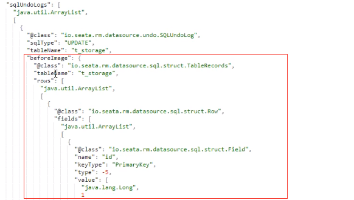
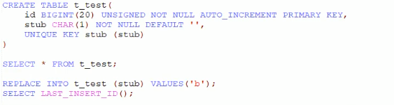
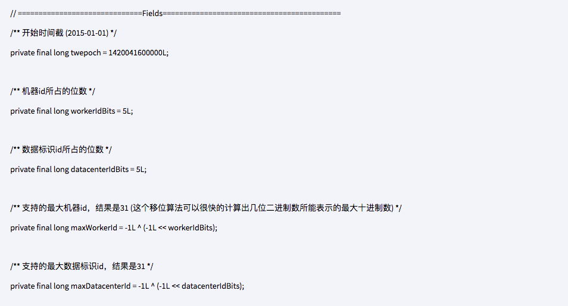
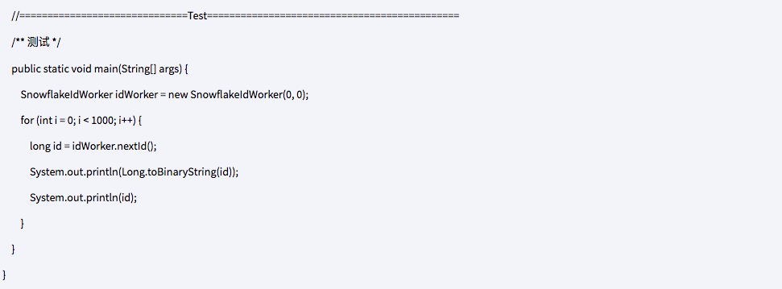
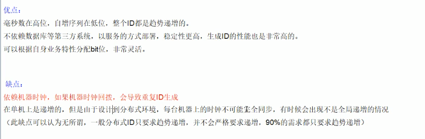

# 分布式事务问题
* 分布式前：单机库没这个问题。从1:1 -> 1:N -> N:N。
* 分布式之后：
  > 单体由应用被拆分成微服务应用，原来的三个模块被拆分成三个独立的应用，分别使用三个独立的数据源，业务操作需要调用三个服务来完成。此时每个服务内部的
  > 数据一致性由本地事务来保证，但是全局的数据一致性问题没法保证。
  > 
  > 如：用户购买商品的业务逻辑，整个业务逻辑由3个微服务提供支持：
  >   * 仓储服务：对给定的商品扣除仓储数量。
  >   * 订单服务：根据采购需求创建订单。
  >   * 账户服务：从用户账户中扣除余额。
  > 
* 一句话：一次业务操作需要跨多个数据源或需要跨多个系统进行远程调用，就会产生分布式事务问题

# Seata简洁
  * 是什么：
    * Seata是一款开源的分布式事务解决方案，致力于在微服务框架下提供高性能和简单易用的分布式事务服务
    * 官网地址：http://seata.io/zh-cn/  
  * 能干嘛：
    * 一个典型的分布式事务过程：
      * 分布式事务处理过程-ID+三组件模型：
        * Transaction ID(XID)：全局唯一的事务id
        * 三组件概念：
          * Transaction Coordinator(TC)：事务协调器，维护全局事务的运行状态，负责协调并驱动全局事务的提交或回滚。
          * Transaction Manager(TM):控制全局事务的边界，负责开启一个全局事务，并最终发起全局提交或全局回滚的决议。
          * Resource manager(RM)：控制分支事务，负责分支注册、状态汇报，并接受事务协调的指令，驱动分支（本地）事务的提交和回滚。
      * 处理过程：
        * 1.TM向TC申请开启一个全局事务，全局事务创建成功并生成一个全局唯一的XID；
        * 2.XID在微服务调用链路的上下文中传播；
        * 3.RM向TC注册分支事务，将其纳入XID对应全局事务的管辖；
        * 4.TM向TC发起针对XID的全局提交或回滚决议；
        * 5.TC调度XID下管辖的全部分支事务完成提交或回滚请求。
        > 
  * 哪儿下：发布说明：https://github.com/seata/seata/releases
  * 怎么玩：
    * 本地：@Transational
    * 全局：@GlobalTranstional：
    > seata的分布式交易解决方案：
    > 

# Seata-Server安装
* 1.官网地址：https://seata.io/zh-cn/
* 2.下载版本
* 3.seata-server-0.9.0.zip解压到指定目录并修改conf目录下的file.conf配置文件：
  * 先备份原始file.conf文件
  * 主要修改：自定义事务组名称+事务日志存储模式为db+数据库连接  
  * file.conf：
    * service模块：
      > 
    * store模块：  
      > 
      > 
* 4.mysql5.7数据库新建库seata：建表db_store.sql在seata-server-0.9.0\seata\conf目录里面。
* 5.在seata库里面新建表。
* 6.修改seata-server-0.9.0\seata\conf目录下的registry.conf目录下的registry.cong配置文件：
  > 
* 7.先启动Nacos端口号8848
* 8.再启动seata-server：seata-server-0.9.0\seata\bin : seata-server.bat

# 订单/库存/账户业务数据库准备
* 以下演示都需要先启动Nacos后启动Seata，保证两个都OK：Seata没启动报错no available server to connect
* 分布式事务业务说明：
  > 这里我们会创建三个服务，一个订单服务，一个库存服务，一个账户服务。
  > 
  > 当用户下单时，会在订单服务中创建一个订单，然后通过远程调用库存服务来扣减下单商品的库存，再通过远程调用账户服务来扣减用户账户里面的余额，最后在
  > 订单服务中修改订单状态为已完成。
  > 
  > 该操作跨越三个数据库，两次远程调用，很明显会有分布式事务问题。
* 创建数据库：
  * seata_order:存储订单的数据库
  * seata_storage：存储库存的数据库
  * seata_account：存储账户信息的数据库
  * 建表：
    > create database seata_order;
    > create database seata_storage;
    > create database seata_account;
* 按照上述3库分别建立对应业务表：
  * seata_order库下新建t_order表：
    > 
  * seata_storge库下新建t_storage表：
    > 
  * seata_account库下新建t_account表：
    > 
* 按照上述3库分别建立对应的回滚日志表：
  * 订单-库存-账户3个库下都需要建各自独立的回滚日志表
  * seata-server-0.9.0\seata\conf\目录下的db_undo_log.sql
  * 建表SQL：
    > 
* 最终效果
  > 
  
# 订单/库存/账户业务微服务准备
* 业务需求：下订单 -> 减库存 -> 扣余额 -> 改（订单状态）
* 新建订单Order-Module：
  * 1.seata-order-service2001
  * 2.POM：
    > 
    > 
    > 
    > 
  * 3.YML:
    > 
    > 
  * 4.file.conf：拷贝seata-server/conf目录下的file.conf 放入 /resources下
    > 
  * 5.registry.conf：拷贝seata-server/conf目录下的registry.conf 放入 /resources下
  * 6.domain：
    * CommonResult:
      > 
    * Order:
      > 
  * 7.Dao接口实现：
    * OrderDao
    * resources文件夹下新建mapper文件夹后添加：OrderMapper.xml
  * 8.Server接口及实现：
    * OrderService
    * AccountService
    * StorageService
  * 9.Controller：OrderController  
  * 10.Config配置：
    * MyBatisConfig
      > 
    * DataSourceProxyConfig
      > 
  * 11.主启动
    > 
* 新建库存Storage-Module：seata-storage-service2002
* 新建账户Account-Module: seata-account-service2003

# Test
* 数据库初始情况：
  > 
* 下订单 -> 减库存 -> 扣余额 -> 改（订单）状态：
  > 
* 正常下单：http://localhost:2001/order/create?userId=1&productId=1&count=10&money=100
  > 数据库情况：
  > 
* 超时异常，没加@GlobalTransactional：
  * AccountServiceImpl添加超时。
  * 数据库情况
  * 故障情况：
    * 当库存和账户金额扣减后，订单状态并没有设置为已经完成，没有从零改为1.
    * 而且由于feign的重试机制，账户余额还有可能被多次扣减。
  * 超时异常，添加@GlobalTransactional：
    * AccountServiceImpl添加超时。
    * OrderServiceImpl@GlobalTransactional：
      > 

# 一部分补充
* Seata：
  * 2019年1月蚂蚁金服和阿里巴巴共同开源的分布式事务解决方案。
  * Simple Extensible Autonomous Transaction Architecture，简单可扩展自治事务框架。
  * 2020起始，参加工作后用1.0以后的版本：
    > 
* 再看TC/TM/RM三个组件：
  *  
  * 分布式事务的执行流程：
    * TM开启分布式事务（TM向TC注册全局事务记录）
    * 按业务场景，编排数据库、服务等事务内资源（RM向TC汇报资源准备状态）
    * TM结束分布式事务，事务一阶段结束（TM通知TC提交/回滚分布式事务）
    * TC汇报事务信息，决定分布式事务是提交还是回滚。
    * TC通知所有RM提交/回滚资源，事务二阶段结束。
* AT模式如何做到对业务的无侵入：
  * 是什么：
    > AT模式：
    > * 前提：
    >   * 基于支持本地ACID事务的关系型数据库。
    >   * Java应用，通过JDBC访问数据库。
    > * 整体机制：两阶段提交协议的演变
    >   * 一阶段：业务数据和回滚日志记录在同一个本地事务中提交，释放本地锁和连接资源。
    >   * 二阶段：
    >     * 提交异步化，非常快速地完成。
    >     * 回滚通过一阶段的回滚日志进行反向补偿。
  * 一阶段加载：
    > 在一阶段，Seata会拦截"业务SQL",
    > * 1.解析SQL语义，找到"业务SQL"要更新的业务数据，在业务数据被更新前，将其保存成"before image"。
    > * 2.执行"业务SQL"更新业务数据，在业务数据更新之后，
    > * 3.将其保存成"after image"，最后生成行锁。
    > * 以上操作全部在一个数据库事务内完成，这样保证了一阶段操作的原子性。
    > 
  * 二阶段提交：
    > 二阶段如是顺利提交的话，因为"业务SQL"在一阶段已经提交至数据库，所以Seata框架只需将一阶段保存的快照数据和行锁删掉，完成数据清理即可。
    > 
  * 三阶段回滚：
    > 二阶段回滚：
    > 二阶段如果是回滚的话，Seata就需要回滚一阶段已经执行的"业务SQL",还原业务数据。
    > 回滚方式便是用"before image"还原业务数据；但在还原前要首选要校验脏写，对比"数据库当且业务数据"和"after image"，如果两份数据完全一致就说明
    > 没有脏写，可以还原业务数据，如果不一致就说明有脏写，出现脏写就需要转人工处理。
    > 
* debug：
  > AccountServiceImpl
  > 
  > 
  > 
  > undo.log
  > 
  > before image
  > 
* 补充：
  > 

# 集群高并发情况下如何保证分布式唯一全局id生成：
* 问题：
  * 为什么需要分布式全局唯一ID以及分布式ID的业务需求：
    > 在复杂分布式系统中，往往需要对大量的数据和消息进行唯一标识。
    > 
    > 如在美团点评的金融、支付、餐饮、酒店；
    > 猫眼电影等产品的系统中数据日渐增长，对数据分库分表后需要有一个唯一ID来标识一条数据或消息；
    > 特别一点的如订单、骑手、优惠券也都需要唯一ID做标识。
    > 此时一个能够生成全局唯一ID的系统是非常必要的。
  * ID生成规则部分硬性要求：
    * 1.全局唯一：不能出现重复的ID号，既然是唯一标识，这是最基本的要求。
    * 2.趋势递增：在MySQL的innoDB引擎中使用的是聚集索引，由于多数RDBMA使用Btree的数据结构来存储索引数据，在主键的选择上面我们应该尽量使用有序的主键保证写入性能
    * 3.单调递增：保证一个ID大于上一个ID，例如事务版本号、IM增量信号、排序等特殊需求。
    * 4.信息安全：如果ID是连续的，恶意用户的扒取工作就非常容易做了，直接按照顺序下载指定URL即可。所以在一些应用场景下，需要ID无规则，不规则，让竞争对手不好猜。
    * 5.含时间戳：这样就能在开发中快速了解分布式id的生成时间。
  * ID号生成系统的可用性要求：
    * 高可用：发一个获取分布式ID的请求，服务器就能保证99.999%的情况下给我们创建一个唯一分布式ID。
    * 低延迟：发一个获取分布式ID的请求，服务器就要快速，极速。
    * 高QPS：假如并发一口气创建分布式ID请求同时杀过来，服务器要顶得住且一下子成功创建10万。
* 一般通用方案：
  * UUID：
    * 是什么：如果只考虑唯一性，OK
      > UUID(Universally Unique Identifier)的标准形式包含32个16进制数字，以练字号分为五段，形式为8-4-4-4-12的36个字符，实例：
      > 550e8400-e29b-42d4-a716-446644550000
      > 性能非常高：本地生成，没有网络消耗。
    * But:入数据库性能差：
      > 为什么无序的UUID会导致入库性能变差呢？
      > * 1.无序，无法预测它的生成顺序，不能生成递增的有序数字。
      >   首先分布式id一般都会作为主键，但是安装mysql官方推荐主键要尽量越短越好，UUID每一个都很长，所以不是很推荐。
      > * 2.主键，ID作为主键时在特定的环境会存在一些问题。
      >   比如做DB主键的场景下，UUID就非常不适用MySQL官方有明确的建议主键要尽量越短越好36个字符长度的UUID不符合要求。
      > * 3.索引，B+树索引的分裂
      >   既然分布式id是主键，然后主键是包含索引的，然后mysql的索引是通过b+树来实现的，每一次新的UUID数据的插入，为了查询的优化，都会对索引底层
      >   的b+树进行修改，因为UUID数据是无须的，所以每一次UUID数据的插入都会对主键的b+树进行很大的修改，这一点很不好。插入完全无序，不但会导致一些
      >   中间节点产生分裂，也会白白创造出很多不饱和的节点，这样大大降低了数据插入的性能。
  * 数据库自增主键：
    * 单机：
      > 在分布式里面，数据库的自增ID机制的主要原理是：数据自增ID和mysql数据库的replace into实现的。
      > 这里的replace into更insert功能类似，
      > 不同点在于：replace into首先尝试插入数据列表中，如果发现表中已经有此行数据（根据主键或唯一索引判断）则先删除，再插入。
      > 否则直接插入新数据。
      > 
      > REPLACE INTO的含义是插入一条记录，如果表中唯一索引的值遇到冲突，则替换老数据。
      > 
    * 集群分布式：
      > 那数据库自增ID机制适合作分布式ID吗？答案是不太适合。
      > 1：系统水平扩展比较困难，比如定义好了步长和机器台数之后，如果要添加机器该怎么做？假设现在只有一台机器发号是1、2、3、4、5（步长是1），这个时候
      > 需要扩容机器一台。可以这样做：把第二台机器的初始值设置的比第一台超过很多，貌似还好，现在想象一下如果我们线上有100台机器，这个时候要扩容该怎么做？
      > 简直是噩梦。所以系统水平扩展方案复杂难以实现。
      > 
      > 2：数据库压力还是很大，每次获取ID都得读写一次数据库，非常影响性能，不符合分布式ID里面的延迟低和要高QPS的规则（在高并发下，如果都去数据库里面
      > 获取id，那是非常影响性能的）。
  * 基于redis生成全局id策略：
    * 因为Redis是单线程的天生保证原子性，可以使用原子操作INCR和INCRBY来实现。
    * 集群分布式：
      > 注意：在Redis集群情况下，同样和MySQL一样需要设置不同的增长步长，同时key一定要设置有效期。
      > 可以使用Redis集群来获取更高的吞吐量。
      > 假如一个集群中有5台Redis。可以初始化每台Redis的值分别是1、2、3、4、5,然后步长都是5。
      > 
* snowflake：Twitter的分布式自增ID算法snowflake：
  * 概述：
    > Twitter的分布式雪花算法SnowFlake，经测试snowflake每秒能够产生26万个自增可排序的ID.
    > * 1.twitter的SnowFlake生成ID能够按时间有序生成。
    > * 2.SnowFlake算法生成id的结果是一个64bit大小的整数，为一个Long型（转换成字符串后长度最多19）。
    > * 3.分布式系统内不会产生ID碰撞（由datacenter和workerId作分区）并且效率较高。
    > 
    > 分布式系统中，有一些需要使用全局唯一ID的场景，生成ID的基本要求。
    > * 1.在分布式的环境下必须全局且唯一。
    > * 2.一般都需要单调递增，因为一般唯一ID都会存到数据库，而Innodb的特性就是将内容存储在注解索引树上的叶子节点，而且是从左往右，递增的，所以
    >   考虑到数据库性能，一般生成的id也最好是单调递增。为了防止ID冲突可以使用36位的UUID,但是UUID有一些缺点，首先他相对比较长，另外UUID一般是无须的。
    > * 3.可能还会需要无规则，因为如果使用唯一ID作为订单号这种，为了不然别人知道一天的订单量是多少，就需要这个规则。
  * 结构：
    > 
    > 
    > 
  * 源码：https://github.com/twitter-archive/snowflake
    > 
    > 
    > 
    > 
    > 
    > 
    > 
    > 
    > 
    > 
  * 工程落地经验：
    * 糊涂工具包：
      * https://github.com/looly/hutool
      * https://hutool.cn/
    * springboot整合雪花算法：
      * POM：
        > 
      * 核心代码IdGeneratorSnowflake
  * 优缺点：
    > 
* 其他补充：
  * 百度开源的分布式唯一ID生成器UidGenerator
  * Subtopic。

