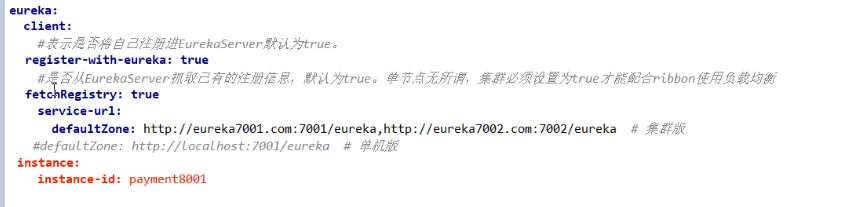
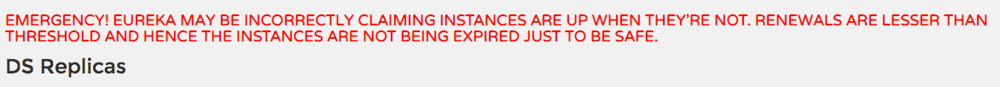

# 7.1.2.1 Eureka服务注册与发现

## 1.Eureka基础知识
* 什么是服务治理：
  > Spring Cloud封装了Netflix公司开发的Eureka模块来实现服务治理。
  > 
  > 在传统的rpc远程调用框架中，管理每个服务与服务之间的依赖关系比较复杂，管理比较复杂，所有需要使用服务治理，管理服务与服务之间依赖管理，可以实现服务调用、
  > 负载均衡、容错等，实现服务发现与注册。
* 什么是服务注册：
  > Eureka采用了CS的设计架构，Eureka Server作为服务注册功能的服务器，它是服务注册中心。而系统中的其他微服务，使用Eureka的客户端连接到Eureka Server
  > 并未出心跳连接。这样系统的维护人员就可以通过Eureka Server来监控系统中各个微服务是否正常运行。
  > 
  > 在服务注册与发现中，有一个注册中。当服务器启动的时候，会把当前自己服务器的信息，比如服务地址通信地址等以别名方式注册到注册中心上。另一方（消费者|
  > 服务提供者），以该别名的方式去注册中心上获取到实际的服务通讯地址，然后再实现本地RPC调用RPC远程调用框架核心设计思想：在注册中心，因为使用注册中心
  > 管理每个服务与服务之间的一个依赖关系（服务治理概念）。在任何rpc远程框架中，都会有一个注册中（存放服务地址相关信息（接口地址））。
  > 
* Eureka两组件：Eureka Server和Eureka Client
  * Eureka Server提供服务注册服务：
    > 各个微服务节点通过配置启动后，会在EurekaServer中进行注册，这样EurekaServer中的微服务注册表中将会存储所有可用微服务节点的信息，服务节点
    > 的信息可以在界面中直观看到。
  * EurekaClient通过注册中心进行访问：
    > 是一个Java客户端，用于简化Eureka Server的交互，客户端同时也具备一个内置的、使用轮询（round-robin）负载算法的负载均衡器。在应用启动后，将会向
    > Eureka Server发送心跳（默认周期为30秒）。如果Eureka Server在多个心跳周期内没有接收到某个节点的心跳，EurekaServer将会从服务注册表中
    > 把这个服务节点移除（默认90秒）。
## 2.单机Eureka构建步骤
* IDEA生成EurekaServer端服务注册中：类型物业公司
  * 建Module：cloud-eureka-server7001
  * 改POM:
    > <dependencies>
    > <!--eureka-server-->
    >   <dependency>
    >       <groupId>org.springframework.cloud</groupId>
    >       <artifactId>spring-cloud-starter-netflix-eureka-server</artifactId>
    >   </dependency>
    >   <dependency>
    >       <groupId>com.atguigu.springcloud</groupId>
    >       <artifactId>cloud-api-common</artifactId>
    >       <version>${project.version}</version>
    >   </dependency>
    >   <dependency>
    >       <groupId>org.springframework.boot</groupId>
    >       <artifactId>spring-boot-starter-web</artifactId>
    >   </dependency>
    >   <dependency>
    >       <groupId>org.springframework.boot</groupId>
    >       <artifactId>spring-boot-starter-actuator</artifactId>
    >   </dependency>
    >   <!--一般为通用配置-->
    >   <dependency>
    >       <groupId>org.springframework.boot</groupId>
    >       <artifactId>spring-boot-devtools</artifactId>
    >       <scope>runtime</scope>
    >       <optional>true</optional>
    >   </dependency>
    >   <dependency>
    >       <groupId>org.projectlombok</groupId>
    >       <artifactId>lombok</artifactId>
    >       <optional>true</optional>
    >   </dependency>
    >   <dependency>
    >       <groupId>org.springframework.boot</groupId>
    >       <artifactId>spring-boot-starter-test</artifactId>
    >       <scope>test</scope>
    >   </dependency>
    > </dependencies>
    > 
    > 
    * 1.x和2.x的对比说明：
      > 
      > <dependencies>
      >   <dependency>
      >   <groupId>org.springframework.cloud</groupId>
      >   <artifactId>spring-cloud-starter-netflix-eureka-server</artifactId>
      >   </dependency>
      > </dependencies>
  * 写YML：
    > 
  * 主启动：@EnableEurekaServer
    > 
  * 测试：  
    * http://localhost:7001/
    * 结果页面：No application available没有服务被发现，因为没有注册服务进来当前不可能有服务被发现。
* EurekaClient端cloud-provider-payment8001 将注册进EurekaServer成为服务提供者provider。
  * cloud-provider-payment8001：
  * 改POM：
    > 
    > <dependency>
    >   <groupId>org.springframework.cloud</groupId>
    >   <artifactId>spring-cloud-starter-netflix-eureka-client</artifactId>
    > </dependency>
  * 写YML:
    > 
    > 
  * 主启动：@EnableEurekaClient
  * 测试：
    * 先启动EurekaServer。
    * http://localhost:7001/
    * 微服务名配置说明：
      > 
  * 自我保护机制：
    > 

* EurekaClient端cloud-consumer-order80 将注册进EurekaServer成武服务消费者consumer。

* bug

## 3.集群Eureka构建步骤

* Eureka集群原理说明：
  >
  > 解决办法：搭建Eureka注册中心集群，实现负载均衡+故障容错
* Eureka集群环境构建步骤：
  * 参考cloud-eureka-server7001
  * 新建cloud-eureka-server7002
  * 改POM：
  * 修改映射配置：
    * 找到C:\Windows\System32\drivers\etc路径下的hosts文件。
      > 
    * 修改映射配置添加hosts文件。
      * 127.0.0.1 eureka7001.com
      * 127.0.0.1 eureka7002.com
    * 刷新hosts文件。
  * 写YML（以前单机）：
    
    * 7001:
      > 
    * 7002:
      > 
  * 主启动：
* 将支付服务8001微服务发布到上面2台Eureka集群配置中：
  > 
  > 
* 将订单服务80微服务发布到上面2台Eureka集群配置中：
  > 
  > defaultZone: http://eureka7001.com:7001/eureka,http://eureka7002.com:7002/eureka
* 测试1：
  * 先要启动EurekaServer，7001/7002服务。
  * 再要启动服务提供者provider,8001。
  * 再要启动消费者，80
  * http://localosh/consumer/payment/get31：
  
    
* 支付服务提供者8001集群环境搭建：
  * 参考cloud-provider-payment8001
  * 新建cloud-provider-payment8002
  * 改POM
  * YAML
    > 
  * 主启动：
  * 业务类：直接从8001粘。
  * 修改8001/8002的controller：
    > 
    > 
* 负载均衡：
  * bug：订单服务访问地址不能写死。
    > 
    > // 通过在eureka上注册过的微服务名称调用
    > public static final String PAYMENT_URL="http://CLOUD-PAYMENT-SERVICE";
    > 
  * 使用@LoadBalanced注解赋予RestTemplate负载均衡的能力：
    > 
  * ApplicationContextBean：
* 测试2：
  * 先要启动EurekaServer，7001/7002服务。
  * 再要启动服务提供者provider，8001/8002服务。
  * http://localhost/consumer/payment/get/31
  * 结果：负载均衡效果达到，8001/8002端口交替出现。
  * Ribbon和Eureka整合后Consumer可以直接调用服务而不用再关心地址和端口号，且该服务还有负载功能。

## 4.actuator微服务信息完善
* 主机名称：服务名称修改：
  * 当前问题：
    > 
  * 修改cloud-provoder-payment8001
    > * yaml:
    >   * 修改部分；
    >     
    >   * 完整内容：
    >     
    > * 效果：
    >   > 
  * 修改之后：
  
* 访问信息由IP信息提示：
  * 没有IP提示：
  * 修改cloud-provoder-payment8001：
    * YAML:
      * 修改部分：
        > 
      * 完整内容：
        > 
    * 效果图：
      > 
  * Subtopic：

## 5.服务发现Discovery
* 对于注册eureka里面的微服务，可以通过服务发现来获得该服务的信息。
* 修改cloud-provider-payment8001的Controller：
  > 
  > 
* 8001的启动类：@EnableDiscoveryClient：
* 自测：
  * 先要启动EurekaServer。
  * 再启动8001主启动类，需要稍等一会。
  * http://localhost:8001/payment/discovery
  * 效果图：
  > 
  > 

## 6.eureka自我保护
* 故障现象：
> 概述：
> 
> 保护模式主要用于一组客户端和Eureka Server之间存在网络分区场景下的保护。一旦进入保护模式，Eureka Server将会尝试保护其服务注册表中的信息，
> 不再删除服务注册表中的数据，也就是不会注销任何微服务。
> 
> 如果在Eureka Server的首页看到以下这段提示，则说明Eureka进入保护模式：
> EMERGENCY! EUREKA MAY BE INCORRECTLY CLAIMING INSTANCES ARE UP WHEN THEY'RE NOT. RENEWALS ARE LESSER THAN THRESHOLD AND HENCE THE INSTANCES ARE NOT BEING EXPIRED JUST TO BE SAFE.
> 

* 导致原因：
  * 一句话：某时某刻一个微服务不可用了，Eureka不会立刻清理，依旧会对该服务的信息进行保存。
  * 属于CAP里面的AP分支。
  > 为什么会产生Eureka自我保护机制？
  > 为了防止EurekaClient可以正常运行，但是与EurekaServer网络不通情况下，EurekaServer不会立刻将EurekaClient服务剔除。
  > 
  > 什么是自我保护模式？
  > 默认情况下，如果EurekaServer在一定时间内没有接收到某个微服务实例的心跳，EurekaServer将会注销该实例（默认90秒）。但是当网络分区故障发生（
  > 延时、卡顿、拥挤）时，微服务与EurekaServer之间无法正常通信，以上行为可能变得非常危险了——因为微服务本身其实是健康的，此时本不应该注销这个微服务。
  > Eureka通过"自我保护模式"来解决这个问题——当EurekaServer节点在段时间内丢失过多客户端时（可能发生了网络分区故障），那么这个节点就会进入自我
  > 保护模式。
  > 
  > 它的设计哲学就是宁可保留错误的服务注册信息，也不盲目注销任何可能监控的服务实例。一句话讲解：好死不如赖活着。
  > 
  > 综上，自我保护模式是一种应对网络异常的安全保护措施。它的架构哲学是宁可同时保留所有微服务（健康的微服务和不健康的微服务都会保留）也不盲目注销任何健康的
  > 微服务。使用自我保护模式，可以让Eureka集群更加的健壮、稳定。
* 怎么禁止自我保护：
  * 注册中心eurekaServer端7001:
    * 默认，自我保护机制是开启的：eureka.server.enable-self-preservation=true
    * 使用eureka.server.enable-self-preservation=false可以禁用自我保护模式
    * 关闭效果：
      > 
    * 在eurekaServer端7001处设置关闭自我保护机制。
  * 生产者客户端eurekaClient端8001:
    * 默认：
      * eureka.instance.lease-renewal-interval-in-seconds=30 ：单位是秒（默认30秒）。
        > Eureka客户端向服务端发送心跳的时间间隔,单位为秒(默认是30秒)
      * eureka.instance.lease-expiration-duration-in-seconds=90 ：单位为妙（默认是90秒）。
        > Eureka服务端在收到最后一次心跳后等待时间上限 ,单位为秒(默认是90秒),超时剔除服务
    * 配置：
      > 
    * 测试：
      * 7001和8001都配置成功。
      * 先启动7001再启动8001。
      * 先关闭8001：马上被删除了
        > 

# 7.1.2.2 Zookeeper服务注册与发现

## Eureka停止更新了，怎么办
https://github.com/Netflix/eureka/wiki

## SpringCloud正好Zookeeper替代Eureka
* 注册中心Zookeeper：
  * Zookeeper是一个分布式协调工具，可以实现注册中心功能。
  * 关闭Linux服务器防火墙后启动Zookeeper服务器：
    > 
  * Zookeeper服务器取代Eureka服务器，zk作为服务注册中心。
* 服务提供者：
  * 新建cloud-provider-payment8004
  * POM：
    > 
    > 
    > 
  * YML:
    > 
  * 主启动类：@EnableDiscoveryClient
    > 
  * Controller:
    > 
  * 启动8004注册进zookeeper：
    * 启动zk：zkServer.sh start
    * 启动后问题：
      > 
    * why:
      * 解决zookeeper版本jar包冲突问题：
        > 
      * 排除zk冲突后的新POM：
        > 
        > 
        > 
        > 
  * 验证测试：http://localhost:8004/payment/zk
    > 
  * 验证测试2：
    * 获得json串后用在线工具查看试试：
      > 
    > 
  * 思考：服务节点是临时节点还是持久节点。
    * 临时节点：

* 服务消费者：
  * 新建cloud-consumerzk-order80:
  * POM：
    > 
    > 
    > 
  * YML:
    > 
    > 
  * 主启动：
    > 
  * 业务类：
    * 配置bean:
      > 
    * controller：
      > 
      > 
  * 验证测试：
    > 
  * 访问测试地址：http://location/consumer/payment/zk

# 7.1.2.3 Consul服务注册与发现

## 7.1.2.3.1 Consul简介
* 是什么：https://www.consul.io/intro/index.html
  > 
  > Consul是一套开源的分布式服务发现和配置管理系统，由HashiCorp公司用Go语言开发。
  > 
  > 提供了微服务系统中的服务治理、配置中心、控制总线等功能。这些功能中每一个都可以根据需要单独使用，也可以一起使用以构建全方位的服务网格，总之Consul
  > 提供了一种完整的服务网格解决方案。
  > 
  > 它具有很多优点。包括：基于raft协议，比较简洁；支持健康检查，同时支持HTTP和DNS协议支持跨数据中心的WAN集群提供图形界面，跨平台，支持Linux、Mac、Windows。
* 能干吗？：
  > 
  * 服务发现：提供HTTP/DNS两种发现方式。
  * 健康检测：支持多种方式，HTTP、TCP、Docker、shell脚本定制化。
  * KV存储：Key、Value的存储方式。
  * 多数据中心:Consul支持多数据中心
  * 可视化界面：
* 下载：https://www.consul.io/downloads.html
* 使用：https://www.springcloud.cc/spring-cloud-consul.html

## 7.1.2.3.2 安装并运行Consul
* 官网说明：https://learn.hashicorp.com/consul/getting-started/install.html
* 下载完成后只有一个consul.exe文件，硬盘路径下双击运行，查看版本信息：
> 
> consul --version
* 使用开发模式启动：
  * consul agent -dev
  * 通过以下地址可以访问Consul的首页：http://localhost:8500
  * 结果页面：
  > 
## 7.1.2.3.3 服务提供者
* 新建Module支付服务provider8006：cloud-providerconsul-payment8006
* POM：
  > 
  > 
* YML:
  > 
* 主启动类：
  > 
* 业务Controller:
  > 
* 验证测试：http://localhost:8006/payment/consul
  > 
  
## 7.1.2.3.4 服务消费者
* 新建Module消费服务order80:cloud-consumerconsul-order80
* POM:
  > 
  > 
  > 
* YML:
  > 
* 主启动类：
  > 
* 配置bean：
* Controller:
* 验证测试：
* 访问测试地址：http://localhost/consumer/payment/consul

## 7.1.2.3.5 三个注册中心异同

* CAP：分区容错性要保证，要么是CP，要么是AP。
  * C:Consistency（强一致性）。
  * A:Availability（可用性）。
  * P:Parttition tolerance(分区容错性)。
  > CAP理论关注粒度是否是数据，而不是整体系统设计的策略。

* 经典CAP图：
  > 最多只能同时较好的满足两个。
  > CAP理论的核心是：一个分布式系统不可能同时很好的满足一致性、可用性和分区容错性这三个需求，因此，根据CAP原理将NoSQL数据库分成了满足CA原则、
  > 和满足CP原则和满足AP原则三大类：
  > 
  > CA-单点集群，满足一致性、可用性的系统，通常在扩展性上不太强大。
  > 
  > CP-满足一致性、分区容忍性的系统，通常性能不是特别高。
  > 
  > AP-满足可用性，分区容忍性的系统，通常可能对一致性要求低一些。
  * AP(eureka):
    > 
  * CP(Zookeeper/Consul)：
    > CP架构：
    > 当网络分区出现后，为了保证一致性，就必须拒绝请求，否则无法保证一致性。
    > 结论：违背了可用性A的要求，只满足一致性和分区容错性，即CP
    > 

