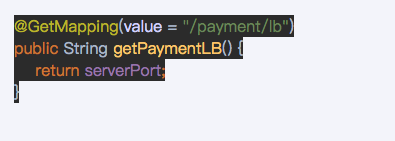

# 概述
* 是什么：
  > Spring Cloud Ribbon是基于Netflix Ribbon实现的一套 客户端 负载均衡的工具。
  > 
  > 简单的说，Ribbon是Netflix发布的开源项目，主要功能是提供客户端的软件负载均衡算法和服务调用。Ribbon客户端组件提供一系列完善的配置项如连接超时，
  > 重试等。简单的说，就是在配置文件中列出Load Balancer（简称LB）后面所有的机器，Ribbon会自动的帮助你基于某种规则（如简单轮训，随机连接等）去
  > 连接这些机器。我们很容易使用Ribbon实现自定义的负载均衡算法。
* 官网资料：
  * https://github.com/Netflix/ribbon/wiki/Getting-Started
  * Ribbon目前也进入维护模式：
    > 
    * 未来替换方案：
      > SpringCloud loadBalancer
      > 
* 能干嘛：
  * LB(负载均衡)：
    > LB负载均衡（Load Balance）是什么
    > 
    > 简单的说就是将用户的请求平摊的分配到多个服务上，从而达到系统的HA(高可用)。
    > 场景的负载均衡有软件Nginx、LVS，硬件F5等。
    > 
    > 
    > Ribbon本地负载均衡客户端VS Nginx服务端负载均衡区别：
    > Nginx是服务器负载均衡，客户端所有请求都会交给nginx，然后由nginx实现转发请求。即负载均衡是由服务端实现的。
    > 
    > Ribbon本地负载均衡，在调用微服务接口时候，会在注册中心上获取注册信息服务列表之后缓存到JVM本地，从而在本地实现RPC远程服务调用技术。
    * 集中式LB：
      > 即在服务的消费方和提供方之间使用独立的LB设施（可以是硬件，如F5，也可以是软件，如nginx），由该设施负责把访问请求通过某种策略转发至服务的提供方。
    * 进程内LB:  
      > 将LB逻辑集成到消费方，消费方从服务注册中心获知那些地址可用，然后自己再从这些地址中选择出一个合适的服务器。
      > 
      > Ribbon就属于进程内LB，它只是一个类库，集成于消费方进程，消费方通过它来获取到服务提供方的地址。
  * 前面我们讲解过80通过轮询负载访问8001/8002
  * 一句话：负载均衡+RestTemplate调用。  

# Ribbon负载均衡演示
* 架构说明：

  * Ribbon在工作时分成两步：
    * 第一步先选择EurekaServer，它优先选择在同一区域内负载较少的server。
    * 第二步再根据用户指定的策略，在server取到的服务注册列表中选择一个地址。其中Ribbon提供了多种策略：比如轮询、随机和根据响应时间加权。
  * 总结：Ribbon其实就是一个软负载均衡的客户端组件，它可以和其他所需请求的客户端结合使用，和eureka结合只是其中一个实例。  
* POM:
  > 
  > 

* 二说RestTemplate的使用：
  * 官网：
    > 
  * getForObject方法/getForEntity方法：
    > 
    > 
  * postForObject/postForEntity：
  * GET请求方法：
  * POST请求方法
# Ribbon核心组件IRule
* IRule：根据特定算法从服务器中选取一个要访问的服务：

  * com.netflix.loadbalancer.RoundRobinRule：轮询。
  * com.netflix.loadbalancer.RandomRule：随机。
  * com.netflix.loadbalancer.RetryRule：先按照RoundRobinRule的策略获取服务，如果获取服务失败则在指定时间内进行重试，获取可用的服务。
  * WeightedResponseTimeRule：对RoundRobinRule的扩展，响应速度越快的实例选择权重越大，越容易被选择。
  * BestAvailableRule: 会先过滤掉由于多次访问故障而处于断路器跳闸状态的服务，然后选择一个并发量最小的服务。
  * AvailabilityFilteringRUle：先过滤掉故障实例，再选择并发较小的实例。
  * ZoneAvoidanceRule：默认规则，复合判断server所在区域的性能和server的可用性选择服务器。

* 如何替换：
  * 修改cloud-consumer-order80
  * 注意配置细节。
    > 官方文档明确给出了警告：
    > 这个自定义配置类不能放在@ComponentScan所扫描的包当前包下以及子包下，否则我们自定义的这个配置类就会被所有的Ribbon客户端所共享，达不到特殊化定制的目的了。
    > 
    > 
  * 新建package：com.atguigu.myrule：
    > 
  * 上面包下新建MySelfRule规则类：
    > 
  * 主启动类添加@RibbonClient:
    > 
  * 测试：http://locahost/consumer/payment/get/31  

# Ribbon负载均衡算法
* 原理：负载均衡算法：rest接口第几次请求数 % 服务器集群总数量 = 实际调用服务器位置下标，每次服务重启动后rest接口计数从1开始。
  > 
* 源码：
* 手写：
  * 7001/7002集群启动：
  * 8001/8002集群启动：controller:
    > 
  * 80订单微服务改造：
    * 1.ApplicationContextBean去掉注解@LoadBalanced。
    * 2.LoadBalancer接口。
    * 3.MyLB.
    * 4.OrderController。
    * 5.测试：http://localhost/consumer/payment/lb
      > 

      