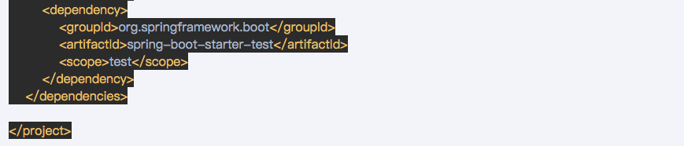

# 概述
* OpenFeign是什么：
  * Feign是一个声明式的Web服务客户端，让编写Web服务客户端变得非常容易， 只需 创建一个接口并在接口上添加注解即可。
  * GitHub：https://github.com/spring-cloud/spring-cloud-openfeign。  
  >  官网解释：https://cloud.spring.io/spring-cloud-static/Hoxton.SR1/reference/htmlsingle/#spring-cloud-openfeign
  >          https://cloud.spring.io/spring-cloud-static/Hoxton.SR1/reference/htmlsingle/#spring-cloud-openfeign
  > 
  > Feign是一个声明式WebService客户端。使用Feign能让编写Web Service客户端更加简单。
  > 它的使用方法是定义一个服务接口然后在上面添加注解。Feign也支持可插拔式的编译器和解释器。Spring Cloud对Feign进行了封装，使其支持Spring MVN
  > 标准注解和HttpMessageConverters。Feign可以与Eureka和Ribbon组合使用以支持负载均衡
  > 
* 能干嘛：
  > Feign旨在使编写Java Http客户端变得更容易。
  > 前面在使用Ribbon+RestTemplate时，利用RestTemplate对http请求的封装处理，形成了一套模板化的调用方法。但是在实际开发中，由于对服务依赖的
  > 调用可能不止一处，往往一个接口会被多处调用，所以通常都会针对每个微服务自行封装一些客户端类来包装这些依赖服务的调用。所以，Feign在此基础上做了进一步封装，
  > 由它来帮助我们定义和实现依赖服务接口的定义。在Feign的实现下，我们只需创建一个接口并使用注解的方式来配置它（以前是Dao接口上面标注Mapper注解，现在是一个微服务接口上面
  > 注一个Feign注解即可），即可完成对服务提供方的接口绑定，简化了使用Spring cloud Ribbon时，自动封装服务调用客户端的开发量。
  > 
  > Feign集成Ribbon
  > 利用Ribbon维护了Payment的服务列表信息，并且通过轮询实现了客户端的负载均衡。而与Ribbon不同的是，通过feign只需要定义服务绑定接口且以声明式的方法，优雅而简单的实现了服务调用。

* Feign和OpenFeign两者区别：
  > 
  
# OpenFeign使用步骤
* 接口+注解：微服务调用接口+@FeignClient。
* 新建cloud-consumer-feign-order80：feign在消费端使用：
  > 
* POM:
  > 
  > 
  > 
* YML：
  > 
* 主启动：@EnableFeignClients
  > 
* 业务类：
  * 业务逻辑接口+@FeignClient配置调用provider服务。
  * 新建PaymentFeignService接口并新增注解@FeignClient：@FeignClient。
  * 控制层Controller。  
* 测试：
  * 先启动2个eureka集群7001/7002
  * 再启动2个微服务8001/8002
  * 启动OpenFeign
  * http://localhost/cpnsumer/payment/get/31
  * Feign自带负载均衡配置项。  
* 小总结：
  > 

# OpenFeign超时控制
* 超时设置，故意设置超时演示出错情况：
  * 服务提供方8001故意写暂停程序。
  * 服务消费方80添加超时方法PaymentFeignService。
  * 服务消费方80添加超时方法OrderFeignController。
  * 测试：
    * http://localhost/consumer/payment/feign/timeout
    * 错误页面：
    > 
* OpenFeign默认等待1秒钟，超过后报错。
* 是什么？OpenFeign默认支持Ribbon。
  > 默认Feign客户端只等待一秒钟，但是服务端处理需要超过1秒钟，导致Feign客户端不想等待了，直接返回报错。为了避免这样的情况，有时候我们需要设置
  > Feign客户端的超时控制。
  >
  > yml文件中开启配置。
* YML文件里需要开启OpenFeign客户端超时控制：
  > 
  
# OpenFeign日志打印功能
* 日志打印功能：
* 是什么：
  > Feign提供了日志打印功能，我们可以通过配置来调整日志级别，从而了解Frign中Http请求的细节。说白了就是对Feign接口的调用情况进行监控和输出。
* 日志级别：
  * NONE：默认的，不显示任何日志。
  * BASIC：仅记录请求方法、URL、响应状态码及执行时间；
  * HEADERS：除了BASIC中定义的信息之外，还有请求和响应的头信息；
  * FULL：除了HEADERS中定义的信息之外，还有请求和响应的正文及元数据。
* 配置日志bean:
  > 
* YML文件里需要开启日志的Feign客户端：
  > 
* 后台日志查看：
  > 

  
