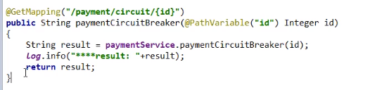
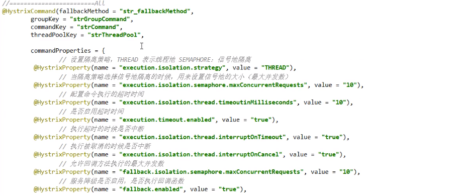
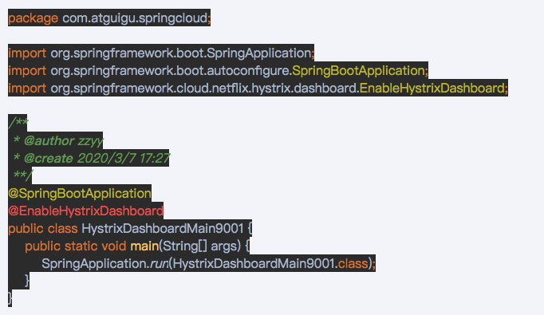

# 1.概述
* 分布式系统面临的问题：
  > 复杂分布式体系结构中的应用程序，有数10个依赖关系，每个依赖关系在某些时候将不可避免地失败。
  > 
  > 服务雪崩：
  > 
  > 多个微服务之间调用的时候，假设服务A调用微服务B和微服务C，微服务B和微服务C又调用其它的微服务，这就是所谓的 "扇出"。如果扇出的链上某个微服务的
  > 调用响应时间过长或者不可用，对微服务A的调用就会占用越来越多的系统资源，进而引起系统崩溃，所谓的"雪崩效应"。
  > 
  > 对于高流量的应用来说，单一的后端依赖可能会导致所有服务器上的所有资源都在几秒钟内饱和。比失败更糟糕的是，这些应用程序还可能导致服务之间的延迟增加，
  > 备份队列，线程和其他系统资源紧张，导致整个系统发生更多的级联故障。这些都表示需要对故障和延迟进行隔离和管理，以便单个依赖关系的失败，不能取消整个应用程序或系统。
  > 所以， 
  > 通常当你发现一个模块下的某个实例失败后，这时候这个模块依然还会接收流量，然后这个有问题的模块还调用了其他的模块，这样就会发生级联故障，或者叫雪崩。
* 是什么：
  > Hystrix是一个用于处理分布式系统的延迟和容错的开源库，在分布式系统里，许多依赖不可避免的会调用失败，比如超时、异常等，Hystrix能够保证在一个
  > 依赖出问题的情况下，不会导致整个服务失败，避免级联故障，以提高分布式系统的弹性。
  > 
  > "断路器"本身是一种开关装置，当某个服务单元发生故障之后，通过断路器的故障监控（类似熔断保险丝），向调用方返回一个符合预期的、可处理的备选响应（FallBack），
  > 而不是长时间的等待或者抛出调用方法处理的异常，这样就保证了服务调用方的线程不会被长时间、不必要地占用，从而避免了故障在分布式系统中的蔓延，乃至雪崩。
  > 
* 能干嘛：
  * 服务降级：
  * 服务熔断：
  * 接近实时的监控：  
* 官网资料：https://github.com/Netflix/hystrix/wiki
* Hystrix官宣，停更进维：https://github.com/Netflix/hystrix
    > 
    * 被动修复bugs。
    * 不再接受合并请求。
    * 不再发布新版本。
# 2.HyStrix重要概念
* 服务降级：
  * 服务器忙，请稍后再试，不让客户端等待并立刻返回一个友好提示，fallback。
  * 那些情况会发出降级：
    * 程序运行异常.
    * 超时。
    * 服务熔断触发服务降级。
    * 线程池/信号量也会导致服务降级。
* 服务熔断：
  * 类比保险丝达到最大服务访问后，直接拒绝访问，拉闸限电，然后调用服务降级的方法并返回友好提示。
  * 就是保险丝：服务的降级->进而熔断->恢复调用链路。 
* 服务限流：秒杀高并发等操作，严禁一窝蜂的过来拥挤，大家排队，一秒钟N个，有序进行。

# 3.hystrix案例
* 构建：
  * 新建cloud-provider-hystrix-payment8001
  * POM:
    > 
    > 
    > 
  * YML:
    > 
  * 主启动：
    > 
  * 业务类：
    * server:
      > 
      > 
    * controller:  
      > 
      > 
  * 正常测试：  
    * 启动eureka7001
    * 启动eureka-provider-hystrix-payment8001
    * 访问：
      * success的方法：http://localhost:8001/payment/hystrix/ok/31
      * 每次调用耗时5秒钟：http://localhost:8001/payment/hystrix/ok/31
    * 上述module均OK：以上述为根基平台，从正确->错误->降级熔断->恢复。
* 高并发测试：
  * 上述在非高并发情形下，还能勉强满足 but...
  * Jmeter压测测试：
    > 下载地址https://jmeter.apache.org/download_jmeter.cgi
    * 开启Jmeter,来20000个并发压死8001，20000个请求都去访问paymentInfo_TimeOut服务：
      > 
    * 再来一个访问：http://localhost:8001/payment/hystrix/timeout/31
    * 演示结果：
      * 两个都在转圈圈
      * 为什么会被卡死：tomcat的默认工作线程数被打满了，没有多余的线程来分解压力和处理。
  * Jmeter压测结论:上面还只是服务提供者8001自己测试，假如此时外部的消费者80也来访问，那消费者只能干等，最终导致消费端8001直接被拖死。
  * 看热闹不嫌弃事大，80新建加入：cloud-consumer-feign-hystrix-order80：
    * 新建：cloud-consumer-feign-hystrix-order80
    * POM:
      > 
      > 
      > 
    * YML:
      > 
    * 主启动：
      > 
    * 业务类：
      * PaymentHystrixService:
        > 
        > 
      * OrderHystrixController：
    * 正常测试：http://localhost/consumer/payment/hystrix/ok/32
    * 高并发测试：
      * 2w个线程压8001
      * 消费者80微服务再去访问的OK服务8001地址
      * http://localhost/consumer/payment/hystrix/ok/32
      * 消费者80，：
        * 要么转圈
        * 要么消费端报超时错误：
          > 
* 故障和导致现象：
  * 8001同一层次的其他接口被困死，因为tomcat线程池里面的工作线程已经被挤占完毕。
  * 80此时调用8001,客户端访问响应缓慢，转圈圈。
* 上述结论：因上述故障或表现不佳，才有我们的降级/容错/限流等技术诞生。
* 如何解决？解决的要求：
  * 超时导致服务器变慢：超时，不再等待。
  * 出错（宕机或程序运行出错）：出错要有兜底。
  * 解决：
    * 对方服务（8001）超时了，调用者（80）不能一直卡死等待，必须有服务降级。
    * 对方服务（8001）down机了，调用者（80）不能一直卡死等待，必须有服务降级。
    * 对方服务（8001）ok，调用者（80）自己有故障或有自我要求（自己的等待时间小于服务提供者）。
* 服务降级：
  * 降级配置：@HystrixCommand
  * 8001先从自身找问题：设置自身调用超时时间的峰值，峰值内可以正常运行，超过了还需要有兜底的方法处理，做服务降级fallback。
  * 8001fallback:
    * 业务类启用：@HystrixCommand报异常后如何处理，一旦调用服务方法失败并且抛出了错误信息，会自动调用@HystrixCommand标注好的fallbckMethod
      标注好的fallbckMethod调用类中指定方法。
      > 
      > @HystrixCommand(fallbackMethod = "payment_TimeOutHandler", commandProperties = {
      > @HystrixProperty(name = "execution.isolation.thread.timeoutInMilliseconds", value = "3000")
      > 
    * 主启动类激活：@EnableCircuitBreaker
  * 80fallback：
    * 80订单微服务，也可以更好的保护自己，自己也依样画葫芦进行客户端降级保护。
    * 题外话：我们自己配置过的热部署方式对java代码的改动明显，但对@HystrixCommand内属性的修改建议重启微服务。
    * POM:
      > 
    * YML：
      > 
    * 主启动：@EnableHystrix
    * 业务类：
      > 
      > @GetMapping("/consumer/payment/hystrix/timeout/{id}")
      > @HystrixCommand(fallbackMethod = "paymentTimeOutFallbackMethod", commandProperties = {
      > @HystrixProperty(name = "execution.isolation.thread.timeoutInMilliseconds", value = "1500")
      > })
      > public String paymentInfo_TimeOut(@PathVariable("id") Integer id) {
      > //int age = 10/0;
      > return paymentHystrixService.paymentInfo_TimeOut(id);
      > }
      > 
      > public String paymentTimeOutFallbackMethod(@PathVariable("id") Integer id) {
      > return "我是消费者80,对方支付系统繁忙请10秒种后再试或者自己运行出错请检查自己,o(╥﹏╥)o";
      > }
  * 目前问题：
    * 每个业务方法对应一个兜底的方法，代码膨胀
    * 统一和自定义的分开
  * 解决办法：
    * 每个方法配置一个：
      * feign接口系列。
      * @DefaultProperties(defaultFallback="")：
        > 
        > 
      * controller配置：
        > 
        > 
        > 
    * 和业务逻辑混在一起：
      * 服务降级，客户端去调用服务端，碰上服务端宕机或关闭。
      * 本次案例服务降级处理是在客户端80实现完成，与服务器8001没有关系，只需要为Feign客户端定义的接口添加一个服务降级处理的实现类即可实现解耦。
      * 未来我们要面对的异常：
        * 运行：
        * 超时：
        * 宕机
      * 再看我们的业务类PaymentController:
        > 
      * 修改cloud-consumer-feign-hystrix-order80
      * 根据cloud-consumer-feign-hystrix-order80已经有的PaymentHystrixService接口，重新创建一个类（PaymentFallbackService）实现接口，
        统一为接口里面的方法进行异常处理。
      * PaymentFallbackService类实现PaymentFeginService接口 
        > 
      * YML:
        > 
      * PaymentFeignClientService接口：
        > 
      * 测试：
        * 单个eureka先启动7001
        * PaymentHystrixMain8001启动
        * 正常访问测试：http://localhost/consumer/payment/hystrix/ok/32
        * 故意关闭微服务8001
        * 客户端自己调用提示：此时服务端provider已经down，但是我们做了服务降级处理，让客户端在服务端不可用时也会获得提示信息而不会挂起耗死服务器。
* 服务熔断：
  * 断路器：一句话就是家里的保险丝。
  * 熔断是什么？：大神论文：https://martinfowler.com/bliki/CircuitBreaker.html
  * 实操：
    * 修改cloud-provider-hystrix-payment8001
    * PaymentService：
      > 
      > why这些参数：
      > 
    * PaymentController:
    > 
    * 测试：
      * 自测：cloud-provider-hystrix-payment8001
      * 正确：http://localhost:8001/payment/circuit/31
      * 错误：http://localhost:8001/payment/cicuit/-31
      * 一次正确一次错误trytry
      * 重点测试：多次正确，然后慢慢正确，发现刚开始不满足条件，就算是正确的访问也不能进行。
  * 原理/总结：
    * 大神结论：
      > 
    * 熔断类型：
      * 熔断打开：请求不再调用当前服务，内部设置一般为MTR(平均故障处理时间)，当打开长达导致所设时钟则进入半熔断状态。
      * 熔断关闭：熔断关闭后不会对服务进行熔断。
      * 熔断半开：部分请求根据规则调用当前服务，如果请求成功且符合规则则认为当前服务恢复正常，关闭熔断。
    * 官网断路器流程图：
      * 官网步骤：
        > 
      * 断路器在什么情况下开始起作用：
        > 
      * 断路器开启或者关闭的条件：
        * 当满足一定的阈值的时候（默认10秒钟超过20个请求次数）
        * 当失败率达到一定的时候（默认10秒内超过50%的请求次数）
        * 到达以上阈值，断路器将会开启。
        * 当开启的时候，所有请求都不会进行转发。
        * 一段时间之后（默认5秒），这个时候断路器是半开状态，会让其他一个请求进行转发，如果成功，断路器会关闭，若失败，继续开启，重复4和5.
      * 断路器打开之后：
        > 
      * ALL配置：
        > 
        > 
        > 
        > 
* 服务限流：后面高级篇讲解alibaba的Sentinel说明。

# 4.hystrix工作流程
* https://github.com/Netflix/Hystrix/wiki/How-itWorks
* Hystrix工作流程：
  * 官网图例：
    > 
  * 步骤说明：
    > 

# 5.服务监控hystrixDashboard
* 概述：
  除了隔离依赖服务的调用以外，Hystrix还提供了准实时的调用监控（Hystrix Dashboard），Hystrix会持续地记录所有通过Hystrix发起的请求的执行信息，
  并以统计报表和图形的形式展示给用户，包括每秒执行多少请求多少成功，多少失败等。Netflix通过hystrix-metrics-event-stream项目实现对以上指标的监控。
  Spring Cloud也提供了Hystrix Dashboard的整合，对监控内容转化成可视界面。
  
* 仪表盘9001：
  * 新建cloud-consumer-hystrix-dashboard9001
  * POM：
    > 
    > 
    > 
  * YML:
    > 
  * HystrixDashboardMain9001+新注解@EnableHystrixDashboard：
    > 
  * 所有Provider微服务提供类（8001/8002/8003）都需要监控依赖部署：
    > 
  * 启动cloud-consumer-hystrix-dashboard9001该微服务后续将监控微服务8001：http//localhost:9001/hystrix
    > 
  
* 断路器演示（服务监控hystrixDashboard）
  * 修改cloud-provider-hystrix-payment8001：
    * 注意：新版本Hystrix需要在主启动MainAppHystrix8001中指定监控路径：
      > 
      > package com.atguigu.springcloud;
      > import com.netflix.hystrix.contrib.metrics.eventstream.HystrixMetricsStreamServlet;
      > import org.springframework.boot.SpringApplication;
      > import org.springframework.boot.autoconfigure.SpringBootApplication;
      > import org.springframework.boot.web.servlet.ServletRegistrationBean;
      > import org.springframework.cloud.netflix.hystrix.dashboard.EnableHystrixDashboard;
      > import org.springframework.context.annotation.Bean;
      >
      > /**
      > * @author zzyy
      > * @create 2020/3/7 17:27
      >   **/
      >   @SpringBootApplication
      > @EnableHystrixDashboard
      > public class HystrixDashboardMain9001 {
      > public static void main(String[] args) {
      > SpringApplication.run(HystrixDashboardMain9001.class);
      > }
      > 
      > /**
      >   * 此配置是为了服务监控而配置，与服务容错本身无观，springCloud 升级之后的坑
      >   * ServletRegistrationBean因为springboot的默认路径不是/hystrix.stream
      >   * 只要在自己的项目中配置上下面的servlet即可
      >   * @return
      >   */
      > @Bean
      > public ServletRegistrationBean getServlet(){
      > HystrixMetricsStreamServlet streamServlet = new HystrixMetricsStreamServlet();
      > ServletRegistrationBean<HystrixMetricsStreamServlet> registrationBean = new ServletRegistrationBean<>(streamServlet);
      > registrationBean.setLoadOnStartup(1);
      > registrationBean.addUrlMappings("/hystrix.stream");
      > registrationBean.setName("HystrixMetricsStreamServlet");
      > return registrationBean;
      >  } 
      >      }
   * Unable to connect to Command Metric Stream。
   * 404  
  * 监控测试：
    * 启动一个eureka或者3个eureka集群均可。
    * 观察监控窗口：
      * 9001监控8001：
        > 
        * 填写监控地址：
        * http://localhost:8001/hystrix.stream
      * 测试地址：
        * http://localhost:8001/payment/circuit/31
        * http://localhost:8001/payment/circuit/-31
        * 上述测试通过：ok
        * 先访问正确地址，再访问错误地址，再正确地址，会发现图标断路器都是慢慢放开的：
          * 监控结果，成功。
            > 
          * 监控结果，失败。
            > 
      * 如何看？
        * 7色：
          > 
        * 1圈：
          > 实心圆：共有两种含义。它通过颜色的变化代表了实例的健康程度，它的健康度从绿色<黄色<橙色<红色递减。
          > 该实心圆除了颜色的变化之外，它的大小也会根据实例的请求流量发生变化，流量越大该实心圆就越大。所以通过该实心圆的展示，就可以在大量的实例中
          > 快速的发现故障实例和高压力实例。
        * 1线：
          > 曲线：用来记录2分钟内流量的相对变化，可以通过它来观察到流量的上升和下降趋势。
        * 整图说明：
          > 
          > 
        * 整图说明2：
          > 
      * 搞懂一个才能看懂复杂的：
          > 

