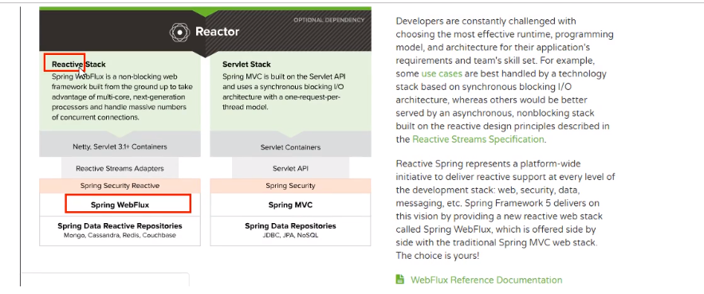
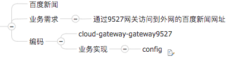

# 7.1.6.1 zuul路由网关
## 1. 概述
* 是什么
> 
* 能干嘛：路由/过滤
* 官网资料：https://github.com/Netflix/zuul/wiki/Getting-Started

## 2. 路径基本配置
* 新建Model模块microservicecloud-zuul-getway-9527
* POM：
  * 修改内容：
    > 
  * 全部内容：
    > 
    > 
    > 
    > 
    > 
  * YML
    > 
    > 
  * hosts修改：127.0.0.1 myzuul.com
  * 主启动类：@EnableZuulProxy
    > 
  * 启动：
    >
    > 
    * 三个eureka集群
    * 一个服务提供类microservicecloud-provider-dept-8001
    * 一个路由  
  * 测试：
    > 
## 3.路由访问映射规则
* 工程microservicecloud-zuul-getway-9527
* 代理名称：
  * YML：
    > 
  * 此时问题：  
    > 
* 原真是服务名忽略：
  * YML:
    > 
  * 单个具体，多个可以用"*"
    > 
* 设置统一公共前缀：
  > 
  > 
* 最后YML:
  > 
  > 

## 4.路由映射规则

## 5.查看路由信息

## 6.过滤器

# 7.1.6.2 Gateway新一代网关
## 概述简介
* 官网：
  * 上一代zuul 1.x：https://github.com/Netflix/zuul/wiki
  * 当前gateway：https://cloud.spring.io/spring-cloud-static/spring-cloud-gateway/2.2.1.RELEASE/reference/html/  
* 是什么：
  * 概述：
    > Cloud全家桶中有个很重要的组件就是网关，在1.x版本中都是采用的Zuul网关;但在2.x版本中，zuul的升级一直跳票，SpringCLoud最后自己研发了一个网关替代Zuul,
    > 那就是SpringCloud GateWay一句话：gateway是原zuul1.x版的替代。
    > 
    > Gateway是Spring生态系统之上构建的API网关服务，基于Spring 5，Spring Boot2和Project Reactor等技术。Gateway旨在提供一种简单而有效的方式来对
    > API进行路由，以及提供一些强大的过滤器，例如：熔断、限流、重试等。
    > 
    > SpringCloud Gateway是Spring Cloud的一个全新项目，基于Spring 5.0+Spring Boot 2.0和Project Reactor等技术开发的网关，它旨在为微服务架构提供一种
    > 简单有效的统一的API路由管理方式。
    > 
    > SpringCloud Gateway作为Spring Cloud生态系统中的网关，目标是替代Zuul,在Spring Cloud 2.0以上版本中，没有对新版本的Zuul 2.o以上最新
    > 高性能版本进行集成，仍然还是使用的Zuul 1.x非Reactor模式的老版本。而为了提升网关的性能，SpringCloud Gateway是基于WebFlux框架实现的，而WebFlux
    > 框架底层则使用了高性能的Reactor模式通信框架Netty。
    > 
    > SpringCloud Gateway的目标提供统一的路由方式且基于Filter链的方式提供了网关基本的功能，例如：安全、监控/指标，和限流。
  * 一句话：  
    * SpringCloud Gateway使用的是Webflux中的reactor-netty响应式编程组件，底层使用了Netty通讯框架。
    * 源码架构：
      > 
  * 能干嘛：
    * 反向代理
    * 鉴权
    * 浏览控制
    * 熔断
    * 日志监控
    * ...
  * 微服务架构中网关在哪里：
    > 
  * 有Zuul了怎么又出来gateway:
    * 我们为什么选择Gateway?:
      * 1.netflix不太靠谱，zuul2.0一直跳票，迟迟不发布。
        > 一方面因为Zuul1.0已经进入了维护阶段，而且Gateway是SpringCloud团队研发的，是亲儿子产品，值的信赖。而且很多功能Zuul都没有用起来也非常的简单便捷。
        > 
        > Gateway是基于异步非阻塞模型上进行开发的，性能方面不需要担心。虽然Netflix早就发布了最新的Zuul 2.x，但Spring Cloud貌似没有整合计划。
        > 而且Netflix相关组件都宣布进入维护期；不知前景如何？
        > 
        > 多方面综合考虑Gateway是很理想的网关选择。
      * 2.SpringCloud Gateway具有如下特性：
        > 基于Spring Framework 5，Project Reactor和Spring Boot 2.0进行构建；
        > 动态路由：能够匹配任何请求属性；
        > 可以对路由指定Predicate（断言）和Filter(过滤器)；
        > 集成Hystrix的断路器功能；
        > 集成Spring Cloud服务发现功能；
        > 易于编写的Predicate（断言）和Filter（过滤器）；
        > 请求限流功能；
        > 支持路径重写。
      * 3.SpringCloud Gateway与Zuul的区别：  
        > 在SpringCloud Finchley正式版之前，Spring Cloud推荐的网关是Netflix提供的Zuul：
        > 1、Zuul 1.x是一个基于阻塞 I/O的API Gateway。
        > 
        > 2、Zuul 1.x基于Servlet2.5使用阻塞架构它不支持任何长连接（如WebSocket）Zuul的设计模式和Nginx较像，每次I/O操作都是从工作线程中选择一个执行，
        > 请求线程被阻塞到工作线程完成，但是差别是Nginx用C++实现，Zuul是Java实现，而JVM本身会有第一次加载较慢的情况，使得Zuul的性能相对较差。
        > 
        > 3、Zuul 2.x理念更先进，想基于Netty非阻塞和支持长连接，但SpringCloud目前还没有整合。Zuul 2.x的性能较Zuul 1.x有较大提升。在性能方面，
        > 根据官方提供的基准测试，Spring Cloud Gateway的RPS(每秒请求数)是Zuul的1.6倍。
        > 
        > 4、Spring Cloud Gateway建立在Spring Framework 5、Project Reactor和Spring Boot 2之上，使用非阻塞API。
        > 
        > 5、Spring Cloud Gateway还支持WebSocket，并且与Spring紧密集成拥有更好的开发体验。
    * Zuul1.x模型：
      > 
      > 
    * Gateway模型：WebFlux是什么？
      > 
      > 
      * https://docs.spring.io/spring/docs/current/spring-framework-reference/web-reactive.html#spring-webflux
      * 说明：
        > 传统的Web框架，比如说：struts2、springmvc等都是基于Servlet API与Servlet容器基础之上运行的。
        > 但是
        > 在Servlet3.1之后有了异步非阻塞的支持。而WebFlux是一个典型非阻塞异步的架构，它的核心是基于Reactor的相关API实现的。相当于传统的web
        > 框架来说，它可以运行在诸如Netty，Undertow及支持Servlet3.1的容器之上。非阻塞式+函数式编程（Spring5必须让你使用java8）
        > 
        > Spring WebFlux是Spring 5.0引入的新的响应式框架，区别于Spring MVC，它不需要依赖Servlet API，它是完全异步非阻塞的，并且基于Reactor
        > 来实现响应式流规范。
## 三大核心概念
* Route（路由）：路由是构建网关的基本模块，它由ID，模板URI，一系列的断言和过滤器组成，如断言为true则匹配该路由。
* Predicate(断言)：参考的是Java8的java.util.function.Predicate开发人员可以匹配HTTP请求中的所有内容（例如请求头或请求参数），如果请求与断言
  相匹配则进行路由。
* Filter（过滤）：指的是Spring框架中GatewayFilter的实例，使用过滤器，可以在请求被路由前或者之后对请求进行修改。
* 总结：
> 
> web请求，通过一些匹配条件，定位到真正的服务节点。并在这个转发过程的前后，进行一些精细化控制。
> predicate就是我们的匹配条件：而filter，就可以理解为一个无所不能的拦截器，有了这两个元素，再加上目标uri，就可以实现一个具体的路由了。

## Gateway工作流程
* 官网总结：
  > 
  > 客户端向Spring Cloud Gateway发出请求。然后在Gateway Handler Mapping中找到与请求相匹配的路由，将其发送到Getway Web Handler。
  > 
  > Handler再通过指定的过滤器链来将请求发送到我们实际的服务执行业务逻辑，然后返回。
  > 过滤器之间用虚线分开是因为过滤器可能会在发送代理请求之前（"pre"）或之后（"post"）执行业务逻辑。
  > 
  > Filter在"pre"类型的过滤器可以做参数校验、权限校验、流量监控、日志输出、协议转换等，
  > 在"post"类型的过滤器中可以做响应内容、响应头的修改，日志的输出，流量监控等有着非常重要的作用。
* 核心逻辑：路由转发+执行过滤器链。

## 入门配置
* 新建Module：cloud-gateway-gateway9527
* POM：
  > 
* YML
* 业务类：无
* 主启动类：
  > 
* 9527网关如何做路由映射呢？
  * cloud-provider-payment8001看看controller的访问地址：
    * get
    * lb
  * 我们目前不想暴露8001端口，希望在8001外面套一层9527
* YML新增网关配置：
  > 
  > 
  > 
 
* 测试
  * 启动7001
  * 启动8001:cloud-provider-payment:8001
  * 启动9527
  * 访问说明：
    > 
    * 添加网关前：http://localhost:8001/payment/get/31
    * 添加网关后：http://localhost:9527/payment/get/31
* YML配置说明：Gatewat网关路由有两种配置方式：
  * 在配置文件yaml中配置：见前面的步骤
  * 代码中注入RouteLocator的Bean：
    * 官网案例：
      > 
      > 
    * 百度国内新闻网站，需要外网：https://news.baidu.com/guonei
    * 自己写一个
    > 
    > 
## 通过服务名实现动态

## Predicate

## Predicate

## Filter的使用

