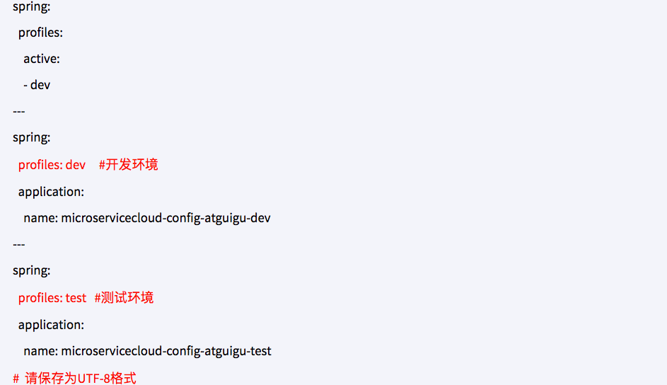
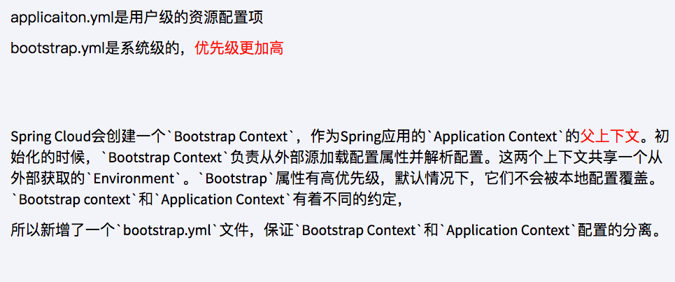

# 概述
* 分布式系统面临的配置问题：
  > 微服务意味着要将单体应用中的业务拆分成一个个子服务，每个服务的粒度相对较小，因此系统中会出现大量的服务。由于每个服务都需要必要的配置信息才能运行，所以
  > 一套集中式的、动态的配置管理设施是必不可少的。
  > 
  > SpringCloud提供了ConfigServer来解决这个问题，我们每一个微服务自己带着一个application.yml，上百个配置文件的管理。
* 是什么？
  > 
  > * 是什么: 
  >   SpringCloud Config为微服务架构中的微服务提供集中化的外部配置支持，配置服务器为各个不同微服务应用的所有环境提供了一个中心化的外部配置。
  > 
  > * 怎么玩?
  >   SpringCloud Config分为服务端和客户端两部分。        
  >   服务端也称为分布式配置中心，它是一个独立的微服务应用，用来连接配置服务器并为客户端提供获取配置信息，加密/解密信息等访问接口。       
  >   客户端则是通过指定的配置中心来管理应用资源，以及与业务相关的配置内容，并在启动的时候从配置中心获取和加载配置信息配置服务器默认采用git来存储配置信息，
  >   这样就有助于对环境配置进行版本管理，并且可以通过git客户端工具来方便的管理和访问配置内容。
  > 

* 能干嘛：
  * 集中管理配置文件
  * 不同环境不同配置，动态化的配置更新，分环境部署比如/dev/test/prod/beta/release
  * 运行期间动态调整配置，不再需要在每个服务部署的机器上编写配置文件，服务会向配置中心统一拉取配置自己的信息。
  * 当配置发生变动时，服务不需要重启即可感知到配置的变化并应用新的配置。
  * 将配置信息以REST接口的形式暴露，post、curl访问刷新均可...
* 与GitHub整合配置：由于SpringCLoud Config默认使用Git来存储配置文件(也有其他方式，比如支持SVN和本地文件)，但最推荐的还是Git，而且使用的是
http/https访问的形式。
* 官网：https://cloud.spring.io/spring-cloud-static/spring-cloud-config/2.2.1.RELEASE/reference/html/

# Config服务端配置与测试
* 1.用自己的GitHub账户在GitHub上新建一个名为microservicecloud-config的新Repository。
  > 
* 2.由上一步获得SSH协议的git地址:git@github.com:zzyybs/microservicecloud-config.git
* 3.本地硬盘目录上新建git仓库并clone：
  > 
  > 本地地址：D:\44\mySpringCloud
  > git命令：git clone git@github.com:zzyybs/microservicecloud-config.git
* 4.在本地D:\44\mySpringCloud\microservicecloud-config里面新建一个application.yml
  * YML内容：
    > 
  * 保存格式必须为UTF-8
* 5.将上一步的YML文件推送到github上:
  * git add.
  * git commit -m "init yml"
  * git push origin master
  * 步骤结果：
    * 命令清单：
      > 
    * GitHub：
      > 
* 6.新建Module模块microservicecloud-config-3344它即为Cloud的配置中心模块。
* 7.POM:
  * 修改内容：
    > 
  * 全部内容：
    > 
    > 
    > 
    > 
    > 
    > 
* 8.YML
  > 
* 9.主启动类Config_3344_StartSpringCloudApp：@EnableConfigServer
  > 
* 10.windows下修改hosts文件，增加映射：127.0.0.1 config-3344.com
* 11.测试通过Config微服务是否可以从GitHub上获取配置内容：
  > 
* 12.配置读取规则：
  > 官网：
  > 
  > 
* 13.成功实现了用SpringCloud Config通过GitHub获取配置信息。

# Config客户端配置与测试
* 1.在本地D:\44\mySpringCloud\microservicecloud-config路径下新建文件microservicecloud-config-client.yml
* 2.microservicecloud-config-client.yml内容：
  > 
  > 
* 3.将上一步提交到GitHub中
* 4.新建miroservicecloud-config-client-3355
* 5.POM：
  * 修改内容：
    > 
  * 全部内容：
    > 
    > 
    > 
    > 
    > 
* 6.bootstrap.yml
  * 是什么：
    > 
  * 内容：
    > 
* 7.application.yml
  > 
* 8.windows下修改hosts文件，增加映射：127.0.0.1 client-config.com
* 9.新建rest类，验证是否能从GitHub上读取配置：
  > 
  > 
* 10.主启动类ConfigClient_3355_StartSpringCloudAPP
  > 
* 11.测试：
  > 
* 12.成功实现了客户端3355访问SpringCloud Config3344通过GitHub获取配置信息
* 13.问题随之而来，分布式配置的动态刷新问题：
  > 
  
# Config客户端之动态刷新
* 避免每次更新配置都要重启客户端微服务3355
* 动态刷新》步骤：
* 修改3355模块
* POM引入actuator监控
  > 
* 修改YML，暴露监控端口：
  > 
* @RefreshScope业务类Controller修改：
  > 
* HOW:
  > 
* 再次：
  > 
* 还有什么问题：
  > 

