# 概述
* 分布式自动刷新配置功能。
* Spring Cloud Bus配合Spring Cloud Config使用可以实现配置的动态刷新。
* 是什么：Bus支持两种消息代理：RabbitMQ和kafka
  > 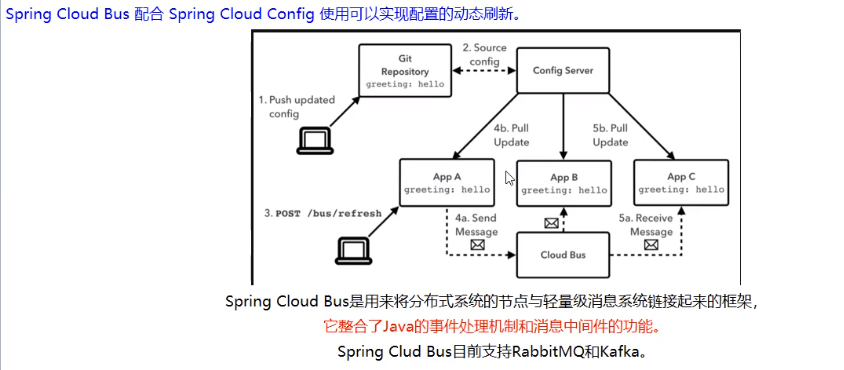
* 能干嘛：
  > 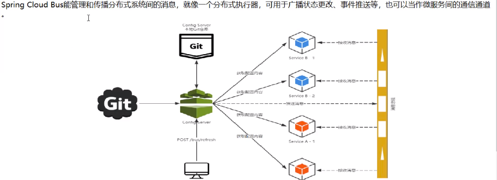
* 为什么被称为总线：
  > * 什么是总线
  >   在微服务架构的系统中，通常会使用轻量级的消息代理来构建一个共用的消息主题，并让系统中所有微服务实例都连接上来。由于该主题中产生的消息会被所有
  >   实例监听和消费，所以称它为消息总线。在总线上的各个实例，都可以方便地广播一些需要让其他连接在该主题上的实例都知道的消息。
  > * 基本原理
  >   ConfigClient实例都监听MQ中同一个topic（默认是springCloudBus）。当一个服务刷新数据的时候，它会把这个信息放入到Topic中，这样其他监听同一个
  >   Topic的服务就能得到通知，然后去更新自身的配置

# RabbitMQ环境配置
* 安装Erlang,下载地址：
> http://erlang.org.download/otp_win64_21.3.exe
> 步骤：
> 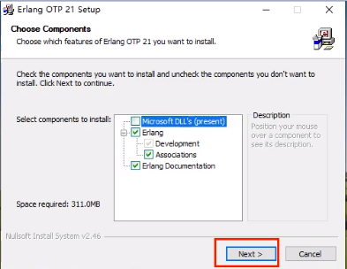
> 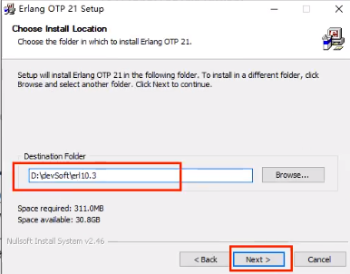
> 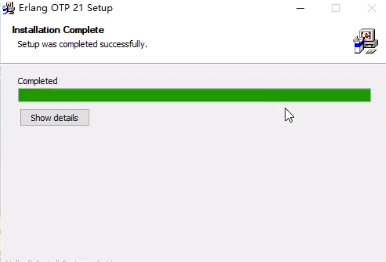
* 安装RabbitMQ,下载地址：
> https://dl.bintray.com/rabbitmq/all/rabbitmq-server/3.7.14/:rabbitmq-server-3.7.14.exe
> 步骤：
> 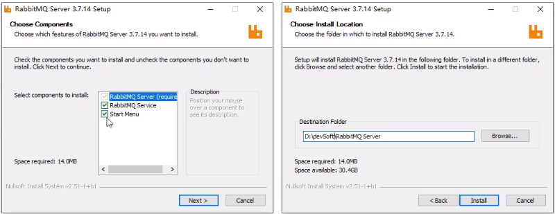
> 
* 进入RabbiqMQ安装目录下的sbin目录：D:\devSoft\RabbitMQ Server\rabbitmq_server-3.7.14\sbin
> 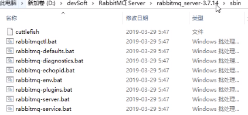
* 输入以下命令启动管理功能：
  * rabbitmq-plugins enable rabbitmq_management：
    > 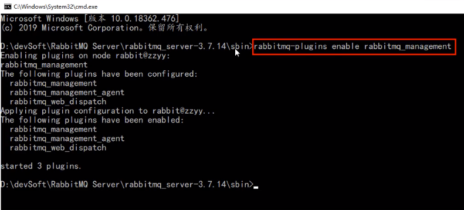
  * 可视化插件
    > 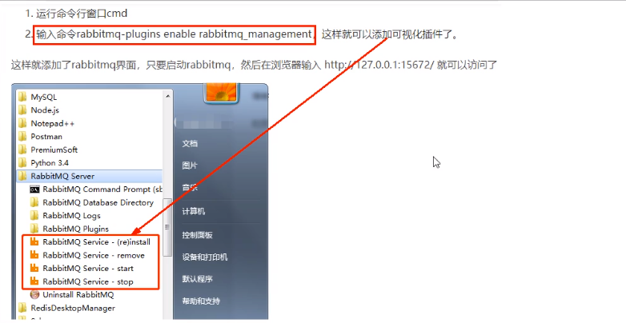
  * 访问地址查看是否安装成功：http://localhost:15672
  * 输入账号密码并登录：guest guest  

# SpringCloud Bus动态刷新全局广播
* 必须先具备良好的RabbitMQ环境
* 演示广播效果，增加复杂度，再以3355为目标制作一个3366:
  > 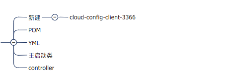
* 设计思想：
  * 1）利用消息总线触发一个客户端/bus/refesh，而刷新所有客户端的配置：
    > 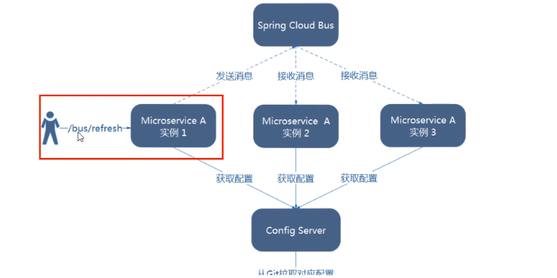
  * 2）利用消息总线触发一个服务端ConfigServer的/bus/refesh端点，而刷新所有客户端的配置：通知总控，再通知其他。
    > 
    > 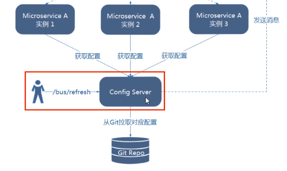
  * 图二的架构显然更加适合，图一不适合的原因如下：
    * 打破了微服务的职责单一性，因为微服务本身是业务模块，它不应该承担配置刷新的职责。
    * 打破了微服务各节点的对等性。
    * 有一定的局限性，例如，微服务在迁移时，它的网络地址常常会发生变化，此时如果想要做自动刷新，那就会增加更多的修改。
  * 给cloud-config-center-3344配置中心服务端添加消息总线支持：
    * POM：
      > 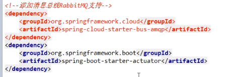
    * YML:
      > 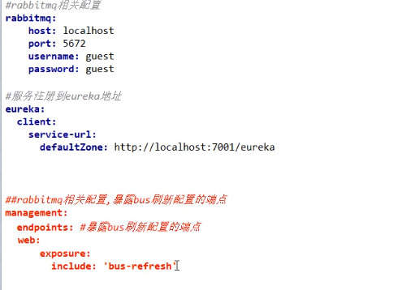
  * 给cloud-config-center-3355客户端添加消息总线的支持：
    * POM:
      > 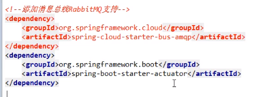
    * YML:
      > 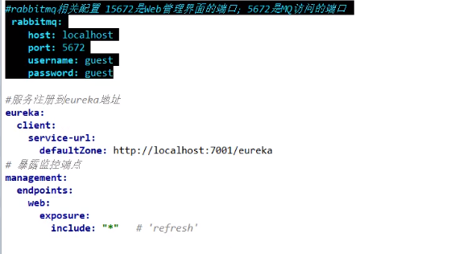
  * 给cloud-config-client-3366客户端添加消息总线的支持：
    * POM:
      > 
    * YML:
      > 
  * 测试：
    > 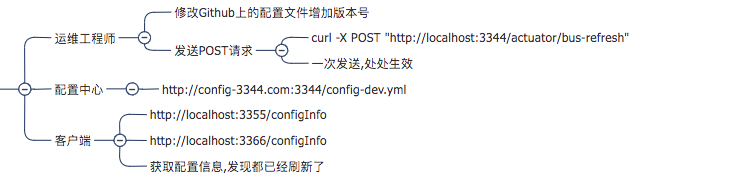
  * 一次修改，广播通知，处处生效：  

# SpringCloud Bus动态刷新定点通知
* 不想全部通知，只想定点通知：
  * 只通知3355
  * 不通知3366
* 简单一句话：
  * 指定具体一个实例生效而不是全部。
  * 公式：http://localhost:配置中心端口号/actuator/bus-refresh/{destination}
  * /bus-refresh请求不再发送到具体的服务实例上，而是发给config server并通过destination参数类指定需要重新配置的服务或实例。
* 案例：我们这里以刷新运行在3355端口上的config-client为例:只通知3355，不通知3366。
  > curl -X POST "http://localhost:3344/actuator/bus-refresh/config-client:3355"
  > 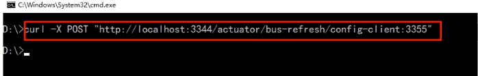
* 通知总结ALL:
  > 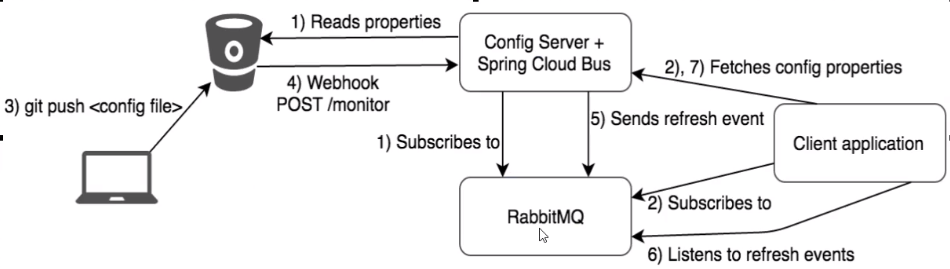

