# 消息驱动概述
* 是什么：
  * 一句话：屏蔽底层信息中间件的差异，降低切换成本，统一消息的编程模型。
    > 什么是SpringCloudStream.
    > 官方定义Spring Cloud Stream是一个构建消息驱动微服务的框架。
    > 
    > 应用程序通过inputs或者outputs来与Spring Cloud Stream中binder对象交互。
    > 通过我们配置来binding（绑定），而Spring Cloud Stream的binder对象负责与消息中间件交互。
    > 所以，我们只需要搞清楚如何与Spring Cloud Stream交互就可以方便使用消息驱动的方式。
    > 
    > 通过使用Spring Integration来连接消息代理中间件以实现消息事件驱动。
    > Spring Cloud Stream为一些供应商的消息中间件产品提供了个性化的自动化配置实现，引用了发布-订阅、消费组、分区的三个核心概念。
    > 目前仅支持RabbitMQ、Kafka。
    > 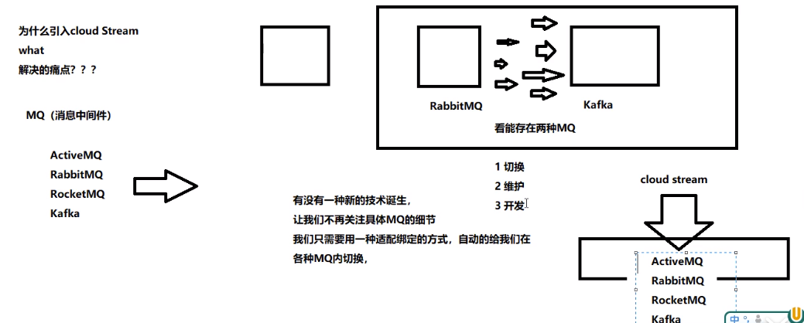
  * 官网：  
    * https://spring.io/projects/spring-cloud-stream#overview
      > SpringCloud Stream是用于构建与共享消息传递系统连接的高可伸缩的事件驱动微服务框架，该框架提供了一个灵活的编程模型，它建立在已经建立和
      > 熟悉的Spring熟语和最佳实践上，包括支持持久化的发布/订阅、消费组以及消息分区这三个核心概念。
      > 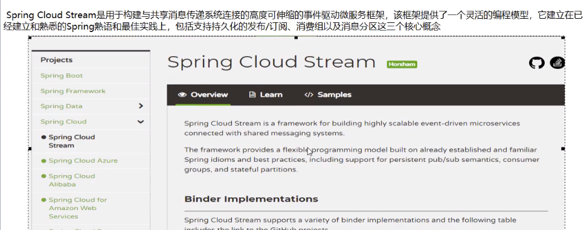
    * https://cloud.spring.io/spring-cloud-static/spring-cloud-stream/3.0.1.RELEASE/reference/html/
    * Spring Cloud Stream中文指导手册：https://m.wang1314.com/doc/webapp/topic/20971999.html
    
* 设计思想：
  * 标准MQ:
    > 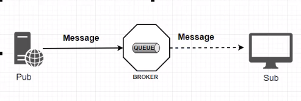
    * 生成着/消费者之间靠消息媒介传递消息内容：Message。
    * 消息必须走特定的通道：消息通道MessageChannel。
    * 消息通道里的消息如何被消费呢？谁负责收发处理：消息通道MessageChannel的子接口SubscribableChannel，由MessageHandler消息处理器所订阅。  
  * 为什么用Cloud Stream：
    > 比方说我们用到了RabbitMQ和Kafka，由于这两个消息中间件的架构上的不同，像RabbitMQ有exchange，kafka有Topic和Partitions分区。
    > 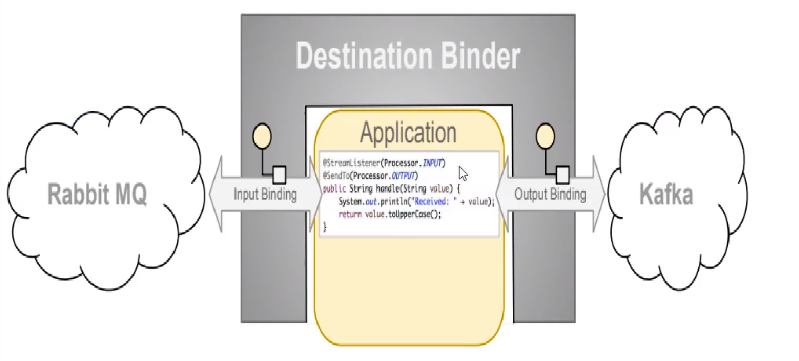
    > 这些中间件的差异性导致我们实际项目开发给我们造成了一定的困扰，我们如果用了两个消息队列的其中一种，后面的业务需求，我们想往另外一种消息队列进行
    > 迁移，这时候无疑就是一个灾难性的，一大堆东西都要重新推到重新做，因为它跟我们的系统耦合了，这时候springcloud Stream给我们提供了一种解耦合的方式。
    * stream凭什么可以统一底层差异：
      > 在没有绑定器这个概念的情况下，我们的SpringBoot应用要直接与消息中间件进行信息交互的时候，由于各消息中间件构建的初衷不同，它们的实现细节上
      > 会有较大的差异性，通过定义绑定器作为中间层，完美地实现了应用程序与消息中间件细节之间的隔离。
      > 通过向应用程序暴露统一的Channel通道，使得应用程序不需要再考虑各种不同的消息中间件实现。
      > 
      > 通过定义绑定器Binder作为中间层，实现了应用程序与消息中间件细节之间的隔离。
      > 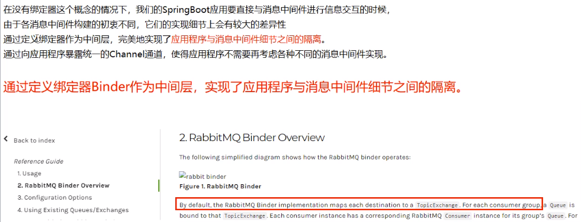
    * Binder：  
      > 在没有绑定器这个概念的情况下，我们的SpringBoot应用要直接与消息中间件进行信息交互的时候，由于各个消息中间件构建的初衷不同，它们的实现细节
      > 上会有较大的差异性，通过定义绑定器作为中间层，完美地实现了应用程序与消息中间件细节之间的隔离。Stream对消息中间件的进一步封装，可以做到代码层
      > 对中间件的无感知，甚至于动态的切换中间件（rabbitmq切换为kafka），使得微服务开发的高度解耦，服务可以关注更多自己的业务流程。
      > 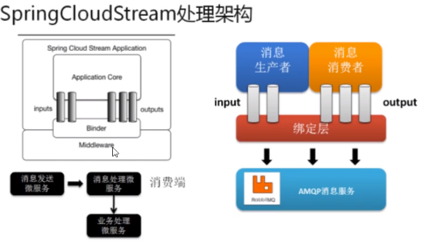
      > 通过定义绑定器Binder作为中间层，实现了应用程序与消息中间件之间的隔离。
      * input对应消费者：
      * output对应生产者：
  * Stream中的消息通信方式遵循了发布-订阅模式： topic主题进行广播
    * 在ribbitmq就是Exchange。
    * 在kafka中就是topic。

* Spring Cloud Stream标准流程套路
  > 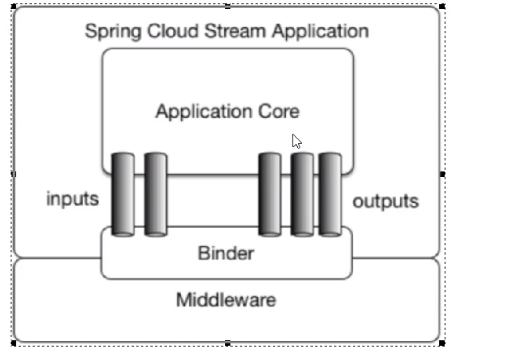
  > 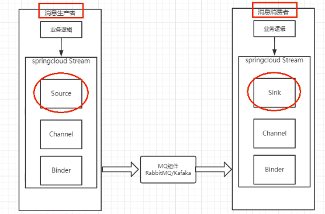
  * Binder：很方便的连接中间件，屏蔽差异。
  * Channel：通道，是队列Queue的一种抽象，在消息通讯系统中就是实现存储和转发的媒介，通过Channel对队列进行配置。
  * Source和Sink：简单的可理解为参考对象Spring Cloud Stream的自身，从Stream发布信息就是输出，接受消息就是输入。
* 编程API和常用注解：
  > 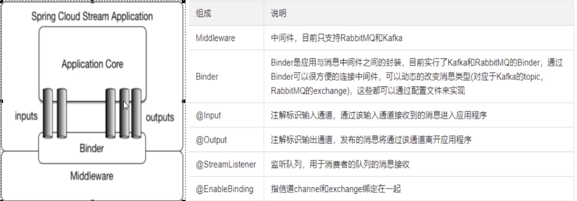

# 案例说明
  * RabbitMQ环境已经OK。
  * 工程中新建三个子模块：
    * cloud-stream-rabbitmq-provider8801,作为生产者进行发送发消息模块
    * cloud-stream-rabbitmq-provider8802,作为消息接收模块
    * cloud-stream-rabbitmq-provider880，作为消息接收模块
  
# 消息驱动之生产者
* 新建Module：cloud-stream-rabbitmq-provider8801
* POM
* YML
* 主启动类StreamMQMain8801
* 业务类：
  * 发送消息接口
  * 发送消息接口实现类
  * Controller
* 测试： 
  * 启动7001eureka
  * 启动rabbitmq：
    * rabbitmq-plugins enable rabbitmq_management
    * http://localhost:15672/
  * 启动8001：
    > 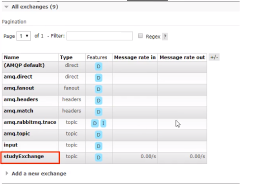
  * 访问：http://localhost:8801/sendMessage

# 消息驱动之消费者
* 新建Module：cloud-stream-rabbitmq-consumer8802
* POM
* YML:
  > 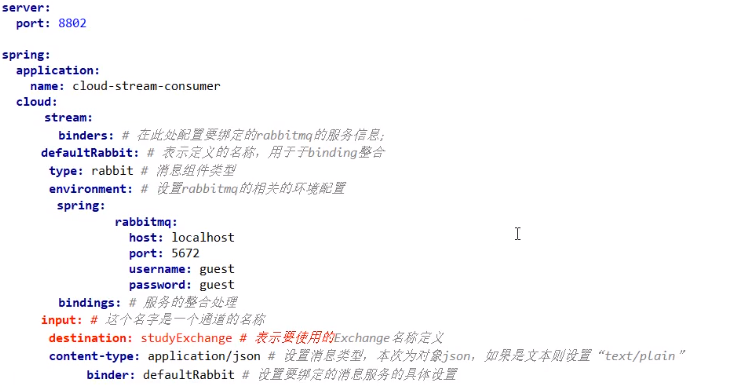
  > 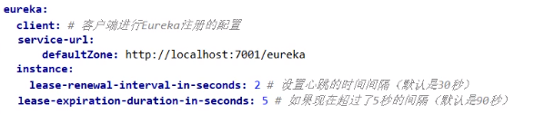
* 主启动类StreamMQMain8802
* 业务类
* 测试8801发送8802接收消息：http://localhost:8801/sendMessage

# 分组消息与持久化
* 依照8802,clone出来一份运行8803:cloud-stream-consumer8803
* 启动：
  * RabbitMQ
  * 7701：服务注册
  * 8801：消息生产
  * 8802: 服务消费
  * 8803： 服务消费
* 运行后有两个问题：
  * 有重复消费问题
  * 消息持久化问题
* 消费：目前是8802/8803同时都收到了，存在重复消费问题：
    * http://localhost:8801/sendMessage
    * 如何解决：分组和持久化属性group。重要
    * 生产实际案例：
      > 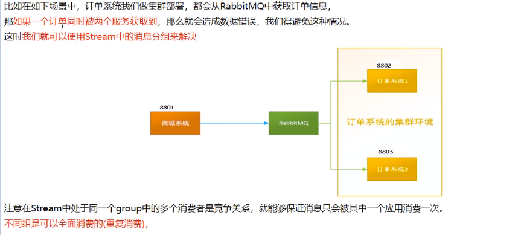
* 分组：
  * 原理:微服务应用放置于同一个group中，就能保证消息只会被其中一个应用消费一次，不同的组是可以消费的，同一个组内会发生竞争关系，只有其中一个可以消费。
    > 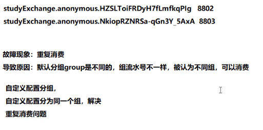
  * 8802/8803都变成了不同组，group两个不同：
    * group:atguiguA、atguiguB
    * 8802修改YML
      > 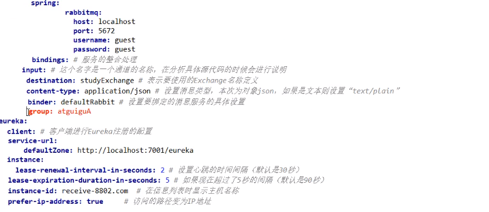
    * 8803修改YML
    * 我们自己配置：
    > 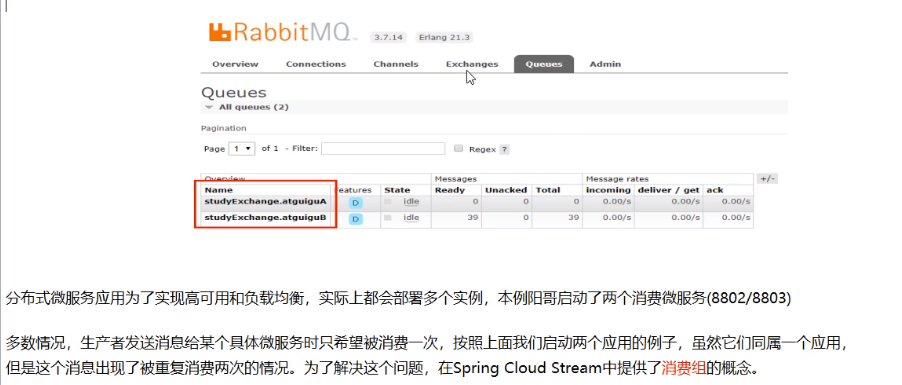
    * 结论，还是重复消费
  * 8802/8803实现了轮询分组，每次只有一个消费者8801模块的发的消息只能被8802或8803其中一个接收到，这样避免了重复消费。
  * 8802/8803都变成了相同组，group两个相同
    * group:atguigu
    * 8802修改YML
    * 8803修改YML
    * 结论：同一个组的多个微服务实例，每次只会有一个拿到。
  * 持久化：
    * 通过上述，解决了重复消费问题，再看持久化。
    * 停止8802/8803并去除8802的分组group:atguigu：注意8803的分组group:atguigu没有去掉。
    * 8801先发送4条消息到rabbitmq
    * 先启动8802,无分组属性配置，后台没有打出来消息。
    * 再启动8803,有分组属性配置，后台打出来MQ上的消息。

