# 7.1 概述
微服务架构是一种架构模式，它提倡将单一应用程序划分成一组小的服务，服务之间互相协调、互相配合，为用户提供最终价值。每个服务运行在其独立的进程中，服务
与服务之间采用轻量级的通信机制互相协作（通常是基于HTTP协议的RESTful API）。每个服务都围绕着具体业务进行构建，并且能够被独立的部署到生成环境、类生成
环境等。另外，应当尽量避免统一的、集中式的服务管理机制，对于一个服务而言，应根据业务上下文，学长合适的语言、工具对其进行构建。

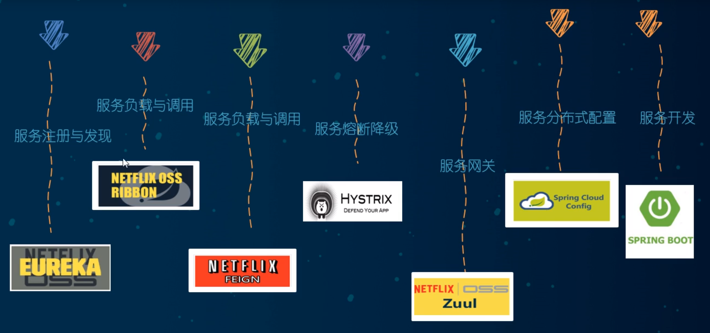

微服务目前主流体系:
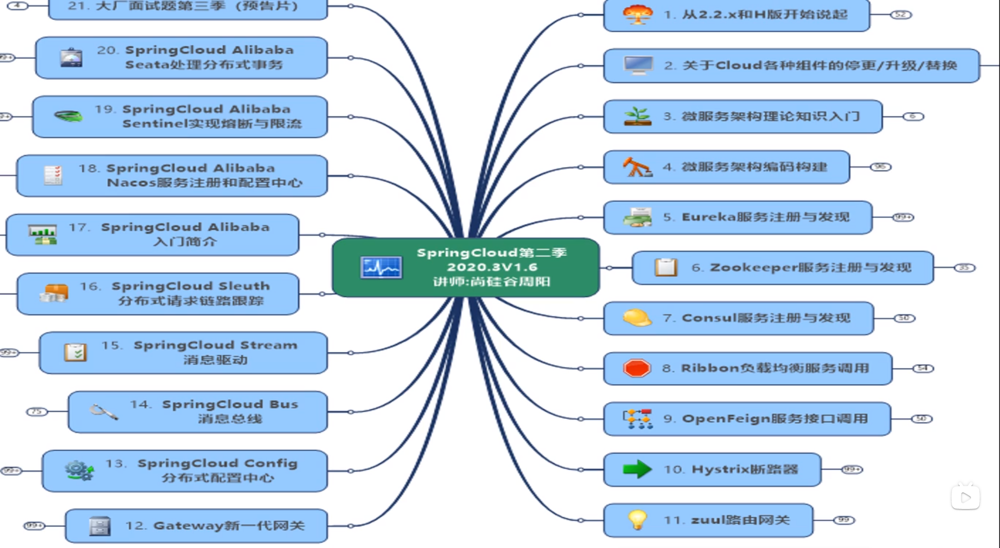

## Boot和Cloud选型
参见官网说明：https://spring.io/projects/spring-cloud
技术选型：https://start.spring.io/actuator/info

# SpringCloud微服务架构框架
## 目标：
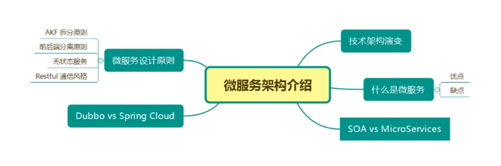

## 微服务技术演变
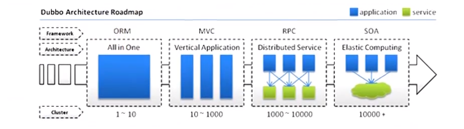
* 单体应用：
    * Model1模式：jsp + java
    * Model2模式（MVC）模式：Model View Controller(web service dao)
    * 当网站流量很小时，只需一个应用，将所有功能都部署在一起，以减少部署节点和成本。
    * 此时，用于简化增删改查工作量的数据访问框架（ORM）是关键。
    * 缺点：随着应用功能的增多，代码量越来越大，越来越难维护，那怎么解决代码一体化的问题？
* 垂直应用：
    * 加统一验证validator：入用户，返回ticker。服务间调用通过ticker。
* RPC分布式应用：
* SOA流动计算架构：
  * 资源调度 负载均衡 动态服务创建... 服务治理  
* 微服务:
    微：单一职责。

### Dubbo VS Spring Cloud
* Spring全家桶
*Dubbo
  * 可以支持RESTful风格的API,调用远程API像调用本地API一样，同时基于接口的方式增加了服务间的耦合。
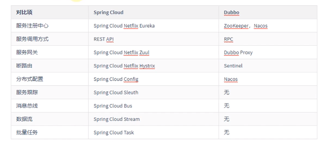

# 7.2 关于Cloud各种组件的停更/升级/替换
* 官网参考：
  * Spring Cloud:
    * https://cloud.spring.io/spring-cloud-static/Hoxton.SR1/reference/htmlsingle
    * 中文文档:https://www.bookstack.cn/read/spring-cloud-docs/docs-index.md
  * Spring Boot：https://docs.spring.io/spring-boot/docs/2.2.2.RELEASE/reference/htmlsingle/

* Spring Vloud升级：
  * 服务注册中心：
    * Eureka：停更。原生自带。
    * Zookeeper：
    * Consul:
    * Nacos：推荐，经过百万级考验。
  * 服务调用：
    * Ribbon:
    * LoadBalancer：
  * 服务调用：
    * Feign：停更。
    * OpenFeign：
  * 服务降级：
    * Hystrix：停更。
    * resilience4j：官网推荐，国外用较多。
    * sentienl：推荐。阿里的。
  * 服务网关:
    * Zuul：停更。
    * gateway：Spring推荐。
  * 服务配置：
    * Config：停。
    * Nacos:推荐
  * 服务总线。
    * bus:
    *Nacos:推荐

# 7.2 微服务架构编码构建
* 约定 > 配置 > 编码。
* IDEA新建project工作空间：
  * 微服务cloud整体聚合父工程Project。
    * 1.New Project:
      > 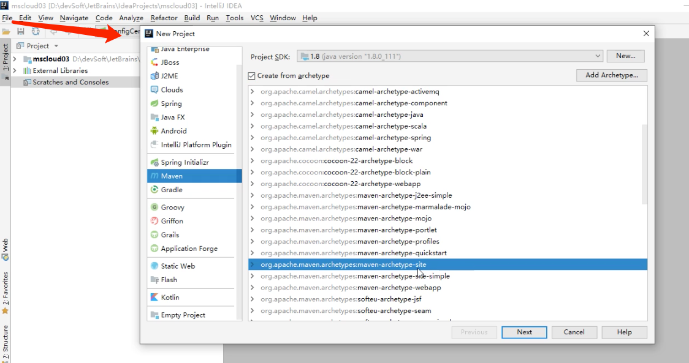
      > 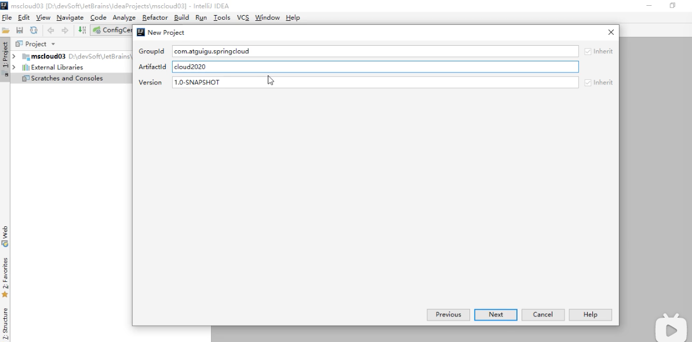
      > 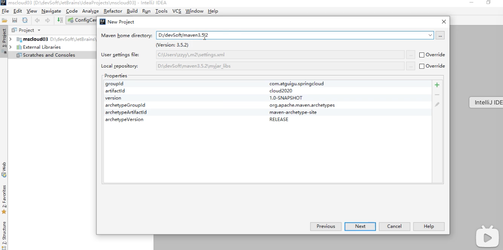
      > 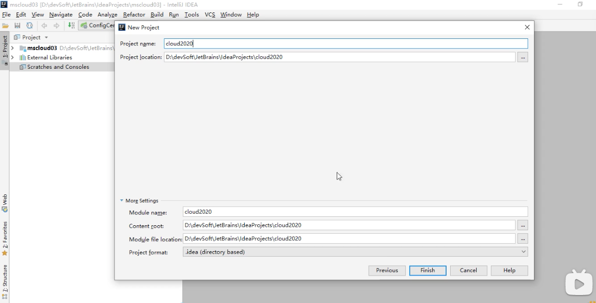
    * 2.聚合总父工程名称：
    * 3.Maven选版本：
    * 4.工程名字：
    * 5.字符编码：
      > 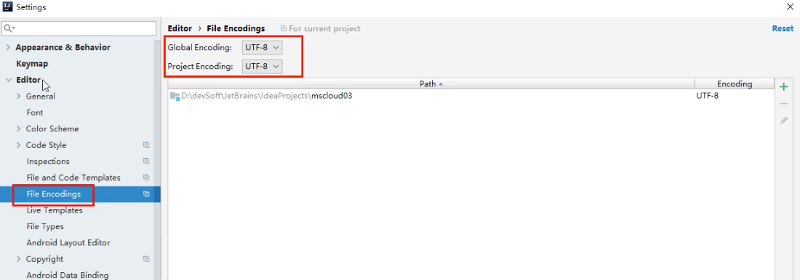
      > 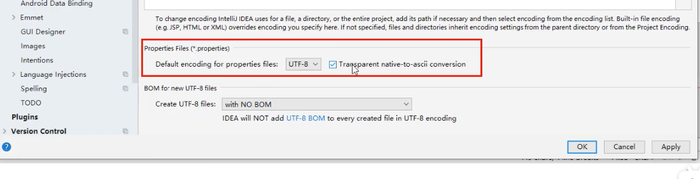
      > 
      > 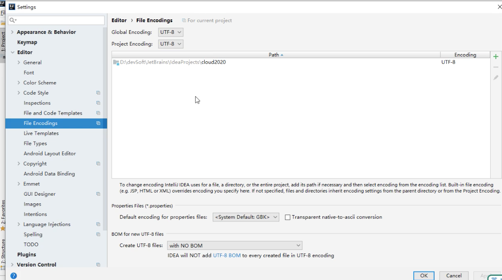
    * 6.注解生效激活：
      > 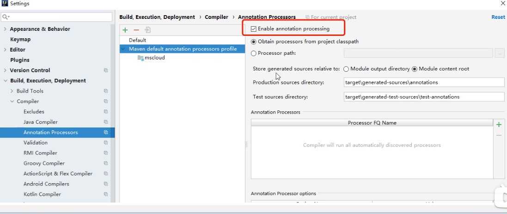
      > 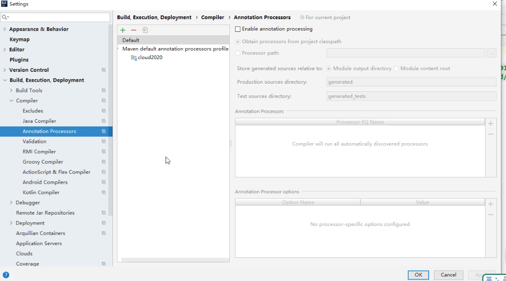
    * 7.java编译版本选8：
      > 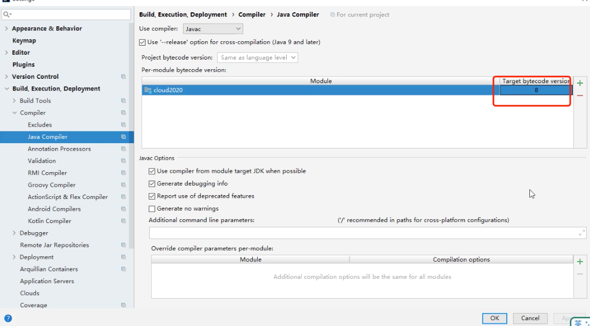
    * 8.File Type过滤。
      > 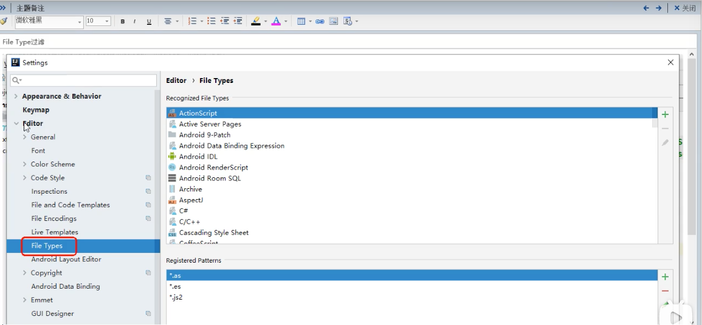
      > 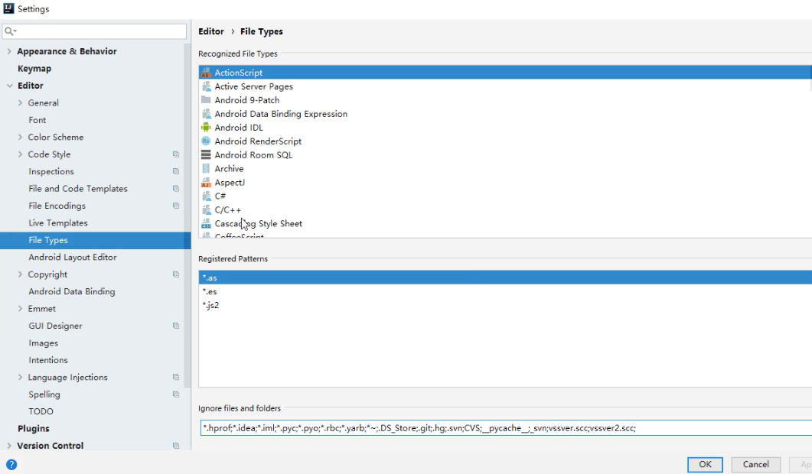
  * 父工程POM:
    > 
    > 
  * Maven工程落地细节：
  * 父工程创建完成执行mvn:install将父工程发布到仓库方便子工程继承。

* Rest微服务工程构建：
  * 1.cloud-provider-payment8001：微服务提供者支付Module模块。
    > 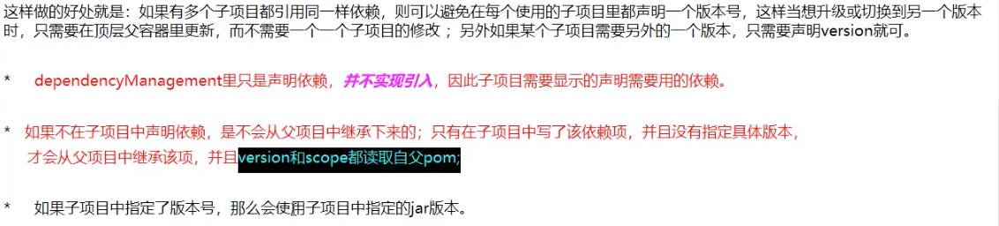
    > 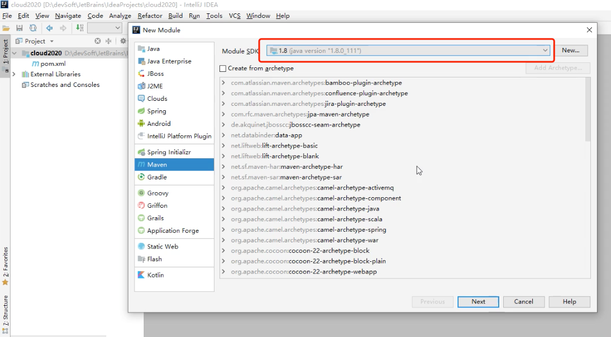
    > 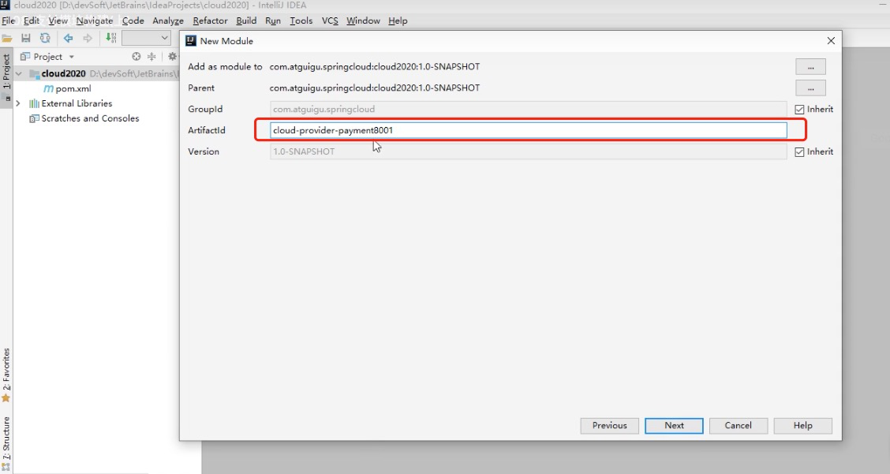
    > 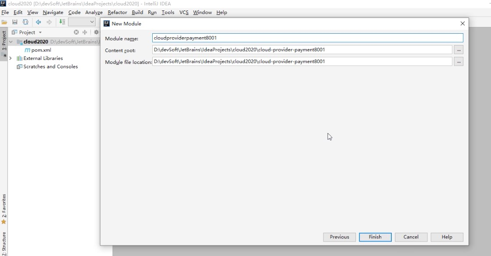
    > 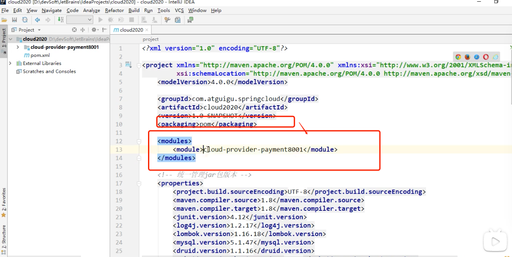
    > 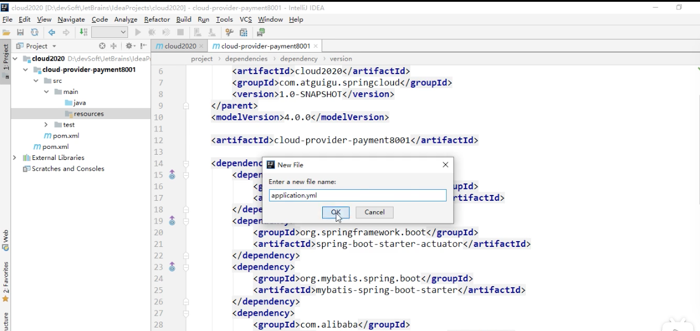
    > 
  * 2.热部署Devtools：
  * 3.cloud-consumer-order80：微服务消费者订单Module模块。
  * 4.工程重构。

https://www.bilibili.com/video/BV18E411x7eT?p=6&spm_id_from=pageDriver

