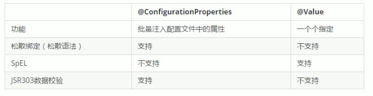

# 8.1.1 SpringBoot简介
Spring Boot来简化Spring应用开发，约定大于配置，去繁从简，just run就能创建一个独立的，产品级别的应用。

* 背景：
  > J2EE笨重的开发、繁多的配置、低下的开发效率、复杂的部署流程、第三方技术集成难度大。

* 解决：
  > Spring全家桶 时代。
  > Spring Boot -> J2EE一站式解决方案
  > Spring Cloud -> 分布式整体解决方案。

* 优点：
  * - 快速创建独立运行的Spring项目以及与主流框架集成。
  * - 使用嵌入式的Servlet容器，应用无需打成WAR包。
  * - starters自动依赖与版本控制。
  * - 大量的自动配置，简化开发，也可修改默认值。
  * - 无需配置XML，无代码生成，开箱即用。
  * - 准生成环境的运行时应用监控。
  * - 与云计算的天然集成。

# 8.1.2 微服务
微服务：架构风格。
一个应用应用是一组小型服务；可以通过HTTP的方式进行互通；
每一个功能元素最终都是一个可独立替换和独立升级的软件单元；

# 8.1.3 Spring Boot HelloWorld
* 一个功能： 浏览器发送hello请求，服务器接受请求并处理，响应Hello World字符串；

* 1.创建一个maven工程；（jar）
* 2.导入依赖spring boot相关的依赖。
  ````    <parent>
        <groupId>org.springframework.boot</groupId>
        <artifactId>spring-boot-starter-parent</artifactId>
        <version>2.2.5.RELEASE</version>
    </parent>

    <dependencies>
        <dependency>
            <groupId>org.springframework.boot</groupId>
            <artifactId>spring-boot-starter-web</artifactId>
        </dependency>
    </dependencies>
* 3.编写一个主程序；启动Spring Boot应用
  ``` @SpringBootApplication
public class HelloWorldMainApplication {
    public static void main(String[] args) {
        // Spring boot启动
        SpringApplication.run(HelloWorldMainApplication.class,args);
    }
}
* 4.编写相关的Controller、Service
  ```` @Controller
public class HelloController {

    @ResponseBody
    @RequestMapping("/hello")
    public String hello(){
        return "Hello World!";
    }
}
* 5.运行主程序测试。

# 8.1.4 Spring Boot HelloWorld探究
* 1.POM文件
  * 1.父项目
    ```` <parent>
            <groupId>org.springframework.boot</groupId>
            <artifactId>spring-boot-starter-parent</artifactId>
            <version>2.2.5.RELEASE</version>
        </parent>
    
    他的父项目是
      <parent>
        <groupId>org.springframework.boot</groupId>
        <artifactId>spring-boot-dependencies</artifactId>
        <version>2.2.5.RELEASE</version>
        <relativePath>../../spring-boot-dependencies</relativePath>
      </parent>
      他来真正管理Spring Boot应用里面的所有依赖版本；  
  * 2.导入的依赖
    ````        <dependency>
            <groupId>org.springframework.boot</groupId>
            <artifactId>spring-boot-starter-web</artifactId>
        </dependency>
    > Spring Boot将所有的功能场景都抽取出来，做成一个个的starters（启动器），只需要在项目里面引入这些starter相关
      场景的所有依赖都会导入进来。要用什么功能就导入什么场景启动器。

* 2.主程序，主入口类
      ````/**
            * @SpringBootApplication 来标注一个主程序类，说明这是一个Spring Boot应用
            */
            @SpringBootApplication
            public class HelloWorldMainApplication {
                public static void main(String[] args) {
                    // Spring boot启动
                    SpringApplication.run(HelloWorldMainApplication.class,args);
                }
            }
  > @SpringBootApplication：Spring Boot应用标注在某个类上说明这个类是SpringBoot的主配置类，SpringBoot
  > 就应该运行这个类的main方法来启动SpringBoot应用;

    ````@Target({ElementType.TYPE})
        @Retention(RetentionPolicy.RUNTIME)
        @Documented
        @Inherited
        @SpringBootConfiguration
        @EnableAutoConfiguration
        @ComponentScan(
        excludeFilters = {@Filter(
            type = FilterType.CUSTOM,
            classes = {TypeExcludeFilter.class}
            ), @Filter(
            type = FilterType.CUSTOM,
            classes = {AutoConfigurationExcludeFilter.class}
            )}
        )
        public @interface SpringBootApplication {
  
  * a. SpringBootConfiguration：Spring Boot的配置类：标注在某个类上，表示这是一个Spring Boot的配置类。
  *    Configuration：配置类上来标注这个注解；  
  * b. EnableAutoConfiguration：开启自动配置功能；
    以前我们需要配置的东西，Spring Boot帮我们自动配置；@EnableAutoConfiguration告诉SpringBoot开启自动配置功能；这样自动配置才能生效；
    
    @AutoConfigurationPackage
    
  
    public @interface EnableAutoConfiguration {
    * b1. @AutoConfigurationPackage：自动配置包。
        * b11. @Import({Registrar.class})：Spring的底层注解@Import，给容器中导入一个组件；导入的组件由Registrar.class。
            将住配置类（@SpringBootApplication标注的类）的所在包及下面所有子包里面的所有组件扫描到Spring容器；
        * b12. @Import({AutoConfigurationImportSelector.class})：给容器中导入组件。
                AutoConfigurationImportSelector.class：导入那些组件的选择器；
                将所有需要导入的组件以全类名的方式返回；这些组件就会被添加到容器中；
                会给容器中导入非常多的自动配置类（xxxAutoConfiguration）；就是给容器中导入这个场景需要的所有组件，并配置好这些组件；
                
                有了自动配置类，免去了我们手动编写配置注入功能组件等的工作；
                SpringFactoriesLoader.loadFactoryNames(EnableAutoConfiguration.class,classLoader);
                Spring Boot在启动的时候从类路径下的META-INF/spring.factories中获取EnableAutoConfiguration指定的值；
                将这些值作为自动配置类导入到容器中，自动配置类就生效，帮我们进行自动配置工作；
  
  * 
    

# 8.1.5 Spring Boot 配置
* 配置文件：
  * SpringBoot使用一个全局的配置文件：配置文件名固定。
    * application.properties。
    * application.yml。
    * 配置文件的作用：修改SpringBoot自动配置的默认值；SpringBoot在底层都给我们自动配置好了；
  * YAML语法：
    * - 使用缩进表示层级关系。
    * - 缩进时不允许使用Tab键，只允许使用空格。
    * - 缩进的空格数目不重要，只要相同层级的元素左侧对齐即可。
    * - 大小写敏感。
    * 对象：键值对的集合。
    * 数组：一组按次排列的值。
    * 字面量：单个的、不可再分的值。字符串默认不用加上单引号或者双引号。
      * ""：双引号；不会转义字符串里面的特殊字符。特殊字符会作为本身想表示的意思。
      * ''：会转义特殊字符，特殊字符最终只是一个普通的字符串数据。
  * @Value获取值和@ConfigurationProperties获取值比较。
  
  * @ConfigurationProperties(prefix ="xxx")：告诉SpringBoot将类中的所有属性和配置文件中相关的配置进行绑定；默认从全局配置文件中获取值。
 * @PropertySource(value ={"classpath:xxx.properties"})：加载类路径下的配置文件 xxx.properties
 * @ImportResource：导入Spring的配置文件，让配置文件里面的内容生效；
 * @Bean：将方法的返回值添加到容器中；容器中这些组件默认的id就是方法名。
 * RandomValuePropertySource：配置文件中可以使用随机数。如${random.lang}、${random.int[1024,65536]}
 * 属性占位符：可以在配置文件中引用前面配置过的属性。${server.port:默认值}。
 * Profile：文件名可以是【application-{profile}.properties.yaml】。
   * 默认配置文件中可以添加：spring.profiles.active=dev激活指定配置
   * 虚拟机参数：【VM options实例】 -Dspring.profiles.active=dev
   * 命令行参数：【Program arguments实例】 --spring.profiles.active=dev
* 配置文件加载位置：
> spring boot启动会扫描以下位置的application.properties或者application.yml文件作为Spring boot的默认配置文件。
> - file:./config/          ：当前项目下
> - file:./                 ：当前项目下
> - classpath:/config/      ：类路径下
> - classpath:/             ：类路径下
> - 以上是按照优先级从高到底的顺序，所有位置的文件都会被加载，高优先级配置内容会覆盖低优先级配置内容。
> - 我们也可以通过配置spring.config.location来改变默认配置。

* 外部配置加载顺序：优先级从高到低。
> 外部配置优先级：https://docs.spring.io/spring-boot/docs/current-SNAPSHOT/reference/htmlsingle/#boot-features-external-config
> * 1.命令行参数
> * 2.来自java:comp/env的JNDI属性
> * 3.Java系统属性(System.getProperties())
> * 4.操作系统环境变量
> * 5.RandomValuePropertySource配置的random.*属性值
> * 6.jar包外部的application-{profile}.properties或application.yml（带spring.profile）配置文件。
> * 7.jar包内部的application-{profile}.properties或application.yml（带spring.profile）配置文件。
> * 8.jar包外部的application.properties或application.yml（不带spring.profile）配置文件。
> * 9.jar包内部的application.properties或application.yml（不带spring.profile）配置文件。
> * 10.@Configuration注解类上的@PropertySource。
> * 11.通过SpringApplication.setDefaultProperties指定的默认属性。

* 配置原理：
  * 1.SpringBoot启动的时候加载主配置类，开启了自动配置功能@EnableAutoConfiguration。
  * 2.@EnableAutoConfiguration作用：
    > * 利用EnableAutoConfigurationImportSelector给容器中导入一些组件？
    > * 可以导入selectImports()方法的内容;
    > * List<String> configurations = this.getCandidateConfigurations(annotationMetadata, attributes);获取候选的配置。
    >   * SpringFactoriesLoader.loadFactoryNames()
    >   * 扫描所有jar包下的路径public static final String FACTORIES_RESOURCE_LOCATION = "META-INF/spring.factories";
    >   * 把扫描到的这些文件的内容包装成properties对象。
    >   * 从properties中获取到EnableAutoConfiguration.class类(类名)对应的值，然后把他们添加到容器中。
    > 
    > 将类路径下 META-INF/spring.factories里面配置的所有EnableAutoConfiguration的值加入到了容器中；
    > 每一个这样的 xxxAutoConfiguration类都是容器中的一个组件，都加入到容器中；用他们来做自动配置；
  * 3.每一个自动配置类进行自动配置功能；
  * 4.以HttpEncodingAutoConfiguration为例解释自动配置原理；
    > @Configuration(proxyBeanMethods = false)  //表示这是一个配置类，以前编写的配置文件一样，也可以给容器中添加组件。
    @EnableConfigurationProperties(HttpProperties.class)    //启动指定类的ConfigurationProperties功能；将配置文件中对应的值
    > 和HttpEncodingProperties绑定起来；并把HttpEncodingProperties加入到ioc容器中。
    > 
    > @ConditionalOnWebApplication(type = ConditionalOnWebApplication.Type.SERVLET) //Spring底层@Conditional注解，根据不同
    > 的条件，如果满足指定的条件，整个配置类里面的配置就会生效； 判断当前应用是否是web应用，如果是，当前配置类生效。
    > 
    > @ConditionalOnClass(CharacterEncodingFilter.class)    //判断当前项目有没有这个类。CharacterEncodingFilter.class;SpringMVC
    > 中进行乱码解决的过滤器；
    > 
    > @ConditionalOnProperty(prefix = "spring.http.encoding", value = "enabled", matchIfMissing = true)
    > //判断配置文件中是否存在某个配置spring.http.encoding.enabled;如果不存在，判断也是成立的。 
    >  public class HttpEncodingAutoConfiguration {
  * 5.所有配置文件中能配置的属性都是在xxxProperties类中封装着。配置文件能配置什么都可以参照某个功能对应的这个属性类。
    > @ConfigurationProperties(prefix = "spring.http")  //从配置文件中获取指定的值和bean的属性进行绑定
    public class HttpProperties {
    > 
  * 精髓:
    > * 1.SpringBoot启动会加载大量的自动配置类。
    > * 2.我们看我们需要的功能有没有SpringBoot默认写好的自动配置类；
    > * 3.我们再来看这个自动配置类中到底配置了哪些组件；（只要我们要用的组件有，我们就不需要再来配置了）。
    > * 4.给容器中自动配置类添加组件的时候，会从properties类中获取某些属性。我们就可以在配置文件中指定这些属性的值；
* 配置原理-细节： 
  * 1.@Conditional派生注解（Spring注解版原生的@Conditional作用）：作用：必须@Conditional指定的条件成立，才给容器中添加组件，配置里面的所有内容才生效；
    
  * 2.自动配置类必须在一定的条件下才生效：通过启用debug=true属性；来让控制台打印自动配置报告，这样我们就可以很方便的知道哪些自动配置类生效。


# 8.1.5 Spring Boot 日志

* 日志框架：
    JUI（java.util.logging），JCL（Apache Commons Logging），Log4j2,Logback，SLF4j、jboss-logging等。 

    SpringBoot：底层是Spring框架，Spring框架默认是JCL.
    SpringBoot选用SLF4j和logback；

* SLF4j使用。
  * 1.如何在系统中使用SLF4j。以后开发的时候，日志记录方法的调用，不应该来直接调用日志的实现类，而是调用日志抽象层里面的方法;
    给系统里面导入slf4j的jar和logback的实现jar。
    ```` import org.slf4j.Logger;
        import org.slf4j.LoggerFactory;
        
        public class HelloWorld {
        public static void main(String[] args) {
        Logger logger = LoggerFactory.getLogger(HelloWorld.class);
        logger.info("Hello World");
        }
        }
    ````  
  * 2.遗留问题：
    统一日志记录，即使是别的框架和我一起统一使用slf4j进行输出？参见：http://www.slf4j.org/legacy.html
    
    
    如何让系统中所有的日志都统一到slf4j：
    * 1.将系统中其他日志框架先排除出去；
    * 2.用中间包来替换原有的日志框架；
    * 3.我们导入slf4j其他的实现。

    SpringBoot修改日志的默认配置：
    

# 8.1.6 Spring Boot与Web开发


