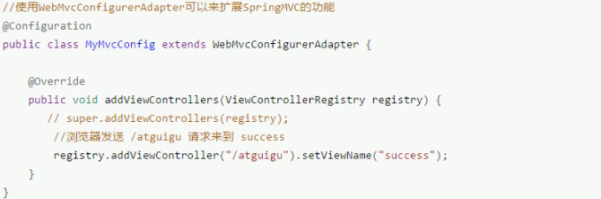
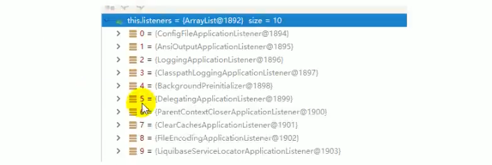

# 8.1.1 SpringBoot简介
Spring Boot来简化Spring应用开发，约定大于配置，去繁从简，just run就能创建一个独立的，产品级别的应用。

* 背景：
  > J2EE笨重的开发、繁多的配置、低下的开发效率、复杂的部署流程、第三方技术集成难度大。

* 解决：
  > Spring全家桶 时代。
  > Spring Boot -> J2EE一站式解决方案
  > Spring Cloud -> 分布式整体解决方案。

* 优点：
  * - 快速创建独立运行的Spring项目以及与主流框架集成。
  * - 使用嵌入式的Servlet容器，应用无需打成WAR包。
  * - starters自动依赖与版本控制。
  * - 大量的自动配置，简化开发，也可修改默认值。
  * - 无需配置XML，无代码生成，开箱即用。
  * - 准生成环境的运行时应用监控。
  * - 与云计算的天然集成。

# 8.1.2 微服务
微服务：架构风格。
一个应用应用是一组小型服务；可以通过HTTP的方式进行互通；
每一个功能元素最终都是一个可独立替换和独立升级的软件单元；

# 8.1.3 Spring Boot HelloWorld
* 一个功能： 浏览器发送hello请求，服务器接受请求并处理，响应Hello World字符串；

* 1.创建一个maven工程；（jar）
* 2.导入依赖spring boot相关的依赖。
  ````    <parent>
        <groupId>org.springframework.boot</groupId>
        <artifactId>spring-boot-starter-parent</artifactId>
        <version>2.2.5.RELEASE</version>
    </parent>

    <dependencies>
        <dependency>
            <groupId>org.springframework.boot</groupId>
            <artifactId>spring-boot-starter-web</artifactId>
        </dependency>
    </dependencies>
* 3.编写一个主程序；启动Spring Boot应用
  ``` @SpringBootApplication
public class HelloWorldMainApplication {
    public static void main(String[] args) {
        // Spring boot启动
        SpringApplication.run(HelloWorldMainApplication.class,args);
    }
}
* 4.编写相关的Controller、Service
  ```` @Controller
public class HelloController {

    @ResponseBody
    @RequestMapping("/hello")
    public String hello(){
        return "Hello World!";
    }
}
* 5.运行主程序测试。

# 8.1.4 Spring Boot HelloWorld探究
* 1.POM文件
  * 1.父项目
    ```` <parent>
            <groupId>org.springframework.boot</groupId>
            <artifactId>spring-boot-starter-parent</artifactId>
            <version>2.2.5.RELEASE</version>
        </parent>
    
    他的父项目是
      <parent>
        <groupId>org.springframework.boot</groupId>
        <artifactId>spring-boot-dependencies</artifactId>
        <version>2.2.5.RELEASE</version>
        <relativePath>../../spring-boot-dependencies</relativePath>
      </parent>
      他来真正管理Spring Boot应用里面的所有依赖版本；  
  * 2.导入的依赖
    ````        <dependency>
            <groupId>org.springframework.boot</groupId>
            <artifactId>spring-boot-starter-web</artifactId>
        </dependency>
    > Spring Boot将所有的功能场景都抽取出来，做成一个个的starters（启动器），只需要在项目里面引入这些starter相关
      场景的所有依赖都会导入进来。要用什么功能就导入什么场景启动器。

* 2.主程序，主入口类
      ````/**
            * @SpringBootApplication 来标注一个主程序类，说明这是一个Spring Boot应用
            */
            @SpringBootApplication
            public class HelloWorldMainApplication {
                public static void main(String[] args) {
                    // Spring boot启动
                    SpringApplication.run(HelloWorldMainApplication.class,args);
                }
            }
  > @SpringBootApplication：Spring Boot应用标注在某个类上说明这个类是SpringBoot的主配置类，SpringBoot
  > 就应该运行这个类的main方法来启动SpringBoot应用;

    ````@Target({ElementType.TYPE})
        @Retention(RetentionPolicy.RUNTIME)
        @Documented
        @Inherited
        @SpringBootConfiguration
        @EnableAutoConfiguration
        @ComponentScan(
        excludeFilters = {@Filter(
            type = FilterType.CUSTOM,
            classes = {TypeExcludeFilter.class}
            ), @Filter(
            type = FilterType.CUSTOM,
            classes = {AutoConfigurationExcludeFilter.class}
            )}
        )
        public @interface SpringBootApplication {
  
  * a. SpringBootConfiguration：Spring Boot的配置类：标注在某个类上，表示这是一个Spring Boot的配置类。
  *    Configuration：配置类上来标注这个注解；  
  * b. EnableAutoConfiguration：开启自动配置功能；
    以前我们需要配置的东西，Spring Boot帮我们自动配置；@EnableAutoConfiguration告诉SpringBoot开启自动配置功能；这样自动配置才能生效；
    
    @AutoConfigurationPackage
    
  
    public @interface EnableAutoConfiguration {
    * b1. @AutoConfigurationPackage：自动配置包。
        * b11. @Import({Registrar.class})：Spring的底层注解@Import，给容器中导入一个组件；导入的组件由Registrar.class。
            将住配置类（@SpringBootApplication标注的类）的所在包及下面所有子包里面的所有组件扫描到Spring容器；
        * b12. @Import({AutoConfigurationImportSelector.class})：给容器中导入组件。
                AutoConfigurationImportSelector.class：导入那些组件的选择器；
                将所有需要导入的组件以全类名的方式返回；这些组件就会被添加到容器中；
                会给容器中导入非常多的自动配置类（xxxAutoConfiguration）；就是给容器中导入这个场景需要的所有组件，并配置好这些组件；
                
                有了自动配置类，免去了我们手动编写配置注入功能组件等的工作；
                SpringFactoriesLoader.loadFactoryNames(EnableAutoConfiguration.class,classLoader);
                Spring Boot在启动的时候从类路径下的META-INF/spring.factories中获取EnableAutoConfiguration指定的值；
                将这些值作为自动配置类导入到容器中，自动配置类就生效，帮我们进行自动配置工作；
  
  * 
    

# 8.1.5 Spring Boot 配置
* 配置文件：
  * SpringBoot使用一个全局的配置文件：配置文件名固定。
    * application.properties。
    * application.yml。
    * 配置文件的作用：修改SpringBoot自动配置的默认值；SpringBoot在底层都给我们自动配置好了；
  * YAML语法：
    * - 使用缩进表示层级关系。
    * - 缩进时不允许使用Tab键，只允许使用空格。
    * - 缩进的空格数目不重要，只要相同层级的元素左侧对齐即可。
    * - 大小写敏感。
    * 对象：键值对的集合。
    * 数组：一组按次排列的值。
    * 字面量：单个的、不可再分的值。字符串默认不用加上单引号或者双引号。
      * ""：双引号；不会转义字符串里面的特殊字符。特殊字符会作为本身想表示的意思。
      * ''：会转义特殊字符，特殊字符最终只是一个普通的字符串数据。
  * @Value获取值和@ConfigurationProperties获取值比较。
  
  * @ConfigurationProperties(prefix ="xxx")：告诉SpringBoot将类中的所有属性和配置文件中相关的配置进行绑定；默认从全局配置文件中获取值。
 * @PropertySource(value ={"classpath:xxx.properties"})：加载类路径下的配置文件 xxx.properties
 * @ImportResource：导入Spring的配置文件，让配置文件里面的内容生效；
 * @Bean：将方法的返回值添加到容器中；容器中这些组件默认的id就是方法名。
 * RandomValuePropertySource：配置文件中可以使用随机数。如${random.lang}、${random.int[1024,65536]}
 * 属性占位符：可以在配置文件中引用前面配置过的属性。${server.port:默认值}。
 * Profile：文件名可以是【application-{profile}.properties.yaml】。
   * 默认配置文件中可以添加：spring.profiles.active=dev激活指定配置
   * 虚拟机参数：【VM options实例】 -Dspring.profiles.active=dev
   * 命令行参数：【Program arguments实例】 --spring.profiles.active=dev
* 配置文件加载位置：
> spring boot启动会扫描以下位置的application.properties或者application.yml文件作为Spring boot的默认配置文件。
> - file:./config/          ：当前项目下
> - file:./                 ：当前项目下
> - classpath:/config/      ：类路径下
> - classpath:/             ：类路径下
> - 以上是按照优先级从高到底的顺序，所有位置的文件都会被加载，高优先级配置内容会覆盖低优先级配置内容。
> - 我们也可以通过配置spring.config.location来改变默认配置。

* 外部配置加载顺序：优先级从高到低。
> 外部配置优先级：https://docs.spring.io/spring-boot/docs/current-SNAPSHOT/reference/htmlsingle/#boot-features-external-config
> * 1.命令行参数
> * 2.来自java:comp/env的JNDI属性
> * 3.Java系统属性(System.getProperties())
> * 4.操作系统环境变量
> * 5.RandomValuePropertySource配置的random.*属性值
> * 6.jar包外部的application-{profile}.properties或application.yml（带spring.profile）配置文件。
> * 7.jar包内部的application-{profile}.properties或application.yml（带spring.profile）配置文件。
> * 8.jar包外部的application.properties或application.yml（不带spring.profile）配置文件。
> * 9.jar包内部的application.properties或application.yml（不带spring.profile）配置文件。
> * 10.@Configuration注解类上的@PropertySource。
> * 11.通过SpringApplication.setDefaultProperties指定的默认属性。

* 配置原理：
  * 1.SpringBoot启动的时候加载主配置类，开启了自动配置功能@EnableAutoConfiguration。
  * 2.@EnableAutoConfiguration作用：
    > * 利用EnableAutoConfigurationImportSelector给容器中导入一些组件？
    > * 可以导入selectImports()方法的内容;
    > * List<String> configurations = this.getCandidateConfigurations(annotationMetadata, attributes);获取候选的配置。
    >   * SpringFactoriesLoader.loadFactoryNames()
    >   * 扫描所有jar包下的路径public static final String FACTORIES_RESOURCE_LOCATION = "META-INF/spring.factories";
    >   * 把扫描到的这些文件的内容包装成properties对象。
    >   * 从properties中获取到EnableAutoConfiguration.class类(类名)对应的值，然后把他们添加到容器中。
    > 
    > 将类路径下 META-INF/spring.factories里面配置的所有EnableAutoConfiguration的值加入到了容器中；
    > 每一个这样的 xxxAutoConfiguration类都是容器中的一个组件，都加入到容器中；用他们来做自动配置；
  * 3.每一个自动配置类进行自动配置功能；
  * 4.以HttpEncodingAutoConfiguration为例解释自动配置原理；
    > @Configuration(proxyBeanMethods = false)  //表示这是一个配置类，以前编写的配置文件一样，也可以给容器中添加组件。
    @EnableConfigurationProperties(HttpProperties.class)    //启动指定类的ConfigurationProperties功能；将配置文件中对应的值
    > 和HttpEncodingProperties绑定起来；并把HttpEncodingProperties加入到ioc容器中。
    > 
    > @ConditionalOnWebApplication(type = ConditionalOnWebApplication.Type.SERVLET) //Spring底层@Conditional注解，根据不同
    > 的条件，如果满足指定的条件，整个配置类里面的配置就会生效； 判断当前应用是否是web应用，如果是，当前配置类生效。
    > 
    > @ConditionalOnClass(CharacterEncodingFilter.class)    //判断当前项目有没有这个类。CharacterEncodingFilter.class;SpringMVC
    > 中进行乱码解决的过滤器；
    > 
    > @ConditionalOnProperty(prefix = "spring.http.encoding", value = "enabled", matchIfMissing = true)
    > //判断配置文件中是否存在某个配置spring.http.encoding.enabled;如果不存在，判断也是成立的。 
    >  public class HttpEncodingAutoConfiguration {
  * 5.所有配置文件中能配置的属性都是在xxxProperties类中封装着。配置文件能配置什么都可以参照某个功能对应的这个属性类。
    > @ConfigurationProperties(prefix = "spring.http")  //从配置文件中获取指定的值和bean的属性进行绑定
    public class HttpProperties {
    > 
  * 精髓:
    > * 1.SpringBoot启动会加载大量的自动配置类。
    > * 2.我们看我们需要的功能有没有SpringBoot默认写好的自动配置类；
    > * 3.我们再来看这个自动配置类中到底配置了哪些组件；（只要我们要用的组件有，我们就不需要再来配置了）。
    > * 4.给容器中自动配置类添加组件的时候，会从properties类中获取某些属性。我们就可以在配置文件中指定这些属性的值；
* 配置原理-细节： 
  * 1.@Conditional派生注解（Spring注解版原生的@Conditional作用）：作用：必须@Conditional指定的条件成立，才给容器中添加组件，配置里面的所有内容才生效；
    
  * 2.自动配置类必须在一定的条件下才生效：通过启用debug=true属性；来让控制台打印自动配置报告，这样我们就可以很方便的知道哪些自动配置类生效。


# 8.1.5 Spring Boot 日志

* 日志框架：
    JUI（java.util.logging），JCL（Apache Commons Logging），Log4j2,Logback，SLF4j、jboss-logging等。 

    SpringBoot：底层是Spring框架，Spring框架默认是JCL.
    SpringBoot选用SLF4j和logback；

* SLF4j使用。
  * 1.如何在系统中使用SLF4j。以后开发的时候，日志记录方法的调用，不应该来直接调用日志的实现类，而是调用日志抽象层里面的方法;
    给系统里面导入slf4j的jar和logback的实现jar。
    ```` import org.slf4j.Logger;
        import org.slf4j.LoggerFactory;
        
        public class HelloWorld {
        public static void main(String[] args) {
        Logger logger = LoggerFactory.getLogger(HelloWorld.class);
        logger.info("Hello World");
        }
        }
    ````  
  * 2.遗留问题：
    统一日志记录，即使是别的框架和我一起统一使用slf4j进行输出？参见：http://www.slf4j.org/legacy.html
    
    
    如何让系统中所有的日志都统一到slf4j：
    * 1.将系统中其他日志框架先排除出去；
    * 2.用中间包来替换原有的日志框架；
    * 3.我们导入slf4j其他的实现。

    SpringBoot修改日志的默认配置：
    

# 8.1.6 Spring Boot与Web开发

* 1.快速启动：
  自动配置原理？这个场景SpringBoot帮我们配置了什么？能不能修改？能修改那些配置？能不能扩展？
  > xxxAutoConfiguration：帮我们给容器中自动配置组件；
  > xxxProperties：配置类来封装配置文件的内容；
* 2.SpringBoot对静态资源的映射规则；
  ````
  @Override
		public void addResourceHandlers(ResourceHandlerRegistry registry) {
			if (!this.resourceProperties.isAddMappings()) {
				logger.debug("Default resource handling disabled");
				return;
			}
			Duration cachePeriod = this.resourceProperties.getCache().getPeriod();
			CacheControl cacheControl = this.resourceProperties.getCache().getCachecontrol().toHttpCacheControl();
			if (!registry.hasMappingForPattern("/webjars/**")) {
				customizeResourceHandlerRegistration(registry.addResourceHandler("/webjars/**")
						.addResourceLocations("classpath:/META-INF/resources/webjars/")
						.setCachePeriod(getSeconds(cachePeriod)).setCacheControl(cacheControl));
			}
			String staticPathPattern = this.mvcProperties.getStaticPathPattern();
			if (!registry.hasMappingForPattern(staticPathPattern)) {
				customizeResourceHandlerRegistration(registry.addResourceHandler(staticPathPattern)
						.addResourceLocations(getResourceLocations(this.resourceProperties.getStaticLocations()))
						.setCachePeriod(getSeconds(cachePeriod)).setCacheControl(cacheControl));
			}
		}
        //配置欢迎页映射
  	    @Bean
		public WelcomePageHandlerMapping welcomePageHandlerMapping(ApplicationContext applicationContext,
				FormattingConversionService mvcConversionService, ResourceUrlProvider mvcResourceUrlProvider) {
			WelcomePageHandlerMapping welcomePageHandlerMapping = new WelcomePageHandlerMapping(
					new TemplateAvailabilityProviders(applicationContext), applicationContext, getWelcomePage(),
					this.mvcProperties.getStaticPathPattern());
			welcomePageHandlerMapping.setInterceptors(getInterceptors(mvcConversionService, mvcResourceUrlProvider));
			return welcomePageHandlerMapping;
		}
  ````
  * 1.所有/webjars/**，都去classpath:/META-INF/resources/webjars/找资源；
    webjars：以jar包的方式引入静态资源; http://www.webjars.org/
    
  * 2."/**"访问当前项目的任何资源，（静态资源的文件夹）
    ````
    "classpath:/META-INF/resources/",
	"classpath:/resources/", 
    "classpath:/static/", 
    "classpath:/public/" 
    "/"：当前项目根路径
    ````
  * 3.欢迎页的配置：静态资源文件下所有index.html页面；被"/**"映射；
    localhost:8080/ 找index页面
  * 4.所有的**/favicon.ico都是在静态资源文件下找；
* 3.模板引擎。

* 4.SpringMVC自动配置
  https://docs.spring.io/spring-boot/docs/2.2.2.RELEASE/reference/htmlsingle/#boot-features-spring-mvc

  Spring Boot 自动配置好了SpringMVC
  以下是SpringBoot对SpringMVC的默认配置：
    * Inclusion of ContentNegotiatingViewResolver and BeanNameViewResolver beans.
      * 自动配置了ViewResolver（视图解析器：根据方法的返回值得到视图对象（View）,视图对象决定如何渲染（转发？重定向?|））
      * ContentNegotiatingViewResolver：组合所有的视图解析器；
      * 如何定制：我们可以自己给容器中添加一个视图解析器；自动的将其组合起来；
    * Support for serving static resources, including support for WebJars (covered later in this document)).静态资源文件夹路径，webjars。
    * Static index.html support.静态首页访问。
    * Custom Favicon support (covered later in this document). ：favicon.ico
    * 自动注册 Converter, GenericConverter, and Formatter beans.
      * Converter：转换器；public String hello(User user):类型转换使用Converter。
      * Formatter 格式化器；2021-04-22 === Date；自己添加的格式化器转化器，只需要放到容器中即可。
      * Support for HttpMessageConverters (covered later in this document).
        * HttpMessageConverter：SpringMVC用来转换Http请求和响应的；User---json；
        * HttpMessageConverters：是从容器中确定；获取所有的HttpMessageConverter。自己定义，只需要向容器中中添加组件。
      * Automatic registration of MessageCodesResolver (covered later in this document).：定义错误代码生成规则的。
      * Automatic use of a ConfigurableWebBindingInitializer bean (covered later in this document).
        * 初始化WebDataBinder：请求数据 ===（绑定到）JavaBean
        
      org.springframework.boot.autoconfigure.web：web的所有自动场景；
      
      If you want to keep Spring Boot MVC features and you want to add additional MVC configuration (interceptors, formatters, view controllers, and other features), you can add your own @Configuration class of type WebMvcConfigurer but without @EnableWebMvc. If you wish to provide custom instances of RequestMappingHandlerMapping, RequestMappingHandlerAdapter, or ExceptionHandlerExceptionResolver, you can declare a WebMvcRegistrationsAdapter instance to provide such components.
      扩展SpringMVC：编写一个配置类（@Configuration）,是WebMvcConfigurerAdapter类型；不能标注@EnableWebMvc。  
      既保留了所有的自动配置，也能用我们扩展的配置；
      
      原理：
        * 1）.WebMvcAutoConfiguration是SpringMVC的自动配置类。
        * 2）.在做其他自动配置时会导入；@Import(EnableWebMvcConfiguration.class)
          ````
          @Configuration(proxyBeanMethods = false)
          public static class EnableWebMvcConfiguration extends DelegatingWebMvcConfiguration implements ResourceLoaderAware {
  
          
          private final WebMvcConfigurerComposite configurers = new WebMvcConfigurerComposite();

          // 从容器中获取所有的WebMvcConfigurer  
          @Autowired(required = false)
          public void setConfigurers(List<WebMvcConfigurer> configurers) {
              if (!CollectionUtils.isEmpty(configurers)) {
                this.configurers.addWebMvcConfigurers(configurers);
                //一个参考实现：将所有的WebMvcConfigurer相关配置都一起调用；
               	@Override
                //public void addViewControllers(ViewControllerRegistry registry) {
                //  for (WebMvcConfigurer delegate : this.delegates) {
                //    delegate.addViewControllers(registry);
                //  }
                }

              }
          }
          ````
        * 3）.容器中所有的WebMvcConfigurer都会一起起作用；
        * 4）.我们配置类也会被调用；
        效果：SpringMVC的自动配置和我们的扩展配置都会起作用；
      3）.全面接管SpringMVC;
         SpringBoot对SpringMVC的自动配置不需要了，所有都是我们自己配置；所有的SpringMVC的自动配置都失效了。
          我们需要在配置类中添加@RnableWebMVC即可；
          原理：
          为什么@EnableWebMVC自动配置就失效了；
          1.@EnableWebMVC的核心
            ````
            @Import(DelegatingWebMvcConfiguration.class)
            public @interface EnableWebMvc {
            ````
          2.
            ````
            @Configuration(proxyBeanMethods = false)
            public class DelegatingWebMvcConfiguration extends WebMvcConfigurationSupport {
            ````
          3. 
            ````
            @Configuration(proxyBeanMethods = false)
            @ConditionalOnWebApplication(type = Type.SERVLET)
            @ConditionalOnClass({ Servlet.class, DispatcherServlet.class, WebMvcConfigurer.class })
            //容器中没有这个组件的时候，这个这个自动配置类才生效
            @ConditionalOnMissingBean(WebMvcConfigurationSupport.class)
            @AutoConfigureOrder(Ordered.HIGHEST_PRECEDENCE + 10)
            @AutoConfigureAfter({ DispatcherServletAutoConfiguration.class, TaskExecutionAutoConfiguration.class,
            ValidationAutoConfiguration.class })
            public class WebMvcAutoConfiguration {
            ````
          4. @EnableWebMvc将WebMvcConfigurationSupport组件导入进来；
          5. 导入的WebMvcConfigurationSupport只是SpringMVC最基本的功能。
* 5.如何修改SpringBoot的默认配置：
  * 1）.SpringBoot在自动配置很多组件的时候，先看容器中有没有用户自己配置的（@Bean、@Component）如果有就用用户配置的，如果没有，才自动配置；如果有些组件
    可以有多个（ViewResolver）将用户配置的和自己默认的组合起来；
  * 2）.在SpringBoot中会有非常多的xxxConfigurer帮助我们进行扩展配置。
  * 3）.在SpringBoot中会有很多的xxxCustomizer帮助我们进行定制的配置。

* 6.国际化
  * 之前MVC做法。
    > 1) 编写国际化配置文件；
    > 2）使用ResourceBundleMessageSource管理国际化资源文件；
    > 3）在页面是fmt:message取出国际化内容
  * SpringBoot步骤：
    > 1）编写国际化配置文件，抽取页面需要显示的国际化消息
    > 2）SpringBoot自动配置好了管理国际化资源文件的组件；
    >    ````
    >    @Configuration(proxyBeanMethods = false)
         @ConditionalOnMissingBean(name = AbstractApplicationContext.MESSAGE_SOURCE_BEAN_NAME, search = SearchStrategy.CURRENT)
         @AutoConfigureOrder(Ordered.HIGHEST_PRECEDENCE)
         @Conditional(ResourceBundleCondition.class)
         @EnableConfigurationProperties
         public class MessageSourceAutoConfiguration {
    >    ````
    > 3）配置国际化文件目录：spring.messiges.basename=il8n.login
    > 4) 去页面获取国际化的值。
    >    原理：国际化Locale（区域信息对象）；LocalResolver（获取区域信息对象）；
    >       ````
    >           @Bean
                @ConditionalOnMissingBean
                @ConditionalOnProperty(prefix = "spring.mvc", name = "locale")
                public LocaleResolver localeResolver() {
                    if (this.mvcProperties.getLocaleResolver() == WebMvcProperties.LocaleResolver.FIXED) {
                        return new FixedLocaleResolver(this.mvcProperties.getLocale());
                    }
                    AcceptHeaderLocaleResolver localeResolver = new AcceptHeaderLocaleResolver();
                    localeResolver.setDefaultLocale(this.mvcProperties.getLocale());
                    return localeResolver;
                }
                //默认的就是根据请求头带来的区域信息获取Local进行国际化。
    >       ````
    >   修改原理：实现自己的localeResolver,放入容器中。
* 7.登录检查


* 8.错误处理机制
  * 1）SpringBoot默认的错误处理机制
    默认效果（浏览器/各种客户端不同）：返回一个默认的错误页面。
    
    
    
    
    原理：
      可以参照ErrorMvcAutoConfiguration；错误处理的自动配置。
      给容器中添加了以下组件
      1.DefaultErrorAttributes:
        
      2.BasicErrorController: 处理默认/error请求
        ````
            @Controller
            @RequestMapping("${server.error.path:${error.path:/error}}")
            public class BasicErrorController extends AbstractErrorController {


            @RequestMapping(produces = MediaType.TEXT_HTML_VALUE) //产生html类型的数据
            public ModelAndView errorHtml(HttpServletRequest request, HttpServletResponse response) {
                HttpStatus status = getStatus(request);
                Map<String, Object> model = Collections
                        .unmodifiableMap(getErrorAttributes(request, isIncludeStackTrace(request, MediaType.TEXT_HTML)));
                response.setStatus(status.value());

                //去那个页面作为错误页面；包含页面地址和解析页面
                ModelAndView modelAndView = resolveErrorView(request, response, status, model);
                return (modelAndView != null) ? modelAndView : new ModelAndView("error", model);
            }
        
            @RequestMapping //产生json类型数据
            public ResponseEntity<Map<String, Object>> error(HttpServletRequest request) {
                HttpStatus status = getStatus(request);
                if (status == HttpStatus.NO_CONTENT) {
                    return new ResponseEntity<>(status);
                }
                Map<String, Object> body = getErrorAttributes(request, isIncludeStackTrace(request, MediaType.ALL));
                return new ResponseEntity<>(body, status);
            }
        ````
      3.ErrorPageCustomizer:
        ````
            @Value("${error.path:/error}")
            private String path = "/error"; 系统出现错误以后到error请求进行处理；（类似：web.xml注册的错误页面规则）
        ````
      4.DefaultErrorViewResolver:
        
        步骤：
            一旦系统出现4xx或者5xx之类的错误；ErroePageCustomizer就会生效（定制错误的响应规则）；就会来到/error请求；就会被BasicErrorController处理；
        
        
        
      如何定制错误的json数据
      
      
      

# 8.1.6 配置嵌入式Servlet容器
  SpringBoot默认使用Tomcat作为嵌入式的Servlet容器：
  

使用嵌入式Tomcat需要考虑的问题。
* 1）如何定制和修改Servlet容器的相关配置：
  * 1.修改和server有关的配置（ServerProperties【也是EmbeddedServletContainerCustomizer】）：
    
  * 2.编写一个EmbeddedServletContainerCustomizer：嵌入式的Servlet容器的定制器；来修改Servlet容器的配置。
    
* 2）注册Servlet三大组件（Servlet、Filter、Listener）
    由于SpringBoot默认是以jar包的方式启动嵌入式的Servlet容器来启动SpringBoot的web应用，没有web.xml文件。
    注册三大组件用以下方式
    ServletRegistrationBean
    
    FilterRegistrationBean
    
    ServletListenerRegistrationBean
    
    SpringBoot帮我们自动SpringMVC的时候，自动的注册SpringMVC的前端控制器；DispatcherServlet；
    
* 3）SpringBoot能不能支持其他Servlet容器；

  默认支持：
  Tomcat(默认使用)
  Jetty——切换方式：
  
  Undertow——切换方式：
  
* 4）嵌入式Servlet容器自动配置原理：
  EmbeddedServletAutoConfiguration：嵌入式的Servlet容器自动配置
  
  
  
  
* 5）我们对嵌入式容器的配置修改怎么生效？

  EmbeddedServletContainerCustomizer：定制器帮我们修改了Servlet容器的配置？
* 6）容器中导入了EmbeddedServletContainerCustomizerBeanPostProcessor
    
    
    步骤：
    1. SpringBoot根据导入的依赖情况，给容器中添加相应的EmbeddedServletContainerFactory【TomcatEmbeddedServletContainerFactory】
    2. 容器中某个组件要创建对象就会惊动后置处理器；
        EmbeddedServletContainerCustomizerBeanPostProcessor；
       只要是嵌入式的Servlet容器工厂，后置处理器就工作；
    3. 后置处理器，从容器中获取所有的EmbeddedServletContainerCustomizer，调用定制器的定制方法。

* 7）嵌入式Servlet容器启动原理
  什么时候创建嵌入式的Servlet容器工厂？什么时候获取嵌入式的Servlet容器并启动。
  获取嵌入式的Servlet容器工厂：
  1.SpringBoot应用启动运行run方法
  2.refreshContext(context);SpringBoot刷新IOC容器【创建IOC容器对象，并初始化容器，创建容器中的每一个组件】；如果是web应用创建
    AnnotationConfigEmbeddedWebApplicationContext，否则：AnnotationConfigApplicationContext。
  3.refresh(context);刷新刚才创建好的ioc容器;
  4.onRefresh();web的ioc容器重写了onRefresh方法。
  5.webioc容器会创建嵌入式的Servlet容器;createEmbeddedServletContainer();
  6.获取嵌入式的Servlet容器工厂：
    EmbeddedServletContainerFactory containerFactory = getEmbeddedServletContainerFactory();
    从ioc容器中获取EmbeddedServletContainerFactory组件；
    TomcatEmbeddedServletContainerFactory创建对象，后置处理器一个是这个对象，就获取所有的定制器来先定制Servlet容器的相关配置；
  7. 使用容器工厂获取嵌入式的Servlet容器：this.embeddedServletContainer = containerFactory.getEmbeddedServletContainer(getSelfInitializer());
  8. 嵌入式的servlet容器创建对象并启动Servlet容器；
    先启动嵌入式的Servlet容器，再将ioc容器中剩下没有创建出的对象获取出来；
     IOC容器启动创建嵌入式的Servlet容器。
  9. 使用外置的Servlet容器
    嵌入式Servlet容器：jar
        优点：简单、便携
        缺点：默认不支持JSP、优化定制比较复杂（使用定制器【ServerProperties、自定义EmbeddedServletContainerCustomizer】,自己编写
            嵌入式Servlet容器的创建工厂【EmbeddedServletContainerFactory】）；
    外置的Servlet容器：外面安装Tomcat —— 应用war包的方式打包；
     步骤：
     1.必须创建一个war项目；（利用idea创建好目录结构）
     2.将嵌入式的Tomcat指定为provided;
     
     3.必须编写一个SpringBootServletInitializer的子类，并调用configure方法。
     
     4.启动服务器，可以使用。
     
     原理：
     jar包：执行SpringBoot主类的amin方法，启动ioc容器，创建嵌入式的Servlet容器；
     war包：启动服务器，服务器启动SpringBoot应用【SpringBootServletInitializer】，启动ioc容器;
     
     
     
     
     
     
     


# 8.1.7 SpringBoot与Docker
* 一、简介
  Docker是一个开源的应用容器引擎；
  Docker支持将软件编译成一个镜像；然后在镜像中各种软件做好配置，将镜像发布出去，其他使用者可以直接使用这个镜像；
  运行中的这个镜像称为容器，容器启动是非常快速的。
* 二、Docker的核心概念
  * docker镜像（Images）：Docker镜像是用于创建Docker容器的模板。
  * docker容器（Container）：容器是独立运行的一个或一组应用。
  * docker客户端（Client）：客户端通过命令行或者其他工具使用Docker。Docker API(https://docs.docker.com/reference/api/docker_remote_api)
    与Docker的守护进程进行通信
  * docker主机（Host）：一个物理或者虚拟的机器用于执行Docker守护进程和容器。
  * docker仓库（Registry）：Docker仓库用来保存镜像，可以理解为代码控制中的代码仓库。
    DockerHub（https://hub.docker.com）提供了庞大的镜像集合供使用。
  使用Docker的步骤：
    * 1.安装Docker
    * 2.去Docker仓库找到这个软件对应的镜像
    * 3.使用Docker运行这个镜像，这个镜像就会生成一个Docker容器
    * 4.对容器的启动停止就是对软件的启动停止

* 三、Docker安装
  * 查看centos版本：Docker要求CentOS系统的内核版本高于3.10。uname -r
  * 升级软件包及内核；yum update
  * 安装docker： yum install docker
  * 启动docker：systemctl start docker
  * 将docker服务设为开机启动：systemctl enable docker
* 四、常用操作
  * 1、镜像操作
    * 检索：docker search 关键字。eg：docker search redis。我们经常去docker hub上检索镜像的详细信息，如镜像的TAG。
    * 拉取：docker pull镜像名:tag。查看所有本地镜像。
    * 列表：docker images。查看所有本地镜像。
    * 删除：docker rmi image-id。删除指定的本地镜像。
      
  * 2、容器操作：软件镜像--运行镜像--产生一个容器（正在运行的镜像）
    * 运行：docker run --name container-name -d image-name。eg：docker run --name myredis -d redis。--name：自定义容器名。-d：后台运行。image-name：指定镜像模板。
    * 列表：docker ps（查看运行中的容器）。加上-a；可以查看所有容器。
    * 停止：docker stop container-name/container-id。停止当前运行的容器。
    * 启动：docker start container-name/container-id。启动容器。
    * 删除：docker rm container-id。删除指定容器。
    * 端口映射：-p 6379:6379。eg：docker run -d -p 6379:6379 --name myredis docker.io/redis。-p：主机端口（映射到）容器内部的端口。
    * 容器日志：docker logs container-name/container-id。
    * 更多命令：https://docs.docker.com/engine/reference/commandline/docker/。
    * 
    * 
    * 
      
      
      


# 8.1.8 SpringBoot与数据访问
JDBC、MyBatis、Spring Data JPA
* 整合基本JDBC与数据源
  
  
  
  
  
  
* 整合Druid数据源：
  
  
  

* 整合MyBatis
  
    
  
  
  
  
  

* 整合Spring Data JPA
  
  JPA：ORM（Object Relational Mapping）；
  步骤:
  * 1）编写一个实体类（bean）和数据表进行映射，并且配置好映射关系；
    
  * 2）编写一个Dao接口来操作实体类对应的数据表（Repository）
    
  * 3）基本的配置 参照JpaProperties
    


# 8.1.9 SpringBoot启动配置原理
启动原理、运行流程、自动配置原理

几个重要的事件回调机制。
  * 配置在META-INFO/spring.factories
    * ApplicationContextInitializer
    * SpringApplicationRunListener
  * 只需要放在IOC容器中
    * ApplicationRunner
    * CommandLineRunner

- run()
  * 准备环境
    - 执行ApplicationContextInitializer.initialize()
    - 监听器SpringApplicationRunListener回调contextPrepared
    - 加载主配置类定义信息
    - 监听器SpringApplicationRunListener回调contextLoaded
  * 刷新启动IOC容器；
    - 扫描加载所有容器中的组件
    - 包括从META-INF/spring.factories中获取的所有EnableAutoConfiguration组件
  * 回调容器中所有的ApplicationRunner、CommandLineRunner的run方法
  * 监听器SpringApplicationRunListener回调finished

* 启动流程：
  1.创建SpringApplication对象
    
    
    
    
  2.运行run方法
    
    
    
    


# 8.1.10 SpringBoot自定义starters
starters原理、自定义starters

* starter：
  * 1.这个场景需要使用到的依赖是什么？
  * 2.如何编写自动配置。
    
  * 3.模式：
    启动器只用来做依赖导入；
    专门来写一个自动配置模块；
    启动器依赖自动配置；别人只需要引入启动器（starter）
    mybatis-spring-boot-starter：自定义启动器名-spring-boot-starter
    

