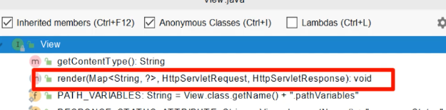
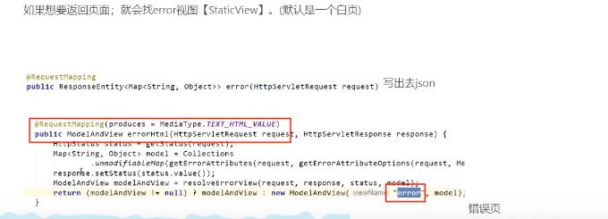
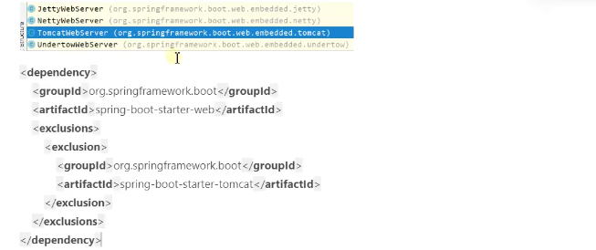
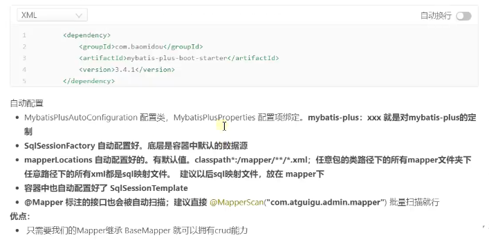
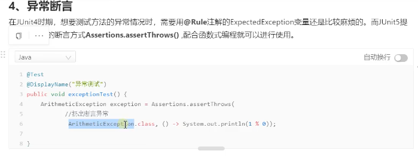

# 8.2.1 SpringBoot2入门

* maven设置
  

## 1、了解自动配置原理
* 1.SpringBoot特点
  * 1.1依赖管理：
  ````
      依赖管理
      <parent>
        <groupId>org.springframework.boot</groupId>
        <artifactId>spring-boot-starter-parent</artifactId>
        <version>2.2.5.RELEASE</version>
      </parent>
  
      它的父项目
        <parent>
          <groupId>org.springframework.boot</groupId>
          <artifactId>spring-boot-dependencies</artifactId>
          <version>2.2.5.RELEASE</version>
          <relativePath>../../spring-boot-dependencies</relativePath>
        </parent>
  
      几乎声明了所有开发中常见的依赖的版本号，自动版本仲裁机制
  
  
  ````
    * 开发导入starter场景启动器
      ````
      1、见到很多spring-boot-starter-*： *就是某种场景
      2、只要引入starter，这个场景的所有常规需要的依赖我们都自动引入。
      3、SpringBoot所有支持的场景：https://docs.spring.io/spring-boot/docs/current/reference/html/using-spring-boot.html#using-boot-starter
      4、见到的 *.spring-boot-starter，第三方为我们提供的简化开发的场景启动器。
      5、所有场景启动器最底层的依赖
        <dependency>
          <groupId>org.springframework.boot</groupId>
          <artifactId>spring-boot-starter</artifactId>
          <version>2.2.5.RELEASE</version>
          <scope>compile</scope>
        </dependency>
      
      ````
    * 无需关注版本号，自动版本仲裁
      ````
      1、引入依赖默认都可以不写版本
      2、引入非版本仲裁的jar，要写版本号。
      ````
    * 修改版本号
      ````
      1、查看spring-boot-dependencies里面规定当前依赖的版本 用的key。
      2、在当前项目里面重写配置
        <properties>
          <mysql.version>5.0.19</mysql.version>
        </properties>
      ````
  * 1.2、自动配置
    * 自动配好Tomcat
      * 引入Tomcat
      * 配置Tomcat
      ````
      <dependency>
        <groupId>org.springframework.boot</groupId>
        <artifactId>spring-boot-starter-tomcat</artifactId>
        <version>2.2.5.RELEASE</version>
        <scope>compile</scope>
      </dependency>
      ````
    * 自动配好SpringMVC
      * 引入SpringMVC全套组件
      * 自动配好SpringMVC常见组件（功能）
      查看容器内的组件：
        
    * 自动配好Web常见功能，如：字符编码问题
      * SpringBoot帮我们配置好了所有web开发的场景场景
    * 默认的包结构
      * 主程序所在包及其下面的所有子包里面的组件都会被默认扫描进来
      * 无须以前的包扫描配置
      * 想要改变扫描路径，@SpringBootApplication(scanBasePackages="com.iafoot")
        * 或者@ComponentScan 指定扫描路径
    * 各种配置拥有默认值
      * 默认配置最终都是映射到MultipartProperties
      * 配置文件的值最终会绑定每个类上，这个类会在容器中创建对象
    * 按需加载所有自动配置项
      * 引入了哪些场景的starter这个场景的自动配置才会开启。
        ````
          <dependency>
            <groupId>org.springframework.boot</groupId>
            <artifactId>spring-boot-autoconfigure</artifactId>
            <version>2.2.5.RELEASE</version>
            <scope>compile</scope>
          </dependency>
        ````
    * ......

## 2、容器功能 
* 2.1、组件添加
  * 1、@Configuration
    * 基本使用
      * 1、配置类里面使用@Bean标注在方法上给容器注册组件，默认也是单实例的。
      * 2、配置类本身也是组件
      * 3、proxyBeanMethods：代码bean的方法。
      
        
      
    * Full模式与Lite模式
      * 示例
      * 最佳实战
        * 配置类组件之间无依赖关系用Lite模式加速容器启动过程，减少判断
        * 配置类组件之间有依赖关系，方法会被调用得到之前单实例组件，用Full模式。
  * 2、@Bean、@Component、@Controller、@Service、@Repository
  * 3、@ComponentScan、@Import
    * 调用无参构造器给容器中自动创建出这两个类型的组件，默认组件的名字就是全类名。
  * 4、@Conditional
    * 条件装配：满足Conditional指定的条件，则进行组件注入
      

* 2.2、原生配置文件引入
  * 1、@ImportResource：导入Spring的配置文件。
    


* 2.3 配置绑定
如何使用Java读取到properties文件中的内容，并且把它封装到JavaBean中，以供随时使用；
  
  
  * 1、@ConfigurationProperties
  * 2、@EnableConfigurationProperties + @ConfigurationProperties
    
    
    
  * 3、@Component + @ConfigurationProperties
    
    

## 3、自动配置原理入门
* 3.1、引导加载自动配置类
  ````
  @SpringBootConfiguration
  @EnableAutoConfiguration
  @ComponentScan(excludeFilters = { @Filter(type = FilterType.CUSTOM, classes = TypeExcludeFilter.class),
  @Filter(type = FilterType.CUSTOM, classes = AutoConfigurationExcludeFilter.class) })
  public @interface SpringBootApplication {
  
  
  
  
  
  
  
  ````
  * 1、@SpringBootConfiguration:
    @Configuration。代表当前是一个配置类。
  * 2、@ComponentScan：指定扫描哪些,Spring注解；
  * 3、@EnableAutoConfiguration：
    ````
    @AutoConfigurationPackage
    @Import(AutoConfigurationImportSelector.class)
    public @interface EnableAutoConfiguration {
    ````
    * 3.1、@AutoConfigurationPackage：自动配置包。
      ````
      @Import(AutoConfigurationPackages.Registrar.class) //给容器中导入一个组件
      public @interface AutoConfigurationPackage {  
      //利用Registrar给容器中导入一系列组件。
      
        //Registrar 实现
        //将指定的一个包下的所有组件导入进来，MainApplication所在包下。
        @Override
		public void registerBeanDefinitions(AnnotationMetadata metadata, BeanDefinitionRegistry registry) {
			register(registry, new PackageImport(metadata).getPackageName());//new PackageImport(metadata).getPackageName() 获取注解所在类的包名
		}
      ````
    * 3.2 @Import(AutoConfigurationImportSelector.class)
      ````
      	@Override
        public String[] selectImports(AnnotationMetadata annotationMetadata) {
          if (!isEnabled(annotationMetadata)) {
            return NO_IMPORTS;
          }
          AutoConfigurationMetadata autoConfigurationMetadata = AutoConfigurationMetadataLoader
            .loadMetadata(this.beanClassLoader);
          AutoConfigurationEntry autoConfigurationEntry = getAutoConfigurationEntry(autoConfigurationMetadata,
            annotationMetadata);
          return StringUtils.toStringArray(autoConfigurationEntry.getConfigurations());
        }
          //调用的方法  getAutoConfigurationEntry
          protected AutoConfigurationEntry getAutoConfigurationEntry(AutoConfigurationMetadata autoConfigurationMetadata,
                  AnnotationMetadata annotationMetadata) {
              if (!isEnabled(annotationMetadata)) {
                  return EMPTY_ENTRY;
              }
              AnnotationAttributes attributes = getAttributes(annotationMetadata);
              List<String> configurations = getCandidateConfigurations(annotationMetadata, attributes);
              configurations = removeDuplicates(configurations);
              Set<String> exclusions = getExclusions(annotationMetadata, attributes);
              checkExcludedClasses(configurations, exclusions);
              configurations.removeAll(exclusions);
              configurations = filter(configurations, autoConfigurationMetadata);
              fireAutoConfigurationImportEvents(configurations, exclusions);
              return new AutoConfigurationEntry(configurations, exclusions);
          }
          
          
        1、利用getAutoConfigurationEntry(autoConfigurationMetadata,annotationMetadata);给容器中批量导入一些组件。
        2、调用List<String> configurations = getCandidateConfigurations(annotationMetadata, attributes); 获取到所有需要导入容器中的配置类。
        3、利用工厂加载 List<String> configurations = SpringFactoriesLoader.loadFactoryNames(getSpringFactoriesLoaderFactoryClass(),
				getBeanClassLoader()); 最终利用 Map<String, List<String>> loadSpringFactories(@Nullable ClassLoader classLoader) ；得到所有的组件。
        4、上面3是从"META-INF/spring.factories"位置来加载一个文件。默认扫描我们当前系统里面所有META/spring.factories位置的文件。
          spring-boot-autoconfigure-2.2.5.RELEASE.jar包里面也有META-INF/spring.factories
          ````
          文件里面写死了spring-boot一启动就要给容器中加载的所有配置类。
          spring-boot-autoconfigure-2.2.5.RELEASE.jar/META-INF/spring.factories
          # Auto Configure
          org.springframework.boot.autoconfigure.EnableAutoConfiguration=\
          org.springframework.boot.autoconfigure.admin.SpringApplicationAdminJmxAutoConfiguration,\
          org.springframework.boot.autoconfigure.aop.AopAutoConfiguration,\
          org.springframework.boot.autoconfigure.amqp.RabbitAutoConfiguration,\
          org.springframework.boot.autoconfigure.batch.BatchAutoConfiguration,\
          org.springframework.boot.autoconfigure.cache.CacheAutoConfiguration,\
          org.springframework.boot.autoconfigure.cassandra.CassandraAutoConfiguration,\
          org.springframework.boot.autoconfigure.cloud.CloudServiceConnectorsAutoConfiguration,\
          org.springframework.boot.autoconfigure.context.ConfigurationPropertiesAutoConfiguration,\
          org.springframework.boot.autoconfigure.context.MessageSourceAutoConfiguration,\
          org.springframework.boot.autoconfigure.context.PropertyPlaceholderAutoConfiguration,\
          org.springframework.boot.autoconfigure.couchbase.CouchbaseAutoConfiguration,\
          org.springframework.boot.autoconfigure.dao.PersistenceExceptionTranslationAutoConfiguration,\
          org.springframework.boot.autoconfigure.data.cassandra.CassandraDataAutoConfiguration,\
          org.springframework.boot.autoconfigure.data.cassandra.CassandraReactiveDataAutoConfiguration,\
          org.springframework.boot.autoconfigure.data.cassandra.CassandraReactiveRepositoriesAutoConfiguration,\
          org.springframework.boot.autoconfigure.data.cassandra.CassandraRepositoriesAutoConfiguration,\
          org.springframework.boot.autoconfigure.data.couchbase.CouchbaseDataAutoConfiguration,\
          org.springframework.boot.autoconfigure.data.couchbase.CouchbaseReactiveDataAutoConfiguration,\
          org.springframework.boot.autoconfigure.data.couchbase.CouchbaseReactiveRepositoriesAutoConfiguration,\
          org.springframework.boot.autoconfigure.data.couchbase.CouchbaseRepositoriesAutoConfiguration,\
          org.springframework.boot.autoconfigure.data.elasticsearch.ElasticsearchAutoConfiguration,\
          org.springframework.boot.autoconfigure.data.elasticsearch.ElasticsearchDataAutoConfiguration,\
          org.springframework.boot.autoconfigure.data.elasticsearch.ElasticsearchRepositoriesAutoConfiguration,\
          org.springframework.boot.autoconfigure.data.elasticsearch.ReactiveElasticsearchRepositoriesAutoConfiguration,\
          org.springframework.boot.autoconfigure.data.elasticsearch.ReactiveRestClientAutoConfiguration,\
          org.springframework.boot.autoconfigure.data.jdbc.JdbcRepositoriesAutoConfiguration,\
          org.springframework.boot.autoconfigure.data.jpa.JpaRepositoriesAutoConfiguration,\
          org.springframework.boot.autoconfigure.data.ldap.LdapRepositoriesAutoConfiguration,\
          org.springframework.boot.autoconfigure.data.mongo.MongoDataAutoConfiguration,\
          org.springframework.boot.autoconfigure.data.mongo.MongoReactiveDataAutoConfiguration,\
          org.springframework.boot.autoconfigure.data.mongo.MongoReactiveRepositoriesAutoConfiguration,\
          org.springframework.boot.autoconfigure.data.mongo.MongoRepositoriesAutoConfiguration,\
          org.springframework.boot.autoconfigure.data.neo4j.Neo4jDataAutoConfiguration,\
          org.springframework.boot.autoconfigure.data.neo4j.Neo4jRepositoriesAutoConfiguration,\
          org.springframework.boot.autoconfigure.data.solr.SolrRepositoriesAutoConfiguration,\
          org.springframework.boot.autoconfigure.data.redis.RedisAutoConfiguration,\
          org.springframework.boot.autoconfigure.data.redis.RedisReactiveAutoConfiguration,\
          org.springframework.boot.autoconfigure.data.redis.RedisRepositoriesAutoConfiguration,\
          org.springframework.boot.autoconfigure.data.rest.RepositoryRestMvcAutoConfiguration,\
          org.springframework.boot.autoconfigure.data.web.SpringDataWebAutoConfiguration,\
          org.springframework.boot.autoconfigure.elasticsearch.jest.JestAutoConfiguration,\
          org.springframework.boot.autoconfigure.elasticsearch.rest.RestClientAutoConfiguration,\
          org.springframework.boot.autoconfigure.flyway.FlywayAutoConfiguration,\
          org.springframework.boot.autoconfigure.freemarker.FreeMarkerAutoConfiguration,\
          org.springframework.boot.autoconfigure.gson.GsonAutoConfiguration,\
          org.springframework.boot.autoconfigure.h2.H2ConsoleAutoConfiguration,\
          org.springframework.boot.autoconfigure.hateoas.HypermediaAutoConfiguration,\
          org.springframework.boot.autoconfigure.hazelcast.HazelcastAutoConfiguration,\
          org.springframework.boot.autoconfigure.hazelcast.HazelcastJpaDependencyAutoConfiguration,\
          org.springframework.boot.autoconfigure.http.HttpMessageConvertersAutoConfiguration,\
          org.springframework.boot.autoconfigure.http.codec.CodecsAutoConfiguration,\
          org.springframework.boot.autoconfigure.influx.InfluxDbAutoConfiguration,\
          org.springframework.boot.autoconfigure.info.ProjectInfoAutoConfiguration,\
          org.springframework.boot.autoconfigure.integration.IntegrationAutoConfiguration,\
          org.springframework.boot.autoconfigure.jackson.JacksonAutoConfiguration,\
          org.springframework.boot.autoconfigure.jdbc.DataSourceAutoConfiguration,\
          org.springframework.boot.autoconfigure.jdbc.JdbcTemplateAutoConfiguration,\
          org.springframework.boot.autoconfigure.jdbc.JndiDataSourceAutoConfiguration,\
          org.springframework.boot.autoconfigure.jdbc.XADataSourceAutoConfiguration,\
          org.springframework.boot.autoconfigure.jdbc.DataSourceTransactionManagerAutoConfiguration,\
          org.springframework.boot.autoconfigure.jms.JmsAutoConfiguration,\
          org.springframework.boot.autoconfigure.jmx.JmxAutoConfiguration,\
          org.springframework.boot.autoconfigure.jms.JndiConnectionFactoryAutoConfiguration,\
          org.springframework.boot.autoconfigure.jms.activemq.ActiveMQAutoConfiguration,\
          org.springframework.boot.autoconfigure.jms.artemis.ArtemisAutoConfiguration,\
          org.springframework.boot.autoconfigure.groovy.template.GroovyTemplateAutoConfiguration,\
          org.springframework.boot.autoconfigure.jersey.JerseyAutoConfiguration,\
          org.springframework.boot.autoconfigure.jooq.JooqAutoConfiguration,\
          org.springframework.boot.autoconfigure.jsonb.JsonbAutoConfiguration,\
          org.springframework.boot.autoconfigure.kafka.KafkaAutoConfiguration,\
          org.springframework.boot.autoconfigure.ldap.embedded.EmbeddedLdapAutoConfiguration,\
          org.springframework.boot.autoconfigure.ldap.LdapAutoConfiguration,\
          org.springframework.boot.autoconfigure.liquibase.LiquibaseAutoConfiguration,\
          org.springframework.boot.autoconfigure.mail.MailSenderAutoConfiguration,\
          org.springframework.boot.autoconfigure.mail.MailSenderValidatorAutoConfiguration,\
          org.springframework.boot.autoconfigure.mongo.embedded.EmbeddedMongoAutoConfiguration,\
          org.springframework.boot.autoconfigure.mongo.MongoAutoConfiguration,\
          org.springframework.boot.autoconfigure.mongo.MongoReactiveAutoConfiguration,\
          org.springframework.boot.autoconfigure.mustache.MustacheAutoConfiguration,\
          org.springframework.boot.autoconfigure.orm.jpa.HibernateJpaAutoConfiguration,\
          org.springframework.boot.autoconfigure.quartz.QuartzAutoConfiguration,\
          org.springframework.boot.autoconfigure.rsocket.RSocketMessagingAutoConfiguration,\
          org.springframework.boot.autoconfigure.rsocket.RSocketRequesterAutoConfiguration,\
          org.springframework.boot.autoconfigure.rsocket.RSocketServerAutoConfiguration,\
          org.springframework.boot.autoconfigure.rsocket.RSocketStrategiesAutoConfiguration,\
          org.springframework.boot.autoconfigure.security.servlet.SecurityAutoConfiguration,\
          org.springframework.boot.autoconfigure.security.servlet.UserDetailsServiceAutoConfiguration,\
          org.springframework.boot.autoconfigure.security.servlet.SecurityFilterAutoConfiguration,\
          org.springframework.boot.autoconfigure.security.reactive.ReactiveSecurityAutoConfiguration,\
          org.springframework.boot.autoconfigure.security.reactive.ReactiveUserDetailsServiceAutoConfiguration,\
          org.springframework.boot.autoconfigure.security.rsocket.RSocketSecurityAutoConfiguration,\
          org.springframework.boot.autoconfigure.security.saml2.Saml2RelyingPartyAutoConfiguration,\
          org.springframework.boot.autoconfigure.sendgrid.SendGridAutoConfiguration,\
          org.springframework.boot.autoconfigure.session.SessionAutoConfiguration,\
          org.springframework.boot.autoconfigure.security.oauth2.client.servlet.OAuth2ClientAutoConfiguration,\
          org.springframework.boot.autoconfigure.security.oauth2.client.reactive.ReactiveOAuth2ClientAutoConfiguration,\
          org.springframework.boot.autoconfigure.security.oauth2.resource.servlet.OAuth2ResourceServerAutoConfiguration,\
          org.springframework.boot.autoconfigure.security.oauth2.resource.reactive.ReactiveOAuth2ResourceServerAutoConfiguration,\
          org.springframework.boot.autoconfigure.solr.SolrAutoConfiguration,\
          org.springframework.boot.autoconfigure.task.TaskExecutionAutoConfiguration,\
          org.springframework.boot.autoconfigure.task.TaskSchedulingAutoConfiguration,\
          org.springframework.boot.autoconfigure.thymeleaf.ThymeleafAutoConfiguration,\
          org.springframework.boot.autoconfigure.transaction.TransactionAutoConfiguration,\
          org.springframework.boot.autoconfigure.transaction.jta.JtaAutoConfiguration,\
          org.springframework.boot.autoconfigure.validation.ValidationAutoConfiguration,\
          org.springframework.boot.autoconfigure.web.client.RestTemplateAutoConfiguration,\
          org.springframework.boot.autoconfigure.web.embedded.EmbeddedWebServerFactoryCustomizerAutoConfiguration,\
          org.springframework.boot.autoconfigure.web.reactive.HttpHandlerAutoConfiguration,\
          org.springframework.boot.autoconfigure.web.reactive.ReactiveWebServerFactoryAutoConfiguration,\
          org.springframework.boot.autoconfigure.web.reactive.WebFluxAutoConfiguration,\
          org.springframework.boot.autoconfigure.web.reactive.error.ErrorWebFluxAutoConfiguration,\
          org.springframework.boot.autoconfigure.web.reactive.function.client.ClientHttpConnectorAutoConfiguration,\
          org.springframework.boot.autoconfigure.web.reactive.function.client.WebClientAutoConfiguration,\
          org.springframework.boot.autoconfigure.web.servlet.DispatcherServletAutoConfiguration,\
          org.springframework.boot.autoconfigure.web.servlet.ServletWebServerFactoryAutoConfiguration,\
          org.springframework.boot.autoconfigure.web.servlet.error.ErrorMvcAutoConfiguration,\
          org.springframework.boot.autoconfigure.web.servlet.HttpEncodingAutoConfiguration,\
          org.springframework.boot.autoconfigure.web.servlet.MultipartAutoConfiguration,\
          org.springframework.boot.autoconfigure.web.servlet.WebMvcAutoConfiguration,\
          org.springframework.boot.autoconfigure.websocket.reactive.WebSocketReactiveAutoConfiguration,\
          org.springframework.boot.autoconfigure.websocket.servlet.WebSocketServletAutoConfiguration,\
          org.springframework.boot.autoconfigure.websocket.servlet.WebSocketMessagingAutoConfiguration,\
          org.springframework.boot.autoconfigure.webservices.WebServicesAutoConfiguration,\
          org.springframework.boot.autoconfigure.webservices.client.WebServiceTemplateAutoConfiguration

          ````
      ````
  * 
  * 
  
     
* 3.2、按需开启自动配置项
  ````
  虽然我们127个场景的所有自动配置启动的时候默认全部加载。
  按照条件装配规则，最终会按需配置。
  ````
* 3.3、修改默认配置
  
  SpringBoot默认会在底层配好所有的组件。但是如果用户自己配置了以用户的优先
  
  总结：
    * SpringBoot先加载所有的自动配置类。来源 xxxAutoConfiguration.class
    * 每个自动配置类按照条件进行生效，默认都会绑定配置文件指定的值。来源xxxProperties.class里面拿。xxxProperties.class和配置文件进行绑定。
    * 生效的配置类就会给容器中封装很多组件
    * 只要容器中有这些组件，相当于这些功能就有了
    * 只要用户自己配置的，就以用户的优先。
    * 定制化配置：
      * 用户直接自己@Bean替换底层的组件。
      * 用户去看这个组件是获取的配置文件什么值就去修改。
    xxxAutoConfiguration -->组件 --> xxxProperties里面拿值 --> application.properties 
* 3.4、最佳实践
  * 引入场景依赖
    * https://docs.spring.io/spring-boot/docs/current/reference/html/using-spring-boot.html#using-boot-starter
  * 查看自动配置定制化
    * 自己分析，引入场景对应的自动配置，一般都生效了
    * 配置文件中配置：debug=true。开启自动配置报告。Negative（不生效）。Positive（生效）。
  * 是否需要修改
    * 参照文档修改配置项
      * https://docs.spring.io/spring-boot/docs/current/reference/html/appendix-application-properties.html#common-application-properties
      * 自己分析。xxxProperties绑定了配置文件的那些。
  * 自定义加入或者替换组件
    * @Bean、@Component。。。
  * 自定义器 xxxCustomizer；
  * 。。。


## 4、开发小技巧
* 4.1、Lombok
简化开发
  

* 4.2、dev-tools 热更新，ctrl + F9,重启。
````
<dependencies>
    <dependency>
        <groupId>org.springframework.boot</groupId>
        <artifactId>spring-boot-devtools</artifactId>
        <optional>true</optional>
    </dependency>
</dependencies>
````

* 4.3、Spring Initailizr 
Spring 初始化向导


# 8.2.1 SpringBoot2核心技术-核心功能

## 4、配置文件
* 1、properties。同上文描述
* 2、yaml：非常适合用来做以数据为中心的配置文件
  * 2.1 基本语法
    * key：value；kv之间有空格。
    * 大小写敏感
    * 使用缩进表示层级关系
    * 缩进不允许使用tab，只允许空格。
    * 缩进的空格数不重要，只要相同层级的元素左对齐即可。
    * '#'表示注释。
    * ''与""表示字符串内容 会被 转义/不转义。如\n：单引号会将\n作为字符串输出。双引号会将 \n 作为换行输出。
  * 2.2、数据类型
    * 字面量：单个的、不可再分的值。date、boolean、string、number、null
      
    * 对象：键值对的集合。map、hash、set、object
      
    * 数组/集合：一组按次序排列的值。array、list、queue
      

  * 2.3、配置提示
  自定义配置类和配置文件绑定一般没有提示。
  
  


## web开发
https://docs.spring.io/spring-boot/docs/current/reference/html/spring-boot-features.html#boot-features-developing-web-applications
* 1、SpringMVC自动配置概览
  
   

* 2、简单功能分析
  * 2.1、静态资源访问
    * 静态资源目录：
      类路径下：called/static (or /public or /resources or /META-INF/resources)
      访问：当前项目根路径 /+静态资源名
      
      原理：静态映射/**。
      请求进来，先去找Controller看能不能处理。不能处理的所有请求又都交给静态资源处理器。静态资源也找不到404.
      修改静态资源路径：
      
    * 静态资源访问前缀
      默认无前缀。
      ````
      spring:
        mvc:
        static-path-pattern: "/res/**"
      ````
      当前项目+static-path-pattern+静态资源名 = 静态资源文件夹下找。
    * wabjar
      自动映射
      https://www.webjars.org/
      ````
      <dependency>
        <groupId>org.webjars</groupId>
        <artifactId>jquery</artifactId>
        <version>3.6.0</version>
      </dependency>
      ````
      
  
  * 2.2、欢迎页支持
    * 静态资源路径下index.html
      * 可以配置静态资源路径
      * 但是不可以配置静态资源的访问前缀。否则导致index.html不能被默认访问。
      
    * controller能处理/index请求
  * 2.3、自定义Favicon
    
  * 2.4、静态资源配置原理
    * Spring启动默认加载 xxxAutoConfiguration类（自动配置类）
    * SpringMVC功能的自动配置类 WebMvcAutoConfiguration。
      ````
      生效：
      @Configuration(proxyBeanMethods = false)
      @ConditionalOnWebApplication(type = Type.SERVLET)
      @ConditionalOnClass({ Servlet.class, DispatcherServlet.class, WebMvcConfigurer.class })
      @ConditionalOnMissingBean(WebMvcConfigurationSupport.class)
      @AutoConfigureOrder(Ordered.HIGHEST_PRECEDENCE + 10)
      @AutoConfigureAfter({ DispatcherServletAutoConfiguration.class, TaskExecutionAutoConfiguration.class,
      ValidationAutoConfiguration.class })
      public class WebMvcAutoConfiguration {
      ````
    * 给容器中配置了什么
      ````
      	@Configuration(proxyBeanMethods = false)
        @Import(EnableWebMvcConfiguration.class)
        @EnableConfigurationProperties({ WebMvcProperties.class, ResourceProperties.class })
        @Order(0)
        public static class WebMvcAutoConfigurationAdapter implements WebMvcConfigurer {
      ````
    * 配置文件的相关属性和xxx进行了绑定。WebMvcProperties == spring.mvc、ResourceProperties == spring.resources
      1、配置类只有一个有参构造器
      ````
            //有参构造器所有参数的值都会从容器中确定
            //ResourceProperties resourceProperties：获取和spring.resources绑定的所有值对象。
            //WebMvcProperties mvcProperties：获取和spring.mvc绑定的所有值对象。
            //ListableBeanFactory beanFactory： Spring的beanFactory
            //ObjectProvider<HttpMessageConverters> messageConvertersProvider：找到所有的HttpMessageConverters
            //ResourceHandlerRegistrationCustomizer：找到资源处理器的自定义器。====后面重点说明====
      		public WebMvcAutoConfigurationAdapter(ResourceProperties resourceProperties, WebMvcProperties mvcProperties,
				ListableBeanFactory beanFactory, ObjectProvider<HttpMessageConverters> messageConvertersProvider,
				ObjectProvider<ResourceHandlerRegistrationCustomizer> resourceHandlerRegistrationCustomizerProvider) {
              this.resourceProperties = resourceProperties;
              this.mvcProperties = mvcProperties;
              this.beanFactory = beanFactory;
              this.messageConvertersProvider = messageConvertersProvider;
              this.resourceHandlerRegistrationCustomizer = resourceHandlerRegistrationCustomizerProvider.getIfAvailable();
		    }   
      ````
      2、资源处理的默认规则
      ````
        @Override
		public void addResourceHandlers(ResourceHandlerRegistry registry) {
			if (!this.resourceProperties.isAddMappings()) {
				logger.debug("Default resource handling disabled");
				return;
			}
			Duration cachePeriod = this.resourceProperties.getCache().getPeriod();
			CacheControl cacheControl = this.resourceProperties.getCache().getCachecontrol().toHttpCacheControl();
			if (!registry.hasMappingForPattern("/webjars/**")) {
				customizeResourceHandlerRegistration(registry.addResourceHandler("/webjars/**")
						.addResourceLocations("classpath:/META-INF/resources/webjars/")
						.setCachePeriod(getSeconds(cachePeriod)).setCacheControl(cacheControl));
			}
			String staticPathPattern = this.mvcProperties.getStaticPathPattern();
			if (!registry.hasMappingForPattern(staticPathPattern)) {
				customizeResourceHandlerRegistration(registry.addResourceHandler(staticPathPattern)
						.addResourceLocations(getResourceLocations(this.resourceProperties.getStaticLocations()))
						.setCachePeriod(getSeconds(cachePeriod)).setCacheControl(cacheControl));
			}
		}
      ````
      
      
      
      * 3、欢迎页的处理位置：
      ````
        //HandlerMapping：处理器映射。保存了每一个Handler能处理那些请求。
        @Bean
		public WelcomePageHandlerMapping welcomePageHandlerMapping(ApplicationContext applicationContext,
				FormattingConversionService mvcConversionService, ResourceUrlProvider mvcResourceUrlProvider) {
			WelcomePageHandlerMapping welcomePageHandlerMapping = new WelcomePageHandlerMapping(
					new TemplateAvailabilityProviders(applicationContext), applicationContext, getWelcomePage(),
					this.mvcProperties.getStaticPathPattern());
			welcomePageHandlerMapping.setInterceptors(getInterceptors(mvcConversionService, mvcResourceUrlProvider));
			return welcomePageHandlerMapping;
		}
          //---
          WelcomePageHandlerMapping(TemplateAvailabilityProviders templateAvailabilityProviders,
			ApplicationContext applicationContext, Optional<Resource> welcomePage, String staticPathPattern) {
		if (welcomePage.isPresent() && "/**".equals(staticPathPattern)) {
			//要用欢迎页功能，必须是/**
            logger.info("Adding welcome page: " + welcomePage.get());
			setRootViewName("forward:index.html");
		}
		else if (welcomeTemplateExists(templateAvailabilityProviders, applicationContext)) {
			//调用Controller /index
            logger.info("Adding welcome page template: index");
			setRootViewName("index");
          } 
        }
      ````
    * 


* 3、请求参数处理
  * 1、请求映射
    * @xxxMapping；
    * Rest风格支持（使用HTTP请求方式动词表示对资源的操作）
      * 以前：/getUser 获取用户 、/deleteUser 删除用户、/editUser 修改用户、/saveUser 保存用户
      * 现在：/user GET-获取用户、DELETE-删除用户、PUT-修改用户、POST-保存用户
      * 核心Filter;HiddenHttpMethodFilter
        * 用法：表单method=post，隐藏域_method=put
        * SpringBoot中手动开启
        1、Rest原理（表单提交要使用REST的时候）
          * 表单提交会带上_method=PUT
          * 请求过来被HiddenHttpMethodFilter拦截
            * 请求是否正常，并且是POST
              * 获取到_method的值。
              * 兼容以下请求；PUT/DELETE/PATCH
              * 原生request(post)，包装模式requestWrapper重写了getMethod方法，返回的是传入的值。
              * 过滤器链放行的时候用wrapper。以后的方法调用getMethod是调用的requestWrapper的。
            REST使用客户端工具：
              *  如PostMan直接发送Put、delete等方法请求，无须Filter。
              
        2、请求映射原理
          
          
          
          RequestMappingHandlerMapping：保存了所有@RequestMapping和handler的映射规则。
          
          所有的请求映射都在HandlerMapping中。
            * SpringBoot自动配置欢迎页的WelcomePageHandlerMapping。访问/能访问到index.html；
            * 请求进来，挨个尝试所有的RequestMappingHandlerMapping看是否有请求信息。
              * 如果有就找到这个请求对应的handler
              * 如果没有就是下一个HandlerMapping
            * 如果我们需要一些自定义的映射处理，我们也可以自己给容器中放HanderMapping。
  * 2、SpringMVC接收WEB请求，可以接收的传参类型。
    * 注解：@PathVariable、@RequestHeader、@ModelAttribute、@RequestParam、@MatrixVariable、@CookieValue、@RequestBody
    * Servlet API：WebRequest、ServletRequest、MultipartRequest、HttpSession、javax.servlet.htp.PushBuilder、Principal、InputStream、Reader、
      HttpMethod、Locale、TimeZone、Zoneld
    * 复杂参数：MAP、Model（map、model里面的数据会被放在request的请求域中。相当于调用request.setAttribute）、Error/BindingResult、
      RedirectAttributes(重定向携带数据)、ServletResponse、SessionStatus、UriComponentsBuilder、
      ServletUriComponentsBuilder
      
    * 自定义对象参数：可以自动类型转换与格式化，可以级联封装。
  * 3、参数处理原理：
    * HandlerMapping中找到能处理请求的Handler（Controller.method()）
    * 为当前Handler找到一个适配器HandlerAdapter 
       
         
         
  * 4、自定义对象参数：
    * POJO封装过程。
      * ServletModerAttributeMethodProcessor
    * 

* 4、数据响应和内容协商
  * 4.1、响应JSON
    * jackson+@ResponseBody
    
      
    * 返回值解析器
       
      
      
      
      1、返回值处理器判断是否支持这种类型返回值supportsReturnType
      2、返回值处理器调用
    * SpringMVC到底支持哪些返回值
      
      
      
      
      
    * 
  * 4.2、HTTPMessageConverter原理
    
    
    
    
  * 4.3、开启浏览器参数方式内容协商功能。
    为了方便内容协商，开启基于请求参数的内容协商功能。
    
    
    
  * 4.4、自定义MessageConverter
    实现多协议数据兼容。json、xml、x-guigu
    1、@ResponseBody 响应数据出去 调用 RequestResponseBodyMethodProcessor处理
    2、Processor处理方法返回值。通过MessageConverter处理。
    3、所有MessageConverter合起来可以支持各种媒体类型数据的操作（读、写）。
    4、内容协商找到最终的messageConverter。

    要给容器中添加什么功能，都是一个入口，给容器中添加WebMvcConfigurer
     
    
  

  
  

* 5、视图解析与模板引擎
  https://www.thymeleaf.org/
  * 视图解析原理流程：
    * 1、目标方法处理的过程中，所有数据都会被放在 ModelAndViewContainer里面。包括数据和视图地址。
    * 2、方法的参数是一个自定义类型对象（从请求参数中确定的），把他重新放到ModelAndViewContainer中。
    * 3、任何目标方法执行完成以后都会返回ModelAndView（数据和视图地址）。
    * 4、processDispatchResult处理派发结果（页面该如何响应）。
      * render(mv,request,response);进行页面渲染逻辑
        * 根据方法的string返回值得到View对象【定义了页面的渲染逻辑】
          * 所有的视图解析器尝试是否能根据当前返回值得到View对象。
          * 得到了redirect:/main.html --> Thymeleaf new RedirectView()
          * ContentNegotiationViewResolver里面包含了下面所有的视图解析器，内部还是利用下面所有视图解析器得到视图对象。
            
          * view.render(mv.getModelInternal(),request,response);视图对象调用自定义的render进行页面渲染工作。
            * RedirectView如何渲染：获取目标url地址。response.sendRedirect(encodedURL);
            
        
* 6.拦截器（HandlerInterceptor）
  
  * 拦截器原理：
    1.根据当前请求，找到HandlerExecutionChain【可以处理请求的handler以及handler的所有拦截器】
    2.先 顺序执行 所有拦截器的 preHandle方法
      1.如果当前拦截器prehandler返回为true。则执行下一个拦截器preHandle
      2.如果当前拦截器返回为false。直接触发 倒序执行所有已经执行了的拦截器的 afterCompletion。
    3.如果任何一个拦截器返回false。直接跳出不执行目标方法。
    4.所有拦截器都返回true。执行目标方法。
    5.倒序执行所有拦截器的postHandle方法。
    6.前面的步骤任何异常都会直接倒序触发afterCompletion。
    7.页面成功渲染完成以后，也会倒序触发afterCompletion。
    
    
    
* 7.文件上传


  
自动配置原理：文件上传-MultipartAutoConfiguration
  * 1.自动配置好了 StandardServletMultipartResolver【文件上传解析器】
  * 2.原理步骤：
    * 1.请求进来使用文件上传解析器判断（isMultipart）并封装（resolveMultipart，返回MultipartHttpServletRequest）文件上传请求。
    * 2.参数解析器来解析请求中的文件内容封装成MultipartFile。
    * 3.将request中文件信息封装为一个Map。
    * 4.FileCopyUtils，实现文件流拷贝。

  


* 8.异常处理
  * 1.错误处理：
    * 1.默认规则
      * 默认情况下Spring Boot提供/error处理所有错误的映射。
      * 对于机器客户端，它将生成JSON响应，其中包含错误，HTTP状态和异常消息的详细信息。对于浏览器客户端，响应一个"whitelabel"错误视图，以HTML格式呈现相同的数据。
      * 要对其进行自定义，添加view解析为error。
      * 要完全替换默认行为，可以实现ErrorController并注册该类型的Bean定义，或添加ErrorAttributes类型的组件 以使用现有机制但替换其内容。
    * 2.定义错误处理逻辑
      * 自定义错误页：error/404.html error/5xx.html
      * @ControllerAdvice+@ExceptionHandle处理异常；底层是ExceptionHandlerExceptionResolver支持的
      * @ResponseStatus+自定义异常；底层是 ResponseStatusExceptionResolver，把responsestatus注解的信息
        底层调用response.sendError(statusCode,resolvedReason)；tomcat发送的/error 
      * Spring底层的异常，如参数类型转换异常;DefaultHandlerExceptionResolver处理框架底层的异常。
        * response.sendError(HTTPServletResponse.SC_BAD_REQUEST,ex.getMessage());
      * 自定义实现HandlerExceptionResolver处理异常。可以作为默认的全局异常处理规则。  
      * ErrorViewResolver实现自定义处理异常。
        * response.sendError。error请求就会转给controller
        * 你的异常没有任何人能处理。tomcat底层response.sendError。error请求就会转给controller。
        * basicErrorController要去的页面地址是ErrorViewResolver；
    * 3.异常处理自动配置原理
      * ErrorMvcAutoConfiguration自动配置：容器中的如下组件
        * 类型：DefaultErrorAttributes ->id：errorAttributes
          * public class DefaultErrorAttributes implements ErrorAttributes, HandlerExceptionResolver, Ordered {
          * DefaultErrorAttributes：定义错误页面中可以包含哪些数据。
        * 类型：BasicErrorController -> id：basicErrorController
          * 处理默认：/error路径的请求。页面响应 new ModelAndView("error", model);
          * 容器中有组件View -> id是error；（响应默认错误页）
          * 容器中放组件BeanNameViewResolver（视图解析器）；按照返回的视图名作为组件的id去容器中找View对象。
        * 类型：DefaultErrorViewResolver -> id：conventionErrorViewResolver
          * 如果发送错误，会以HTTP的状态码作为视图页地址（viewName）,找到真正的页面
          * error/404、5xx.html
      
    * 4.异常处理步骤流程
      * 执行目标方法，目标方法运行期间有任何异常都会被catch，而且标注当前请求结束；并且用dispatchException
      * 进入视图解析流程（页面渲染？）processDispatchResult(ProcessedRequest,response,mappedHandler,mv,dispatchException)；
      * mv=processHandlerException；处理handler发生的异常，处理完成返回ModelAndView；
        * 变量所有的handleExceptionResolvers，看谁能处理当前异常【handlerExceptionResolver处理异常解析器】
        * 系统默认的异常解析器：
          * 1、DefaultErrorAttributes先来处理异常。把异常信息保存到request域，并且返回null；
          * 2、默认没有任何能处理异常，所以异常会被抛出。
          * 3、如果没有任何人能处理最终底层会发送/error请求。会被底层的BasiErrorController处理。
          * 4、解析错误视图：遍历所有的ErrorViewResolver看谁能解析
          * 5、默认的DefaultErrorViewResolver，作用是把响应状态码作为错误页的赋值.error/5xx.html
          * 6、最终显示页面
* 9.Web原生组件注入（Servlet、Filter、Listener）
  * 使用Servlet API：@ServletComponentScan(basePackages="com.iafoot")：指定原生Servlet组件放在那里。@WebServlet(urlPatterns="/my")：效果：直接响应，没有spring的拦截器。
     
    
    * Filter：
      
    * listener:
      
  * 使用RegistrationBean：ServletRegistrationBean、FilterRegistrationBean，ServletListenerRegistrationBean。
    
    
    
* 10.嵌入式Servlet容器
  * 1、切换嵌入式Servlet容器
    * 默认支持的WebServer
      * Tomcat,Jetty，Undertow
      * ServletWebServerApplicationContext容器启动寻找ServletWebServerFactory并引导创建服务器。
    * 切换服务器：
      
    * 原理：
      
  * 2、定制Servlet容器：
    
* 11.定制化原理
  * 1、定制化的常见方式
    * 修改配置文件；
    * xxxCustomizer;实现定制化器。
    * 编写自定义的配置类 xxxConfiguration;+@Bean替换、增加容器中默认组件；视图解析器
    * web应用 编写一个配置类实现 WebMvcConfigurer即可定制化web功能；+@Bean给容器中再扩展一些组件。
      
    
  * 2、原理分析套路：
    场景starter -XXXAutoConfiguration -导入xxx组件-绑定xxxProperties--绑定配置文件项。

## 数据访问
* 1.导入JDBC场景


* 2.分析自动配置

* 3.修改配置项


* 使用Druid数据源
  * druid官方github地址:https://github.com/apache/druid/
  * 整合第三方技术的两种方式：自定义。找starter。
  * 自定义：
    创建数据源：
  * starter：
    引入druid-starter： 
    

* 整合MyBatis操作数据库
  
  
  
  
  
  
  注解模式：

  

* 整合MyBatis-Plus完成CRUD
  什么是MyBatis-Plus
  
  整合MyBatis-Plus
  

  
  
  分页
  


* 整合NoSQL
  
  
  
  
  
  
  

## 单元测试
1、JUnit5的变化


2、JUnit5常用注解

3、断言（assertions）





4、前置条件（assumptions）


5、嵌套测试

6、参数化测试


## 指标监控
1、SpringBoot Actuator


2、Actuator Endpoint


3、定制Endpoint
定制Health信息


定制info信息
方式一：编写配置文件

方式二：编写InfoContributor


定制Metrics信息


定制Endpoint


4、可视化
https://github.com/codecentric/spring-boot-admin


## 原理解析
1、Profile功能:为了方便多环境适配，springboot简化了profile功能。


2、外部化配置

https://docs.spring.io/spring-boot/docs/current/reference/html/features.html#features.external-config


3、自定义starter


# 8.2.1 SpringBoot2入门


