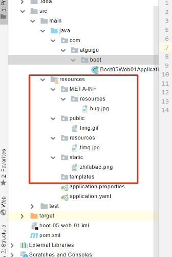

# 8.2.1 配置绑定

* @ConfigurationProperties(prefix="test"): Bean和【Properties/yaml/yml】中指定前缀配置绑定。
> 自定义类配置提示插件：
> ```
> <dependency>
>    <groupId>org.springframework.boot</groupId>
>    <artifactId>spring-boot-configuration-processor</artifactId>
>    <optional>true</optional>
> </dependency>
> 
> <build>
>        <plugins>
>            <plugin>
>                <groupId>org.springframework.boot</groupId>
>                <artifactId>spring-boot-maven-plugin</artifactId>
>                <configuration>
>                    <excludes>
>                        <exclude>
>                            <groupId>org.springframework.boot</groupId>
>                            <artifactId>spring-boot-configuration-processor</artifactId>
>                        </exclude>
>                    </excludes>
>                </configuration>
>            </plugin>
>        </plugins>
>    </build>
> ```
>

# 8.2.1 Web开发


## 8.2.1.1 SpringMVC自动配置概览
官方文档：https://docs.spring.io/spring-boot/docs/current/reference/html/spring-boot-features.html#boot-features-spring-mvc-auto-configuration
>Spring Boot provides auto-configuration for Spring MVC that works well with most applications.(大多场景我们都无需自定义配置)
The auto-configuration adds the following features on top of Spring’s defaults:
• Inclusion of ContentNegotiatingViewResolver and BeanNameViewResolver beans.
• 内容协商视图解析器和BeanName视图解析器
• Support for serving static resources, including support for WebJars (covered later in this document)).
• 静态资源（包括webjars）
• Automatic registration of Converter, GenericConverter, and Formatter beans.
• 自动注册 Converter，GenericConverter，Formatter
• Support for HttpMessageConverters (covered later in this document).
• 支持 HttpMessageConverters （后来我们配合内容协商理解原理）
• Automatic registration of MessageCodesResolver (covered later in this document).
• 自动注册 MessageCodesResolver （国际化用）
• Static index.html support.
• 静态index.html 页支持
• Custom Favicon support (covered later in this document).
• 自定义 Favicon  
• Automatic use of a ConfigurableWebBindingInitializer bean (covered later in this document).
• 自动使用 ConfigurableWebBindingInitializer ，（DataBinder负责将请求数据绑定到JavaBean上）
If you want to keep those Spring Boot MVC customizations and make more MVC customizations (interceptors, formatters, view controllers, and other features), you can add your own @Configuration class of type WebMvcConfigurer but without @EnableWebMvc.
不用@EnableWebMvc注解。使用 @Configuration + WebMvcConfigurer 自定义规则
If you want to provide custom instances of RequestMappingHandlerMapping, RequestMappingHandlerAdapter, or ExceptionHandlerExceptionResolver, and still keep the Spring Boot MVC customizations, you can declare a bean of type WebMvcRegistrations and use it to provide custom instances of those components.
声明 WebMvcRegistrations 改变默认底层组件
If you want to take complete control of Spring MVC, you can add your own @Configuration annotated with @EnableWebMvc, or alternatively add your own @Configuration-annotated DelegatingWebMvcConfiguration as described in the Javadoc of @EnableWebMvc.
使用 @EnableWebMvc+@Configuration+DelegatingWebMvcConfiguration 全面接管SpringMVC
> 
>


## 8.2.1.2 SpringMVC自动配置-静态内容
参见（7.1.5）：https://docs.spring.io/spring-boot/docs/current/reference/html/spring-boot-features.html#boot-features-spring-mvc-static-content
> * 默认路径：默认情况下，Spring Boot从类路径中名为/static（/public或/resources或/META-INF/resources）的目录或根目录提供静态内容ServletContext。它使用ResourceHttpRequestHandlerSpring MVC中的from，因此您可以通过添加自己WebMvcConfigurer的addResourceHandlers方法并覆盖该方法来修改该行为。
> 
> 在独立的Web应用程序中，还启用了容器中的默认servlet，并将其用作后备，从ServletContextSpring决定不处理它的根开始提供内容。在大多数情况下，这不会发生（除非您修改默认的MVC配置），因为Spring始终可以通过处理请求DispatcherServlet。
> * 自定义静态资源位置：可以使用spring.web.resources.static-locations属性来自定义静态资源位置（用目录位置列表替换默认值）。根Servlet上下文路径"/"也会自动添加为位置。
> * 调整映射路径：默认情况下，资源映射到/**，但是您可以使用spring.mvc.static-path-pattern属性对其进行调整。例如，将所有资源重新分配到/resources/**以下位置即可：
> ```
> spring:
>   mvc:
>       static-path-pattern: "/resources/**"
> ```
> * Webjars：您也可以使用spring.web.resources.static-locations属性来自定义静态资源位置（用目录位置列表替换默认值）。根Servlet上下文路径"/"也会自动添加为位置。
> 除了前面提到的“标准”静态资源位置，Webjars内容也有特殊情况。/webjars/**如果jar文件以Webjars格式打包，则从jar文件提供带有路径的所有资源。
>  > 参见：https://www.webjars.org/ 
>  > 	src/main/webapp如果您的应用程序打包为jar，则 不要使用该目录。尽管此目录是一个通用标准，但它仅与war打包一起使用，并且如果生成jar，大多数构建工具都将其忽略。
>

## 8.2.1.3 SpringMVC自动配置-欢迎页支持
参见（7.1.6）：https://docs.spring.io/spring-boot/docs/current/reference/html/spring-boot-features.html#boot-features-spring-mvc-welcome-page
> Spring Boot支持静态和模板欢迎页面。它首先index.html在配置的静态内容位置中查找文件。如果找不到，则寻找index模板。如果找到任何一个，它将自动用作应用程序的欢迎页面。


https://www.bilibili.com/video/BV19K4y1L7MT?p=24&spm_id_from=pageDriver