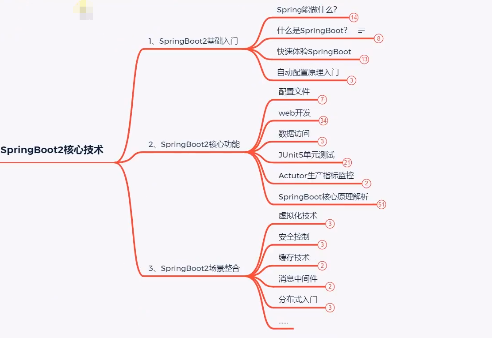
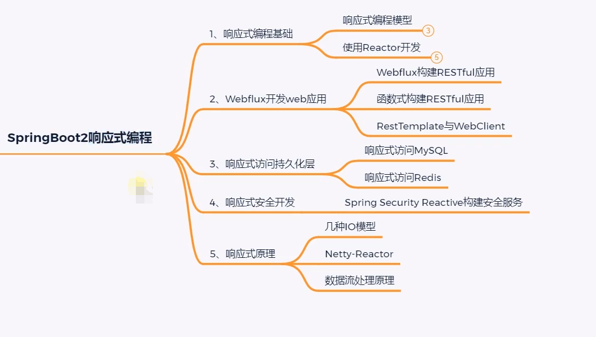
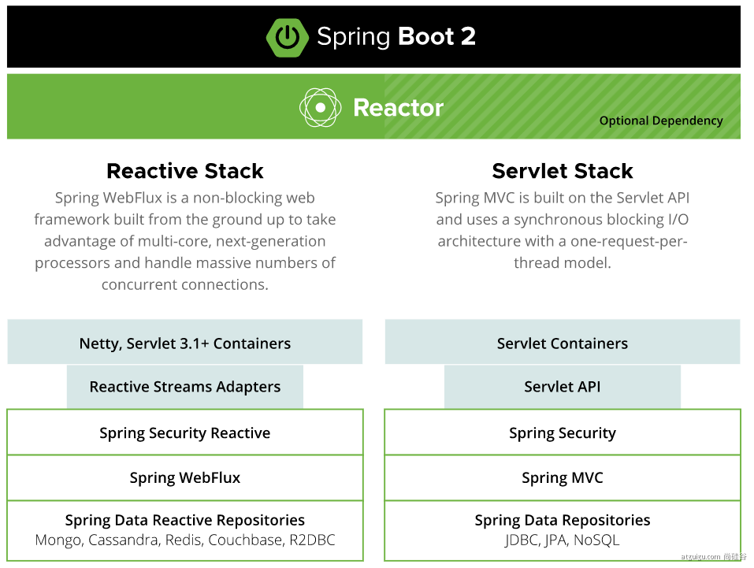
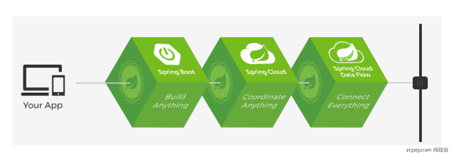

# 8.1 简介
> * Spring Boot 简化Spring开发的一个框架。
> * 整个Spring技术栈的大整合。
> * J2EE开发的一站式解决方案。

Spring官网：https://spring.io/projects

spring-boot官网介绍：https://spring.io/projects/spring-boot

## 8.1.1 优点
* 优点
* Create stand-alone Spring applications 
  * 创建独立Spring应用
* Embed Tomcat, Jetty or Undertow directly (no need to deploy WAR files)
  * 内嵌web服务器
* Provide opinionated 'starter' dependencies to simplify your build configuration
  * 自动starter依赖，简化构建配置
* Automatically configure Spring and 3rd party libraries whenever possible
  * 自动配置Spring以及第三方功能
* Provide production-ready features such as metrics, health checks, and externalized configuration
  * 提供生产级别的监控、健康检查及外部化配置
* Absolutely no code generation and no requirement for XML configuration
  * 无代码生成、无需编写XML

## 8.1.2 微服务
提出微服务完整概念。https://martinfowler.com/microservices/
* 微服务是一种架构风格
* 一个应用拆分为一组小型服务
* 每个服务运行在自己的进程内，也就是可独立部署和升级
* 服务之间使用轻量级HTTP交互
* 服务围绕业务功能拆分
* 可以由全自动部署机制独立部署
* 去中心化，服务自治。服务可以使用不同的语言、不同的存储技术

## 8.1.3 分布式的困难
* 远程调用
* 服务发现
* 负载均衡
* 服务容错
* 配置管理
* 服务监控
* 链路追踪
* 日志管理
* 任务调度
* ......

## 8.1.4 分布式的解决
* SpringBoot + SpringCloud

